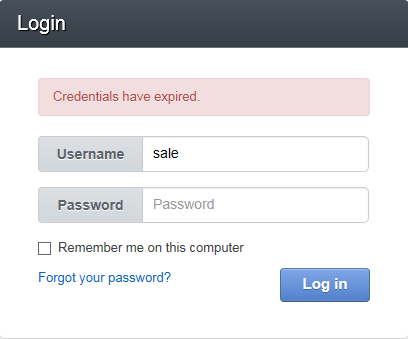

.. _doc-access-oro-cannot-log-in:

Why I Cannot Log In?
====================

.. contents:: :local:
   :depth: 3

This page will help you understand what blocks your from logging into your OroCRM application.

Account Is Locked
^^^^^^^^^^^^^^^^^

|

.. image:: ../img/access_oro/login_user_disabled.png

|

The **Account is locked** notification means that your account has been disabled in the system. This is similar to a deleted account—your can no longer log into the system and other users cannot engage you in the business activities.

**Solution:**

If you are sure that this is a mistake, please contact an administrator.

Credentials Have Expired
^^^^^^^^^^^^^^^^^^^^^^^^

|

|

The **Credentials have expired** notification means that the password reset procedure has been initiated. It could be started manually by an administrator or automatically if your company has a password policy that requires users to periodically change their password. (In the latter case, you might have received notifications reminding you to change your password soon.)

**Solution:**

Please check your email box for the password reset link. You will be able to log into the system after you change your password.

Invalid Username or Password
^^^^^^^^^^^^^^^^^^^^^^^^^^^^

|

.. image:: ../img/access_oro/login_user_invalodusername.png

|

You have entered the wrong credentials.

**Solution:**

Try again.

Invalid Username
^^^^^^^^^^^^^^^^

|

.. image:: ../img/access_oro/login_user_failednotexceeded.png

|

The password policy of your organization gives you a limited number of login attempts. You have entered the wrong credentials but you still have some attempts left.

**Solution:**

Try again.

Invalid Credentials. The Account Has Been Locked
^^^^^^^^^^^^^^^^^^^^^^^^^^^^^^^^^^^^^^^^^^^^^^^^

|

.. image:: ../img/access_oro/login_user_failed.png

|

The password policy of your organization gives you only limited number of login attempts. You have failed them all and become locked out of the system: you cannot log in, however, your profile is still enabled in the system and other users can engage you in business activities.

**Solution:**

Please contact an administrator. Only an administrator can now activate your account.

