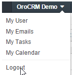
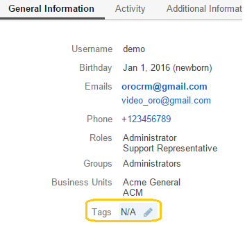
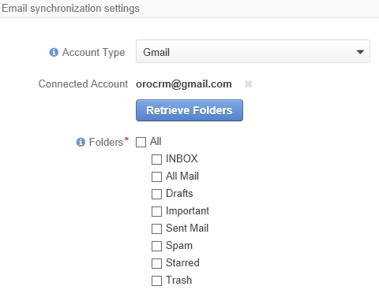

.. _user-guide-log-in:

Access Oro
==========

.. include:: /old_version_notice.rst
   :start-after: begin_old_version_notice

To get to your OroCRM account, enter the OroCRM instance url.

.. image:: ../img/intro/login.png

.. hint::

    The *"login using google"* option may not be available for your organization, check with your OroCRM Administrator.
    
    
.. _user-guide-getting-started-log-in:

Log In
------

Your administrator will determine this but typically upon your user account creation you will receive an email with your 
login credentials. In order to log in to the system for the first time, type in the username and password specified in 
the email. In order to save your credentials on a device, check the *"Remember me on this computer"* box before you log 
in.

.. caution::

    It is strictly recommended to change your password immediately after the first login. You can learn how to do it, see
    the :ref:`Changing Your Password section <doc-my-user-actions-change-password>` topic.

If you have forgotten the credentials, click the *"Forgot your password?"* link and follow the wizard to restore them.

Log in Using Your Google Credentials
^^^^^^^^^^^^^^^^^^^^^^^^^^^^^^^^^^^^

If the Google Single Sign-On capability has been enabled for your organization, you will see the *"login using google"* 
link at the login screen. This means you can log in using your corporate Gmail account credentials. Usually this 
capability is enabled for corporate email addresses only, so your personal mailbox credentials won’t do.

Log in Using Other Corporate Credentials 
^^^^^^^^^^^^^^^^^^^^^^^^^^^^^^^^^^^^^^^^

OroCRM can be set up to accept your existing corporate login and password. This is possible if your organization 
utilizes a common server to share them across multiple applications. This is referred to as LDAP integration. Please 
check with your system administrator to see if this is the case.

Log out
-------

Go to the User Menu in the top right corner of the page, and select the *"Logout"* item.

|

.. |IcEdit| image:: /img/buttons/IcEdit.png
   :align: middle
 

.. |IntroTags1| image:: ../img/intro/user_view_tags_1.png    

.. |IntroTags2| image:: ../img/intro/user_view_tags_2.png    

.. |EditAvatar| image:: ../img/intro/user_edit_avatar.png   

.. |EmailFrom| image:: ../img/intro/user_edit_email_from.png   

.. |EmailTo| image:: ../img/intro/user_edit_email_to.png   

.. |Phone| image:: ../img/intro/user_edit_phone.png   

.. |EmailSync2| image:: ../img/intro/email_sync_2.png   

.. |EmailSyncYahoo| image:: ../img/intro/email_sync_yahoo.png 

.. |EmailSync3| image:: ../img/intro/email_sync_3.png  

.. |EmailSyncGM1| image:: ../img/intro/email_sync_gm_1.png  

.. |EmailSyncGM2| image:: ../img/intro/email_sync_gm_2.png  

.. |EmailSyncGM3| image:: ../img/intro/email_sync_gm_3.png  

.. |EmailSyncGM4| image:: ../img/intro/email_sync_gm_4.png  

