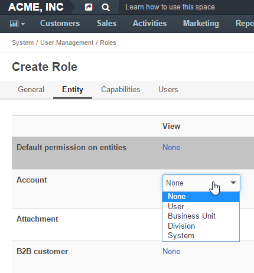

.. _user-guide-user-management-permissions:

Access and Permissions Management
=================================

OroCRM provides a very flexible structure of access and permissions management. 

Whether a user will be able to view, create, edit or delete records of a specific entity and change its :term:`Owner` 
depends on a combination of several factors, namely:

- Ownership Type defined of the entity

- Access Settings defined for the Role assigned to the User

.. _user-guide-user-management-permissions-ownership-type:

Ownership Types
---------------

Each entity in OroCRM has an :ref:`ownership type <user-guide-entity-management-create-other>` type, which defines the 
level at which permissions will be set for records of the entity.

If the ownership type is set to *"None"*, no authorization is required to see and process the entity and all the users
within the OroCRM instance will be able to view, create, edit, delete and assign records of the entity for organizations
other than a :ref:`system organization <user-ee-multi-org-system>`. Otherwise, they depend on the specific Role 
settings, as described below. 

If the ownership type of an entity is set to a *"User"*, *"Business Unit"* or *"Organization"*, the ability to see and 
process the entity records is defined by the role(s) assigned to the user.

.. _user-guide-user-management-role-permissions:

Roles-specific Permissions
--------------------------

Each user is assigned a :ref:`Role <user-guide-user-management-permissions-roles>` or set of roles. Within the role you
can define permissions to perform specific actions with records of each entity:

Actions to Permit
^^^^^^^^^^^^^^^^^

- View: If, for a specific entity, the action is not available to a user, the user won't see the records 
  :ref:`grid <user-guide-ui-components-grids>` nor the :ref:`View pages <user-guide-ui-components-view-pages>` 
  of this entity records.
  
- Create: If, for a specific entity, the action is not available to a user, the user won't be able to create new entity 
  records.

- Edit: If, for a specific entity, the action is not available to a user, the user won't be able to edit the entity 
  records.

- Delete: If, for a specific entity, the action is not available to a user, the user won't be able to delete the
  entity records.
  
- Assign: If, for a specific entity, the action is not available to a user, the user won't be able to change the owner 
  of the entity records.

For each entity and action you can define one of the permission settings, depending on the entity ownership type and
whether it is a :ref:`system organization <user-ee-multi-org-system>`, as described below:

.. _user-guide-user-management-role-permissions-system:

Permission Options for System Organizations
^^^^^^^^^^^^^^^^^^^^^^^^^^^^^^^^^^^^^^^^^^^

In a :ref:`system organization <user-ee-multi-org-system>`, the user will able to perform an action for the
entity records in any organization within the system, as long as the permission is set to *"System"*.

      |
  
.. image:: ./img/multi_org/multi_org_permission.png

|
  
Any other permission setting but *"System"*, in a system organization, will be treated as *"None"*.

Permission Options for Non-System Organizations
^^^^^^^^^^^^^^^^^^^^^^^^^^^^^^^^^^^^^^^^^^^^^^^
Permissions in non-system organizations depend on the ownership type of the entity.

      |

"Organization"
""""""""""""""

If the entity type is set to *"Organization"*, when an entity record is created, an :term:`organization <Organization>` 
is chosen as its :term:`owner <Owner>`. 

You can choose one of the following options for each action: 

- **None**: No users will be able to perform the action.
- **Organization**: All the users from the owner-organization will be able to perform the action.
- **System**: All the users will be able to perform the action.

  |

"Business Unit"
"""""""""""""""

If the entity type is set to "Business Unit", when an entity record is created, a :term:`business unit <Business Unit>` 
is chosen as its Owner. 

You can choose one of the following options for each action: 

- **None**:  No users will be able to perform the action.
- **Business Unit**: All the users from the owner-business-unit will be able to perform the action.
- **Division**: All the users from the owner-business-unit and from its child business units will be able to perform 
  the action.
- **Organization**: All the users from the organization to which the owner-business-unit belongs, will be able to 
  perform the action.
- **System**: All the users will be able to perform the action.

  |

"User"
""""""

If the entity type is set to "User", when an entity record is created, a :term:`user <User>` is chosen as its owner. 
You can choose one of the following options for each action: 

- **None**: No users will be able to perform the action.
- **User**: Only the owner-user will be able to perform the action.
- **Business Unit**: All the users from the business unit to which the owner-user belongs will be able to perform the 
  action.
- **Division**: all the users from the business unit to which the owner-user belongs and from its child business units 
  will be able to perform the action.
- **Organization**: all the users from the organization, to which the owner-user belongs, will be able to perform the 
  action.
- **System**: all the users will be able to perform the action.

Roles and Access Rights
-----------------------
Access right assigned to a role, define if the users will be able to access a specific functionality.
There are only two options:

- **None**: users with the role won't be able to use the functionality.
- ***System***: users with the role will be able to use the functionality for all the records created within their
  OroCRM instance they've logged in into.
