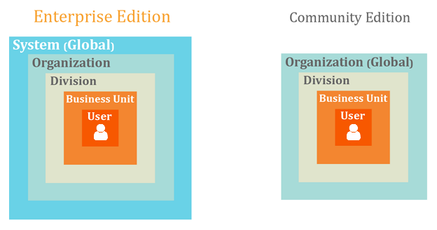
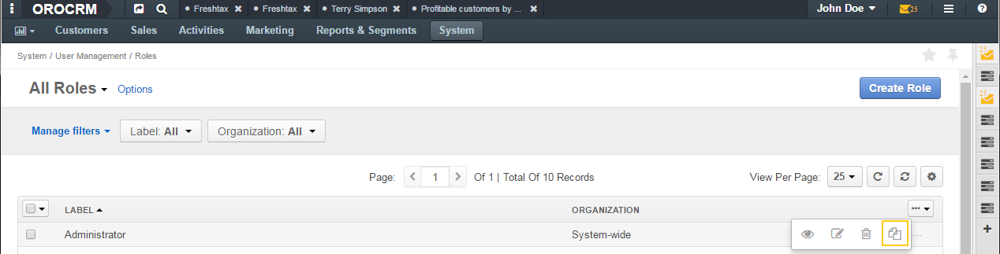

Access / Role Management
========================

.. contents:: :local:
    :depth: 3

Overview
--------

Different OroCRM users require different information and tools. A user's ability to access data and perform actions in the system depends on the following:

-  `Roles` assigned to the user: 
	
   E.g., sales representatives and system administrators need very different data and require different access to it. 

   - Actions a user can perform with particular data depend on access levels set for these actions in the user's role.

-  Organizations and units which the user has access to or is owned by: 
	
   E.g., users who work in different offices usually must have access to data exclusively within their office. 
	   
.. image:: ./img/access_roles_management/user_access.png 

|

-  An owner of particular data: 
   
   When we say that user must have access only to the data of their office, we need to specify which data belongs to which office.

   - In its turn, who can be a data owner depends on the ownership type setting for a data. This setting defines whether the data can belong to a particular user or, for example, it is something like a company address book and thus, can belong only to the whole company but not its subunits or users.   	   

This guide starts with a description of access levels as a basic notion of the access management. 

Access Levels
^^^^^^^^^^^^^

Access levels define a hierarchy of access to data. They can be envisioned as nested boxes. The smaller the box, the more limited set of data a user can access and vice verse. If a user has no box, they have no access whatsoever.
OroCRM has a predefined set of access levels with ``None`` being the most limited and ``Global`` providing the widest access to the data. 

	

The full list of all possible access levels can be found in the following table:  

+---------------+------------------------------+-------------------------------------------------------------------------------------------------------------------------------+
| Access Level                                 |  What data a user can access?                                                                                                 |
+---------------+------------------------------+                                                                                                                               |
| EE            | CE, EE with 1 organization   |                                                                                                                               |
+===============+==============================+===============================================================================================================================+
| None          | None                         | Access is denied.                                                                                                             |
+---------------+------------------------------+-------------------------------------------------------------------------------------------------------------------------------+
| User          | User                         | Entity records owned by the user (providing the user has access to the organization(s) for which these records were created). |
+---------------+------------------------------+-------------------------------------------------------------------------------------------------------------------------------+
| Business Unit | Business Unit                | Entity records owned by the business unit(s) the user has access to or by any user that has access to the same business unit. |
+---------------+------------------------------+-------------------------------------------------------------------------------------------------------------------------------+
| Division      | Division                     | Entity records:                                                                                                               |
|               |                              |                                                                                                                               |  
|               |                              | * Owned by business unit(s) the user has access to or by any user that has access to the same business unit.                  |
|               |                              | * Owned by the whole chain of the business units subordinated to those the user has access to.                                |
+---------------+------------------------------+-------------------------------------------------------------------------------------------------------------------------------+
| Organization  | Global                       | All entity records within the organization the user has access to.                                                            |
+---------------+------------------------------+-------------------------------------------------------------------------------------------------------------------------------+
| Global        |                              | All entity records within the system.                                                                                         |
+---------------+------------------------------+-------------------------------------------------------------------------------------------------------------------------------+

.. Note::
	As you can see, the exact list of access levels available in your system depends on the number of organizations defined. If there is only one organization created (for OroCRM Enterprise Edition, since OroCRM Community Edition does not provide the possibility to create several organizations), there will be no individual **Organization** access level. 

.. Important:: 
	When a user logs into the organization with global access, all their access levels, except **Global**, are treated as **None**.

How Are Access Levels Used? 
"""""""""""""""""""""""""""
You set access levels when you configure a user role and define permissions it will include. For each action that can be performed on entity (view, create, delete, etc.) you can set an access level. 

For example, for the **Account** entity, **Create** action, you set the **User** access level. It means that a user with such role will be able to create accounts only with themselves as an owner. 
If you decide to grant a user permission to create accounts withing the user's division (i.e., when creating an account, the user can set any member of the same division as the account's owner), create a role that will have the **Division**access level for the **Account** entity, action **Create**. 

For more information and examples on roles creation, see the `Roles <./access-roles-management#roles>`__ section.

.. important::
  There are two access levels that you can set for any entity: **None** and **Global**.

	Ability to set other access levels depends on the entity’s ownership type. You can set an access level that is ‘higher than or equal’ to the entity’s ownership type. Thus, if an entity's ownership type is **Business Unit**, you cannot set the **User** access level for any action on this entity. 

	For more information about ownership types, see the `Ownership Type <./access-roles-management#ownership-type>`__ section and specifically, the `Ownership type and access levels <./access-roles-management#ownership-types-and-access-levels>`__ subsection.

 

Ownership Type
^^^^^^^^^^^^^^
When you create an entity record, you may define its 'owner'. The type of the owner depends on the entity a record of which you create. For accounts, for example, you can define a user as an owner. For business units it must be another business unit. 

|

.. image:: ./img/access_roles_management/entity-instance_access.png 

|

'Owner' is an important concept as it may influence a user's access rights. For example, the 'Lex Shop' account belongs to John who has access to the 'West' office of the 'Acme' company. The company employees have access only to the accounts of the office they work at. If Acme decides to transfer John to another office and restricts him access to the 'West' office, employees of the 'West' office will not be able to access 'Lex Shop' any more.  

*Can a particular entity be managed by a user or a business unit or a organization? Or may be this is a system entity?*
You answer these questions by specifying the ``ownership type`` for an entity. 
For example, the **Account** entity ownership type is **User**. So, a customer's account can be 'owned' by a particular user. The user can access, manage this account and is responsible for it. 
A business unit represents a team of users. Decisions about a business unit's fate are taken at the level of the business unit that incorporates the said one or directly at the level of the organization.  So, it takes at least another business unit to 'own' the business unit. And the **Business Unit** entity ownership type is **Business Unit**.

|

.. image:: ./img/access_roles_management/entity_access.png 

|

The following table describes who or what can own entity records depending on the entity ownership type:

+----------------+--------------------------------------------------------------------+
| Ownership type | Possible owners                                                    |
+================+====================================================================+
| User           | Users                                                              |
+----------------+--------------------------------------------------------------------+
| Business Unit  | Business units                                                     |
+----------------+--------------------------------------------------------------------+
| Organization   | Organizations                                                      |
+----------------+--------------------------------------------------------------------+
| None           | No owner (it can be also said that the owner is the system itself) |
+----------------+--------------------------------------------------------------------+

Ownership Type and Access Levels
""""""""""""""""""""""""""""""""
An entity's ownership type limits the range of access levels you can set for actions on this entity. 

The following table shows what access levels can be assigned depending on the entity's ownership type:

+----------------+---------------------------------------------------------------+
| Ownership type | Possible access levels for an entity with this ownership type |
+================+===============================================================+
| User           | None, User, Business Unit, Division, Organization, Global     |
+----------------+---------------------------------------------------------------+
| Business Unit  | None, Business Unit, Division, Organization, Global           |
+----------------+---------------------------------------------------------------+
| Organization   | None, Organization, Global                                    |
+----------------+---------------------------------------------------------------+
| None           | None, Global                                                  |
+----------------+---------------------------------------------------------------+

.. For CE **Organization** OT is the same as **None**?

.. caution::
	As you can see, ownership types in general have the same names as access levels. However, do not be confused: they are very different things. 
	This becomes especially straightforward when you compare the **None** ownership type and the **None** access level:

  The **None** ownership type gives the widest access to entity records. It says 'This record does not belong to any particular organization or business unit or user. Therefore, either each existing user can access it, or no one at all.'
    
  The **None** access level completely restricts access to entity records. It says 'No one can perform this action on the entity.' 

Configure an Ownership Type for an Entity
"""""""""""""""""""""""""""""""""""""""""
.. important::
	You can define an entity ownership type only during the entity creation. As soon as the entity is saved for the first type, its ownership type cannot be changed. 
	Consequently, you cannot change the predefined ownership types of the system entities (such as **Account**, **Business Unit**, etc.). 

1. Start creating a new entity. To do this, follow the instructions provided in the
   `Create Entities <./entities#create-entities>`__ section of the `Entities <./entities>`__ guide. Specify all information as required for the **General Information**, **Communication & Collaboration**, **Attachments** sections.

2. Click **Other**.

3. From the **Ownership Type** list, select the desired ownership type. 

 
   |

   .. image:: ./img/access_roles_management/entity_ownershiptype_create.png
   
   |

5. Click the :guilabel:`Save` button in the upper-right corner.

Review the Ownership Type for an Entity
"""""""""""""""""""""""""""""""""""""""
1. Open the entity view:

    a. In the **Main Menu**, point to **System**, in the drop-down menu, point to **Entities** and in the new drop-down menu, click **Entity Management**.
    
    b. In the grid on the **All Entities** view, click the required entity.

2. On the entity view, click **General Information** and review the **Ownership Type** fields.

.. image:: ./img/access_roles_management/entity_ownershiptype_review.png 

Roles
^^^^^

Overview
""""""""

Roles are predefined sets of permissions. When you assign a role to a user, you can be sure that the user will be able to access only that information within the system which is necessary for them to do their work. 

Roles Creation
~~~~~~~~~~~~~~

Usually roles are created based on the user's job functions: sales manager, marketing team member, administrator. But this is not a strict rule. You can create as many roles as required and configure them according to the needs of your company. 
For how to create a role, see the `Create a Role <./access_roles_management#create-a-role>`__ section. 

Assign and Combine Roles
~~~~~~~~~~~~~~~~~~~~~~~~

Each OroCRM user must be assigned a role. A user can have several roles. This is a logical approach if we assume that roles may be based on job functions. For example, if you have roles 'Leads Development Representative' and 'Sales Representative' and some employees do both of these jobs, you simply assign them both roles instead of creating a specialized role that will cover the whole range of required permissions. 
For how to assign a role to a user, see the `Assign Roles While Creating a New User <access_roles_management#assign-roles-while-creating-a-new-user>`__ section. 

If a user has two or more roles with different permissions, in the result the user will have the maximum of rights granted by all of them.   

The following example shows what access level for an action on entity a user who is assigned two roles with different permissions will have:

+------------------------+----------------------------+----------------------------+
| Role 1                 | Role 2                     | Role 1 + Role 2            |
+========================+============================+============================+
| Entity: Account        | Entity: Account            | Entity: Account            |
| Action: View           | Action: View               | Action: View               |
| Access Level: **User** | Access Level: **Division** | Access Level: **Division** |
+------------------------+----------------------------+----------------------------+

Role Structure
~~~~~~~~~~~~~~
A role is a set of permissions that you can grant to a user all-in-one. 
There are two nominal types of permissions in OroCRM: 

- Permissions to perform a certain action on entity. For each permission of this type you can specify a desired access level.

- Permissions to access system functionalities. They are also called 'capabilities' on the interface. System functionalities belong to the system and thus for them you simply specify whether to include permissions to access them into the role or not. 

.. image:: ./img/access_roles_management/user_access.png 

Action on Entity Permissions
############################

On each entity in the system a user can perform a certain set of actions. The set may vary for some entities but in general it looks as follows:

+-----------+----------------------------------------------------------------------------+
| Action    | Description                                                                |
+===========+============================================================================+
| View      | A user can see the entity records in the grid and open their View pages.   |
+-----------+----------------------------------------------------------------------------+
| Create    | A user can create a new entity record.                                     |
+-----------+----------------------------------------------------------------------------+
| Edit      | A user can edit entity records.                                            |
+-----------+----------------------------------------------------------------------------+
| Delete    | A user can delete an entity record.                                        |
+-----------+----------------------------------------------------------------------------+
| Assign    | A user can change the owner of an entity record.                           |
+-----------+----------------------------------------------------------------------------+
| Share     | A user can share an entity record with other users.                        |
|           | This action is available only in OroCRM EE.                                |
+-----------+----------------------------------------------------------------------------+
| Configure | A user can set up the system configuration for themselves and other users. |
|           | This action is available on for the **User** entity.                       |
+-----------+----------------------------------------------------------------------------+

For each of this actions you can set an access level, thus defining the range of entity records a user can perform an action on: will these be only the records owned by the user themselves, records of the user's division, all records in the system, etc.?  

The picture below shows the scheme of how permissions for an entity may be configured:

|

.. image:: ./img/access_roles_management/ex_permissions-on-entity.png 

|

This is how the corresponding configuration looks on the interface for the **Account** entity :

|

.. image:: ./img/access_roles_management/roles_permissions_general_ex.png 

|

For more information about which access levels defines which range, see the `Access Levels <./access-roles-management#access-levels>`__ section.

.. Important::
	Note that the set of available access levels depends on the entity's ownership type. For example, you will not be able to set the **User** access level if the entity's ownership type is **Organization**. Only two access levels are always available: **None**—access is denied and *Global*—access all entity records within the system.
	For more information about ownership types, see the `Ownership Type <./access-roles-management#ownership-type>`__ section and specifically, the `Ownership type and access levels <./access-roles-management#ownership-types-and-access-levels>`__ subsection.

Permissions for an Entity Field (Field Level ACLs) 
..................................................

All important information that comprises an entity is contained in the entity fields. For example, if you open any record of the **Business Unit** entity, you will see such fields as **Name**, **Organization**, **Description**, **Website**, etc. 

When you include the permission to view entity records in a role, users with such role are automatically able to see all fields of the entity. 

However, there are situations when it is desirable to hide certain fields from one group of users while still having them available for others. For example, both the sales team and support team require to see the **Opportunity** entity records. But as the financial information is often considered sensitive, you may want to hide the **Budget Amount** field from the support team members.  

Its is possible to do this using the Field Level ACLs functionality. When you enable it for an entity, you can assign permissions that allow actions on a particular entity field to a role. 

.. important::
	Currently, the Field Level ACL functionality is available for the **Account**, **Opportunity** and custom entities. 

The list of available actions for entity fields is smaller than for an entity:

+--------+-------------------------------------------------------------------------------+
| Action | Description                                                                   |
+========+===============================================================================+
| View   | A user can see entity record fields in the grid and on the record view pages. |
+--------+-------------------------------------------------------------------------------+
| Create | A user can see and modify entity record fields on the 'new entity' form.      |
+--------+-------------------------------------------------------------------------------+
| Edit   | A user can see and modify entity record fields on the 'edit entity' form.     |
+--------+-------------------------------------------------------------------------------+

For each of these actions you can set an access level, thus defining the range of entity records which fields a user can perform an action on: will the be only the records owned by a user themselves, records of the user's division, all records in the system, etc.?  

.. Important::
	Note that for entity fields, the set of available access levels depends on:

	- Entity's ownership type. For example, you won't be able to set the **User** access level for a field if the entity's ownership type is **Organization**. 
	- Action. For the **Create** action only the **None** (access is denied) and *Global* (access all entity records within the system) access levels are available independently of the entity's ownership type.
	  
	  .. why? 
	
  For more information about how access levels are configured for entities, please see the `Action on Entity Permissions <./access-roles-management#actions-on-entity-permissions>`__ section.
	For more information about ownership types, see the `Ownership Type <./access-roles-management#ownership-type>`__ section and particularly, the `Ownership type and access levels <./access-roles-management#ownership-types-and-access-levels>`__ subsection.

.. image:: ./img/access_roles_management/roles_permissions_fields_general_ex.png 

|

.. caution:: 
	Ability to assign permissions for entity fields is a powerful tool that gives you an opportunity to tune up user roles in OroCRM to a great extent. However, you need to use it carefully and thoughtfully to gain a great result. Make sure that your configuration makes sense. 

	For example, you can set the **None** access level for the **View** action of all fields, but leave a user an ability to view entity records. Then the user will see only blank lines in the grid and upon opening a record. That is why, if you want to restrict a user from viewing entity records, set the **None** access level for the **View** action on the entity itself.  

	Also, if you restrict a user from viewing a particular field, consider restricting them from editing this field as well to avoid a situation when the user enters the record editing mode and can see the restricted field on the 'edit' form.

Visibility of Restricted Fields
+++++++++++++++++++++++++++++++

Sometimes you want to enable users to modify only certain entity fields and restrict them from modifying others. For example, the workflow accepted in your company states that only a sales manager can change the status of the opportunity. However, sales representatives still need be able to review the **Status** field when they work with opportunities. 

It is possible to configure this with OroCRM for both the **Create** and **Edit** actions. Fields disabled for modifying will appear dimmed on the interface. For how to do this, please see the `Enable User to See Restricted Fields <./access-roles-management#enable-user-to-see-restricted-fields>`__  section.

|

.. image:: ./img/access_roles_management/opportunity_greyed-status.png 

|

System Functionalities Permissions
##################################
Permissions of this type either define whether a user must have access to certain parts of the system (e.g., should they see the page with system jobs queue) or extend 'action on entity' permissions (e.g. should a user retain the ability to modify their own user profile if editing of user profiles in general is forbidden for them). Permissions of this type are also called 'capabilities.'' Capabilities can be either enabled or disabled for a role. 

This is how capabilities look on the interface:

|

.. image:: ./img/access_roles_management/roles_overview2.png 

|

	
Role Structure on the Interface
"""""""""""""""""""""""""""""""

The information about a role is divided into four sections. 

|

.. image:: ./img/access_roles_management/roles_overview1.png 

|

General Section
~~~~~~~~~~~~~~~

+-------+----------------------------------------------------------------+
| Field | Description                                                    |
+=======+================================================================+
| Role  | The name of the role. This value must be unique in the system. |
+-------+----------------------------------------------------------------+

Additional Section
~~~~~~~~~~~~~~~~~~

+--------------+------------------------------------------------------------------------------------------------------+
| Field        | Description                                                                                          |
+==============+======================================================================================================+
| Description  | Short but meaningful description of the role.                                                        |
+--------------+------------------------------------------------------------------------------------------------------+
| Organization | Which organization this role is applicable within.                                                   |
|              | Value **System-Wide** means that this role is applicable to all organizations defined in the system. |
+--------------+------------------------------------------------------------------------------------------------------+

Entity Section
~~~~~~~~~~~~~~

This section contains information about permissions included in a role. 

For convenience, permissions are grouped in tabs by functions they control:

- **All**——All the permissions available on the other four tabs.
- **Account Management**——Access to the account management. 
- **Marketing**——Access to the data useful for marketing team.
- **Sales data**——Access to the data useful for sales team. 
- **System Capabilities**——Access to the system functionalities.
  

Each tab, except **System Capabilities**, is divided into two sections: 

- With the list of 'action on entity' permissions.
- With the list of capabilities.

The **System Capabilities** tab lists only capabilities that control access to the system functionalities. 

|

.. image:: ./img/access_roles_management/roles_overview2.png 

|

It is divided itself in the following sections:

- **Address**—A permission that defines whether a user can see drop-down country, address lists when they fill in address forms. 
- **Application**—Access to system parts of OroCRM application (job queue, system configuration, etc.) or additional extension of 'action on entity' permissions(whether a user can share grid views, change passwords of other users, etc.) 
- **Calendar**—Access to management of system calendars, etc. 
- **Entity**—Permissions that define whether a user can import / export entity records, find them via the search functionality, etc.

Users Section
~~~~~~~~~~~~~

The list of users that have this role. 

|

.. image:: ./img/access_roles_management/roles_userssection.png 

|

Actions with Roles
""""""""""""""""""

Create a Role
~~~~~~~~~~~~~
1. In the **Main Menu**, point to **System**, in the drop-down menu, point to **User Management** and in the new drop-down menu, click **Roles**.
    
2. Click the :guilabel:`Create Role` button in the upper-right corner of the view. The **Create Role** form opens.

3. Click **General**, and in the **Role** field, type the role name. Note that the name must be unique for the system.

.. image:: ./img/access_roles_management/role_create1.png

4. Click **Additional** and specify the following:

   - **Description**—Type the description of this role. Use the in-built text editor to format the provided description.
   
   - **Organization**—Select the organization for user's of which this role will be applicable. If you want this role to be applicable for all organizations defined in the system, do not specify any organization. In this case the field value becomes **System-wide**. (If there is only a single organization defined in the system or you do not have global access rights, there will be no option for selecting an organization.)
	
.. image:: ./img/access_roles_management/role_create2.png

5. Click **Entities**. In this section define which 'action on entity' permissions and which capabilities you want to include in the role. For more information about the 'action on entity' permissions and capabilities, see the `Roles <./access-roles-management#roles>`__ section.
 
   1. For each action on each entity specify the required access level. By default, for all entities access levels are set to **None**. Choose an entity which you want to assign different permissions for. In the entity row, click the action name and in the drop-down list, click the required access level. For more information about the access levels, see the `Access Levels <./access-roles-management#access-levels>`__ section.
   
   .. image:: ./img/access_roles_management/role_create_entities_acl2.png

   If you want to set the same access level for all actions on entity, you can complete it in one move: from the ellipsis menu at the right-hand end of the entity row, select the required access level.

   .. image:: ./img/access_roles_management/roles_create_entities_acl1.png

   If you want to set individual permissions for the entity fields, please see the `Include Permissions for an Entity Field in a Role  <./access-roles-management#include-permissions-for-an-entity-field-in-a-role>`__ section for how to do this. 
   
   2. Under the list of entities, select the check boxes in front of the required capabilities.  
   

.. image:: ./img/access_roles_management/role_create_entities_acl2.png
   
6. Click **Users** and in the grid, select check boxes in front if the users to whom you want to assign this role.
   
    .. image:: ./img/access_roles_management/role_create_entities_acl2.png

7. 4. Click the :guilabel:`Save` button in the upper-right corner. 

Clone a Role
~~~~~~~~~~~~
You can create a role by cloning the existing one. For this, do as follows:

1. In the **Main Menu**, point to **System**, in the drop-down menu, point to **User Management** and in the new drop-down menu, click **Roles**.

2. In the grid on the **All Roles** view, choose the required role, click the ellipsis menu at the right-hand end of the corresponding role and then click the |IcClone| **Clone** icon.  

3. The **Create Role** form opens. It has all of the settings as the original role and 'Copy of \<original_role_name\>'  as its name. If required, modify settings as described in steps 3–6 of the `Create a Role <./access-roles-management#create-a-role>`__ section.   

.. image:: ./img/access_roles_management/role_clone1.png

|

4. Click the :guilabel:`Save` button in the upper-right corner.

Alternatively, you can clone a role from the role view by clicking the :guilabel:`Clone` button in the upper-right corner of the role view.
|

.. image:: ./img/access_roles_management/role_clone2.png

|

Review a Role
~~~~~~~~~~~~~
1. Open the role view:

    a. In the **Main Menu**, point to **System**, in the drop-down menu, point to **User Management** and in the new drop-down menu, click **Roles**.
    
    b. In the grid on the **All Roles** view, click the required role. 
    
2. Review the role settings.

Edit a Role
~~~~~~~~~~~
1. Open the role view:

    a. In the **Main Menu**, point to **System**, in the drop-down menu, point to **User Management** and in the new drop-down menu, click **Roles**.
    
    b. In the grid on the **All Roles** view, click the required role. 

2. On the role view, click the :guilabel:`Edit` button in the upper-right corner.

3. Make the required changes according to the description provided steps 3–6 of the `Create a Role <./access-roles-management#create-a-role>`__ section.   

4. Click the :guilabel:`Save` button in the upper-right corner.

Delete a Role
~~~~~~~~~~~~~
1. In the **Main Menu**, point to **System**, in the drop-down menu, point to **User Management** and in the new drop-down menu, click **Roles**.

2. In the grid on the **All Roles** view, choose the required role, click the ellipsis menu at the right-hand end of the corresponding role and then click the |IcDelete| **Delete** icon.  

|

.. image:: ./img/access_roles_management/role_delete0.png

|

3. In the **Deletion Confirmation** dialog box, click :guilabel:`Yes, Delete`.

Alternatively, you can clone a role from the role view by clicking the :guilabel:`Delete` button in the upper-right corner of the role view.
|

.. image:: ./img/access_roles_management/role_delete2.png

|

.. caution::
	If there is at least one user that has this role, the role cannot be deleted.

Enable Assigning Permissions for an Entity Field
~~~~~~~~~~~~~~~~~~~~~~~~~~~~~~~~~~~~~~~~~~~~~~~~

1. Open the entity view:

    a. In the **Main Menu**, point to **System**, in the drop-down menu, point to **Entities** and in the new drop-down menu, click **Entities Management**.
    
    b. In the grid on the **All Entities** view, click the required entity (it must be either  **Account**, **Opportunity** or any custom entity you have previously created). 

2. On the entity view, click the :guilabel:`Edit` button in the upper-right corner.

3. Click **Others**.

4. Select the **Field Level ACL** check box.

.. image:: ./img/access_roles_management/user_roles_edit.png

5. Click the :guilabel:`Save` button in the upper-right corner.

Enable User to See Restricted Fields 
~~~~~~~~~~~~~~~~~~~~~~~~~~~~~~~~~~~~

1. Open the entity view:

    a. In the **Main Menu**, point to **System**, in the drop-down menu, point to **Entities** and in the new drop-down menu, click **Entities Management**.
    
    b. In the grid on the **All Entities** view, click the required entity (it must be either  **Account**, **Opportunity** or any custom entity you have previously created). 

2. On the entity view, click the :guilabel:`Edit` button in the upper-right corner.

3. Click **Others**.

4. Select the **Show Restricted** check box.

.. image:: ./img/access_roles_management/user_roles_....png

5. Click the :guilabel:`Save` button in the upper-right corner.

Include Permissions for an Entity Field in a Role
~~~~~~~~~~~~~~~~~~~~~~~~~~~~~~~~~~~~~~~~~~~~~~~~~

1. Open the role view:

    a. In the **Main Menu**, point to **System**, in the drop-down menu, point to **User Management** and in the new drop-down menu, click **Roles**.
    
    b. In the grid on the **All Roles** view, click the required role. 

2. On the role view, click the :guilabel:`Edit` button in the upper-right corner.

3. Click **Entities**.

4. Find the required entity in the list. If assigning permissions for an Entity Field was enabled for the entity, you will see the plus sign near its name. 
   
  .. image:: ./img/access_roles_management/roles_permissions_fieldlevel1.png

4. Click the plus sign. Besides the row with an entity name, you will see the list of fields included to this entity.  
   
5. Assign required permissions for actions on the entity fields.  

.. image:: ./img/access_roles_management/roles_permissions_fieldlevel2.png

5. Click the :guilabel:`Save` button in the upper-right corner.

User Access Settings
""""""""""""""""""""
*Which organization and / or business unit a user has access to?*

User's access settings is one of the most important points in determining which data the user will be able to access. The organizations you are selecting in this section are organizations a user can log into. Both organizations and business units selected are records which data owned by a user will belong to. 

.. Caution:: 
  Pay attention that if a user looses access to certain organization, the data the user owns that was created for this organization, stays in organization. If a user looses access to a business unit, the data the user owns becomes unavailable in this business unit. For details, see the `Examples <./user-management-users#examples`> section.

Configure Access Settings While Creating a New User
~~~~~~~~~~~~~~~~~~~~~~~~~~~~~~~~~~~~~~~~~~~~~~~~~~~

1. Start creating a new user. To do this, follow the instructions provided in the
   `Create a User Record <./user-management-users#create-a-user-record>`__ section of the `User Records Management <./user-management-users>`__ guide. Specify all information as required for the **General**, **Additional**, **Groups and Roles** and **Password** sections.

2. Click **Access Settings**.

3. (Only for EE) In the **Organizations** section, select the check boxes in front of organization(s) you want the user to have access to. 
   
   .. caution::
   	    Note that the user will not be able to log in to the system if no organization is selected for them. 

4. Click the **Organization Business Units** field.

5. Type the business unit name or select it from a drop-down list. 
   
   |

   .. image:: ./img/access_roles_management/user_access-settings.png 
   
   |

6. Click the :guilabel:`Save` button in the upper-right corner.

Assign Roles While Creating a New User
~~~~~~~~~~~~~~~~~~~~~~~~~~~~~~~~~~~~~~

1. Start creating a new user. To do this, follow the instructions provided in the
   `Create a User Record <./user-management-users#create-a-user-record>`__ section of the `User Records Management <./user-management-users>`__ guide. Specify everything as required for the **General**, **Additional**, **Access Settings** and **Password** sections.

2. Click **Groups and Roles**.

3. In the **Roles** section, select the check boxes in front of the desired roles. 
   
   .. important::
   		At least one role must be selected. 

   .. caution::
   		If the role is not 'System-Wide' and a particular organization is specified for it, check that the same organization is selected for a user in the **Access Settings** sections. Otherwise the role does not appear in the **Roles** section. 

.. image:: ./img/access_roles_management/user_roles.png 
   
|

4. Click the :guilabel:`Save` button in the upper-right corner.

Change the Range of Assigned User Roles
~~~~~~~~~~~~~~~~~~~~~~~~~~~~~~~~~~~~~~~

1. Open the user view:

    a. In the **Main Menu**, point to **System**, in the drop-down menu, point to **User Management** and in the new drop-down menu, click **Users**.
    
    b. In the grid on the **All Users** view, click the required user. 

2. On the user view, click the :guilabel:`Edit` button in the upper-right corner.

3. Click **Groups and Roles**.

4. If required, add a new user role as described in the step 3 of the `Configure User Roles While Creating a New User <./access_roles_management#configure-user-role-while-creating-a-new-user>`__ section.

.. image:: ./img/access_roles_management/user_roles_edit.png

5. Click the :guilabel:`Save` button in the upper-right corner.

Edit User's Access Settings
~~~~~~~~~~~~~~~~~~~~~~~~~~~

1. Open the user view:

    a. In the **Main Menu**, point to **System**, in the drop-down menu, point to **User Management** and in the new drop-down menu, click **Users**.
    
    b. In the grid on the **All Users** view, click the required user. 

2. On the user view, click the :guilabel:`Edit` button in the upper-right corner.

4. Click **Access Settings**.

5. If required, add a new organization as described in step 3 of the `Configure Access Settings While Creating a New User <./access_roles_management#configure-access-settings-while-creating-a-new-user>`__ section.

7. If required, add a new business unit as described in steps 4–5 of the `Configure Access Settings While Creating a New User <./access_roles_management#configure-access-settings-while-creating-a-new-user>`__ section.

   .. image:: ./img/access_roles_management/user_access-settings_edit.png

8. If required, remove an organization. To do this, in the **Organizations** section, clear the check box against organization which you want to forbid the user to have access to.

9. If required, remove a business unit. To do this, click the |IcRemove| **Remove** icon next to the corresponding business unit. 

   .. image:: ./img/access_roles_management/user_access-settings_delbu.png

10. Click the :guilabel:`Save` button in the upper-right corner.

Review Assigned Roles and Access Settings
~~~~~~~~~~~~~~~~~~~~~~~~~~~~~~~~~~~~~~~~~

1. Open the user view:

    a. In the **Main Menu**, point to **System**, in the drop-down menu, point to **User Management** and in the new drop-down menu, click **Users**.
    
    b. In the grid on the **All Users** view, click the required user. 

2. On the user view, click *General Information*.

3. Review the **Roles** and **Business Units** fields. The first one lists user roles, the second—business units the user has access to. 

.. image:: ./img/access_roles_management/user_review.png

5. In the upper-right corner of the page, review the **Owner** field. It represents the business unit that owns the user. If you review the user view being logged in the organization with a global access, you will also see a name of the organization that owns the user in the braces. 

     

    

.. image:: ./img/access_roles_management/user_review_owner.png

Examples
--------

Sales Structure
^^^^^^^^^^^^^^^
Let's imagine that there are two main regional divisions in the company: one in the USA, the other in the EU.

Each of these divisions has smaller subdivisions. 
In USA it is the 'Los Angeles' division, 'Dallas' division, 'New York' division. 
In EU it is the 'Western Europe' division and the 'Eastern Europe' division. 

Sales in this company are a structured the following way:

The Sales Director controls both regions. Each of the regions has its own Regional Sales Manager (RSM). Each of the subdivisions has an Area Sales Manager (ASM) who has a team of Sales Representatives as subordinates.

The picture bellow helps visualize it: 

|

.. image:: ./img/access_roles_management/sales_structure.png

|

Goal
""""
We want to configure roles and other access settings in such a way that the sales representatives could access only the data they own. ASMs must be able to access data of the their whole subdivision. RSMs—data of all areas in their region. Sales Director must be able to view all the company data. 

Configuration
"""""""""""""

Let's assume that we have already created all the required Business Units: 'Main Office' (represents the unit that has access to the whole organization), 'USA,' 'EU,' 'Los Angeles,' 'Dallas,' 'New York,' 'Western Europe,' 'Eastern Europe.' 'Main Office' does not have a parent business unit. Business Units 'USA' and 'EU' have 'Main Office' as a parent business unit. 'Los Angeles,' 'Dallas,' 'New York' have the 'USA' business unit as a parent one. 'Western Europe,' 'Eastern Europe' have 'EU' as a parent business unit. 

|

.. image:: ./img/access_roles_management/sales_bu_usa.png

|

.. image:: ./img/access_roles_management/sales_bu_la.png

|

First, we create roles. We need 4 roles: 'Sales Rep,' 'Area Sales Manager,' 'Region Sales Manager,' 'Sales Director.' 
 
Into the 'Sales Rep' role we will include permissions that will have the **User** access level.

|

.. image:: ./img/access_roles_management/sales_role_rep.png

|

Into the 'Area Sales Manager' role we will include permissions that will have the  **Business Unit** access level. 

|

.. image:: ./img/access_roles_management/sales_role_asm.png

|

Into 'Regional Sales Manager'—permissions with the **Division** access level.   

|

.. image:: ./img/access_roles_management/sales_role_rsm.png

|

And into the 'Sales Director' role—permissions with the **Organization** access level .

|

.. image:: ./img/access_roles_management/sales_role_dir.png

|

Second, we configure users: assign roles, define which business units the users will have access to. 
   
**Sales Director**

Our sales director will have the following settings: 

   - **Owner**— The sales director has access to the whole organization. So we set 'Main Office' as the owner. 
    
   |

   .. image:: ./img/access_roles_management/sales_user_sd_owner.png

   |

   - **Roles**— We select the 'Sales Director' role.
    
   |

   .. image:: ./img/access_roles_management/sales_user_sd_roles.png

   |

   - **Organization**—We select 'OroCRM'. 
    

   |

   .. image:: ./img/access_roles_management/sales_user_sd_organization.png

   |

    As the sales director will have permissions with the **Global** access level, there is no need to specify what particular business units they she must have access to. 

   |

   **Regional Sales Manager**
   RSMs will have the following settings: 

   - **Owner**— Either 'USA' or 'EU.'  

 

   
   - **Roles**— 'Regional Sales Manager.'
   
   - **Organization**—'OroCRM.'
   
   - **Organization Business Units**—Either 'USA' or 'EU.'  Regional Sales Managers will have permissions with the **Division** access level. A division is a business unit with all the chain of its sub business units and their sub business units an so on. So we need to specify only the top business unit in this chain. 
   
 

 **Area Sales Manager**
   ASMs will have the following settings: 

   - **Owner**— One of the business units of a lower level: 'Los Angeles,''Dallas,' 'New York,' 'Western Europe,' 'Eastern Europe.' 
   
   - **Roles**— 'Area Sales Manager.'
   
   - **Organization**—'OroCRM.'
   
   - **Organization Business Units**—One of the business units of a lower level: 'Los Angeles,''Dallas,' 'New York,' 'Western Europe,' 'Eastern Europe.' 
    
  

  **Sales Representatives**
  Finally, sales representatives will have the following settings: 

   - **Owner**— One of the business units of a lower level: 'Los Angeles,''Dallas,' 'New York,' 'Western Europe,' 'Eastern Europe.' 
   
   - **Roles**— 'Sales Rep.'
   
   - **Organization**—'OroCRM.'
   
   - **Organization Business Units**—One of the business units of a lower level: 'Los Angeles,''Dallas,' 'New York,' 'Western Europe,' 'Eastern Europe.' 
    

Now we can check that when Alan Wise, sales representative in Los Angeles, creates an account, for example, he can assign only himself as an owner of this account (account belongs to him). He will also be able to see only his accounts (unless his managers share any accounts with him).

|

   .. image:: ./img/access_roles_management/sales_acc_alan.png

|

.. how 'share' works? only able to see accounts in the grid? 

Nina Anders, who is an ASM, can manage accounts created by sales representatives of her business unit and by herself:

|

   .. image:: ./img/access_roles_management/sales_acc_nina.png

|

A USA Regional Sales Manager, Samuel Lee, can see and manage accounts of the Nina's (Los Angeles ASM) business unit and of Anthony's (Dallas ASM) business units as both of them are subunits of the business unit USA.

|

   .. image:: ./img/access_roles_management/sales_acc_sam.png

|

 And, finally, a sales director has access to all accounts of the company.   

 
Multiple Organizations
^^^^^^^^^^^^^^^^^^^^^^

There are two businesses that our company runs. One of them is tea sales. The other one—clothes sales. For each business we have created an individual organization in OroCRM ('Tea Sweet' and 'Best Style'). 
John, Jane and Jill are marketing team members. John works in 'Tea Sweet,'' Jane and Jill—in 'Best Style.'' However, being a wide-range specialist, Jill shares her attention between both businesses and thus is given access to both organizations. 
John, Jane and Jill are assigned the 'Marketing' role that includes organization level permissions. 

Each of marketers creates two campaigns in OroCRM: 

|

.. image:: ./img/access_roles_management/multi.png

|

Let's see which data each team member can see. We know that John and Jane can log in only to the organization they work in, and Jill can log into both: 

|

.. image:: ./img/access_roles_management/multi_login.png

|

But what happens when the need ceases for Jill's work at 'Sweet Tea' and an administrator rejects her access to this organization? Now Jill cannot log in into 'Sweet Tea' and cannot see or modify the campaign she has created. She remains the campaign's owner though as other users with access to 'Sweet Tea' can see:

|
.. image:: ./img/access_roles_management/multi_jillcannotlogin.png

|

.. caution::
      This mean that you must be very careful when granting or rejecting users access to organizations. Imagine that John has only user-level permissions for working with campaigns. Then there will be no one in Sweet Tea (except maybe a system administrator) who can manage Jill's account. Such situations are better to be avoided, thus try to make sure that there will be no unattended data when you change access rights. 

User Has Access to Multiple Business Units
^^^^^^^^^^^^^^^^^^^^^^^^^^^^^^^^^^^^^^^^^^
The 'Sweet Tea' company has the Lead Development team which is divided into two geographically distributed units: 'Los Angeles' and 'New York.' Alex, Aaron and Anna are Lead Development Representatives. Alex has access to the 'Los Angeles' business unit, Anna—to the 'New York' unit. Aaron is an experienced employee and was asked by his management to help team members of both business units. Thus, he is granted access to both 'Los Angeles' and 'New York.'   

Each of the team members creates a lead record in OroCRM:

|

.. image:: ./img/access_roles_management/leads_structure.png

|

Let's see which data each team member can see: 

|

.. image:: ./img/access_roles_management/leads_visibility.png

|

.. |IcClone| image:: ./img/buttons/IcClone.png
	:align: middle

.. |IcDelete| image:: ./img/buttons/IcDelete.png
	:align: middle
