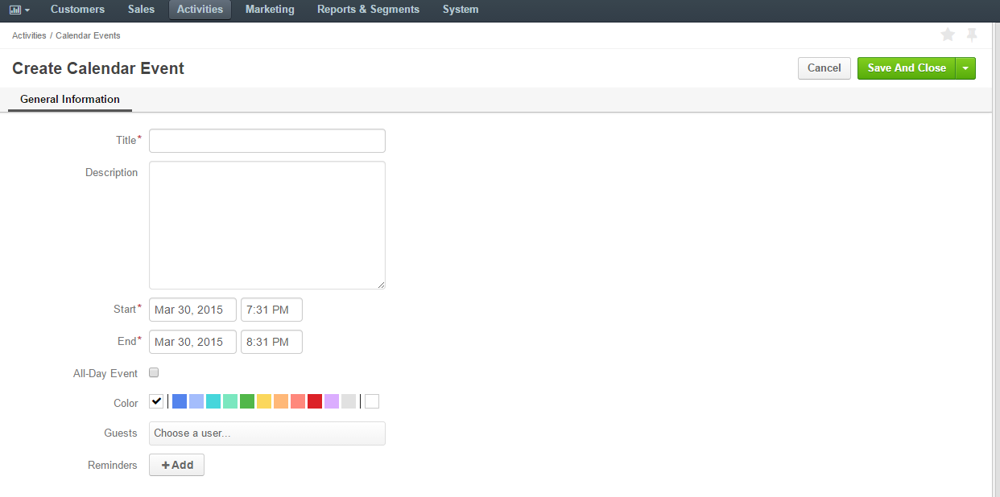
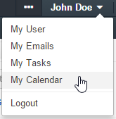

.. _user-guide-activities-events:

Add and Assign Calendar Events
==============================

In order to fix some meeting, conference or another arrangement in your OroCRM account, create a "*Calendar Event"*
record ("calendar event" or "event").  

.. _user-guide-activities-create-events:

Create an Event
---------------
There are several ways to create an event:

- Add an event for a related entity record and define the users-participants.

- Assign an event directly to the user and add other users-participants.

- Create an event from the Events grid and add other users-participants.

Add an Event for a Related Record
^^^^^^^^^^^^^^^^^^^^^^^^^^^^^^^^^

.. important::
    By default, the list of activities available for each entity is determined by what is most commonly used by businesses. However, if your company's work process requires it, you can always turn the desirable activity on for almost any entity (except technical ones). If you need particular activities to be enabled for an entity, contact your administrator, or see steps 4 and 5 of the :ref:`Create an Entity <doc-entity-actions-create>` action description

1. Open the View page of a record the event is related to.

2. Click :guilabel:`Add Event` in the :ref:`actions <user-guide-ui-components-view-page-actions>` tab.

3. The "Add Event" form will appear. The form has the following fields:

.. csv-table::
  :header: "**Name**","**Description**"
  :widths: 10, 30

  "**Title***","The event name. Must be defined."
  "**Start***","Time the event starts. Must be specified." 
  "**End***","Time the event ends. Must be specified."
  "**All day event**","Defines whether the event will take place for a whole day."
  "**Color**","Defines the color to be used in the user's calendar."
  "**Guests**","Defines users, for whom the event is created. Choose the user records from the drop-down menu. Any 
  amount of users can be chosen."
  "**Reminders**","Defines if a message must be sent to the users defined in the *Guests* field before the event.
  Click the :guilabel:`Add` button to add a reminder.

  - Define if the message must be an email or a flash message, as well as and how long before the time defined in the 
    *Start* it must be sent."

For example, we want Ellen Rowell from the sales team and Michael Buckley from the marketing team to be present at a 
meeting with a new contact from the Cal Stereo company. We have chosen a red color to display the event in the users' 
calendars.

.. image:: ../img/activities/add_event_ex.png
   
4. Click the :guilabel:`Save` button and the event will be added.

Assign an Event to a User
^^^^^^^^^^^^^^^^^^^^^^^^^

1. Go to the View page of the user record, for which the event is assigned.

2. Click :guilabel:`Assign Event` in the :ref:`actions <user-guide-ui-components-view-page-actions>` tab of the user.

3. The "Assign Event to {user name}" form will appear.

   The form has the same fields as the "Add Event" form. The "Guest" field in this case relates to attendees other 
   than the user and may be left empty. 

For example, we also need Ellen Rowell to visit a sales conference on April 8th.

.. image:: ../img/activities/assign_event_ex.png

4. Click the :guilabel:`Save` button and the event will be saved.

Create an Event from the Events Grid
^^^^^^^^^^^^^^^^^^^^^^^^^^^^^^^^^^^^

1. Go to *Activities → Calendar Events* or click the :guilable`Events` button above your calendar.

2. Click the :guilabel:`Create Calendar Event` button.

3. The "Create Calendar Event" form will appear.

The form has the same fields as the "Add Event" form. The "Guest" field relates to attendees other than
the user and may be left empty.

View and Manage Events
^^^^^^^^^^^^^^^^^^^^^^

.. note::

   The ability to view and edit the events depends on specific roles and permissions defined for them in 
   the system. 
   
- All the events  added  for a record are displayed and can be reached from the *Record Activities* section on the 
  View page:

  |
  
.. image:: ../img/activities/add_event_view.png

|
  
- To see the details, click on the event title or the :guilabel:`+` to the left from it.  

  |
  
.. image:: ../img/activities/add_event_view_detailed.png

- All your calendar events assigned to you are displayed and can be reached from the Events grid.

- In order to see the events assigned to another user on the Events grid:
  
  - Go to "My Calendar".

|

- Choose the user in the drop-down on the left.

.. image:: ../img/activities/assign_events_cal_add.png  

- From any of the grids above, you can manage the events using the action icons:

  - Delete the task: |IcDelete|

  - Get to the :ref:`Edit form <user-guide-ui-components-create-pages>` of the event: |IcEdit|

  - Get to the :ref:`View page <user-guide-ui-components-view-pages>` of the event:  |IcView|

- You can also manage your events from the calendar:

  - Click on the task in the calendar to get to its information tab. 
  
  - Use the buttons at the bottom to manage the task.

.. image:: ../img/activities/my_tasks_info.png

.. note::
  
    The calendar events can also be mapped to the Outlook account as described in the corresponding
    :ref:`section <outlook-task-mapping>` of the :ref:`Synchronization with Outlook guide <user-guide-synch-outlook>`.

.. note::
  
    The tasks can also be mapped to the Oulook account as described in the corresponding 
    :ref:`section <outlook-calendar-mapping>` of the
    :ref:`Synchronization with Outlook guide <user-guide-synch-outlook>`.

.. |IcDelete| image:: ../../img/buttons/IcDelete.png
   :align: middle

.. |IcEdit| image:: ../../img/buttons/IcEdit.png
   :align: middle

.. |IcView| image:: ../../img/buttons/IcView.png
   :align: middle
