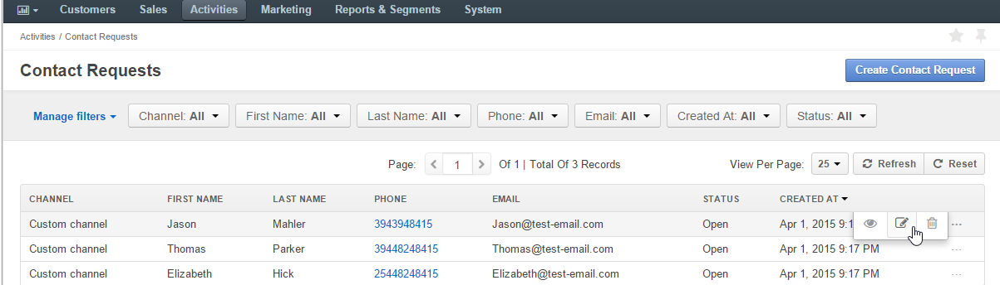

.. _user-guide-activities-requests:

Contact Requests
================

Contact requests are used to track contact with individuals who are requesting information such as product information, support, partnership information, or any other types of assistance. Oro has a standard embedded contact form out-of-the-box for you to add to your websites. When your customers use this form, contact requests are automatically generated and added to the page of all contacts in your Oro application. 

See a short demo in our media library on `how to create and manage contact requests <https://oroinc.com/orocrm/media-library/manage-contact-requests>`_, or keep reading the guidance below.

.. raw:: html

   <iframe width="560" height="315" src="https://www.youtube.com/embed/psQnfsFxQeg" frameborder="0" allowfullscreen></iframe>

Create a Contact Request from a Third-Party Application
-------------------------------------------------------

Add the code for the form to your website, as described in the :ref:`Embedded Forms guide <admin-embedded-forms>` topic. 
Use the *Magento Contact Us Request form* type for the Magento-based businesses, or the *Contact Request form*
type for the other websites. Every time a customer completes the form, the information is automatically synced to your Oro application.  

.. note:: Other contact request types can be developed in the course of integration, according to your specific business needs.

How to View and Manage Contact Requests
---------------------------------------

The ability to view and edit contact requests depends on the specific :ref:`roles and permissions <user-guide-user-management-permissions-roles--acl>` defined in the system. 
   
All contact requests can be viewed from the page of all contact requests under **Activities > Contact Requests** in the main menu. From this page, you can view, edit and delete contact requests:

.. note:: You can also check out an article on :ref:`how to create contact requests manually <user-guide-activities-requests-create-manually>` in your Oro application.

.. include:: /img/buttons/include_images.rst
   :start-after: begin

