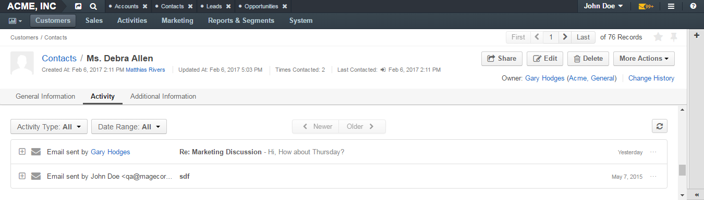
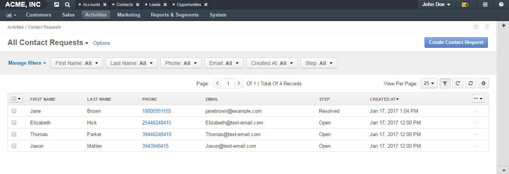

.. _user-guide-activities:

Activities
==========

.. contents:: :local:
    :depth: 2

Overview
--------

Activities are actions that employees of your company perform on a daily basis. The range of these actions is quite wide. Employees define and fulfill job tasks, handle different issues, communicate with colleagues and customers, participate in events. Hence, it is important to have a good tool that gives a possibility to conveniently keep track on and manage all these actions. 

OroCRM provides such a tool. Its capabilities for managing activities are quite wide. They cover three logical directions: workflow management, communications, and adding useful remarks.

|

.. image:: ../img/activities/activities.png

| 

For each activity, it is possible to add links to the related records. For example, a link to an email with the discussion in which the activity emerged, the marketing campaign that the activity deals with, and the user concerned, etc. Such links are called ``contexts`` and they make it much easier to take account of all the details connected with the activity.

.. Note:: 
   An account is an entity that integrates customer entities, therefore, if one of the customers who constitute an account is added as a context of some activity, the account inherits this activity and you can see it not only on the customer view page but on the account's as well.

In this document, you can find short descriptions of what each activity serves for. 

.. important:: 
 	By default, the list of activities available for each entity is determined by general business practices. However, if the work process of your company requires it, you can always turn on the desirable activity for almost any entity (except technical). If you need particular activities to be enabled for an entity, contact your administrator, or see steps 4 and 5 of the :ref:`Create an Entity <doc-entity-actions-create>` action description.

Workflow Management
-------------------

Managing Tasks
""""""""""""""

What Is a Task? 
~~~~~~~~~~~~~~~

Tasks are assignments that need to be accomplished by a user. Keeping track on tasks helps organize the work process and ensure that all the important work is done. 

'Create a regional sales report,' 'Compose an email to customer ABC,' 'Prepare everything required for marketing campaign A'—these are all examples of tasks that users can be assigned. 

What You Can Do with Tasks?
~~~~~~~~~~~~~~~~~~~~~~~~~~~

With OroCRM you can create, assign tasks, organize them by priority, set their due date and manage them through their life cycles. 

|

.. image:: ../img/activities/activities_tasks.png

| 

  
Tasks can be created in 3 different ways. 

**1st Way**

If you need to distribute work in your business unit and make sure that the work time of your employees is used efficiently, you can go to the user view page, check their current tasks in the corresponding section, and click the :guilabel:`Assign Task` action button to create and immediately assign a new task to this user.  

**2nd Way**

The second way is the most convenient when the idea of the task appears when you work with the certain entity record. For example, you work with an opportunity record and decide to create a task related to it. Click the :guilabel:`Add Task` action button on the opportunity record view page to create a task. 

|

.. image:: ../img/activities/activities_tasks2.png

| 

When you add a task from an opportunity page, this opportunity is displayed as a context of the task being created. 

|

.. image:: ../img/activities/activities_tasks2-2.png

|
  

.. note::
    If you use the :guilabel:`Add Task` action button on a user view page, the user will not appear as a context for the task. 

**3rd Way**

The third way of creating tasks is the most traditional: you have the whole system section devoted to tasks (by default you can find it by navigating to **Activities>Tasks** in the main menu) where you can create, assign and manage them according to your liking.

|

.. image:: ../img/activities/activities_tasks3.png

|

Users can see tasks assigned to them on the **My Tasks** page and in the **Tasks** section of their view pages. 

If an entity record is marked as a context for a task, this task appears in the **Activity** section on the entity record view page. 

For more information about tasks, see the :ref:`Tasks <user-guide-activities-tasks>` guide.

  
Managing Cases
""""""""""""""

What Is a Case? 
~~~~~~~~~~~~~~~

Cases are issues, problems or failures reported by customers or found internally. It is important to record, monitor and solve cases in time to ensure that small and big issues do not harm the business of your company. 

'5 faulty details in the supply,' 'Missing picture for product 01234,' 'User Jane Smith cannot log in' are examples of cases that you can create. 

What You Can Do with Cases?
~~~~~~~~~~~~~~~~~~~~~~~~~~~

You can create, assign cases, organize them by their source, priority, set their due date and manage them through their life cycles. 

In addition to this, OroCRM provides an out-of-box integration with Zendesk customer support platform. Once it is activated, you can load data from Zendesk tickets into OroCRM cases and vice versa. (Note that you need to have a configured Zendesk account).

In the dedicated system section (by default you can find it by navigating to **Activities>Cases** in the main menu) you can create, assign and manage cases as you find it necessary.

|

.. image:: ../img/activities/activities_cases.png

|

Users can see cases assigned to them in the **Cases** section of their view pages. 
If an entity record is marked as a context for a case, this case appears in the **Activity** section of the entity record view page.

For more information about cases, see the :ref:`Cases <user-guide-activities-cases>` guide.

Calendar Events
"""""""""""""""

What Is a Calendar Event? 
~~~~~~~~~~~~~~~~~~~~~~~~~

It is very easy for a busy employee who is working hard on some task to forget about some meeting or appointed call. Similarly easy one can imagine a situation when one employee sends emails to another hoping to find a quick answer to an urgent question and nobody answers. It usually takes you a bit of time and a few more calls to find out that the said colleague is on the business trip or at a conference.
   
While such incidents can negatively affect the reputation of your business and work performance, it is very easy to deal with them: for each important meeting, conference, call, vacation, etc. create an event in an OroCRM calendar. It will help you avoid missing appointments or calls, and your colleagues can easily follow your schedule and be sure that that they are up-to-date with your business trips and conferences.

What You Can Do with Calendar Events?
~~~~~~~~~~~~~~~~~~~~~~~~~~~~~~~~~~~~~

You can create a calendar event, define its participants, set up reminders about the event, and select how and when to send them to participants. 

If more than one person should participate in the event, add them as guests to make this event appear in their calendars as well. 

Similar to tasks, there are three ways of creating a calendar event: 

- By clicking :guilabel:`Assign Calendar Event` action button on the view page of the user who you want to assign this event to.
- By clicking the :guilabel:`Add Calendar Event` action button on the view page of the entity record related to this event. For example, if you want to discuss a certain account with your colleagues, you can go to the account's view page and add a new calendar event from it. The account will become a context for this event.   
- By clicking the :guilabel:`Create Calendar Event` button in the dedicated system section. 

|

.. image:: ../img/activities/activities_calendarevents.png

|

Once you have created an event, an invitation will be sent to the specified participants.    

Users can track events on the **My Calendar** page or via the dashboard widget (**Today's calendar**). They can also see calendars of their colleagues or any additional calendars added by an administrator.

If an entity record is marked as a context for a calendar event, this event appears in the **Activity** section on the entity record view page.

For more information about calendar events, see the :ref:`Calendar Events <user-guide-activities-events>` guide.

Communications
--------------

Making and Logging Calls
""""""""""""""""""""""""

.. start-include-calls

Although not every company employee makes calls very often, calls play one of the most crucial roles in sales and are of significant help to support teams. For those users who make and receive many calls per day or / and communicate  with clients by phone, it is convenient to have an instrument that enables them to make records of who they called to and what they discussed. Such instrument is also helpful to managers who can monitor the progress of important tasks and see if all key contacts have received enough attention.

OroCRM's call logging functionality allows users to record who the call was with, which party initiated it, when it was made and what its duration and subject were. A user can also make additional notes regarding the conversation and mention what entity records it dealt with. 

Additionally, OroCRM's integration with Google Hangouts enables users to make Hangouts voice or video calls from within OroCRM, providing an advantage for sales and support teams by enabling them to connect with customers directly.
Users can make voice calls to a single phone number, or launch a audio / video conference with up to 5 participants. Call data is logged automatically, including any notes made during the call.

There are three ways to start making or logging a call: 

- By clicking the :guilabel:`Log Call` button in the dedicated system section.
- By clicking the **Hangouts call** or **Log Call** icons that appear near the phone fields throughout the system when you hover over them.  
- By clicking :guilabel:`Log Call` action button on the view page of the entity that the call is connected to.

|

.. image:: ../img/activities/activities_calls3.png

|

.. image:: ../img/activities/activities_calls.png

|

Users can access logged calls in the dedicated system section, in the **Activities** section of their user page, via the :ref:`Recent Calls <doc-widgets-recent-calls>` dashboard widget. If an entity record is marked as a context for a call, this call appears in the **Activity** section on the entity record view page.

|

.. image:: ../img/activities/activities_calls2.png

|

For more information about logging calls, see the :ref:`Calls <doc-activities-calls>` guide.

For information about whether Hangouts calls are available for you, contact an administrator or see the :ref:`Voice and Video Calls via Hangouts <user-guide-hangouts>` guide.

.. end-include-calls

Sending and Receiving Emails
""""""""""""""""""""""""""""

In the majority of modern companies, a significant amount of important information is being exchanged via emails. Company employees may not use phones or messengers but email box is a must. 

OroCRM allows users to send and receive emails from within the system utilizing both personal and system (company-wide) mailboxes. Users can neatly design their letters using HTML formatting and an in-built text editor, create and use email templates, attach files to emails, configure personalized signatures. It is also possible to configure auto-actions (for example, for each email received to a certain mailbox, a lead record or a case may be created in the system) and auto-responses.

OroCRM also provides a feature of auto-assignment to contact, thanks to which new emails synced into Oro are automatically linked to contacts if email addresses of these contacts appeared in the correspondence. Moreover, when an email contains a file as an attachment, it is possible to reattach the file to the entity record itself (manually or automatically).  

Oro CRM Enterprise Edition also supports integration with Microsoft Exchange Server and Outlook.

Users can access their emails on the personal **My Emails** page, via the **Recent Emails** menu button, and the **Recent Emails** dashboard widget.

|

.. image:: ../img/activities/activities_emails1.png

|

When an entity record is mentioned as a context in an email, or if an email is sent using the **Send Email** action button from the entity record view page, this email becomes available in the **Activities** section of the record  view page. Emails linked to contacts appear in the same section on the corresponding contact view pages.

|

|

For more information on using emails, see the :ref:`Emails <user-guide-using-emails>` guide.

For how to configure emails, ask your administrator or see the :ref:`Email Configuration <user-guide-email-admin>` guide.

Creating Contact Requests
"""""""""""""""""""""""""

Imagine that your company participates in an exhibition. Visitors advance your representers asking for more detailed information about the company's products to be sent to them via email or telling that they already use your products but would like some assistance with them. 

To maintain such requests, use the contact request functionality in OroCRM. With it you can create a contact request record in which you define who you need to contact and how (via email or phone), the request type (i.e. what a requester needs: more information, assistance, make a complaint, etc.) and fill in any details that concern this request.

Users can see and manage contact request in the dedicated system section.

|

|

Contact requests can be also created automatically. For this, put an embedded form like 'Contact Us' on your site. After a user fills in the form and submits it, a corresponding contact request will appear in your Oro application. You can read more about embedded forms in the :ref:`Embedded Forms <admin-embedded-forms>` guide.

For more information about contact requests, see the :ref:`Contact Requests <user-guide-activities-requests>` guide.

Adding Useful Remarks
---------------------

Making Notes
""""""""""""

Sometimes you need to leave additional information about an entity record. For example, you know that you need to refer to one of your foreign contacts in a certain way. While it is possible to add an additional field to an entity to store this information, it is not very rational when it relates only to one or two contacts, while other contacts may require very different but also specific remarks. 

For such cases, OroCRM provides an in-built functionality that enables you to leave different notes on entity records.

|

.. image:: ../img/activities/activities_notes.png

|

You can add a note by clicking the :guilabel:`Add Note` action button on the view page of the entity record that the note relates to. You can format notes as necessary and attach files to them. 

Notes are displayed in the **Activities** section of the entity record view page.

For more information about notes, see the :ref:`Notes <user-guide-add-note>` guide.

Leaving Comments
""""""""""""""""

Discussing work with colleagues can boost work process. Use comments functionality to have a discussion on an entity record view page.  This way users can be sure that everything important that emerged during this discussion will not be lost and can be easily found.   
Users can also use comments to express their personal opinion about an entity record or anything connected with it (while notes can designated for storing objective information regarding an entity record).

You can leave a comment in the **Comments** section of the entity view page. 

|

.. image:: ../img/activities/activities_comments.png

|

For more information about comments, see the :ref:`Comments <user-guide-activities-comments>` guide.

Add Attachments
"""""""""""""""

When you need to provide additional information about an entity record and this information is fully included in a file (for example, you want to add a calculation sheet), add this file as an attachment directly to the entity record. 

You can attach files by clicking the :guilabel:`Add Attachment` action button on the view page of the entity record that the attachment relates to.

Files attached to the entity record appear in the **Attachments** section of the entity record. 

|

.. image:: ../img/activities/activities_attachments.png

|

For more information about attachments, see the :ref:`Attachments <user-guide-activities-attachments>` guide.

