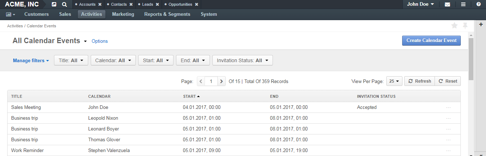
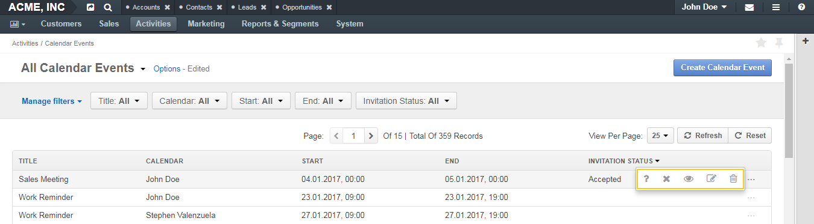

.. _doc-activities-events-grid:

All Calendar Events Grid
========================

|

|

Page Top
^^^^^^^^

On the upper-left of the page, you can see the name of the selected grid view. The only grid view available by default for calendar events is **All Calendar Events** (all available calendar events are displayed).

In the upper-right part of the page, you can see the :guilabel:`Create Calendar Event` action button. Click it to make a new calendar entry. See the :ref:`Add a Calendar Event <doc-activities-events-actions-add>` action descriptions.

The other grid controls are common for all grids in the application. See the :ref:`Grids <user-guide-ui-components-grids>` guide for more information on grids.

Grid
^^^^

+-------------------+------------------------------------------------------------------+
| Field             | Description                                                      |
+===================+==================================================================+
| TITLE             | The event name.                                                  |
+-------------------+------------------------------------------------------------------+
| CALENDAR          | Which calendar this event belongs to.                            |
+-------------------+------------------------------------------------------------------+
| START             | The day and time when the event starts.                          |
+-------------------+------------------------------------------------------------------+
| END               | The day and time when the event ends.                            |
+-------------------+------------------------------------------------------------------+
| INVITATION STATUS | Whether the invitation for the event has been accepted.          |
+-------------------+------------------------------------------------------------------+

Inline editing within the grid is not available for calendar events. If you wish to change the details of a record, you should first open it and then make the necessary changes on the record edit page.

Access a Calendar Event
~~~~~~~~~~~~~~~~~~~~~~~

To respond to a calendar event, view, edit, or delete it, click the ellipsis menu at the end of the row, and then click the corresponding icon.

To view a calendar event, you can also click the corresponding row itself.

|

|

See the action descriptions:

- :ref:`Respond to a Calendar Event <doc-activities-events-actions-respond>`
- :ref:`View a Calendar Event <doc-activities-events-actions-view>`
- :ref:`Edit a Calendar Event <doc-activities-events-actions-edit>`
- :ref:`Delete a Calendar Event <doc-activities-events-actions-delete>`

Mass Actions
~~~~~~~~~~~~

You can delete multiple calendar events from this page. See the :ref:`Delete Multiple Calendar Events <doc-activities-eventss-actions-massdelete>` action description.

See Also
========

:ref:`Calendar Events Overview <doc-activities-events>`

:ref:`Manage Calendar Events <doc-activities-events-actions>`

:ref:`Calendar Event View Page <doc-activities-events-view-page>`

:ref:`My Calendar Page <doc-my-oro-calendar>`

:ref:`Today's Calendar Widget <doc-widgets-today-calendar>`

