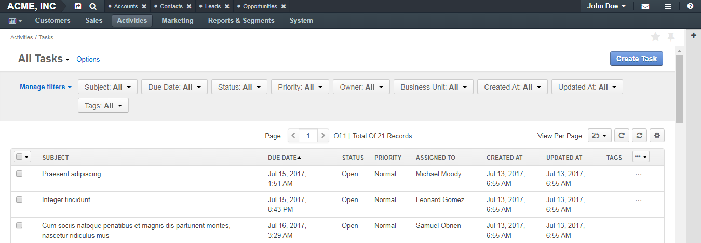
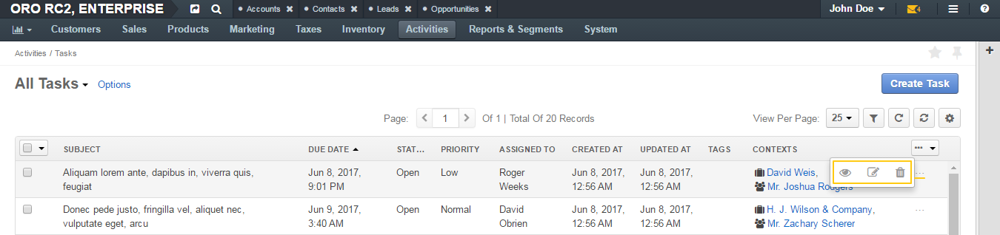

.. _doc-activities-tasks-grid:

All Tasks Grid
==============

|

|

.. contents:: :local:
   :depth: 3

.. _doc-activities-tasks-grid--page-top:

Page Top
^^^^^^^^

On the upper-left of the page, you can see the name of the selected grid view. The only grid view available by default for tasks is **All Tasks** (all available tasks are displayed).

In the upper-right part of the page, you can see the :guilabel:`Create Task` action button. Click it to add a new task. See the :ref:`Add a Task <doc-activities-tasks-actions-add>` action descriptions.

The other grid controls are common for all grids in the application. See the :ref:`Grids <user-guide-ui-components-grids>` guide for more information on grids.

.. _doc-activities-tasks-grid--grid:

Grid
^^^^

+-------------+-------------------------------------------------------------------------------------------------------------------------------------------+
| Field       | Description                                                                                                                               |
+=============+===========================================================================================================================================+
| SUBJECT     | Short, one-phrase description of what the task is about.                                                                                  |
+-------------+-------------------------------------------------------------------------------------------------------------------------------------------+
| DUE DATE    | The day and time when the task must be completed.                                                                                         |
+-------------+-------------------------------------------------------------------------------------------------------------------------------------------+
| STATUS      | The phase of work on the task.                                                                                                            |
+-------------+-------------------------------------------------------------------------------------------------------------------------------------------+
| PRIORITY    | Nominates an order in which the task should be managed. Can be *High*, *Normal*, or *Low*. Higher-priority tasks should be managed first. |
+-------------+-------------------------------------------------------------------------------------------------------------------------------------------+
| ASSIGNED TO | The user that is responsible for doing the work related to the task.                                                                      |
+-------------+-------------------------------------------------------------------------------------------------------------------------------------------+
| CREATED AT  | The day and time when the task has been created.                                                                                          |
+-------------+-------------------------------------------------------------------------------------------------------------------------------------------+
| UPDATED AT  | The day and time when the task information has been changed.                                                                              |
+-------------+-------------------------------------------------------------------------------------------------------------------------------------------+
| TAGS        | A list of :ref:`tags <user-guide-tags>` added to the task.                                                                                |
+-------------+-------------------------------------------------------------------------------------------------------------------------------------------+
| CONTEXTS    | Links to the records that somehow relate to the task.                                                                                     |
+-------------+-------------------------------------------------------------------------------------------------------------------------------------------+

.. _doc-activities-tasks-grid--manage-task:

Manage a Single Task
~~~~~~~~~~~~~~~~~~~~

To view, edit, or delete a task, click the ellipsis menu at the end of the row, and then click the corresponding icon.

To view a task, you can also click the corresponding row itself.

|

|

See the action descriptions:

- :ref:`View a Task <doc-activities-tasks-actions-view>`
- :ref:`Edit a Task <doc-activities-tasks-actions-edit>`
- :ref:`Delete a Task <doc-activities-tasks-actions-delete>`

.. _doc-activities-tasks-grid--manage-task-mass:

Mass Actions
~~~~~~~~~~~~

You can delete multiple tasks from this page. See the :ref:`Delete Multiple Tasks <doc-activities-tasks-actions-massdelete>` action description.

See Also
========

:ref:`Tasks Overview <doc-activities-tasks>`

:ref:`Manage Tasks <doc-activities-tasks-actions>`

:ref:`Task View Page <doc-activities-tasks-view-page>`

:ref:`My Tasks <doc-my-oro-tasks>`

:ref:`My Calendar Page <doc-my-oro-calendar>`

:ref:`Tasks List Sidebar Widget <doc-widgets-sidebar-task-list>`

:ref:`Today's Calendar Widget <doc-widgets-today-calendar>`

:ref:`Task Flow Workflow <doc--workflows--task-flow>`
