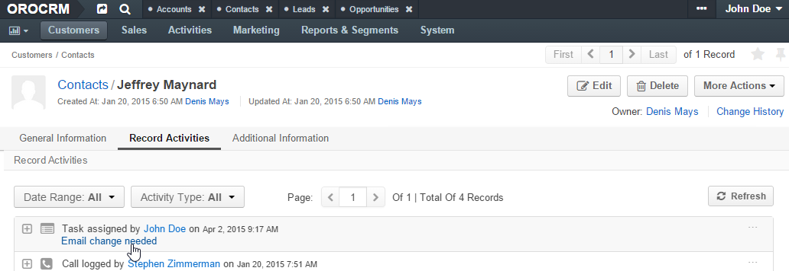
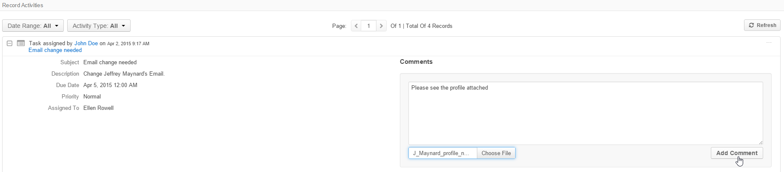

.. _user-guide-activities-comments:

Add Comment
===========

If you want to comment details of an :ref:`activity <user-guide-activities>`, other than a contact request (e.g. leave 
some additional details of task, comment on an email sent or a call made, etc.) use the "*Add Comment"* action.

.. note::

    Comments are available only for the actions that have the Comments activity 
    :ref:`enabled <user-guide-activities-enable>`.

Create and View Comments
------------------------

Once an activity has been created, a comment can be added to it from either its Edit page or from the View page of a 
record the activity is related to.

.. caution::

   The ability to view and write comments depends on the permissions and role settings defined in the system for the 
   Comment entity.

So, if an activity has been related to a user, you can:

- View the activity details:

  - Go to the View page of the record and open to the Record Activities section (or the User Tasks if you want to 
    comment on a task assigned to a user and click on the activity title.

  - Alternatively, go to the activities grid and click the icon to get to the activity View page.
  
- Click the :guilabel:`Add Comment` button.

- Enter the comment into the the text-box.

- Click the :guilabel:`Choose File` button to add a file to the comments.

- Click the :guilabel:`Add Comment` button to save the comment.

.. hint::

    You can :ref:`edit <user-guide-entity-management-edit>` the *Comment* entity and add new fields, if required.

For example, Ellen Rowel was a task "Email change needed", which required her to change the email address of 
Mr. Jeffrey Maynard.

- First, Ellen Rowel opened the "My Tasks" grid.

.. image:: ./img/activities/comments_01.png  

- Then she went to the :ref:`View page <user-guide-ui-components-view-pages>` page of the task and left a comment.

.. image:: ./img/activities/comments_02.png  

- John Doe opened the task details on the View page of Jeffrey Maynard's contact record.

- Then he left a comment and attached Maynard's profile to it.
  

- Michael Buckley from the Marketing department opened the Tasks grid and opened the task View page. He can see both 
  comments made by Ellen Rowel and John Doe.

  .. image:: ./img/activities/comments_05.png 

   
Case Comments
-------------

Case comments work in a similar manner, except there is an additional check-box - "Make Public". You can use it to 
define if the comment shall be public on :ref:`Zendesk <user-guide-zendesk-integration>`. 

  .. image:: ./img/activities/comments_case.png 
