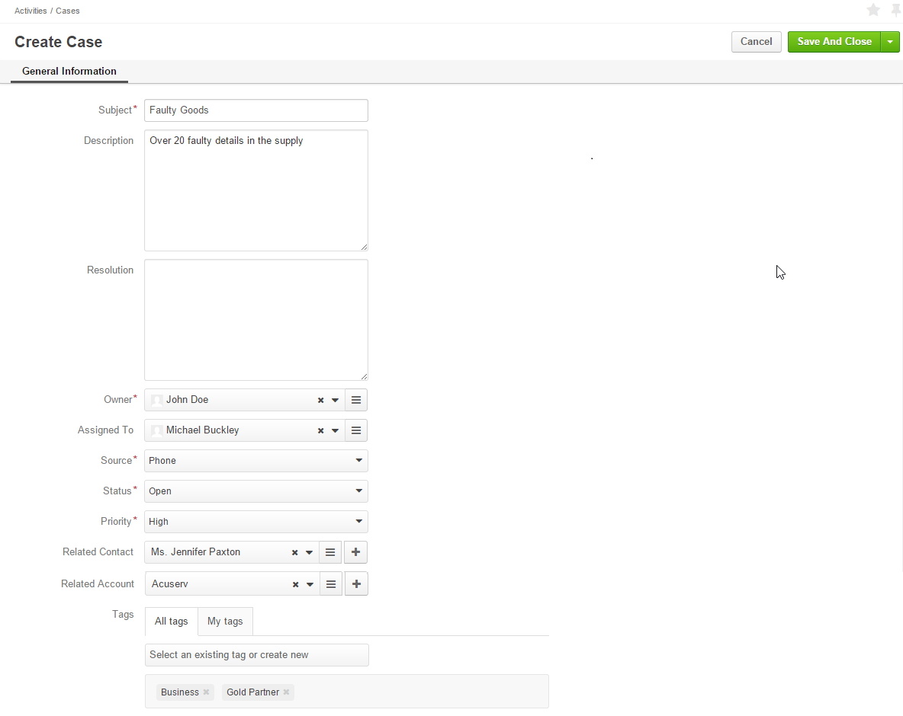

.. _user-guide-activities-cases:

Create Case
===========

Cases correspond to certain issues, problems or failures reported by customers. 

Cases can be created from the Cases grid:

1. Go to *Activities → Cases*.

2. Click the :guilabel:`Create Case` button.

3. The "Create Case" form will appear. The form has the following fields:

.. csv-table::
  :header: "**Name**","**Description**"
  :widths: 10, 30

  "**Subject***","The case title. Must be defined."
  "**Description**","A free text tab. Contains the problem description. May be left empty."
  "**Resolution**","A free text tab. Contains the problem resolution details. May be left empty."
  "**Owner***","Limits the list of users that can manage the case (view, edit) to users, whose roles allow managing 
  cases assigned to the owner (e.g. the owner, owner's managers, colleagues, etc.).

  By default is set to the user filing the case.  
  
  To clear the field, click the :guilabel:`x` button. 
  
  You can choose another owner from the list."
  "**Assigned To**","Defines the user, who shall resolve the issue. The field may be left empty."
  "**Source***","Defines how you have received information about the issue. The possible options are:

  - *Email*
  - *Other*
  - *Phone*
  - *Web*

  The field is by default filled with the *Other* option."
  "**Status***","Defines the current status of the case processing. The possible options are:

  - *Open*
  - *In Progress*
  - *Resolved*
  - *Closed**

  The field is by default filled with the *Open* option." 
  "**Priority***","Defines the task priority. The possible options are:

  - *Low*
  - *Normal*
  - *High* 
  
  The field is by default set to the *Normal* option."
  "**Related Contact**","Defines a :term:`contact record <Contact>` related to the case, if any. The field may be left 
  empty."
  "**Related Account**","Defines an :term:`account record <Account>` related to the case, if any. The field may be left 
  empty."
  "**Tags**","Defines :term:`tags <Tag>` for the case. Click the :guilabel:`Select and existing tag or create new`
  button and either choose a tag from the drop-down menu or enter a new tag. Any number of tags may be added."

4. Click the button in the top right corner to save the case.

For example, the company has received a phone call from a manager of the Acuserv company saying that some of the details 
in the previous supply were faulty. The head of the purchasing department in Acuserv is Jennifer Paxton (a related 
contact). We've assigned the issue to Michael Buckley from the Marketing department and defined its priority as high. 
We've added the "Business" and "Gold Partner" tags for this case.

View and Manage Cases
^^^^^^^^^^^^^^^^^^^^^

.. note:

    The ability to view and edit cases depends on specific roles and permissions defined in the system. 
   
- All the cases can be viewed from the Cases grid.

- All the cases assigned to a specific user (cases, for which the "Assigned to" field is not empty) are displayed in and 
  can be reached from the "Cases" grid in the "Additional Information" section on the View page of the user record.
 
.. image:: ./img/activities/case_view_user.png

- All the cases assigned to a specific contact (cases, for which the  "Related Contact" field is not empty) are 
  displayed in and can be reached from the "Cases" grid in the "Additional Information" section on the View page of the 
  contact record.
  
.. image:: ./img/activities/case_view_contact.png

- All the cases assigned to a specific account (cases, for which the "Related Account" field is not empty) are displayed
  and can be reached from the "Cases" grid in the "Additional Information" section on the View page of the account record.
  
.. image:: ./img/activities/case_view_account.png

- From any of the grids above, you can manage the cases using the action icons:

  - Delete the case: |IcDelete|

  - Get to the :ref:`Edit form <user-guide-ui-components-create-pages>` of the case: |IcEdit|

  - Get to the :ref:`View page <user-guide-ui-components-view-pages>` of the case:  |IcView|

.. note:
  
    The tasks can also be mapped to the Zendesk account as described in the
    :ref:`Integration with Zendesk <user-guide-zendesk>` guide.

.. |IcDelete| image:: ./img/buttons/IcDelete.png
   :align: middle

.. |IcEdit| image:: ./img/buttons/IcEdit.png
   :align: middle

.. |IcView| image:: ./img/buttons/IcView.png
   :align: middle
