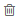

.. _user-guide-activities-calls:

Log Call
========

Calls logging helps to keep a record of the outgoing and incoming calls.

There are two ways to log a call in OroCRM:

- Log a call related to a record of an entity.
- Log a call from the *"Calls"* grid.

Log a Call Related to Another Entity Record
-------------------------------------------

The *"Log Call"* action will be available for records of entities with the *"Calls"* activity 
:ref:`enabled <user-guide-activities-enable>`.

1. Go to the View page of the record, for which the call has been made. 
 
2. Click :guilabel:`Log Call` in the :ref:`actions <user-guide-ui-components-view-page-actions>` tab of the record.

3. The "Log Call" form will appear. The form has the following fields:

.. csv-table::
  :header: "**Name**","**Description**"
  :widths: 10, 30

  "**Owner***","Limits the list of users that can manage the log (view, edit) to users,  whose 
  :ref:`roles <user-guide-user-management-permissions>` allow managing 
  calls assigned to the owner (e.g. the owner, members of the same business unit, system administrator, etc.).

  By default, it is set to the user logging the call.  
  
  To clear the field, click the :guilabel:`x` button. 
  
  You can choose another owner from the list."
  "**Subject***","Topic of the call."
  "**Additional comments**","Record any meaningful call details."
  "**Call date & time***","Time when the call was made. By default, it is set to the time when the call was logged."
  "**Phone number***","Number the call was made to. 
 
  The field is by default filled with the phone number of one of the contacts assigned to the record (if any).

  To clear the field, click the :guilabel:`x` button." 
  "**Direction***","Defines whether the call was outgoing or ingoing. By default, the field is set to *Outgoing*."
  "**Duration**","Define how long the call was."

For example, we have called Mr. Maynard to verify the email address:

- The "Owner" field was automatically filled with the user John Doe.
- We've defined the call subject and briefly described the call results in the "Additional comments" section.
- We've specified the call duration (5 minutes).

.. image:: ./img/activities/log_call_ex.png  

.. hint::

    "Call date & time", "Phone number" and "Direction" fields are filled in automatically, but you can change their 
    values as required.

4. Click the :guilabel:`Log Call` button and the call will be logged.

Log Call from the Calls Grid
----------------------------

1. Go to *Activities → Calls*.

2. Click the :guilabel:`Log Call` button.

3. The "Log Call" form will appear.

.. image:: ./img/activities/log_call_form.png

|

The form has the same fields. By default, no phone number is defined.

|

View and Manage Calls
^^^^^^^^^^^^^^^^^^^^^

.. note:

   The ability to view and edit the calls depends on specific roles and permissions defined for them in 
   the system. 
   
- All the calls can be viewed from the Calls grid.

- All the calls logged for a record are displayed and can be reached from the *Record Activities* section on the 
  View page:

.. image:: ./img/activities/log_call_view.png

- To see the details, click on the call title or the :guilabel:`+` to the left of it.

      |

From any of the grids above, you can manage the tasks using the action icons:

- Delete the call: |IcDelete|

- Get to the :ref:`Edit form <user-guide-ui-components-create-pages>` of the call: |IcEdit|

- Get to the :ref:`View page <user-guide-ui-components-view-pages>` of the call:  |IcView|
  
  

.. |IcEdit| image:: ./img/buttons/IcEdit.png
   :align: middle

.. |IcView| image:: ./img/buttons/IcView.png
   :align: middle
