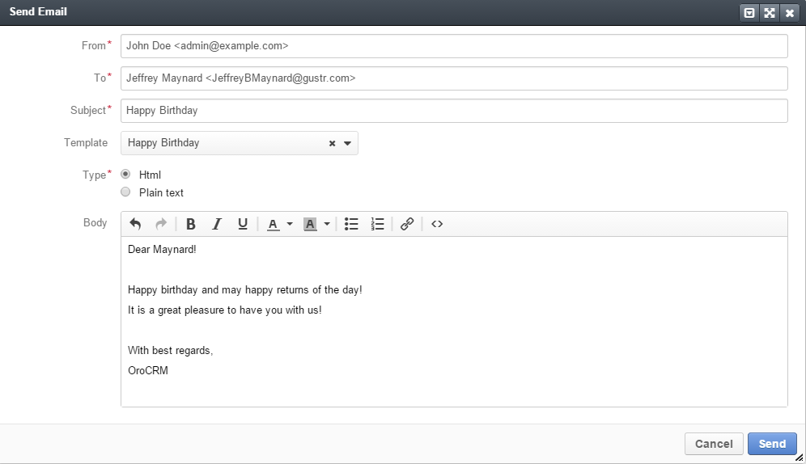
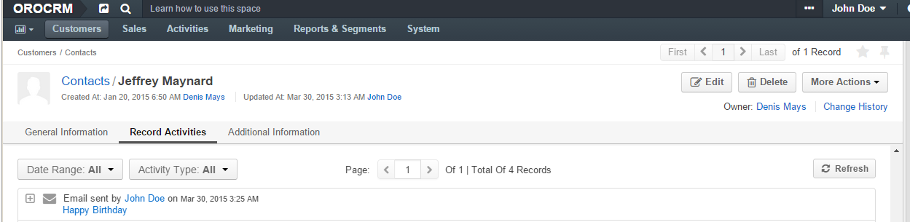
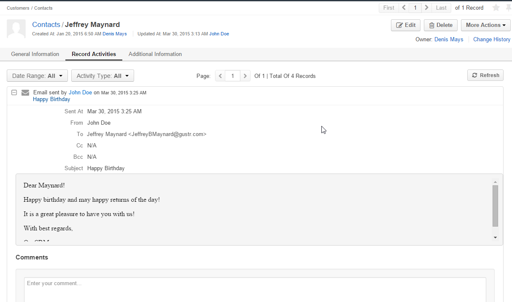

.. _user-guide-activities-emails:

Send Email
==========

The *Send Email* action will be available for records of entities with "Emails" activity 
:ref:`enabled <user-guide-activities-enable>`.

.. note::

    "Emails" activity is by default enabled and cannot be disabled for users.

1. Go to the View page of the record, for which the email is created. 

2. Click :guilabel:`Send Email` in the :ref:`actions <user-guide-ui-components-view-page-actions>` tab of the record.

3. The "Send Email" form will appear. The form has the following fields:

.. csv-table::
  :header: "**Name**","**Description**"
  :widths: 10, 30

  "**From***","The sender's address. The field is by default filled with the primary email address of the user, who is
  creating the email. 
  
  To clear the field, click the :guilabel:`x` button. 
  
  If the field is clear, you can enter another email address. The cannot be empty and only one address can be defined."
  "To","Recipients of the email.  The field is by default filled with the primary email address of one of the contacts 
  assigned to the record (if any).

   To clear the field, click the :guilabel:`x` button. 
   
   Click the :guilabel:`Cc` or :guilabel:`Bcc` button to define emails for a carbon copy or a blind carbon copy of the 
   email.
   
   At least one of the fields (*To*, *Cc* or *Bcc* must be filled)"
   "Subject","Topic of the email. The field must be filled."
   "Apply template","You can choose an :ref:`email template <user-guide-email-template>` to use from the drop-down."
   "Type","Define if you want to use an html or a plain text for the email. The type is be default set to html."
   "Body","Define the email body"
   
For example, we have created an Email for the contact Jeffrey Maynard:
- The "From" field was automatically filled with email address of the user John Doe
- The "To" field was  filled with the email of the contact
- We've chosen the template Happy Birthday and subject and body were defined as in the template. 

.. hint::

    You can change any of the field values manually as required.
   
4. Click the  :guilabel:`Send` button and the Email will be sent.

All the emails sent for a record are displayed and can be reached from the *Record Activities* section on the View page:

To see the details, click on the email title or the :guilabel:`+` to the left from it.

