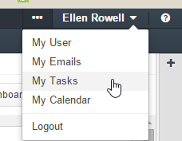
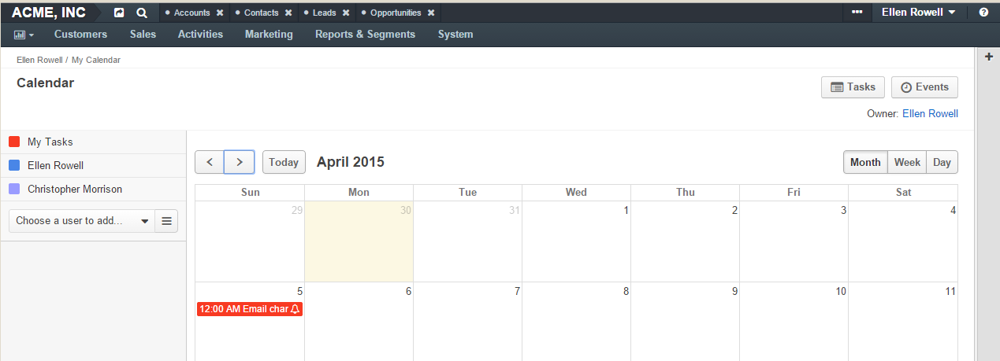
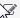

.. _user-guide-activities-tasks:

Add Task and Assign Task
========================

Tasks represent certain actions and issues assigned to a specific OroCRM user. 

Create a Task
-------------
There are several ways to create a task:

- Add a task for another entity record and define the user responsible

- Assign a task directly to the user

- Create a task in the Tasks grid

Add a Task for Another Record
^^^^^^^^^^^^^^^^^^^^^^^^^^^^^

The *Add Task* action will be available for records of entities with "Tasks" activity 
:ref:`enabled <user-guide-activities-enable>`.

1. Open the View page of a record the task is related to.

2. Click :guilabel:`Add Task` in the :ref:`actions <user-guide-ui-components-view-page-actions>` tab.

3. The "Add Task" form will appear. The form has the following fields:

.. csv-table::
  :header: "**Name**","**Description**"
  :widths: 10, 30

  "**Subject***","The task title. Must be defined."
  "**Description**","A free text tab. Contains the task description. The field may be left empty."
  "**Due date**","Defines the date the task is due from the calendar (if any)."
  "**Priority***","Defines if the task priority. The possible values are: 
  
  - *Low*
  - *Normal*
  - *High*
  
  The field is by default set to *Normal*."
  "**Assigned To***","Choose the user, to whom the task is assigned. By default, the field is by default filled in with 
  name of the user, creating the task."
  "Reminders","Defines if a message must be sent to the user defined in the *Assigned to* field with regard to the task.
  
  Click the :guilabel:`Add` button to add a reminder.

   - Define if the message will be an email or a flash message, as well as how long before the time defined in the 
   *Due date* it will be sent. 

  Reminders cannot be defined if the due date hasn't been defined."
   
For example, we want Ellen Rowell from the sales to replace the email address of Jeffrey Maynard, who has recently 
changed his work. 

We have created a relevant task on the View page of Jeffrey Maynard's contact record.  The task must be done within
a week (till April 5th). An email will be sent to Ellen Rowell one day before the due date.

.. image:: ./img/activities/add_task_ex.png
   
4. Click the :guilabel:`Create Task` button and the Task will be added.

Assign a Task to a User
^^^^^^^^^^^^^^^^^^^^^^^

1. Go to the View page of the user record, for which the task is assigned.

2. Click :guilabel:`Assign Task` in the :ref:`actions <user-guide-ui-components-view-page-actions>` tab.

3. The "Assign Task to {user name}" form will appear.

   The form has the same fields as the "Add Task" form. The "Assigned to" field value is the user you have chosen, and 
   it cannot be edited.

For example, we also need Ellen Rowell to find a new contact at Cal Stereo, where Mr. Jeffrey Maynard used to work.
The task has no specific due date, but its priority is high.

.. image:: ./img/activities/assign_task.png

4. Click the :guilabel:`Create Task` button and the task will be added.

Create a Task from the Tasks Grid
^^^^^^^^^^^^^^^^^^^^^^^^^^^^^^^^^

1. Go to *Activities → Tasks*.

.. hint:

    Another way to get to the grid is to click the :guilable`Tasks` button above your calendar.

2. Click the :guilabel:`Create Task` button.

3. The "Create Task" form will appear.

.. image:: ./img/activities/create_task.png

The form has the same fields as the "Add Task" form. By default, the "Assigned to" field is filled with the user
creating the task but it can be edited.

This is a particularly convenient way to create a task for yourself, as well as for other users.

View and Manage Tasks
^^^^^^^^^^^^^^^^^^^^^

.. note:

   The ability to view and edit the tasks depends on specific roles and permissions defined for them in 
   the system. 
   
- All the tasks can be viewed for the Tasks grid

- All the events added for a record are displayed and can be reached from the *Record Activities* section on the 
  View page of this record:

.. image:: ./img/activities/add_task_view.png

- To see the details, click on the task title or the :guilabel:`+` to the left from it.  

.. image:: ./img/activities/add_task_view_detailed.png

- All the tasks assigned to a user will appear in the "User Tasks" grid in the "Additional Information" section of the 
  user's View page. 

.. image:: ./img/activities/assign_task_manage.png

- From any of the grids above, you can manage the tasks using the action icons:

  - Delete the task: |IcDelete|

  - Get to the :ref:`Edit from <user-guide-ui-components-create-pages>` of the task: |IcEdit|

  - Get to the :ref:`View page <user-guide-ui-components-view-pages>` of the task:  |IcView|

Tasks Assigned to You
"""""""""""""""""""""

Once you have logged into the system, you can see the Task grid in "My Tasks" page.

.. image:: ./img/activities/my_tasks.png

Tasks, for which a due date has been defined will also appear in the "My Calendar" page:

Click on the task in the calendar to get to its information tab. Use the buttons at the bottom to manage the task.

.. image:: ./img/activities/my_tasks_info.png

.. note:
  
    The tasks can also be mapped to the Oulook account as described in the corresponding 
    :ref:`section <ooutlook-calendar-mapping>` of the 
    :ref:`Synchronization with Outlook guide `<user-guide-synch-outlook>.

.. |IcDelete| image:: ./img/buttons/IcDelete.png
   :align: middle

.. |IcView| image:: ./img/buttons/IcView.png
   :align: middle
