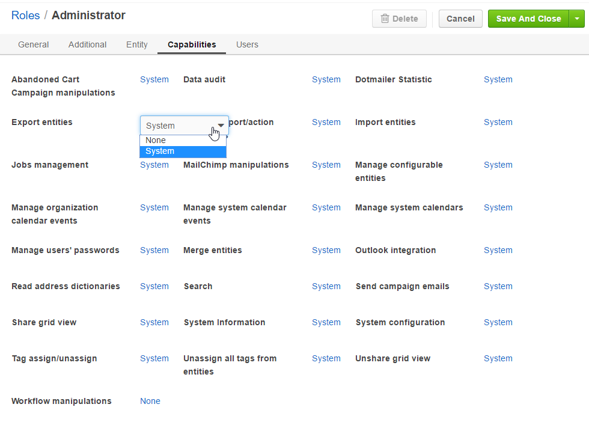
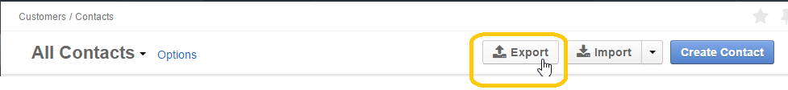
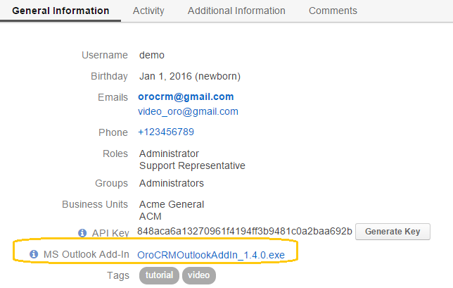

.. _admin-capabilities:

Capabilities List
=================

The *"Capabilities"* make an important part of the access and permission settings defined in the system, as described in 
the :ref:`Access and Permissions Basics guide <user-guide-user-management-permissions-basic>`. 

Depending on their specific roles, users will have access to different functionalities. For example, some users may not 
be able to assign tags, share grids, or create new users.

For each role and capability pair there are only two options:

For each role and capability pair there are only two options:

- **None**: users with the role won’t be able to use the functionality.
- ***System***: users with the role will be able to use the functionality for all the records created within their 
  OroCRM instance they’ve logged in into.

  

  
This guide describes the set of capabilities available in the alphabetical order and provides examples of several 
default capability settings for some common roles.

.. _admin-capabilities-acc:

Abandoned Cart Campaign manipulations
-------------------------------------

If this capability is set to *"System"*, users with the role can use the Abandoned Cart Campaign functionality to 
generate automatic mailings to customers who have unfinished their purchase in your Magento store in order to convince 
them to complete the checkout and place an order.  You can find more details about the functionality in the 
:ref:`Magento Abandoned Cart Campaigns guide <user-guide-acc>`.

This capability is useful for marketing representatives and other employees working with email campaigns for customers 
of Magento-based stores, e.g. for a general Magento store manager. The functionality may be reached from the 
*Marketing* menu:

.. important::

    To use the functionality, you also need to :ref:`set up the Abandoned Cart extension <user-guide-acc-ext>`.

    
.. _admin-capabilities-data-audit:    
    
Data Audit
----------

If this capability is set to *"System"*, users with the role can see full history of changes made to any record of an 
:ref:`auditable entity <user-guide-entity-management-create-other>` and an out-of-the-box report of all such actions.

The report is available from the "*System*" menu and described in more details in the 
:ref:`Data Audit <user-guide-data-audit>` guide.

The link to the history of changes of a specific record is available in the top right corner of the record’s
:ref:`View page <user-guide-ui-components-view-pages>`.

|

.. image:: ./img/data_management/view/view_history.png

|

This capability is usually used by system administrators and may be used by managers in order to see how and by whom 
details of different records were changed.

.. _admin-capabilities-dotmailer-stats:    

Dotmailer Statistic
-------------------

The capability is meaningful if the system has been integrated with dormatiler. 

Such integration enables users to utilize dotmailer as an email campaign engine, as described in the guide on
:ref:`Integration with Dotmailer <user-guide-dm-integration>`. 

When using the functionality, users with the role can synchronize lists of contacts in OroCRM and dotmailer, and use 
them to create email campaigns in dotmailer and import them to OroCRM – the dotmailer campaign statistics can then be 
used to analyze the campaign efficiency. These statistics will only be visible if the capability has been set to 
*"System"*.

This capability is usually used by marketing managers and representatives responsible for email campaigns.

.. _admin-capabilities-export-entities:    

Export Entities
---------------

If this capability is set to *"System"*, users with the role can export records of an entity into the a .CSV file, as 
described in the 
:ref:`Import and Export Data <user-guide-export>` guide. The :guilabel:`Export` button will 
appear in the top right corner of the page.

|

|

This is a general productivity capability that is usually enabled for most users.

.. _admin-capabilities-general_import:  

General import/action operations
--------------------------------

The capability enables common operations for import and export, such as the action to load the error log. It is 
recommended to set it to *"System"* if at least one of the capabilities *"Export Entities"* and *"Import Entities"* is 
set to *"System"*. 

.. _admin-capabilities-import-entities:    

Import Entities
---------------

If this capability is set to *"System"*, users with the role can import records from a .CSV file to OroCRM, as described 
in the :ref:`Import and Export Data <user-guide-import>` guide. The :guilabel:`Import` button will 
appear in the top right corner of the page.

|

.. image:: ./img/roles/import.png 

|

This capability is necessary for users who need to import large sets of data into the system, for example these may be 
sales representatives or employees responsible for the lead development.

.. _admin-capabilities-jobs:  

Jobs management
---------------

If this capability is set to *"System"*, users with the role can see jobs started in the system, view their currrent 
status and their performance log from the *"Job Queue*" page. Link to the page is available in the *"System"* menu.

This capability is usually used by the system administrators.

.. _admin-capabilities-mailchimp:  

MailChimp manipulations
-----------------------

The capability is meaningful if the system has been integrated with Mailchimp. Such integration enables users to utilize 
MailChimp as an email campaign engine  as described in the guide on 
:ref:`Integration with MailChimp <user-guide-mc-integration>`. 

When using the functionality, the user can synchronize lists of contacts in OroCRM and MailChimp, use them to create 
email campaigns in MailChimp and import them to OroCRM – the MailChimp campaign statistics can then be used to analyze 
the campaign efficiency. All of these operations on the OroCRM side will only be available if the capability has been 
set to  *"System"*.

The capability is usually enabled for marketing associates and other managers responsible for email campaigns.

.. _admin-capabilities-config-entities:  

Manage configurable entities
----------------------------

Many entities in OroCRM can be configured from the UI, as described in the 
:ref:`Entities guide <user-guide-entity-management-from-UI>`. So, the system administrator can change the attachments 
settings, define whether the entity should be displayed on a grid and/or a View page, whether it will be exported 
to a .CSV file, and define other settings. For some of them it is also possible to add new fields, as described in the 
:ref:`Entity Fields guide <user-guide-field-management>`. 

These actions are only available if this capability is set to “System”, and are usually performed by the system 
administrators.

.. _admin-capabilities-org-calendar-events: 

Manage organization calendar events
-----------------------------------

The capability enables users to create, edit and delete events in the organization-wide calendars, which are described 
in more details in the :ref:`corresponding section <user-guide-calendars-system>` of the *Calendars Overview* guide.

This capability can be utilized by the organization-level managers and HRs or other employees authorized to manage the 
organization-wide calendars

Users can view organization-wide calendars, regardles of this capability.

.. _admin-capabilities-sys-calendar-events: 

Manage system calendar events
-----------------------------

The capability enables users to create, edit and delete events in the system-wide calendars, which are described 
in more details in the :ref:`corresponding section <user-guide-calendars-system>` of the *Calendars Overview* guide.

This capability can be utilized by the company managers and HRs or other employees authorized to manage calendars at the 
system-wide level.

Users can view system-wide calendars, regardles of this capability.

.. _admin-capabilities-sys-calendars: 

Manage system calendars
-----------------------

The capability enables users to :ref:`create <user-guide-calendars-system>` and 
:ref:`manage <user-guide-calendars-manage>` system-wide calendars.

It is usually available for system administrators and top managers.

.. _admin-capabilities-passwords:
 
Manage users' passwords
-----------------------

The capability enables users to change passwords of other users. Usually, it is only granted to the system 
administrators, and can be used when :ref:`creating or editing a user record <user-management-users>`. The functionality
does not effect the ability of a user to :ref:`edit own password <user-guide-getting-started-profile-password>` from the 
*"My User"* page.

.. _admin-capabilities-merge:

Merge entities
--------------

The capability enables users to :ref:`merge <user-guide-ui-components-grids-delete-merge>` several records of the same 
grid. This is mostly applicable to the merge of :ref:`accounts <user-guide-accounts>`.

The capability is usually used by the sales representatives, marketing associates, and other employees working with 
accounts.

.. _admin-capabilities-outlook:

Outlook integration
-------------------

The capability is topical for enterprise users only. If this capability is set to *"System"*, users with the roles will be able to 
:ref:`download <user-guide-getting-started-my-user-outlook>` the latest version 
of OroCRM add-in for Outlook. 

With this add-in you can synchronize contacts, tasks, and calendar events between OroCRM and your Outlook.  
You can associate emails to accounts, contacts, opportunities, and cases and create leads, opportunities and cases 
in OroCRM based on emails from the Outlook side bar.

This is a general capability that can improve the user experience for all enterprise users using both OroCRM and 
Outlook. 

|

|

.. _admin-capabilities-address-dic:

Read address dictionaries
-------------------------

The capability enalbles access to countries, regions, and address types via API. It has to be set to *"System"*, if 
the Lead creation via Outlook should be supported. This capability should be available to system administrators or 
integrators, authorized to access OroCRM via API.

.. _admin-capabilities-search:

Search
------

The capability enables users to use the :ref:`search <user-guide-getting-started-search>` 
functionality to find specific records quickly.

This is a general capability that can improve the overall user-experience.

The setting does not effect the user's ability to :ref:`search by tag <user-guide-getting-started-search-tag>`.

.. _admin-capabilities-campaign-emails:

Send Campaign Emails
--------------------

The capability enables users to :ref:`send emails within OroCRM email campaigns <user-guide-email-campaigns-send>`.
This way, marketin associates can sed a personalized template-based letter to multiple users.

The setting does not effect the user's ability to create and edit :ref:`email campaings <user-guide-email-campaigns>` 
and should only be allowed to employees authorized to send email campaigns. These may be emails to potential customers, 
other system users, etc.  

|

.. image:: ./img/roles/email_campaign.png

|

.. _admin-capabilities-share-grid:

Share grid view
---------------

The capability enables users to share the :ref:`grid <user-guide-ui-components-grids>` views that they have configured, 
this way the user can :ref:`adjust a grid <user-guide-ui-components-grids-adjust>` and share it with other users.

This is particularly useful for team-leads and heads of departments, who can share grids with their subordinates, but 
may also be available to other users.

|

.. image:: ./img/roles/grid_share.png

|

 
.. _admin-capabilities-system-info:

System Information
------------------

The capability enables users to see view the system information page. This page contains the list of Oro Packages and 
third-party packages installed  and is usually used by the system administrators and integrators only.

.. _admin-capabilities-system-config:

System configuration
--------------------

The capability enables users to access the :ref:`system configuration page <admin-configuration>`. If it is set to 
*"System"*, the system administrator can localize the system, change the display and tracking settings, and make other 
important changes.

.. _admin-capabilities-tags:

Tag assign/unassign
-------------------

The capability enables users to assign/unassign :ref:`tags <user-guide-tags>` - non-hierarchical keywords or phrases 
assigned to records. They provide additional information about records and are visible to all the system users.
You can assign/unassign tags from the grid or from a View page of the record.

Tags can be successfully utilized by all the users.

.. _admin-capabilities-tags-all:

Unassign all tags from entities
-------------------------------

The capability enables users to unassign tags added to the records by other users. The capability is only 
meaningful if *"Tag assign/unassign"* has been enabled (set to *"System"*). If *"Tag assign/unassign"* has been enabled, 
and *"Unassign all tags from entities"* is set to *"None"*, the users will only be able to unassigne tags added by 
themselves -  this way you can restrict users from deleting tags of other users. The capability is usually available to 
team leads, heads of departments and managers..

.. _admin-capabilities-unshare-grid:

Unshare grid view
-----------------

If this capability is set to *"System"*, users with the role can unshare grids previously 
:ref:`shared <admin-capabilities-share-grid>` by themselves. This capability is usually available to all the users, who 
work with grids.

.. _admin-capabilities-view-sql:

View SQL query of a report/segment
----------------------------------

If this capability is set to *"System"*, users with the role can see the SQL request sent to the system for a 
report/segment. 

Usually this capability is only granted to the system administrators, so they can check if the report has been developed 
correctly. The *"Show SQL Query"* link will appear below the report.

|

.. image:: ./img/roles/sql_show.png

|

The setting will only work if the functionality has been enabled in the *"System Configuration --> Display Settings --> 
Report settings*". 

|

.. image:: ./img/roles/sql_setting.png

|

.. _admin-capabilities-workflow:

Workflow manipulations
----------------------

If this capability is set to *"System"*, users with the role can manage the records, involved in the 
:ref:`workflows <user-guide-workflow-management-basics>`, otherwise the user may be able to see and edit the records, 
but not to change their status within the workflow. This may be used to restrict the users from changing the record 
status.

Default Configurations Table
----------------------------

In this table you will find several default configurations, created for different user roles.By default 
system administrators have access to all capabilities, and other roles are limites by their functions, as shown below.

.. csv-table::
  :header: "", "Admin", "Leads Development Representative", "Marketing Representative", "Online Sales Representative", 
  "Sales Manager", "Sales Representative", "Support Representative"
  :widths: 35, 10, 10, 10, 10, 10, 10, 10

  "**Capability**","System","None","None","None","System","None","None"
  "**Abandoned Cart Campaign manipulations**","System","None","None","None","System","None","None"
  "**Data audit**","System","None","None","None","System","None","None"
  "**Dotmailer Statistic**","System","None","None","None","System","None","None"
  "**Export entities**","System","None","System","None","System","None","None"
  "**General import/action operations**","System","None","None","None","System","None","None"
  "**Import entities**","System","System","None","None","System","None","None"
  "**Jobs management**","System","None","None","None","None","None","None"
  "**MailChimp manipulations**","System","None","None","None","System","None","None"
  "**Manage configurable entities**","System","None","None","None","System","None","None"
  "**Manage organization calendar events**","System","None","None","None","System","None","None"
  "**Manage system calendar events**","System","None","None","None","System","None","None"
  "**Manage system calendars**","System","None","None","None","System","None","None"
  "**Manage users' passwords**","System","None","None","None","System","None","None"
  "**Merge entities**","System","None","None","None","System","None","None"
  "**Outlook integration**","System","System","System","System","System","System","None"
  "**Read address dictionaries**","System","None","None","None","System","System","None"
  "**Search**","System","System","System","System","System","None","None"
  "**Send campaign emails**","System","None","None","None","System","None","None"
  "**Share grid view**","System","None","None","None","System","None","None"
  "**System Information**","System","None","None","None","None","None","None"
  "**System configuration**","System","None","None","None","None","None","None"
  "**Tag assign/unassign**","System","None","None","None","System","None","None"
  "**Unassign all tags from entities**","System","None","None","None","System","None","None"
  "**Unshare grid view**","System","None","None","None","System","None","None"
  "**View SQL query of a report/segment**","System","None","None","None","None","None","None"
 "**Workflow manipulations**","System","System","System","System","System","System","None"