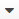

.. _user-guide-system-channel-entities-b2b-customer:

B2B Customers
=============

For each customer involved in the business-to-business activity you can create a *"B2B Customer"* record 
("B2B customer"). 

.. _user-guide-customers-create:

Create B2B Customer Records
---------------------------

In order to create a new B2B customer in the system:

- Go to the *Customers → B2B Customers*.

- Click the :guilabel:`Create B2B Customer` button.

- The *"Create B2B Customer"* :ref:`form <user-guide-ui-components-create-pages>` will appear:

      |
  
.. image:: ./img/b2b_customers/b2b_customers_create.png

|

The following fields are mandatory and **must** be defined:

.. csv-table::
  :header: "Field", "Description"
  :widths: 10, 30

  "**Owner***","Limits the list of users that can manage the customer to users, whose 
  :ref:`roles <user-guide-user-management-permissions>` allow managing 
  B2B customers assigned to the owner (e.g. the owner, members of the same business unit, system administrator, etc.).
  
  By default, the user creating the record is chosen."
  "**Name***","The name used to refer to the B2B customer in the system."
  "**Channel***","Choose one of active :term:`B2B channels <B2B Channel>`, from which OroCRM will get information on 
  this customer."
  "**Account***","An :ref:`Account <user-guide-accounts-create>`, to which the customer will be assigned. 
  Details of this B2B customer will then be a part of this account's details."

The rest of the fields are **optional**. The fields are added to the system based on general B2B practices, aims and 
processes and keep additional details of the customer. The optional fields may be left empty.
  
If you need to collect and process any other details of B2B customers, 
:ref:`custom fields can be created <user-guide-field-management-create>`. Their values will be displayed in the 
*"Additional"* section.
  
Once all the necessary fields have been defined, click the button in the right top corner of the page to save the 
customer in the system.

.. _user-guide-customers-actions:

Manage B2B Customer Records 
---------------------------

The following actions can be performed with B2B Customer records:

From the :ref:`grid <user-guide-ui-components-grids>`:

      |

.. image:: ./img/b2b_customers/customers_grid.png

|

- Delete a customer from the system : |IcDelete|
  
- Get to the :ref:`Edit form <user-guide-ui-components-create-pages>` of the customer : |IcEdit|
  
- Get to the :ref:`View page <user-guide-ui-components-view-pages>` of the customer : |IcView| 
  
      |
  
From the View page you can:
  
- Get to the *"Edit"* form of the customer.

- Delete the customer from the system 
  
- The rest of the actions available depend on the system settings defined in the 
  :ref:`Communication &  Collaboration settings <user-guide-entity-management-create-commun-collab>`
  of the B2B Customer entity.

.. hint:: 

    :ref:`Custom Reports <user-guide-reports>` can be added to analyze details of B2B customers in OroCRM. 

    :ref:`Workflows <user-guide-workflow-management-basics>` can be created to define rules and guidelines on possible 
    actions/updates of B2B customers in the system

.. |BCrLOwnerClear| image:: ./img/buttons/BCrLOwnerClear.png
   :align: middle

.. |BGotoPage| image:: ./img/buttons/BGotoPage.png
   :align: middle

.. |Bplus| image:: ./img/buttons/Bplus.png
   :align: middle

.. |IcDelete| image:: ./img/buttons/IcDelete.png
   :align: middle

.. |IcEdit| image:: ./img/buttons/IcEdit.png
   :align: middle

.. |IcView| image:: ./img/buttons/IcView.png
   :align: middle

