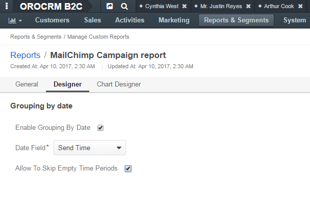
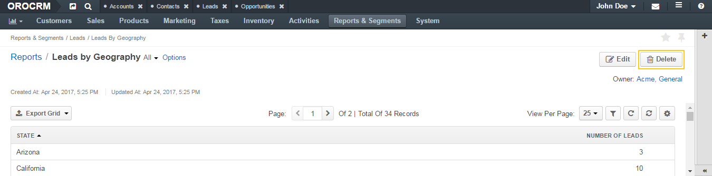

.. _doc-reports-manage:

Manage Reports
==============

.. contents:: :local:
   :depth: 3

.. _doc-reports-actions-create:

Create a Custom Report
----------------------

1. In the main menu, navigate **Reports and Segments>Manage Custom Reports**.

2. On the reports grid page, click the :guilabel:`Create Report` button.

3. On the **Create Report** page, define properties of the report, as described in the sections below.

.. _doc-reports-actions-create-general:

General
^^^^^^^

|

.. image:: ../../img/reports/general.png

|

The following fields are mandatory and **must** be defined for a report:

.. csv-table::
  :header: "Field","Description"
  :widths: 10, 30

  "**Name**","The name that is used to refer to the report on the interface.

  It is recommended to choose a name that indicates what information the report presents."
  "**Entity**","A target :term:`entity <Entity>` of the report. Data related to it will be used to generate the report.

  Select one of the entities from the list. (You can also start typing the entity name in the text field to find it faster.)"
  "**Report Type**","Select *Table* from the list. The report will present data in the form of the table. This is the only type of the reports currently available."
  "**Owner**","Select the user who can manage this report and is respondible for it. Which users can be assigned a report owners is subject to the
  :ref:`access and permission settings <user-guide-user-management-permissions>`."

The only optional system field, **Description**, can be used to save additional information about the report.

.. _doc-reports-actions-create-designer:

Designer
^^^^^^^^

In the section you can define the structure of your report.

|

.. image:: ../../img/reports/designer.png

|

There are four main subsections that help you build your report:

- **Columns**—In this subsection you define which data columns your report will contain.

- **Grouping**—In this subsection you can define how the information in your report will be aggregated.

- **Grouping by Date**—In this section you can enable period filters.

- **Filters**—In this subsection you apply filters to the data that the report returns to select only the information you need.

Columns
~~~~~~~

.. _doc-reports-actions-create-columns-add:

Add a Column
""""""""""""

To add a column, perform as follows:

1. Specify the required data:

.. csv-table::
  :header: "Field","Description"
  :widths: 10, 30

  "**Choose a field***","Choose the field that contains the required values. This can be a field of the entity
  specified in the **Entity** field of the **General** section or a field of an entity related to it. You can see the available fields in the
  list, fields a grouped by entities."
  "**Label**","If required, you can customly label the selected field. This custom name will be applicable only to the current report.

  By default, the field label is used."
  "**Function**","Select an aggregate function that you want to apply to the field values. Aggregate functions process a set of values and return just a single value.

  For example, you want a report that shows the number of opportunities with each of the statuses **Open**, **Closed Won** and **Closed Lost**. Then, you can create a report with target entity **Opportunity**, add opportunity's fields **Status** and, for example, **Id**, For the **Id** field, specify the **Count** aggregate function. As the result, the system takes the first of the statuses and counts how many Ids are listed under it, and the same for other statuses.

  There are some field-specific functions (e.g. **Won Count** that shows the number of won opportunities) for the opportunity's **Status** field. The most common functions are the following:

  - **None**—The data is not aggregated, you will see field values as they are.

  - **Count**—The column displays the number of values in the set.

  - **Sum**—The column displays the sum of all values in the set.

  - **Average**—The column displays arithmetical mean of the values in the set.

  - **Min**—The column displays the smallest value in the set.

  - **Max**—The column displays the largest value in the set.

  .. note:: You can see only the functions available for the selected field. For example, **Sum** is applicable only to numeric fields.

  .. important:: When you specify an aggregate function for any column, all other columns must be added to the **Grouping** section of your report (except they have aggragate function specified for them too).

  "
  "**Sorting**","Select the sorting order for the field.

  - **None**—The data in the field is not sorted.
  - **Asc**—The data is sorted in the ascending order (e.g. from the smallest to the largest number or from A to Z).
  - **Desc**—The data is sorted in the descending order (e.g. from the largest to the smallest number or from Z to A).

  .. important::
    If sorting is defined for several columns, the report is sorted according to order specified for the first column, and then, if multiple values of other columns correspond to any value of a first column, they will be sorted according to the order defined for the next columns.

    Let us take the following table.

    Unsorted:

    +---+---+
    | A | 1 |
    +---+---+
    | C | 1 |
    +---+---+
    | B | 3 |
    +---+---+
    | A | 3 |
    +---+---+
    | B | 2 |
    +---+---+
    | B | 1 |
    +---+---+
    | C | 3 |
    +---+---+

    For example, the **Asc** sorting is defined for the first column and **Desc**—for the second:

    Sorted:

    +---+---+
    | A | 3 |
    +---+---+
    | A | 1 |
    +---+---+
    | B | 3 |
    +---+---+
    | B | 2 |
    +---+---+
    | B | 1 |
    +---+---+
    | C | 3 |
    +---+---+
    | C | 1 |
    +---+---+

  After the report has been generated, it can be sorted by any of its columns.

  "

2. Click :guilabel:`Add`.

The field you have defined will appear in the **COLUMN** grid.

.. _doc-reports-actions-create-columns-edit:

Edit a Column
"""""""""""""

To edit a column, perform as follows:

1. Click the |IcEdit| **Edit** icon at the right end of the corresponding row.
2. Perform required changes as described in step 1 of the :ref:`Add a Column <doc-reports-actions-create-columns-add>` action description.
3. Click the :guilabel:`Save` button.

.. _doc-reports-actions-create-columns-delete:

Delete a Column
"""""""""""""""

To delete a column, click the |IcDelete| **Delete** icon at the right end of the corresponding row, and in the **Delete Confirmation** dialog box, click :guilabel:`Yes, Delete`.

.. _doc-reports-actions-create-columns-rearrange:

Rearrange Report Columns
""""""""""""""""""""""""

To move a column, click the |IcArrowsV| **Move** icon at the right end of the corresponding row, hold the mouse button, and drag-and-drop the column up (to make it appear earlier in the report) or down (to make it appear later).

.. _doc-reports-actions-create-grouping:

Grouping
~~~~~~~~

When you specify aggregating functions for some of the fields, you need to add all other fields (that does not have any aggregating functions specified for them) to the **Grouping** section.

.. _doc-reports-actions-create-grouping-fieldadd:

Add a Field to Grouping
"""""""""""""""""""""""

To add a field to the **Grouping** section, select it from the **Grouping Columns** field, and click the :guilabel:`Add` button. For example, you can see a total, average, maximum, and minimum budget amount for each the opportunities with the same status.

.. warning:: Do not add fields that are not present in the **Columns** section.

.. _doc-reports-actions-create-grouping-fieldremove:

Remove a Field from Grouping
""""""""""""""""""""""""""""

To remove a field from the **Grouping** section, click the |IcDelete| **Delete** icon at the right end of the corresponding row, and in the **Delete Confirmation** dialog box, click :guilabel:`Yes, Delete`.

.. _doc-reports-actions-create-groupingbydate:

Grouping by Date
~~~~~~~~~~~~~~~~

In this section you can define whether to show additional period filters for this report on the report view page.

|

.. image:: ../../img/reports/reports_grouping_by_date_viewpage.png

|

These filters enable report users to define the date range for which the report will show data, and to group the data in this range by periods (days, month, quarters, years).
You can also enable the report users to choose whether to show or not those periods that do not contain any data.

|

|

.. csv-table::
  :header: "Field","Description"
  :widths: 10, 30

  "Enable Grouping by Date","Select this check box to enable additional date filters."
  "Date Field","Select which date field to use for grouping. This field will appear in the report as if you selected it in the **Columns** section. Listed are all of the date fields of the report entity."
  "Allow to Skip Empty Time Periods","Select this check box to enable the report user to choose whether to display or not those periods that do not contain any data."

.. _doc-reports-actions-create-filters:

Filters
~~~~~~~

You can define conditions used to select specific records. Only data of the records that meet all the conditions defined in the **Filters** section will be used for the report.

For example, you can create a report only for those customers who appeared within the last month and live in Texas.

Please see the :ref:`Filters <user-guide-filters-management>` guide for more details.

.. _doc-reports-actions-create-chart:

Chart Designer
^^^^^^^^^^^^^^

|

.. image:: ../../img/reports/chartdesigner.png

|

Chart
~~~~~

OroCRM supports line charts. To create a line chart for the report, in the **Chart** section define the following fields (all the fields are mandatory).

.. csv-table::
  :header: "Field","Description"
  :widths: 10, 30

  "**Chart Type**","Currently only the **Line Chart** option is available"
  "**Category (X Axis)**","Choose the fields, values whereof will form the X Axis of the report chart"
  "**Value (Y Axis)**","Choose the fields, values whereof will form the Y Axis of the report chart"

Please, see the :ref:`chart example <doc-reports-examples-chart>`.

.. _doc-reports-actions-view:

View a Report
-------------

.. _doc-reports-actions-view-custom:

View a Custom Report
^^^^^^^^^^^^^^^^^^^^

.. _doc-reports-actions-view-custom-fromgrid:

From the Custom Reports Grid
^^^^^^^^^^^^^^^^^^^^^^^^^^^^

In the main menu, navigate **Report & Segments>Manage Reports**, and in the custom reports grid, click the required report.

Alternatively, you can click the ellipsis menu at the right-hand end of the corresponding row and then click the |IcView| **View** icon.

|

.. image:: ../../img/reports/reports_view_fromgrid.png

|

.. _doc-reports-actions-view-custom-fromviewpage:

From the Custom Report View Page
^^^^^^^^^^^^^^^^^^^^^^^^^^^^^^^^

In the main menu, navigate **Report & Segments**. Custom reports are gathered in sections by the name of the entity they are related to. Choose the required section, navigated further to the desired report, and click it.

|

.. image:: ../../img/reports/viewcustomreportfrommenu.png

|

.. _doc-reports-actions-view-system:

View a System Report
^^^^^^^^^^^^^^^^^^^^

To view a system report, in the main menu, navigate **Report & Segments>Reports** and further to the required report  (e.g. **Report & Segments>Reports>Accoutns>Life Time**).

|

.. image:: ../../img/reports/viewsystemreport.png

|

.. _doc-reports-actions-export:

Export a Report
---------------

1. Open the report that you want to export:

   - If you want to export a custom report, in the main menu, navigate **Report & Segments>Manage Reports**, and in the custom reports grid, click the required report.

   - If you want to export a system report, in the main menu, navigate **Report & Segments>Reports** and further to the required report  (e.g. **Report & Segments>Reports>Accoutns>Life Time**).

2. On the report page, click the :guilabel:`Export Grid` button in the upper-left corner of the grid, and then click **CSV** or **XLXS** to export the report to the file of the corresponding format.

   |

   .. image:: ../../img/reports/reports_export.png

   |

.. _doc-reports-actions-edit:

Edit a Custom Report
--------------------

.. _doc-reports-actions-edit-fromgrid:

From the Custom Reports Grid
^^^^^^^^^^^^^^^^^^^^^^^^^^^^

1. In the main menu, navigate **Report & Segments>Manage Reports**.

2. In the grid on the **All Reports** page, click the ellipsis menu at the right end of the corresponding row and then click the |IcEdit| **Edit** icon.

   |

   .. image:: ../../img/reports/reports_edit_fromgrid.png

   |

3. Update report details as required. For the description of the fields, see :ref:`Create a Custom Report <doc-reports-actions-create>`.

4. Click :guilabel:`Save`.

.. _doc-reports-actions-edit-fromviewpage:

From the Custom Report View Page
~~~~~~~~~~~~~~~~~~~~~~~~~~~~~~~~

1. In the main menu, navigate **Report & Segments>Manage Reports**.

2. In the grid on the **All Reports** page, click the required report.

   Alternatively, you can click the ellipsis menu at the right end of the corresponding row and then click the |IcView| **View** icon.

   |

   .. image:: ../../img/reports/reports_view_fromgrid.png

   |

3. On the report page, click the :guilabel:`Edit` button in the upper-right corner of the page.

4. Update report details as required. For the description of the fields, see :ref:`Create a Custom Report <doc-reports-actions-create>`.

5. Click :guilabel:`Save`.

.. _doc-reports-actions-delete:

Delete a Custom Report
----------------------

.. _doc-reports-actions-delete-fromgrid:

From the Custom Reports Grid
^^^^^^^^^^^^^^^^^^^^^^^^^^^^

1. In the main menu, navigate **Report & Segments>Manage Reports**.

2. In the grid on the custom reports page, choose the report that you want to delete, click the ellipsis menu at the right end of the corresponding row and then click the |IcDelete| **Delete** icon.

|

.. image:: ../../img/reports/reports_delete_fromgrid.png

|

3. In the **Deletion Confirmation** dialog box, click :guilabel:`Yes, Delete`.

.. _doc-reports-actions-delete-fromviewpage:

From the Custom Report View Page
~~~~~~~~~~~~~~~~~~~~~~~~~~~~~~~~

Alternatively, you can delete a custom report from the reports view page by clicking the :guilabel:`Delete` button in the upper-right corner of the custom report view page.

|

|

.. _doc-reports-actions-deletemultiple:

Delete Multiple Custom Reports
------------------------------

You can delete multiple custom reports at a time.

1. In the main menu, navigate **Report & Segments>Manage Reports**.

2. In the grid on the custom reports page, select check boxes in front of the custom reports that you want to delete.

3. Click the ellipsis menu at the right end of the grid header row and then click |IcDelete| **Delete**.

  |

  .. image:: ../../img/reports/reports_massdelete.png

  |

4. In the **Delete Confirmation** dialog box, click :guilabel:`Yes, Delete`.

See Also
--------

:ref:`Reports Overview <user-guide-reports>`

:ref:`Reports Examples <doc-reports-examples>`

.. include:: ../../../img/buttons/include_images.rst
   :start-after: begin