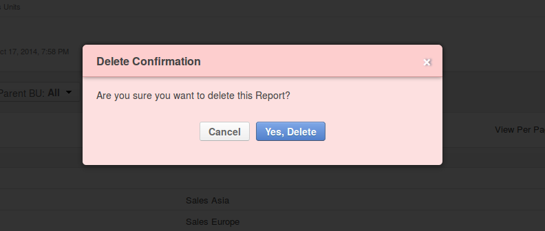

.. _user-guide-reports:

Reports
=======

In OroCRM, you can create reports based on the details of any entity available in the system. 

Using this functionality, you can get easy-to-understand adjustable reports on the amount and activity of different 
customers, on statuses of carts and current state of actual and potential sales, on the performance of your 
:ref:`marketing effort <user-guide-marketing>`, specifics of recent :ref:`activities <user-guide-activities>`, etc.

There is a number of out-of-the-box reports, such as :ref:`Leads by Date <user-guide-leads-reports>` and 
:ref:`Opportunities by Status <user-guide-opportunities-reports>` , but you can also create your own ("custom") reports.

The article describes how to create and manage custom reports.

.. _user-guide-manage-custom-reports:

Create Custom Reports
---------------------

- Go to *Reports and Segments → Manage Custom Reports* and click the :guilabel:`Create Report` button.

- The *"Create Report""* page will appear.

- Define properties of the report, as described in the sections below:

.. _user-guide-reports-general-settings:

General Setting
^^^^^^^^^^^^^^^

      |
 
The following fields are mandatory and **must** be defined for a report:

.. csv-table::
  :header: "Field","Description"
  :widths: 10, 30

  "**Name***","The name is used to refer to the report in the future.
  
  It is recommended to use a name that is meaningful for you."
  "**Entity***","Target :term:`entity <Entity>` of the report. Choose one of the entities from the drop-down. Data
  related to it will be used to generate the report. 
  (Both system and custom entities will be displayed in the alphabetic order). 
  You can also start typing the entity name in the text field to find it faster."
  "**Report Type***","Only table reports are available."
  "**Owner***","Limits the list of users that can manage the report, subject to the 
  :ref:`access and permission settings <user-guide-user-management-permissions>`."

The only optional system field, *"*Description**, can be used to save additional information about the report. 

.. _user-guide-reports-designer:

Designer
^^^^^^^^

      |
  
In the section you can define the structure of your report.

      |
 
.. image:: ./img/reports/designer.png

|

There are three main parts:

- **Columns**: defines the columns of your report and information displayed therein.

- **Grouping**: defines how details of the report will be grouped in the rows.

- **Filters**: filter the records to be processed by the report.

*Columns*
^^^^^^^^^

The following settings shall be defined for each column of the report:

.. csv-table:: 
  :header: "Field","   Description"
  :widths: 10, 30

  "**Choose a field***","Choose a field from which raw data will be taken. This can be a field of the entity
  specified in the general settings of the report or of a related entity. All the fields available will appear in the 
  drop-down list under their entities."
  "**Label***","A free text field that defines how the field chosen at the previous step will be referred to in the 
  report.  
  
  The field is automatically filled by the :ref:`field label <user-guide-field-management-create>`, but may be edited 
  for each report."                 
  "**Function***","A function to perform with the field values. You will only see the functions available for the field
  chosen.
  
  There are some field-specific functions (e.g. *Won Count* that shows the number of *Won* Opportunities for the 
  *Opportunities → Status* field. Description of of the most common function and relevant examples is
  provided below:

  - *None*: no function applied. The data will be displayed for all the available entity records.
   
  - *Count*: you will see the number of possible values of the field for all the entity records.
   
  - *Sum*: the field values for all the entity records will be summed up.
    
  - *Average*: the arithmetical mean of the field values for all the records against the amount of records will be 
    displayed.
    
  - *Min*: only the smallest of all the field values for all the records will be displayed.
   
  - *Max*: only the largest of all the field values for all the records will be displayed.
  
  "
  "**Sorting***","Defines the order values, in which the field or their functions shall be displayed in the report. 
   
  - *None*: no sorting applied 
  - *Asc*: ascending
  - *Desc*: descending
  
  The whole report is sorted by the column, to which the sorting is applied. If sorting settings are defined for 
  several columns, settings of the column that comes the earliest are used.

  After the report has been generated, it can be sorted by any of its columns.
  
  "

  
Actions for Columns
"""""""""""""""""""
    
Once you have specified the settings for a column element, click the :guilabel:`Add` button, and the field you have defined 
will appear in the "COLUMN" grid.

Now you can edit (|IcEdit|), delete (|IcDelete|) or move (|IcMove|) the column. 

Examples of Columns and Actions 
"""""""""""""""""""""""""""""""

For the sake of example, we have created a very simple report of one field. It contains only the budget amount details. 

      |

.. image:: ./img/reports/RepEx1.png

|
 
Click the :guilabel:`Add` button to add the settings into the *"Columns"* grid. Click the :guilabel:`Save`.

On the View page of the report, you would see something like this:

      |

.. image:: ./img/reports/RepEx1a.png

|

There are 75 opportunities with the values defined in the *"Budget Amount"* field of each and all of them will be
displayed in the report.

Click :guilabel:`Edit` to return to the report settings. Let's see, how the report changes, if we apply different 
functions to the *"Opportunity Budget"* field. 

Click the |IcEdit| icon and change the column settings. 

      |
  
**Function = Count**

.. image:: ./img/reports/RepEx1b.png

|
  
There are 43 different values of the *""Budget Amount"* field for all the Entity instances in the System.

      |
  
**Function = Sum**

.. image:: ./img/reports/RepEx1c.png

   
The sum of all the values of the *"Budget Amount"* fields for all the Entity instances in the System makes 
$202,565.00.

      |
  
**Function = Max**

.. image:: ./img/reports/RepEx1e.png

The biggest Budget amount value available in the system is $9,902.00 USD
 
 
Grouping
^^^^^^^^
 
The *"Grouping"* section can be used for more complex and informative reports. 

Once you have added a field in this section, you will see information based on the values of all the column 
with the same grouping field.

For example, you can see a total, average maximum and minimum budget amount for each the opportunities with the same 
status.

.. caution:: 

    Fields used for grouping must be added to the "*COLUMN"* section as well.

      |
  
Grouping Example 
""""""""""""""""

      |
  
.. image:: ./img/reports/RepEx2.png

|

The report will look as follows:

      |

.. image:: ./img/reports/RepEx2a.png

Several Level Grouping Example
""""""""""""""""""""""""""""""

You can also group records inside a group. For example, we can add one more grouping field (e.g. Customer name) to our 
report.

      |
  
.. image:: ./img/reports/RepEx3.png

| 

Now you can see the budget function values for all the opportunities with the same status that belong to a specific 
customer. 

First comes data for all the *"In Progress"* opportunities of one customer, then of another customer, etc., and only 
then you will see data for all the *"Won"* opportunities of each customer, etc.

.. image:: ./img/reports/RepEx3a.png

.. hint::

    Once a report has been generated, you can click on the name of a column, to sort all the data in the report by the
    specified fields' value (ascending or descending). You can see the report ordered by the *"Name"* value below.

.. image:: ./img/reports/RepEx3b.png

|

As you can see in the circled area, there are opportunities  for Albers Super Markets that are in progress and 
that were lost. You can view the budget details for the both groups.

.. note::
    
    If the customer's name is the most important part of the grouping, it might be reasonable to edit the report and 
    move the column to make it first.

Filters
^^^^^^^

You can define conditions used to select specific records. Only data of the records that meet all the conditions defined
in the *"Filters"* section will be used for the report. 

For example, you can create a report only for those customers, who appeared within the last month and live in Texas.

Please see the :ref:`Filters guide <user-guide-filters-management>` for more details.

.. _user-guide-reports-chart:

Chart
^^^^^

OroCRM supports line charts. To create a line chart for the report, go to the **Chart** and define the following 
fields (all the fields are mandatory and **must** be defined).

.. csv-table::
  :header: "Field","Description"
  :widths: 10, 30

  "**Chart Type***:","Currently only the *Line Chart* option is available"
  "**Category (X Axis)***","Choose the fields, values whereof will form the X Axis of the report chart"
  "**Value (Y Axis)***","Choose the fields, values whereof will form the Y Axis of the report chart"

Chart Example
"""""""""""""

Let's make a chart for the Budget per opportunity status report (not grouped by customers). 

.. image:: ./img/reports/RepExChart1.png

.. image:: ./img/reports/RepExChart2.png

Manage Reports
--------------

The following actions can be performed for a report:

- From the *"All Reports"* :ref:`grid <user-guide-ui-components-grids>` (*Report & Segments → Manage Custom Reports*):

  |ReportActionIcon|

  |
  
  - Delete a report from the system: |IcDelete|
  
  - Get to the :ref:`Edit form <user-guide-ui-components-create-pages>` of the report: |IcEdit|
  
  - Get to the :ref:`View page <user-guide-ui-components-view-pages>` of the report: |IcView| 

.. hint::

    You can also get to the View page of a report directly from the Report & Segments menu (click the report name).
  
- From the :ref:`View page <user-guide-ui-components-view-pages>`:
  
- Get to the *"Edit"* form of the report

- Delete the report from the system 

- Export the report data into a CSV format: click the *Export Grid* button. 
 

.. note::

    To avoid accidental data loss, there is an additional confirmation required to delete a report.
    
    |ConfirmDelete|

.. |Bdropdown| image:: ./img/buttons/Bdropdown.png
   :align: middle

.. |IcEdit| image:: ./img/buttons/IcEdit.png
   :align: middle
   
.. |IcView| image:: ./img/buttons/IcView.png
   :align: middle
   
.. |IcDelete| image:: ./img/buttons/IcDelete.png
   :align: middle
   
.. |IcMove| image:: ./img/buttons/IcMove.png
   :align: middle
   

   
.. |ReportActionIcon| image:: ./img/reports/report_action_icons.png
   :align: middle
