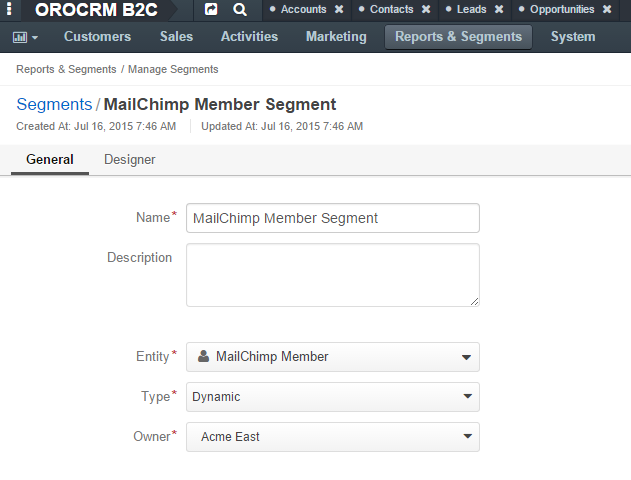
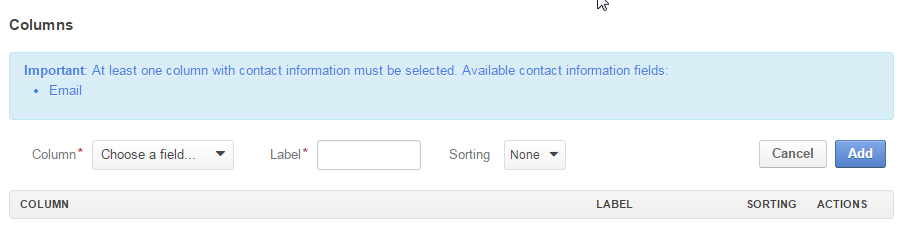

.. _user-guide-filters-segments:

Segments
========

If you often need to use a set of records in reports, filters or 
Marketing lists, you can create a segment and use it instead of redefining the same conditions time and again.
In other words, a Segment record is a set of Activity and/or Data audit and/or Field Condition and/or Condition Group 
filters predefined for records of a specific entity, and updated dynamically or upon a direct user's
request.

The way to create and manage Segment records is described below. 

.. _user-guide-segments-create:

Create Segments
----------------------

Go to *"Reports & Segments → Manage Segments* and click the :guilabel:`Create Segment` button 
in the top right corner of the grid.
   
The Create Segment :ref:`form <user-guide-ui-components-create-pages>` will emerge.

Define the segment settings, as described in the sections below:

.. _user-guide-segment-create-general:
  
General Details  
^^^^^^^^^^^^^^^

The following fields are mandatory and **must** be specified:

.. csv-table::
  :header: "Field", "Description"
  :widths: 10, 30

  "**Name**","Name used to refer to the segment in the system"
  "**Entity**","Choose an entity from the drop-down. Records of the chosen entity will be selected in the segment."
  "**Type**","Chose the segment type from the drop-down:
 
  - **Dynamic** segments are updated as soon as any changes have taken place in the system 
  
  - **Manual** segments will be updated only following the user request 
    (:ref:`refresh the grid <user-guide-ui-components-grid-action-buttons>` in the View page of the Segment record)"
  "**Owner**","A business unit, members of which can manage the segment, subject to the 
  :ref:`roles <user-guide-user-management-permissions>` defined in the system."

Optional field **Description** can be filled with free text to help you and other users to understand the purpose or 
peculiarities of the segment in the future.

      |

.. _user-guide-segment-create-filters:
  
Filters
^^^^^^^

In the *"Filters"* section you can define  the Activity and/or Data audit and/or Field Condition and/or Condition Group 
filters that will be used to select the records for the segment. 

More information about the ways to define filters is provided in the 
:ref:`Filters Management <user-guide-filters-management>` guide.

.. _user-guide-segment-create-columns:

Columns
^^^^^^^

In the "*Columns*" section, define the set of fields.
The only goal of this set of fields is to visualise records included in the record.
Values of the chosen fields will be displayed at the :ref:`View page <user-guide-ui-components-view-pages>` of the 
Segment.

|

- In order to create add a column to the grid:
  
  - Choose the fields from the drop-down in the *"Column*" section.

  - Choose a label that will be used to refer to the field in the report in UI. 
    The default field label, defined in the field's 
    :ref:`general settings <user-guide-entity-management-general-common>` will be added but can be changed. 
  
  - Define the sorting order if you want the whole segment View grid to be sorted by the field value.

  - Click :guilabel:`Add` button

|

.. image:: ./img/filters/segments_column.png 

|

- In order to manage the columns, use action icons in the last column:

  - Delete a column from the segment with |IcDelete|

  - Edit the column settings with |IcEdit|

  - Change the column position, dragging the column by the |IcMove| icon
  
Save the segment in the system with the button in the top right corner of the page.

.. _user-guide-segments-actions:

Manage Segments
---------------

The following actions are available for a segment from the :ref:`grid <user-guide-ui-components-grids>`

      |
 
.. image:: ./img/filters/segment_grid.png

- Delete the segment from the system : |IcDelete| 

- Get to the :ref:`Edit form <user-guide-ui-components-create-pages>` of the segment : |IcEdit| 

- Get to the :ref:`View page <user-guide-ui-components-view-pages>` of the segment :  |IcView| 
 
  The View page contains the grid of records, included in the segment and represented with the columns defined for the 
  segment, as described above.

.. |IcDelete| image:: ./img/buttons/IcDelete.png
   :align: middle

.. |IcEdit| image:: ./img/buttons/IcEdit.png
   :align: middle

.. |IcMove| image:: ./img/buttons/IcMove.png
   :align: middle

.. |IcView| image:: ./img/buttons/IcView.png
   :align: middle
