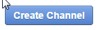
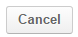
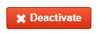
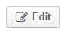
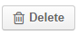
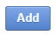
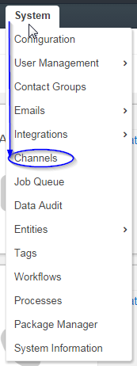
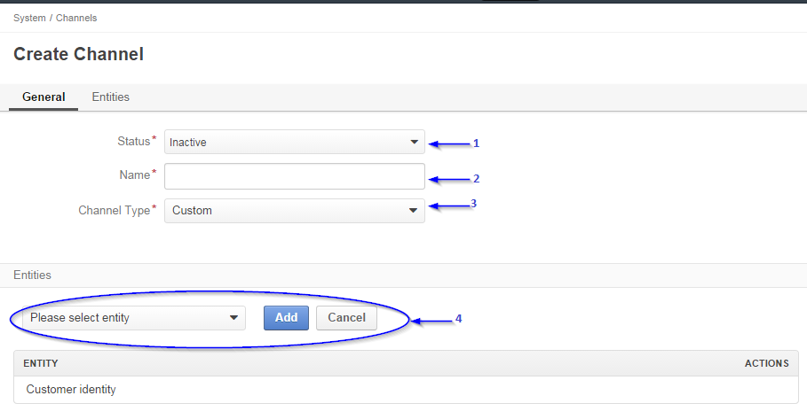
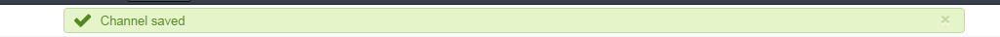

Channel Guide
=============

   

   

   

.. |IcDelete| image:: ./img/channel_guide/Buttons/IcDelete.png
   :align: middle

.. |IcEdit| image:: ./img/channel_guide/Buttons/IcEdit.png
   :align: middle

.. |IcView| image:: ./img/channel_guide/Buttons/IcView.png
   :align: middle

   

   
.. |S03| image:: ./img/channel_guide/Screenshots/S03.png
   :width: 100mm
   
.. |S04| image:: ./img/channel_guide/Screenshots/S04.png
   :width: 100mm

.. |S05| image:: ./img/channel_guide/Screenshots/S05.png
   :width: 100mm

.. |S06| image:: ./img/channel_guide/Screenshots/S06.png
   :width: 100mm

   
.. |M01| image:: ./img/channel_guide/MenuItems/M01.png
   :width: 40mm
   
.. |M02| image:: ./img/channel_guide/MenuItems/M02.png
   :width: 40mm

.. |M03| image:: ./img/channel_guide/MenuItems/M03.png
   :width: 40mm
   
.. |M04| image:: ./img/channel_guide/MenuItems/M04.png
   :width: 40mm
   
.. |M05| image:: ./img/channel_guide/MenuItems/M05.png
   :width: 40mm
   
.. |M06| image:: ./img/channel_guide/MenuItems/M06.png
   :width: 40mm
   
.. |M07| image:: ./img/channel_guide/MenuItems/M07.png
   :width: 40mm
   
.. |M08| image:: ./img/channel_guide/MenuItems/M08.png
   :width: 40mm

.. |WT01| replace:: Contact request form
.. _WT01: http://www.magentocommerce.com/magento-connect/contact-request-form.html

.. |WT02| replace:: Shopping Cart
.. _WT02: http://www.magentocommerce.com/magento-connect/customer-experience/shopping-cart.html

Why We Need Channels
--------------------------

Whether you run a multi-million international business or own a small toy shop in the middle of nowhere, the two vital success components are *knowing your customer* and *keeping a careful track of your business processes*. However, the era of E-commerce with all of its awesome opportunities has brought a number of challenges on the way to the marketing Olympus, including rapidly growing customer-bases, customer's demand for faster and more client-oriented service and, the last but far not least, a need to manage several on-line and off-line shops.

That is when OroCRM steps onstage. Its analysis and reporting tools provide for extensive customer profiling and drill-down marketing capabilities. Its natural flexibility and scalability help to meet the aim of your specific business. And yes, OroCRM has got an answer to the multiple on&off-line shops challenge. This is what we call a *Multiple Channels Functionality*.

**With OroCRM you can create any number of Channels to collect your business-specific data from both online and offline retail outlets for their further processing in the system.**

You can `create </user_guide/channel_guide.rst#creating-a-channel>`_ a specific Channel for each of the outlets and `fill it </user_guide/channel_guide.rst#3-fill-the-channel-with-entities>`_ with forms to collect outlet-specific data, and than create Customer profiles and reports, based on all the information collected from all the stores. 

Channel Types
-----------------

While OroCRM customization capabilities provide for creation of any number of Channel types, we shall consider the three basic ones, i.e. Web, B2B and Custom Channels:

- *Web Channels* are initially sharpened for Magento and provide for easy automated population of the system with customer-related details from multiple shops on Magento.
- *B2B Channels* are dedicated for manual population of the system with off-line business details.
-  *Custom Channels* can be created and tailored subject to specific customer needs and requirement. 

In OroCRM v.1.4 there are two system types of channels supported:

- *Magento Channels* are sharpened for Magento and provide for easy automated population of the system with customer-related details from multiple shops on Magento
- *B2B Channels* are dedicated for manual population of the system with customer-related details for B2B businesses
-  The third type *Custom Channels* that can be created and tailored subject to specific customer needs and requirement. 

Creating a Channel
--------------------------

A Channel can be created with several simple steps:

1. Go to Channels

2. `Define basic Channel details </user_guide/channel_guide.rst#2-define-basic-channel-details>`_

3. `Fill the Channel with Entities </user_guide/channel_guide.rst#3-fill-the-channel-with-entities>`_

4. `Save the Channel in the System </user_guide/channel_guide.rst#4-save-the-channel-in-the-system>`_

.. hint:: Steps three and four are interchangeable, as you can first Save and empty Channel and then Edit it and Fill with Entities, though a simpler straightforward flow is described hereunder).
   

1. Go to Channels
^^^^^^^^^^^^^^^^^
Enter the system and go to *System --> Channels*

|S01|

If you cannot see the *System* and\or *Channels* menu, check your role permissions or address your system administrator.

*System / Channels* page will appear.

Click |B01| button in the top right corner to get to the *Create Channel* page.

|S02|

2. Define Basic Channel Details
^^^^^^^^^^^^^^^^^^^^^^^^^^^^^^^
In the *General* tab define basic Channel information.
The tree obligatory fields (marked with "*" sign) **must** be defined:

- **Status** (1). The following two values are possible:

  * *Inactive*: (default); no data will be loaded from the Channel; the option is useful if a Channel is being configured for future use or is out of date. (For inactive channels no new data is uploaded to the system, but all the data loaded while the Channel was active is considered by the reports.

  * *Active*: data will be loaded from the Channel, can be viewed in the system and is considered by the reports.

- **Name** (2): a name of the channel that will be displayed on the screen (and thus used to manage the Channel).

- **Channel Type**: a drop-down, where you can choose a channel type that is more suitable for the Channel created.

3. Fill the Channel with Entities
^^^^^^^^^^^^^^^^^^^^^^^^^^^^^^^^^
Channel Entities are sets of Customer-related data uploaded into the system. Each entity can contain numerous fields of different types (e.g. text fields, true or false fields, date and time etc.).  When you assign a specific Entity to the Channel, it means that information contained in the Fields of this Entity will be collected and processed for the Channel. There are System and Custom Entities.

Entities are managed in the "Entities" section or tab that you will see when `Creating </user_guide/channel_guide.rst#creating-a-channel>`_ or `Editing  </user_guide/channel_guide.rst#editing-a-channel>`_ a Channel. (*Entities section and tab duplicate each other. This provides for convenience of Entity management for both small and excessive number of entities*)

System Channel Entities
"""""""""""""""""""""""
There is a number of default Channel Entities meaningful for a specific Channel type. Once you have chosen a *B2B* or *Magento* Channel Type, the System Entities will be added in the *ENTITY* list automatically. The following table describes all the currently available System Channel Entities and provide brief description of their content.

.. list-table:: **System Channel Entities**
   :widths: 10 10 30
   :header-rows: 2

   * - 
     - 
     - 
   * - Entity
     - Channel Type
     - Description
   * - |M01|
     - B2B
     - Keeps data on potential Sales most likely to become a success.
       
       Contains such fields as Opportunity opening and closure dates, closure reasons probability of the Opportunity gain, customer needs and described solution descriptions, etc.
   * - |M02|
     - B2B
     - Keeps data on what might become an Opportunity.           
       
       Contains such fields as Lead's personal and business details and reference Opportunity (if any).
   * - |M03|
     - B2B
     - Keeps data on successful Opportunities, which have turned in Sales.           
       
       Contains such fields as date of the Sales Process start and reference to the relevant customer in the system, as well as on the preceding Lead and Opportunity.
   * - |M04|
     - B2B
     - KAggregates all the data on a specific Customer.           
       
       Contains such fields as the list of Channels active for the Customer, the Customer's Leads and Opportunities, billing and shipping details, and lifetime sales values. 
   * - |M05|
     - Magento     
     - Keeps details from form Magento's |WT01|_, including the contact details and information on the contact attempts success and target.    
   * - |M06|
     - Magento     
     - Keeps details on the Magento Customer's pre-sales activity with the |WT02|_   
       Contains Customer's personal data and payment details, reference to related Opportunities, sales values and related communications.
   * - |M07|
     - Magento     
     - Aggregates all the data on a specific Magento Customer, including the list of Channels active for the Customer, billing details, related opportunities, shipping details, rating, etc.
   * - |M08|
     - Magento     
     - Keeps details of actual sales made by the customer within the Channel, including store details, Customer's details, one-time and total credited, payed and taxed amounts, feed-backs, etc.

Custom Entities
"""""""""""""""""""""""
Custom Entities are created for specific Customer needs and can contain any required fields to be filled and processed by the System. For more details on Customer entities please kindly see Entity Management Guide (TBD). 
Once a Custom entity has been created in the System, it will automatically appear in the drop-down menu in the Entities tab/section below the System Entities. use the scroll bar to get to them.

Finalize Entity Choice
"""""""""""""""""""""""
If you have chosen a Custom Channel type, there will be no initially added Entities. For B2B and Magento Channel their specific values will be already in the list. You can use the drop down menu to add any System or Custom Entities that are not yet in the list. Both System and Custom Entities can be added to the same list.

(For the sake of the following example there had been created a Custom Entity named "CEntity".

|S05|

Choose an Entity and click |BAdd| button. The entity will be Added to the list. You can also delete entities from the list. Click |IcDelete| to do so. This will remove the Entity from this Channel's list (not from the System).

4. Save the Channel in the System
^^^^^^^^^^^^^^^^^^^^^^^^^^^^^^^^^^

Once you have finished adding the entities, click |Bsc| button in the top right corner. Your Channel will be saved in the system:

|S07|.

Further Actions
--------------------------

Editing/Deleting a Channel
^^^^^^^^^^^^^^^^^^^^^^^^^^^^^^^^^^
Once a Channel has been created it will appear in the Channel list. Now you can Edit your Channel details. 
Click the Channel name in the list. The Channel details list will appear. In the top right corner you will see possible action buttons:

* |BDeactivate| button (for Active channels) or |BAactivate| button (for Inactive channels).
  * You can deactivate an Active channel. Once the channel has been deactivated, no new data from the Channel will be uploaded to the system. All the data loaded while the Channel was active is considered by the Sales Processes functionality.
  * You can activate an Inactive channel. It will become Active and data from the Channel will be uploaded to the system.
  
* |BDelete| button will delete the Channel. **Once a Channel has been deleted ALL THE RELEVANT DATA WILL BE DELETED.** 

* |BEdit| button will open Edit page that is very similar to the page you used to Create a Channel (See *Create a Channel* section), but:
  * details you have already defined will displayed and
  * **you cannot change Channel Type if data from the Channel has been uploaded into the system at least once**

Editing Entities from a Channel
^^^^^^^^^^^^^^^^^^^^^^^^^^^^^^^
There are sometimes situations when default Entity fields are not enough or excessive. If this is so, Entities may be edited (list of fields, their type and specific properties may be redefined). This can be done only by duly authorized Users.

Entities may be edited from *System --> Entities --> Entity Management*. Entities, assigned to a Channel, may be viewed and/or edited by duly authorized users from the Channel page.

When you open a specific Channel type, there will be two icons in the Action tab. Click |IcView| to see the Entity details. Click |IcEdit| icon to change the Entity. 

 **If you don't have necessary permissions, you will see a browser-specific message on access denial.** 

Channels Usage
^^^^^^^^^^^^^^^^^^^^^^^^^^^^^^^
Once the Channels have been created, data for their Entity properties can be loaded into the System and processed therein. Speaking less IT-language it means that now you can add info from any kind of your retail spots to the OroCRM and gain unified one-point access to analyze and monitor this data (which of course, will no way limit the drill-down capabilities if you want to focus on one specific Channel.

   
