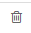
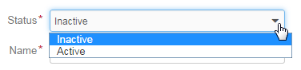
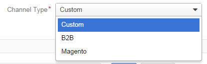
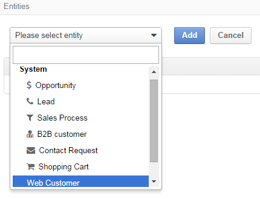
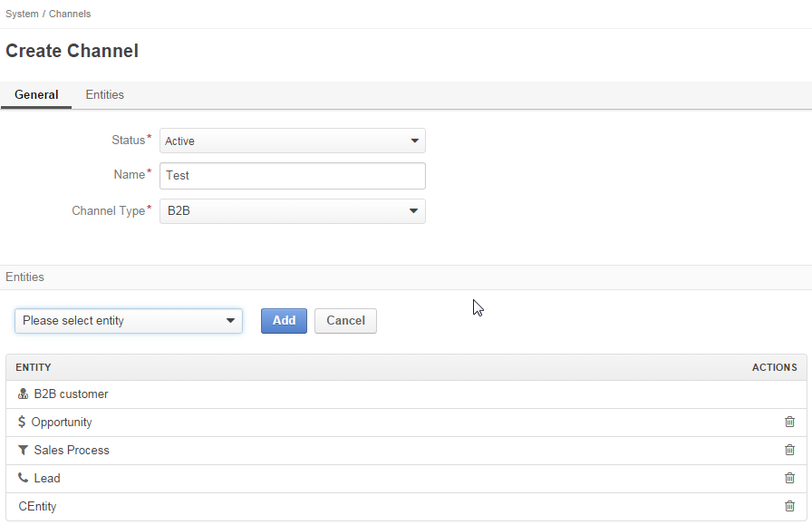
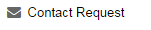

.. _user-guide-channel-guide:

Channels Management Guide
=========================

What Channels Are and Why You Need Them
----------------------------------------

Whether you run a multi-million global business or own a small toy shop in the middle of nowhere, the two vital 
success components are *knowing your customer* and *keeping a careful track of your business processes*. However, the 
era of E-commerce with all of its awesome opportunities has brought a number of challenges on the way to the marketing 
Olympus, including rapidly growing customer-bases, customer's demand for faster and more client-oriented service and, 
the last but far not least, a need to manage several on-line and off-line shops with numerous partner-programs, 
campaigns, additional license and service sales, and so on and so forth.

That is when :term:`OroCRM` steps on-stage. Its analysis and reporting tools provide for extensive customer profiling 
and drill-down marketing capabilities. Its natural flexibility and scalability help to meet the aim of your specific 
business. And yes, OroCRM has got an answer to the multiple sales&customer source challenge. 
This is what we call a :term:`Multiple Channels Functionality`.

Channel is a system :term:`entity <Entity>`, the instances of which represents different sources of 
:term:`Leads <Lead>`, :term:`Opportunities <Opportunity>` and :term:`Customers <Customer>`, e.g. retail outlets, on-line 
shops, advertising campaigns, etc.

You can :ref:`create <user-guide-channel-guide-creating-a-channel>` a specific Channel instance for each of the outlets 
and :ref:`fill it <user-guide-channel-guide-fill-the-channel-with-entities>` with properties to collect details on a 
specific outlet, campaign, sales type whatsoever, and use these Channels to manage your Sales Process workflow and 
create Customer profiles and reports, based on all the information collected from all the Channels. 

.. caution:: 

    With OroCRM you can create any number of :term:`Channels <Channel>` to collect your business-specific data 
    for further processing in :term:`the System <System>`.

    
.. _user-guide-channel-guide-channel_types:

Channel Types
-------------

While OroCRM customization capabilities provide for creation of any number of Channel types, we shall consider the 
three basic ones, i.e. Web, B2B and Custom Channels:

- *Web Channels* are initially sharpened for :term:`Magento` and provide for easy automated population of the system 
  with customer-related details from multiple shops on Magento.

- *B2B Channels* are dedicated for manual population of the system with details of Business-to-Business sales.

- *Custom Channels* can be created and tailored subject to specific customer needs and requirement. 

.. _user-guide-channel-guide-creating-a-channel:

Creating a Channel
------------------

A Channel can be created with several simple steps:

1. :ref:`Go <user-guide-channel-guide-go-to-channels>` to *Channels* tab

2. :ref:`Define <user-guide-channel-guide-define-basic-channel-details>` Basic Channel Details, including 
   :ref:`Integration Details <user-guide-channel-guide-define-integration-details-for-a-magento-channel>` for *Magento* 
   Channels

3. :ref:`Fill <user-guide-channel-guide-fill-the-channel-with-entities>` the Channel with Entities

4. :ref:`Save <user-guide-channel-guide-save-the-channel-in-the-system>` the Channel in the System 

.. note:: 

    Steps three and four are interchangeable, as you can first Save and empty Channel and then Edit it and Fill
    with Entities, though a more straightforward flow is described hereunder).

.. _user-guide-channel-guide-go-to-channels:

1. Go to Channels
^^^^^^^^^^^^^^^^^

Enter the system and go to *System --> Channels*

If you cannot see the *System* and\or *Channels* menu, check your role permissions or address your system administrator.

*System / Channels* page will appear.

Click :guilabel:`Create Channel` button in the top right corner to get to the *Create Channel* page.

.. _user-guide-channel-guide-define-basic-channel-details:

2. Define Basic Channel Details
^^^^^^^^^^^^^^^^^^^^^^^^^^^^^^^

In the *General* tab define basic Channel information.
The three obligatory fields **must** be defined:

- **Status*** (1): current status of the Channel. The following two values are possible:

  - *Inactive*: (default); no data will be loaded from the Channel; the option is useful if a Channel is being 
    configured for future use or is out of date. (For inactive channels no new data is uploaded to the system, but all 
    the data loaded while the Channel was active is considered by the reports.

  - *Active*: data will be loaded from the Channel, can be viewed in the system and is considered by the reports.

- **Name*** (2): a name of the channel that will be displayed on the screen (and thus used to manage the Channel).

- **Channel Type***: a drop-down, where you can choose a :ref:`Channel Type <user-guide-channel-guide-channel_types>` 
   that is more suitable for the Channel created.
   
                     
.. _user-guide-channel-guide-define-integration-details-for-a-magento-channel:

2a. Define Integration Details for a Magento Channel
""""""""""""""""""""""""""""""""""""""""""""""""""""

Once you have chosen a Channel Type = *Magento*, a new mandatory field **Integration*** will appear. Click 
*Configure integration* link to get to the form.

The following fields should be specified:

.. list-table:: **System Channel Entities**
   :widths: 10 30
   :header-rows: 1

   * - Field
     - Description
     
   * - **Name***
     - Configuration name. Mandatory field. Will be used to refer to the configuration within the system (edit, assign,
       etc.)
 
   * - **SOAP WSDL URL***
     - Mandatory field. An http URL string to the WSDL of the SOAP-based service.
     
   * - **SOAP API Key***
   
       **SOAP API User***
       
     - Mandatory fields. SOAP API credentials. 
     
   * - **WS-I Compliance**
     - Optional flag. Defines whether the configuration meets the requirements of Web Services Interoperability 
       Organization guidelines.
   
   * - **Sync start date**
     - Mandatory field The date to start the synchronization with; data uploaded into the Magento account since the 
       date, will be added to OroCRM and can be processed therein.

.. hint::  Please address you Magento administrator for the information on SOAP settings details. 

At this point you can click :guilabel:`Check Connection` button, to check if the settings you have defined above are 
correct.
Once the connection details have been verified, the next fields will be filled with default settings.

.. list-table:: **System Channel Entities (continued)**
   :widths: 12 30
   :header-rows: 1

   * - Field
     - Description
     
   * - **Website***
     - Mandatory field. The list of all the Websites available for the shop. *All Websites* option is chosen by default.
       You can edit the field value and choose one of the Websites available.
       Click "Sync website list" link if the list of Websites is outdated.
       
   * - **Admin url**
     - Optional field. An http link to the Administrator panel of the specified Magento store.
     
   * - **Default owner***
     - Mandatory field. Specifies Users that can manage the configuration.
       
       
.. _user-guide-channel-guide-fill-the-channel-with-entities:

       
3. Fill the Channel with Entities
^^^^^^^^^^^^^^^^^^^^^^^^^^^^^^^^^

Basically, *Entity* is a grouping of things with common rules and/or data. Rules and/or settings defined for an
Entity will be applied to all of its instances.

*Channel Entities* define types of instances that can be collected and processed in the System for each Channel they 
have been assigned to.

  
Entities are managed in the "Entities" section or tab that you will see when 
:ref:`Creating <user-guide-channel-guide-creating-a-channel>`
or :ref:`Editing <user-guide-channel-guide-editingdeleting-a-channel>` a Channel. 

.. _user-guide-channel-guide-system-channel-entities:

System Channel Entities
"""""""""""""""""""""""

There is a number of Channel Entities pre-implemented in OroCRM 4.1, meaningful for a specific Channel type.

Once you have chosen a *B2B* or *Magento* Channel Type, the System Entities will be added in the *ENTITY* list 
automatically. The following table describes all the currently available System Channel Entities and provide 
brief description of their content.

.. list-table:: **System Channel Entities**
   :widths: 7 5 30
   :header-rows: 1
 
   * - Entity
     - Channel Type
     - Instance Description
 
   * - |M01|
     - B2B
     - Keeps data on potential Sales most likely to become a success.
       
       Contains such fields as Opportunity opening and closure dates, closure reasons probability of the Opportunity 
       gain, customer needs and described solution descriptions, etc. More information about Opportunities and their 
       usage pre-implemented in the System is provided in the \:ref:`"Opportunities Management 
       Guide" <user-guide-system-entities-opportunities>`\.
   
   * - |M02|
     - B2B
     - Keeps data on what might become an Opportunity.           
 
       Contains such fields as Lead's personal and business details and reference Opportunity (if any). More information
       about Leads and their usage pre-implemented in the System is provided in the \:ref:`"Leads Management 
       Guide" <user-guide-system-entities-leads>`.

   * - |M03|
     - B2B
     - Used to keep and process data on the Sales Process flow from a Lead to a Closed Opportunity, subject to a 
       workflow predefined in the System.           
       
       Contains such fields as date of the Sales Process start and reference to the relevant Customer instance in the 
       System, as well as on the preceding Lead and Opportunity.
   
   * - |M04|
     - B2B
     - Aggregates all the data for a specific Customer.           
       
       Contains such fields as the list of Channels active for the Customer, the Customer's Leads and Opportunities, 
       billing and shipping details, and lifetime sales values.        

   * - |M06|
     - Magento
     - Keeps details on the Magento Customer's pre-sales activity with the |WT02|_            
       
       Contains Customer's personal data and payment details, reference to related Opportunities, sales values and 
       related communications. 

   * - |M07|
     - Magento
     - Aggregates all the data on a specific Magento Customer, including the list of Channels active for the Customer, 
       billing details, related opportunities, shipping details, rating, etc.            

   * - |M08|
     - Magento
     - Keeps details of actual sales made by the customer within the Channel, including store details, Customer's 
       details, one-time and total credited, paid and taxed amounts, feed-backs, etc.   
       
   * - |M05|
     - Magento and B2B
     - Can be assigned any Channel and used to save the information on the contact attempts success and target.
       To reach the Contact Request form go the the *Activities --> Contact Request* page.     

       
Custom Entities
"""""""""""""""

:term:`Custom <Custom Component>` Entities are created for specific Customer needs and their instances can contain any 
required details to be filled and processed by the System. For more details on Customer entities please kindly see 
Entity Management Guide(TBD). 
Once a Custom entity has been created in the System, it will automatically appear in the drop-down menu in the Entities 
tab/section below the System Entities. Use the scroll bar to get to them.

Finalize Entity Choice
""""""""""""""""""""""

If you have chosen a Custom Channel type, there will be no initially added Entities. For B2B and Magento Channel their 
specific values will be already in the list. You can use the drop down menu to add any System or Custom Entities that 
are not yet in the list. Both System and Custom Entities can be added to the same list.

(For the sake of the following example there had been created a Custom Entity named "CEntity".

|S05|

Choose an Entity and click :guilabel:`Add` button. The entity will be Added to the list. You can also delete entities 
from the list. Click |IcDelete| to do so. This will remove the Entity from this Channel's list (not from the System).

.. _user-guide-channel-guide-save-the-channel-in-the-system:

4. Save the Channel in the System
^^^^^^^^^^^^^^^^^^^^^^^^^^^^^^^^^

Once you have finished adding the entities, click :guilabel:`Save and Close` button in the top right corner. Success 
message will appear and your Channel will be saved in the system.

Using Channels
--------------

.. _user-guide-channel-guide-editingdeleting-a-channel:

Editing/Deleting a Channel
^^^^^^^^^^^^^^^^^^^^^^^^^^

Once a Channel has been created it will appear in the Channel list. Now you can Edit your Channel details. 
Click the Channel name in the list. The Channel details list will appear. In the top right corner you will see possible 
action buttons:

* :guilabel:`Deactivate` button (for Active channels) or :guilabel:`Activate` button (for Inactive channels).

  * You can deactivate an Active channel. Once the channel has been deactivated, no new data from the Channel will be 
    uploaded to the system. All the data loaded while the Channel was active is considered by the Sales Processes 
    functionality.
  
  * You can activate an Inactive channel. It will become Active and data from the Channel will be uploaded to the system.
  
* :guilabel:`Edit` button will open Edit page that is very similar to the page you used to Create a Channel (See 
  :ref:`Create a Channel <user-guide-channel-guide-creating-a-channel>` section), but details you have already  defined 
  will be displayed
  
* :guilabel:`Delete` button will delete the Channel. 

.. caution:: 

    You cannot change Channel Type if data from the Channel has been uploaded into the system at least once. 
    
    Please also keep in mind that **once a Channel has been deleted all the relevant data will be deleted.**

    
Editing Entities from a Channel
^^^^^^^^^^^^^^^^^^^^^^^^^^^^^^^

There are sometimes situations when default Entity fields are not enough or excessive. If this is so, Entities may 
be edited (list of fields, their type and specific properties may be redefined). This can be done only by duly 
authorized Users.

Entities may be edited from *System --> Entities --> Entity Management*. Entities, assigned to a Channel, may be viewed 
and/or edited by duly authorized users from the Channel page.

When you open a specific Channel type, there will be two icons in the Action tab. Click |IcView| to see the Entity 
details. Click |IcEdit| icon to change the Entity. 

.. note:: 

    If you don't have necessary permissions, you will see a browser-specific message on access denial. 

    
Synchronizing a Magento Channel Data
------------------------------------

As a matter of case, Oro Platform provides for integration of OroCRM with different third-party systems and integration 
can be done for different Channels in the course of customization.
However, OroCRM provide embedded integration capabilities for Magento Channels.

Once you have created a Magento type channel and 
:ref:`defined <user-guide-channel-guide-define-integration-details-for-a-magento-channel>`, its integration details
information from Magento will be uploaded into OroCRM automatically subject to a predefined schedule (once an hour by 
default). 
You can enable two-way synchronization settings and manually start synchronization.

Two Way Synchronization
^^^^^^^^^^^^^^^^^^^^^^^

In order to enable two-way synchronization:

- Go to *System --> Channels* and click in the row of the grid that contains your Magento Channel

- Click on its Integration link

- Go to *Synchronization Settings* tab of the emerged page

- Check *Enable Two Way Sync* box

- Define the priority in case of conflicts between the data (e.g. the same customer was edited from OroCRM and from 
  Magento:
   
  - Remote wins: Magento settings will be saved in Magento and loaded to OroCRM
  
  - Local wins: OroCRM settings will be saved in OroCRM and loaded to Magento  

  
Start Synchronization Manually
""""""""""""""""""""""""""""""

In order to start the synchronization manually:

- Go to *System --> Channels* and click in the row of the grid that contains your Magento Channel

- Click on its Integration link

- Click :guilabel:`Schedule Sync` button. *A sync job has been added to the queue. Check progress.* note will appear. 

- The data is being synchronized. You can click *Check progress* link to see the synchronization status.

Channels Usage Examples
-----------------------

Once the Channels have been created, data for their Entity properties can be loaded into the System and processed 
therein. Speaking less IT-language it means that now you can add info from any kind of your retail spots to the OroCRM 
and gain unified one-point access to analyse and monitor this data (which of course, will no way limit the drill-down 
capabilities if you want to focus on one specific Channel.

1
^^

You sell flowers, toys and souvenirs at several Magento stores. You want to keep track of our customers (especially the 
ones who buy things from different shops) and to review how sales go.*

- Create Magento channels that correspond to our shop

- Fill it with Entities that correspond to Customers, Shopping Carts and Sales

- Define specific details you want to know for each Entity type

*Now for each instance of the entity theses details can be loaded into the system and processed there. This means you 
can monitor customers, regardless  of the shop, can make reports on on the activity and assess how many things 
from the cart were actually bought and push the sales with timely customer-focused communications.*
 

2
^^

You sell after-sales support services to customers of our partners and want to keep track of them, to know what partner 
are worth working on with, what are our gains and if the customers attracted from the partners address us for 
additional services.

- Create a Custom Channel Type "Partnership Programs"

- Populate the System with Channels of the Type.

- For each of the Channels define a set of Entities, including Partner Details (this may be a mere name, or a list 
  including address, shipping details, names of contact persons, etc., Service Provided (details 
  on the Services) and Customers Attracted (basic Customer information including contract prolongation, additional 
  services, total money paid, etc.).

*Now, details of the Customers Attracted, Partners and Services may be processed in the System and used to build 
appropriate work-flows and reports.*

3
^^

You own a furniture retail outlet. From time to time, people come in and out wondering about the things you can make. 
You have decided to run a research and find out how many of those will become our customers and how they have learned 
about our shop.

- Create a B2B type Channel for our shop (by the way, these may be several shops)

- Assign this Channel Entity "Leads" (embedded entity sharpened for analyses of potential customers)
      
- Specify the set of details to be collected, e.g. personal details of the people and a set of answers to "Why are you 
  here?" question.

*Now, the "Leads" information can be used as a part of your Sales Process work-flow in the system, you can easily 
collect, process and monitor it.*

   

   

   

   

   

   

   

   

   

.. |WT02| replace:: Shopping Cart
.. _WT02: http://www.magentocommerce.com/magento-connect/customer-experience/shopping-cart.html
