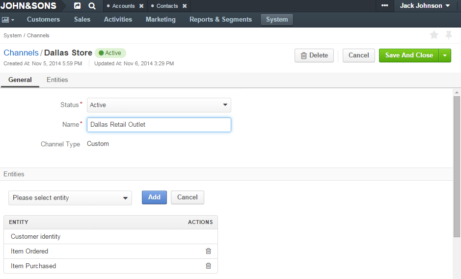
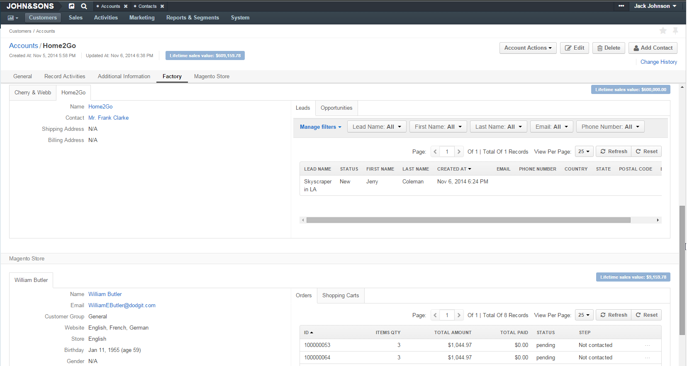

.. _user-guide-channel-guide:

Channels Management
===================

Functionality Overview
----------------------

Multichannel functionality enables source-specific collection of customer information and its aggregation.

A **Channel** entity represent one source of customers and customers' data. For each Channel record 
("channel") created in the system, along with other :ref:`general details <user-guide-channel-guide-general>` 
name, type and set of entities are specified:

- Name of a channel uniquely identifies it in the system

- Type of a channel defines defines nature of the customer data 

- Entities assigned to a channel define the types of information that can be collected from it. 
 
Each channel is assigned a \term:`Customer identity entity`\ that corresponds to the channel type. 
Records of the Customer entities ("customers") can be created within the channel.

Customer data from different channels is aggregated under an Account record ("account"): each customer
must be assigned an account, and one aacount can have multiple customer identities from different channels
associated with it (regardless of their channel types).

.. _user-guide-channel-guide-create:

Creating a Channel
------------------

1. Go to *System --> Channels* page and click :guilabel:`Create Channel` button in the top right corner to get 
   to the *Create Channel* page.

2. Define :ref:`General Details <user-guide-channel-guide-general>` of the Channel

3. :ref:`Fill <user-guide-channel-guide-entities>` the Channel with Entities    

4. Once you have finished adding the entities, use the *Save* function (click :guilabel:`Save and Close`
   or :guilabel:`Save` button in the top right corner). Success message will appear and your Channel 
   will be saved in the system.

.. _user-guide-channel-guide-general:

Define General Details
^^^^^^^^^^^^^^^^^^^^^^

In the *General* tab define basic Channel information.

The three fields are mandatory and **must** be defined:

.. csv-table:: **Mandatory Channel Properties**
  :header: "**Name**","**Description**"
  :widths: 10, 30

  "**Status**","Current status of the channel.
 
    *Inactive* or *Active*. For inactive channels no new data is uploaded to the system (the option is useful
  if a channel is being configured for future use or is out of date."
  "**Name**", "Name that will be used to refer to the Channel in the system. It is recommended to keep the name 
  meaningful." 
   "**Channel Type**", "A drop-down, where you can choose a Channel Type more suitable for the channel  created. 
  
  The following types are available in OroCRM 1.4 out of the box:
   
  - *B2B*: dedicated for managing B2B customer relations
   
  - *Web*: sharpened for :term:`Magento` stores
   
  - *Custom*: any other channels, subject to specific business needs and goals"

.. caution::

    A Magento Channel cannot be saved without integration settings defined. 
    
    Once you have selected *Magento* as a Channel Type, new mandatory field **Integration*** will appear. 
    Please, see :ref:`Magento Channel Integration <user-guide-magento-channel-integration>` article for 
    the details.

    
.. _user-guide-channel-guide-entities:

Fill the Channel with Entities
^^^^^^^^^^^^^^^^^^^^^^^^^^^^^^

Entities assigned to a channel define what data OroCRM can collect from it. 

To add an entity to a channel, use the "Entities" section when 
:ref:`Creating <user-guide-channel-guide-create>` or :ref:`Editing <user-guide-channel-guide-edit>` a Channel.

.. image:: ./img/channel_guide/Screenshots/channels_entity_select.png

One of the entities defined for a channel must represent a customer identity and will be added to the entity list
automatically, subject to the chosen channel type:

- B2B Channel - B2B Customer
- Magento Channel - Web Customer
- Custom Channel - Customer Identity

Some other entities are pre-implemented in the system and sharpened for a specific channel type, e.g. Opportunity
and Lead for a B2B Channel or Cart and Order for a Magento Channel. The entities will be added to the list of 
entities by default, once you have selected the channel type, they are optional and may be removed.

- More information about  System entities meaningful for B2B channels and their usage pre-implemented in the System 
  is provided in the *B2B Channels and Their Entities* guide

- Information about System entities meaningful for Magento Channels is uploaded into the OroCRM during synchronization as 
  described in the *Magento Channel Integration* guide.

- Another pre-implemented entity is **Contact Request**. It refers to records uploaded to the system from a 
  pre-implemented embedded form *Contact request* that can be added to any Website. The Entity is described in more 
  details in the *Actions* guide.
  
- **Custom Entities** are created for specific Customer needs and their instances can contain any required 
  details to be filled and processed by the System. For more details on Customer entities please 
  see the *Entity Management* guide. 
  Once a Custom entity has been created in the System, it will automatically appear in the drop-down menu in the Entities 
  tab/section below the System Entities. Use the scroll bar to get to them.

To add an entity to the channel list, choose the entity and click :guilabel:`Add` button. The entity will be added 
to the list. 
To delete an entity, click |IcDelete| icon. This will remove the entity from this channel's list (not from the System).

.. _user-guide-channel-guide_example:

Channels Examples
-----------------
John&Sons factory sells building and finishing materials to different scale construction businesses. They have also got 
an outlet for retail and small wholesale in Dallas. Recently they have launched a Magento store, where the users can 
order any amount of goods.
Along with numerous benefits, this diversified approach has brought some challenges such as the need to control 
customer relations at many end-points, keeping in mind that some of the customers may reach 
the company at different grounds. 

John&Sons need three Channels.

*Factory* Channel
^^^^^^^^^^^^^^^^^

Factory sales are of business-to-business nature, so we have created a Channel of B2B Type named *Factory*.

As we want to keep track of potential and actual opportunities and sales and keep the customer communications within 
the same sales process, we have kept all the entities added to the list by default.
We have also created and added a custom entity *Subcontract*, that keep details of final customer and general 
contractor in cases when the factory is subcontracting.

.. image:: ./img/channel_guide/Screenshots/channels_entity_select_custom.png

The entity was created as an example in the *Entity Management* guide

This is how the page of the channel looks when we are creating it:

.. image:: ./img/channel_guide/Screenshots/channels_created_b2b.png

*Magento Store Channel*
^^^^^^^^^^^^^^^^^^^^^^^

Factory sales details will be saved in the channel of a dedicated Web Type named *Magento Store*.

Contact Request form was embedded on the Website, so we have added the Contact Request entity.

.. image:: ./img/channel_guide/Screenshots/channels_created_web.png

*Dallas Retail Outlet Channel*
^^^^^^^^^^^^^^^^^^^^^^^^^^^^^^

Retail outlet in Texas needs a separate channel of a Custom Type named *Dallas Store*.

Here we also want to monitor the contacts, so we have added the Contact Request entity. Along with that, there are two
Custom entities:

Item Ordered entity: its records represent the things ordered by a customer but not yet delivered to them. This
could be as the customer has ordered the goods by phone, or if the store was currently out of stock. Each Goods Ordered 
record keeps details of the product to be delivered, delivery date, order status, details of how the order was made 
and will be paid for.

and 

Item Purchased: its records represent different things the customer has bought in the store. Goods Purchased 
records keep such details as name of a specific product, purchase volume, the goods price and total cost and date of 
the purchase.

The entities were created as an example in the *Entity Management* guide

This is how the page of the channel looks when we are creating it:

.. note:: 

    Custom Channel may not be limited to sales activities. So, if John&Sons decided to start a Charity Fund, a special 
    Channel entity could be created to represent it, where Customer Identities, would be the fund participants and 
    other entities could represent charity events and types of help provided.
    
    Moreover, if there were many different funds to manage, a special type could be created, such that these entities 
    were added to it by default.    
 

.. _user-guide-channel-guide-edit:

Managing Channels from the Grid
--------------------------------

Once a channel has been saved, it will appear in the *Channels* grid. A number of options is available for each
Channel instance in the grid. Hover the mouse to *...* column to see them:

- Click |IcDelete| to delete the Channel instance from the system. 

.. caution:: 

    Once a channel has been deleted all the relevant data will be deleted as well.

- Click |IcEdit| to edit the channel details. Edit page very similar to the page you used to 
  :ref:`create a channel <user-guide-channel-guide-create>`), but details you have already defined will be 
  displayed

.. caution:: 

    You cannot change the channel type if data from the channel has been uploaded into the system at least once.

- Click |IcView| to get to the page of the channel. For example, out *Factory* channel page looks as follows:

.. image:: ./img/channel_guide/Screenshots/channels_created_b2b_view.png

There is a number of actions available from the page.

- Click :guilabel:`Deactivate` button (for Active channels) or :guilabel:`Activate` button (for Inactive channels):

  - You can deactivate an active channel. Once the channel has been deactivated, no new data from the channel will be 
    uploaded to the system.
  
  - You can activate an inactive channel. It will become active and data from the channel will be uploaded to the 
    system.
  
- Click :guilabel:`Edit` button edit the channel
  
- Click :guilabel:`Delete` button to delete the channel 

  
Editing Entities from a Channel
^^^^^^^^^^^^^^^^^^^^^^^^^^^^^^^

There are sometimes situations when default Entity fields are not enough or excessive. If this is so, Entities may 
be edited (list of fields, their type and specific properties may be redefined). This can be done only by duly 
authorized Users. When you open a specific channel page, there will be two icons in the action tab. Click 
|IcView| to see the Entity details. Click |IcEdit| icon to change the Entity. 

We can use the functionality, if, for example, there appeared a need to add a new field to the Item Ordered entity.

.. image:: ./img/channel_guide/Screenshots/channels_created_b2b_view_edit_entity.png

Please refer to the `Entity Management Guide <user-guide-entity-management-guide>` for more details. 

.. note:: 

    If you don't have necessary permissions, you will see a browser-specific message on access denial. 

Multichannel Customer Profile Example
--------------------------------------

John&Sons have now got a separate channel for each of the customer sources. Sales and communication details
are saved for each customer in different channels. All the customer are assigned to one account, from which 
the managers can see all of those activities regardless the specific ground used for them.

For example, there is a *Home2Go* construction company. 

John&Sons factory has already implemented several successful projects with them. Leads and Opportunities were
created for each of these projects and assigned to a B2B Customer named *Home2Go*.
The B2B Customer is assigned to the *Home2Go* Account.

For smaller purchases that do not require long negotiations and many-page agreements, Home2Go's managers have
purchased materials from the John&Sons Magento store. A specific Web Customer was created for each of the managers'
account (Magento users). However, all of these Web Customers were assigned to the *Home2Go* account (the same as 
for the B2B Customer).

During a current project in Texas, construction engineers were missing some necessary equipment and addressed the retail
outlet to purchase it. They have bought most of what they needed and ordered the rest. Customer Identities were created
for each of the engineers and details on the goods purchased and ordered were saved. All these Customer Identities were
assigned to the *Home2Go* account, as well.

Account record is rather many-fold, and the screenshot show only a part of it:

   
.. |IcDelete| image:: ./img/buttons/IcDelete.png
   :align: middle

.. |IcEdit| image:: ./img/buttons/IcEdit.png
   :align: middle

.. |IcView| image:: ./img/buttons/IcView.png
   :align: middle

.. |WT02| replace:: Shopping Cart
.. _WT02: http://www.magentocommerce.com/magento-connect/customer-experience/shopping-cart.html
