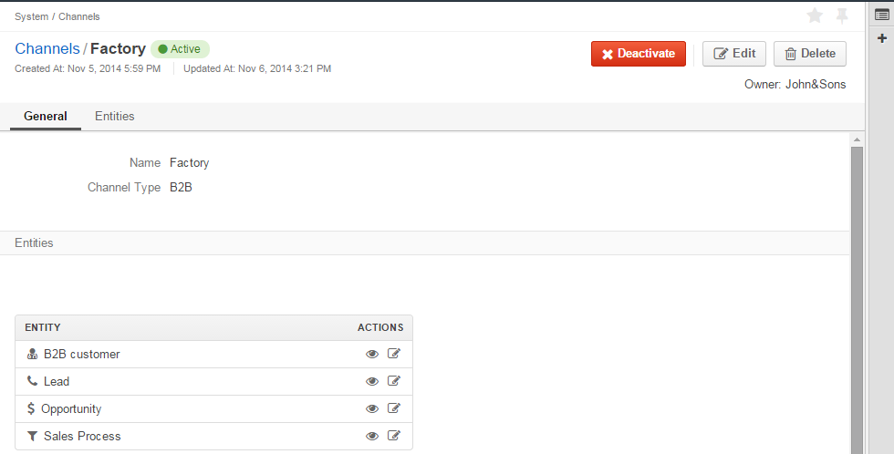
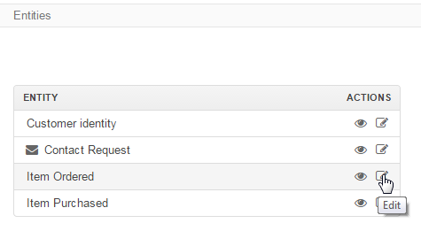

.. _user-guide-channel-guide:

Channels Management
===================

A **Channel** entity represent one source of customers and customer data. 

The guide describes how to :ref:`create <user-guide-channel-guide-create>` channels and 
:ref:`manage <user-guide-channel-guide-edit>` their records from the UI 

.. _user-guide-channel-guide-create:

Creating a Channel
------------------

1. Go to *System --> Channels* page and click :guilabel:`Create Channel` button in the top right corner to get 
   to the *Create Channel* page.

2. Define :ref:`General Details <user-guide-channel-guide-general>` of the Channel

3. Define :ref:`Entities <user-guide-channel-guide-entities>`, details of which will be received from the channel's 
   source

4. Once you have finished adding the entities, use the *Save* function (click :guilabel:`Save and Close`
   or :guilabel:`Save` button in the top right corner). Success message will appear and your Channel 
   will be saved in the system.

   
.. _user-guide-channel-guide-general:

General Details
^^^^^^^^^^^^^^^

Define basic Channel information in the *General* section. 

.. image:: ./img/channel_guide/channels_general.png

The three fields are mandatory and **must** be defined:

.. csv-table::
  :header: "**Name**","**Description**"
  :widths: 10, 30

  "**Status**","Current status of the channel.
 
  *Inactive* or *Active*. For inactive channels no new data is uploaded to the system (the option is useful
  if a channel is being configured for future use or is out of date.)"
  "**Name**", "Name that will be used to refer to the Channel in the system. It is recommended to keep the name 
  meaningful." 
  "**Channel Type**", "A drop-down, where you can choose a Channel Type more suitable for the channel  created. 
  
  Channel types define the set of rules and setting applied to the channel. 
  There is a proven practice of extending the OroCRM with new channel types to meet specific business needs. 
  
  The following types are available in the current version out of the box:
   
  - *B2B*: dedicated for managing B2B customer relations
   
  - *Magento*: sharpened for :term:`Magento` stores
   
  - *Custom*: any other channels, subject to specific business needs and goals"

.. caution::

    Once you have selected *Magento* as a Channel Type, new mandatory field **Integration*** will appear. 
    Please, see :ref:`Magento Channel Integration <user-guide-magento-channel-integration>` article for 
    the details.

    
.. _user-guide-channel-guide-entities:

Entities
^^^^^^^^

Entities assigned to a channel define what data OroCRM can collect from it. 

To add an entity to a channel, use the "Entities" section.

One of the entities defined for a channel must represent a customer identity and will be added to the entity list
automatically, subject to the chosen channel type:

- B2B Channel - B2B Customer
- Magento Channel - Web Customer
- Custom Channel - Customer Identity

Some other entities are pre-implemented in the system and sharpened for a specific channel type, e.g. Opportunity
and Lead for a B2B Channel or Cart and Order for a Magento Channel. The entities will be added to the list of 
entities by default, once you have selected the channel type, they are optional and may be removed.

- More information about  System entities default for B2B channels and their usage pre-implemented in the System 
  is provided in the *B2B Channels and Their Entities* article

- Information about System entities default for Magento Channels is uploaded into the OroCRM during synchronization as 
  described in the *Magento Channel Integration* guide.

- Another pre-implemented entity is a **Contact Request**. It refers to records uploaded to the system from a 
  pre-implemented embedded form *Contact request* that can be added to any Website. The Entity is described in more 
  details in the *Actions* guide.
  
- **Custom Entities** are created for specific Customer needs and their records can contain any required 
  details to be filled and processed by the System. For more details on Customer entities please 
  see the *Entity Management* guide. 
  Once a Custom entity has been created in the System, it will automatically appear in the drop-down menu in the 
  Entities section.

To add an entity to the channel list, choose the entity and click :guilabel:`Add` button. The entity will be added 
to the list. 

.. image:: ./img/channel_guide/channels_entity_select.png

To delete an entity, click |IcDelete| icon. This will remove the entity from this channel's list (not from the System).

.. _user-guide-channel-guide-edit:

Managing Channels
-----------------

Once a channel has been saved, it will appear in the *Channels* grid.

.. image:: ./img/channel_guide/channels_created.png

Hover the mouse to *...* to manage the channel records as described in
the :ref:`Grids <user-guide-ui-components-grids>` section of the UI Components guide.

The following action icons are available:

|IcDelete|: used to delete the channel from the system. 

.. caution:: 

    Once a channel has been deleted all the relevant data will be deleted as well.

|IcEdit|: used to edit the channel details. 

.. caution:: 

    You cannot change the channel type if data from the channel has been uploaded into the system at least once.

|IcView| : used to get to the View page of the channel. For example, out *Factory* channel page looks as follows:

There is a number of actions available from the page as described in the 
:ref:`View Pages <user-guide-ui-components-view_pages>` section of the UI Components guide.

The following actions are buttons:

:guilabel:`Deactivate` (for Active channels) or :guilabel:`Activate` (for Inactive channels) buttons:

- You can deactivate an active channel. Once the channel has been deactivated, no new data from the channel will be 
  uploaded to the system.
  
- You can activate an inactive channel. It will become active and data from the channel will be uploaded to the 
  system.
  
- :guilabel:`Edit`: get to the Edit form of the channel
  
:guilabel:`Delete` button: used to delete the channel 

  
Editing Entities from a Channel
^^^^^^^^^^^^^^^^^^^^^^^^^^^^^^^

There are sometimes situations when default Entity fields are not enough or excessive. If this is so, Entities may 
be edited (list of fields, their type and specific properties may be redefined). This can be done only by duly 
authorized Users. Go to the *"Entities"* section of the channel view page.
In the *"Actions"* column, click |IcView| to see the Entity details aor |IcEdit| to change the Entity settings. 

Please refer to the `Entity Management Guide <user-guide-entity-management-guide>` for more details. 

.. note:: 

    If you don't have necessary permissions, you will see a browser-specific message on access denial. 

   
.. |IcDelete| image:: ./img/buttons/IcDelete.png
   :align: middle

.. |IcEdit| image:: ./img/buttons/IcEdit.png
   :align: middle

.. |IcView| image:: ./img/buttons/IcView.png
   :align: middle

.. |WT02| replace:: Shopping Cart
.. _WT02: http://www.magentocommerce.com/magento-connect/customer-experience/shopping-cart.html
