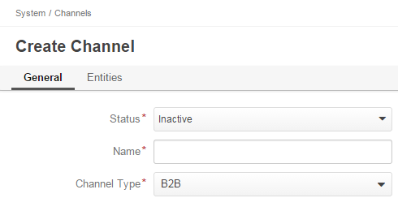

Channels Management
===================

:term:`Channels <Channel>` in :term:`OroCRM` represent sources of customers and customer data.

This guide describes how to create and manage channels from the UI.

.. _user-guide-channel-guide-create:

Creating a Channel
------------------

1. Go to the *System --> Channels* page and click the :guilabel:`Create Channel` button in the top right corner to go
   to the *Create Channel* page.

2. Define the :ref:`general details <user-guide-channel-guide-general>` of the channel.

3. Define the :ref:`entity <user-guide-channel-guide-entities>` details that will be received from the channel's
   source.

4. Once you have finished adding the entities, click the button in the top right corner to save it.

.. _user-guide-channel-guide-general:

General Details
^^^^^^^^^^^^^^^

Define basic channel information in the *General* section.

The following three fields are mandatory and **must** be defined:

.. csv-table::
  :header: "**Name**","**Description**"
  :widths: 10, 30

  "**Status**","Current status of the channel.

  *Inactive* or *Active*

  Be aware that when working with inactive channels, no new data is uploaded to the system. This option is useful
  if a channel is being configured for future use or if it is out of date."
  "**Name**", "The name that will be used to refer to the channel in the system. It is recommended to keep the name
  meaningful."
  "**Channel Type**", "A drop-down which allows you to choose the channel type which is the most suitable for the
  channel created.

  Channel types define a specific set of rules and settings that apply to the channel.

  Extending OroCRM with new channel types for specific needs is a proven practice, and the following channel types are
  available out of the box in the current version of the platform:

  - *B2B*: dedicated for managing B2B customer relations

  - *Magento*: designed for :term:`Magento` stores

  - *Custom*: any other channels, subject to specific business needs"

.. caution::

    Once you have selected *Magento* as a channel type, a new mandatory **Integration*** field will appear.
    Please see the :ref:`Magento Channel Integration <user-guide-magento-channel-integration>` guide  for
    more information.

.. _user-guide-channel-guide-entities:

Entities
^^^^^^^^

:term:`Entities <Entity>` assigned to a channel define what data OroCRM can collect from the relevant source.

To make a certain type of records available from the channel, use the "Entities" section.

.. image:: ./img/channel_guide/channels_entities.png

One of the entities defined for a channel must represent a :term:`customer <Customer>` identity and will be added to
the entity list automatically. It is subject to the chosen channel type:

- B2B Channel - B2B Customer
- Magento Channel - Web Customer
- Custom Channel - Customer Identity

Some other entities are pre-defined in the system and are designed for a specific channel type, e.g. an opportunity
and lead for a B2B channel or a cart and order for a Magento channel. These entities will be added to the entity list by
default once you have selected the channel type; however, they are optional and may be removed.

**Custom Entities** are created for specific customer needs and their records may contain certain
information which is required by the system. For more information on custom entities, please
see the *Entity Management* guide. Once a custom entity has been created, it will automatically appear in the
Entities section drop-down menu.

To add an entity to the channel list, choose the entity and click the :guilabel:`Add` button.

.. image:: ./img/channel_guide/channels_entity_select.png

To delete an entity, click the |IcDelete| icon. This will remove the entity from the channel's list, but not from
from the system.

.. _user-guide-channel-guide-actions:

Channel Actions
----------------

The following actions can be performed on channels:

From the :ref:`grid <user-guide-ui-components-grids>`

.. image:: ./img/channel_guide/channels_edit.png

- Delete the channel: |IcDelete|

.. caution::

    Once a channel has been deleted, all of the data related to it will be deleted as well.

- Get to the :ref:`Edit from <user-guide-ui-components-create-pages>` of the channel: |IcEdit|

.. caution::

    You cannot edit the channel type if data from the channel has been already been uploaded into the system.

- Get to the :ref:`View page <user-guide-ui-components-view-pages>` of the channel:  |IcView|

From the :ref:`View page <user-guide-ui-components-view-pages>`:

.. image:: ./img/channel_guide/channels_created_b2b_view.png

- Deactivate or activate channels.  No new data from the channel will be uploaded for
  an inactive channel.

- Get to the :ref:`Edit from <user-guide-ui-components-create-pages>` of the channel

- Delete the channel

Editing Entities from a Channel
^^^^^^^^^^^^^^^^^^^^^^^^^^^^^^^

There may be some situations when there are either not enough default entity fields or too many of them. If this is the
case, entities maybe edited (i.e. the list of fields as well as their type and specific properties may be re-defined).
This can be only be done by properly authorized users. Go to the *"Entities"* section of the channel view page.
In the *"Actions"* column, click |IcView| to see the entity details or |IcEdit| to change the entity settings.
Please refer to the *"Entity Management"* guide for more information.

.. image:: ./img/channel_guide/channels_created_b2b_view_edit_entity.png

.. note::

   Note that you will receive an error message if you do not have the necessary permissions to edit entities.

.. |IcDelete| image:: ./img/buttons/IcDelete.png
   :align: middle

.. |IcEdit| image:: ./img/buttons/IcEdit.png
   :align: middle

.. |IcView| image:: ./img/buttons/IcView.png
   :align: middle

.. |WT02| replace:: Shopping Cart
.. _WT02: http://www.magentocommerce.com/magento-connect/customer-experience/shopping-cart.html
