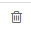

.. _user-guide-channel-guide

Introduction
-------------

So, here we have them, *John&Sons* three brothers running toy business that their father started year back. Today they 
own a big factory with several outlets in California, a shop in LA, own on-line store and two store at Magento 
(*John&Sons* and *John&Sons LA*). Being socially-responsible people, they also have a *John&Sons* charity-fund to help 
children in need.
Their first big aim the OroCRM will help reaching is to monitor information on customers of different shops and on 
participants of the charity project and make sure any brother can see activity of a specific person, family or company 
across them. 
To do so, they will use OroCRM's :ref:`Multichannel functionality <user-guide-channel-guide>` with which one can create 
a separate Channel for each of the customer sources (whether your "customers" are visitors of a shop in LA, 
big businesses that want to make a contract with you, on-line shop clients or community members who have taken part in 
the charity project) and than aggregate information of a chosen set of customers (regardless the channel) into one 
record in the system (called *Account*).

.. _user-guide-channels

Channels
----------

The first step in the story is to create a Channel for each of the brothers' aims, i.e. for:

- California network
- Shop in LA
- Own Web-store (JohnSonsToys.com)
- Charity project
- Magento store *John&Sons* 
- Magento store  *John&Sons LA*

Let's follow them and see how a Channel is created.

.. _user-guide-channel-guide-create:

Creating a Channel
------------------

A Channel can be created with several simple steps:

1. Go to :ref:`*Create Channel*<user-guide-channel-guide-go-to-channels>` page

2. Define :ref:`General Details <user-guide-channel-guide-general>` of the Channel instance

3. :ref:`Fill <user-guide-channel-guide-entities>` the Channel with Entities    

4. :ref:`Save <user-guide-channel-guide-save>` the Channel in the system

1. Go to Create Channel
^^^^^^^^^^^^^^^^^^^^^^^

Enter the system and go to *System --> Channels*

*System / Channels* page will appear.

Click :guilabel:`Create Channel` button in the top right corner to get to the *Create Channel* page.

image:: ./img/channel_guide/channels_create_empty.png

.. hint::
   
   If you cannot see or manage any of the menus, pages, forms and/or tabs described hereunder, please check your role 
   permissions or address your system administrator.

.. _user-guide-channel-guide-general:

2. Define General Details
^^^^^^^^^^^^^^^^^^^^^^^^^

In the *General* tab define basic Channel information.

The three fields are mandatory and **must** be defined:

.. csv-table:: **Mandatory Channel Properties**
  :header: "**Name**", "**Description**"
  :widths: 10, 30

  "**Status**","Current status of the Channel instance. The following two values are possible:
  - *Inactive*: (default); no data will be loaded from the Channel; the option is useful if a Channel is being 
  configured for future use or is out of date. (For inactive channels no new data is uploaded to the system, but all 
  the data loaded while the Channel was active is considered by the reports.

  - *Active*: data will be loaded from the Channel, can be viewed in the system and is considered by the reports.

  By default the filed value is set to *Inactive*"
   
  "**Name**", "Name that will be used to refer to the Channel in the system. It is recommended to keep the name 
  meaningful." 
   
  "**Channel Type**", "A drop-down, where you can choose a Channel Type more suitable for the Channel instance 
  created. The following types are available:
   
  - *B2B*: the type dedicated for managing mostly off-line B2B and B2C customer relations
   
  - *Web*: the type sharpened for :term:`Magento` shops
   
  - *Custom*: any other channels, subject to specific business needs and goals"   
   
.. hint::
 
    If there is a need to create numerous channels with the same set of rules and settings (e.g. many different social 
    organizations, or several on-line shops at a platform other then Magento, or anything else of the kind, it is 
    possible to have OroCRM customized and to add new Channel Types into the system, such that certain settings will be 
    predefined for all the Channel instanced of the Type.
   
   
*Define General Details. Example.*
^^^^^^^^^^^^^^^^^^^^^^^^^^^^^^^^^^
We need the following channels:

- For the California network:

  - Name: California Network
  - Channel Type: B2B

- For the shop in LA:

  - Name: LA Shop
  - Channel Type: B2B
  
- For JohnSonsToys.com

  - Name: JohnSonsToys.com
  - Channel Type: Custom (this is not a Magento shop, nor an off-line outlet, so there are no dedicated Channel Types 
    for it in OroCRM 

- Charity project

  - Name: Charity Fund
  - Channel Type: Custom (same as above)

- Magento store *John&Sons* 

  - Name: John&Sons
  - Channel Type: Magento

- Magento store  *John&Sons LA*

  - Name: John&Sons LA
  - Channel Type: Magento

To create every of these Channels we have to got to the System/Channels page, clicked :guilabel:`Create Channel` button 
in the top right corner, filled the details and clicked :guilabel:`Save and Close` button.

*Are you sure you want to change channel type?* message can appear when you change the channel type. This is just to 
make sure that you are aware of the change. Click *Yes* to change the proceed.

No Magento Channel can be saved without integration settings defined. Please see :ref:`Define Integration Details for a 
Magento Channel <_user-guide-channel-guide-define-integration-details-for-a-magento-channel:>` section for the details.

This is the list we have received when all the channels were saved:

image:: ./img/channel_guide/channels_create_list.png

   
3. Fill the Channel with Entities
^^^^^^^^^^^^^^^^^^^^^^^^^^^^^^^^^

Basically, *Entity* is a grouping of things with common rules and/or data. Rules and/or settings defined for an
Entity will be applied to all of its instances. Entities present in the system by default are System Entities. Entities
added to the system by the user are Custom Entities.

*Channel Entities* define types of instances that can be collected and processed in the System for each Channel they 
have been assigned to. In other words, *if you have created Channel A, Channel B and Channel C and assigned the an 
Entity E, every time someone creates an instance of the Entity E in the system, one of the Channel A, B, C has to be 
chosen for the instance.* 
  
You can assigned an Entity to a Channel instance from the "Entities" tab that you will see when 
:ref:`Creating <user-guide-channel-guide-create>` or :ref:`Editing <user-guide-channel-guide-edit>` a Channel.

image:: ./img/channel_guide/channels_entity_select.png

Channel instances are by default assigned the Entities specially created in OroCRM and meeting the type targets. At the
same time any channel can be assigned other entities, including :ref:`Custom entities <entity-management-create>` 
created by the user or added in the course of customization subject to specific customer's needs.

These way, we can separate all the entities into three types:

- System entities meaningful for a specific Channel Type

- System entities that can be assigned to any Channel Type

- Custom Entities

.. sidebar:: Contact and Account

  For understanding of the further article it is important to explain the meaning of Contact and Account instances in 
  more details.
  
  *Contact* is such an entity that its instances can contain a set of contact details, including full name, billing and 
  shipping address and even a hierarchy in the company (if applicable)
  
  *Account* is such an entity that its instances can contain information on any amount of Customer entities from 
  different Channels.

Let's consider each of them:

.. csv-table:: **System entities meaningful for B2B Channels**
  :header: "**Name**", "**Description**"
  :widths: 10, 30

  "**B2B Customer**","Represents a person, a group of persons or business you are in a sales process with. 
  
  - Contains information on the sales-related activities, lifetime sales values of the specific customer, etc.
    
  - Each B2B Customer instance must be assigned to an only instance of a Channel of a B2B Type
  
  - Each B2B Customer instance must be assigned to an only Account instance
  
  - Each B2B Customer instance can be assigned to an only Contact instance"
  
  "**Opportunity**","Represents potential sales most likely to become a success.

  - Contains such fields as Opportunity opening and closure dates, closure reasons probability of the Opportunity 
    gain, customer needs and described solution descriptions, etc. 
  
  - Each Opportunity instance must be assigned to an only instance of a Channel of a B2B Type
  
  - Each Opportunity instance must be assigned to an only instance of a B2B Customer
  
  - Each Opportunity instance can be assigned to an only Contact instance
  
  - More information about Opportunities and their pre-implemented usage in the system is provided in the 
    :ref:`*Opportunities Management Guide* <user-guide-system-entities-opportunities>`."
   
  "**Lead**","Represents potential Opportunity.
  
  - Contains related personal and business details and reference Opportunity (if any). 
  
  - Each Lead instance must be assigned to an only instance of a Channel of a B2B Type
  
  - Each Lead instance can be assigned to an only instance of a B2B Customer
  
  - Each Opportunity instance can be assigned to an only Contact instance
  
  - More information about Leads and their usage pre-implemented in the System is provided in the :ref:`*Leads 
    Management Guide" <user-guide-system-entities-leads>`."

  "**Sales Process**","Represents a sales workflow instance. 
   
  - Used to keep and process data on the Sales Process flow from a Lead to a Closed Opportunity, subject to a 
    workflow predefined in the System.           
  
  - Each Sales Process instance must be assigned to an only instance of a Channel of a B2B Type
  
  - Each Sales Process instance must be assigned to an only instance of Lead or Opportunity 

  - More information about Sales Process Workflow and its usage pre-implemented in the System is provided in the 
    :ref:`*Workflow Management Guide* <user-guide-workflow-management>`."
    
    
.. csv-table::**System entities meaningful for Magento Channels**
  :header: "**Name**", "**Description**"
  :widths: 10, 30
  
  "**Web Customer**","Represents on Magento user who has performed the sales. 
  
  - Contains relevant personal data and payment details, sales values and communications
  
  "**Cart"","Represent one |WT02|_ in Magento"

  "**Order**","Keeps details of actual sales made by the customer within the Channel, including store details, 
  Customer's details, one-time and total credited, paid and taxed amounts, feed-backs, etc."

 
Information about System entities meaningful for Magento Channels is uploaded into the OroCRM during synchronization.
For more details please refer to the :ref:`*Magento Entities Management Guide* <user-guide-magento-entities>`."

Currently there is one **System entity meaningful for any Channels** prior to any customization, it is:

.. csv-table::
  :header: "**Name**", "**Description**"
  :widths: 10, 30
  
  "**Contact Request**","Keeps information on each case of a contact attempt, its success or failure and target."

Currently there is one **System entity default for Custom Channels**, it is:

.. csv-table::
  :header: "**Name**", "**Description**"
  :widths: 10, 30
  
  "**Customer Identity**","Represent one customer within the Channel. Each Customer Identity instance shall be assigned 
  to an only Custom Type Channel and an only Account instance."
  
As it has been mentioned before,**Custom Entities** are created for specific Customer needs and their instances can 
contain any required details to be filled and processed by the System. For more details on Customer entities please 
kindly see the :ref:`Entity Management Guide <user-guide-entity-management-guide`>. 
Once a Custom entity has been created in the System, it will automatically appear in the drop-down menu in the Entities 
tab/section below the System Entities. Use the scroll bar to get to them.

If you have chosen a Custom Channel type, . For B2B and Magento Channel their 
specific values will be already in the list. Both System and Custom Entities can be added to the same list.
Choose an Entity and click :guilabel:`Add` button. The entity will be Added to the list. You can also delete entities 
from the list. Click |IcDelete| to do so. This will remove the Entity from this Channel's list (not from the System).

3. Fill the Channel with Entities. Example
^^^^^^^^^^^^^^^^^^^^^^^^^^^^^^^^^^^^^^^^^^

For our Magento and B2B Type Channels the entities added by default are almost enough. We will aslo add Contact Request 
entity to each of them. Now we can track all the required information.

For our Custom Type Channels, we have :ref:`created some Custom properties <user-guide-entity-management-guide>`. 
These are:

- For JohnSonsToys.com Channel:

  - JohnSonsToys Cart : its instances represent carts of the shop and will contain details of the items therein and 
    relevant Web users represented with Customer Identity instances assigned to the Channel
   
  - JohnSonsToys Order : its instances represent orders made and contain details of the orders and information about the 
    relevant Web users

- For Charity Fund Channel

  - Charity Event : its instances represent a specific event the person or company represented with a Customer Identity 
    instance assigned to the Channel has taken part in

  - Help : its instances represent the types of help provided by the person or company. Each instance of the Help entity
    is assigned to a specific instance of the Charity Event entity  

.. _user-guide-channel-guide-save:

4. Save the Channel in the System
^^^^^^^^^^^^^^^^^^^^^^^^^^^^^^^^^

Once you have finished adding the entities, click :guilabel:`Save and Close` button in the top right corner. Success 
message will appear and your Channel will be saved in the system.

Using Channels
--------------

.. _user-guide-channel-guide-edit:

Editing/Deleting a Channel
^^^^^^^^^^^^^^^^^^^^^^^^^^

Once a Channel has been created it will appear in the Channel list. Now you can Edit your Channel details. 
Click the Channel name in the list. The Channel details list will appear. In the top right corner you will see possible 
action buttons:

* :guilabel:`Deactivate` button (for Active channels) or :guilabel:`Activate` button (for Inactive channels).

  * You can deactivate an Active channel. Once the channel has been deactivated, no new data from the Channel will be 
    uploaded to the system. All the data loaded while the Channel was active is considered by the Sales Processes 
    functionality.
  
  * You can activate an Inactive channel. It will become Active and data from the Channel will be uploaded to the system.
  
* :guilabel:`Edit` button will open Edit page that is very similar to the page you used to Create a Channel (See 
  :ref:`Create a Channel <user-guide-channel-guide-creating-a-channel>` section), but details you have already  defined 
  will be displayed
  
* :guilabel:`Delete` button will delete the Channel. 

.. caution:: 

    You cannot change Channel Type if data from the Channel has been uploaded into the system at least once. 
    
    Please also keep in mind that **once a Channel has been deleted all the relevant data will be deleted.**

    
Editing Entities from a Channel
^^^^^^^^^^^^^^^^^^^^^^^^^^^^^^^

There are sometimes situations when default Entity fields are not enough or excessive. If this is so, Entities may 
be edited (list of fields, their type and specific properties may be redefined). This can be done only by duly 
authorized Users. When you open a specific Channel instance page, there will be two icons in the Action tab. Click 
|IcView| to see the Entity details. Click |IcEdit| icon to change the Entity. 
Please refer to the `Entity Management Guide <user-guide-entity-management-guide>` for more details. 

.. note:: 

    If you don't have necessary permissions, you will see a browser-specific message on access denial. 

*Some Additional Information for Magento Type Channels*
-------------------------------------------------------

.. _user-guide-channel-guide-define-integration-details-for-a-magento-channel:

Define Integration Details for a Magento Channel
^^^^^^^^^^^^^^^^^^^^^^^^^^^^^^^^^^^^^^^^^^^^^^^^

Once you have chosen a Channel Type = *Magento*, a new mandatory field **Integration*** will appear. Click 
*Configure integration* link to get to the form.

The following fields should be specified:

.. list-table:: **System Channel Entities**
   :widths: 10 30
   :header-rows: 1

   * - Field
     - Description
     
   * - **Name***
     - Configuration name. Mandatory field. Will be used to refer to the configuration within the system (edit, assign,
       etc.)
 
   * - **SOAP WSDL URL***
     - Mandatory field. An http URL string to the WSDL of the SOAP-based service.
     
   * - **SOAP API Key***
   
       **SOAP API User***
       
     - Mandatory fields. SOAP API credentials. 
     
   * - **WS-I Compliance**
     - Optional flag. Defines whether the configuration meets the requirements of Web Services Interoperability 
       Organization guidelines.
   
   * - **Sync start date**
     - Mandatory field The date to start the synchronization with; data uploaded into the Magento account since the 
       date, will be added to OroCRM and can be processed therein.

.. hint::  Please address you Magento administrator for the information on SOAP settings details. 

At this point you can click :guilabel:`Check Connection` button, to check if the settings you have defined above are 
correct.
Once the connection details have been verified, the next fields will be filled with default settings.

.. list-table:: **System Channel Entities (continued)**
   :widths: 12 30
   :header-rows: 1

   * - Field
     - Description
     
   * - **Website***
     - Mandatory field. The list of all the Websites available for the shop. *All Websites* option is chosen by default.
       You can edit the field value and choose one of the Websites available.
       Click "Sync website list" link if the list of Websites is outdated.
       
   * - **Admin url**
     - Optional field. An http link to the Administrator panel of the specified Magento store.
     
   * - **Default owner***
     - Mandatory field. Specifies Users that can manage the configuration.
    
Synchronizing a Magento Channel Data
^^^^^^^^^^^^^^^^^^^^^^^^^^^^^^^^^^^^

As a matter of case, OroCRM can be integrated with different third-party systems and integration can be defined for 
different Channel Types in the course of customization. However, OroCRM provides embedded integration capabilities for 
Magento Channels.

Once you have created a Magento type channel and 
:ref:`defined <user-guide-channel-guide-define-integration-details-for-a-magento-channel>`, its integration details
information from Magento will be uploaded into OroCRM automatically subject to a predefined schedule. 
You can enable two-way synchronization settings and manually start synchronization.

*Two Way Synchronization*
^^^^^^^^^^^^^^^^^^^^^^^^^

In order to enable two-way synchronization:

- Go to *System --> Channels* and click in the row of the grid that contains your Magento Channel

- Click on its Integration link

- Go to *Synchronization Settings* tab of the emerged page

- Check *Enable Two Way Sync* box

- Define the priority in case of conflicts between the data (e.g. the same customer was edited from OroCRM and from 
  Magento:
   
  - Remote wins: Magento settings will be saved in Magento and loaded to OroCRM
  
  - Local wins: OroCRM settings will be saved in OroCRM and loaded to Magento  

Start Synchronization Manually
""""""""""""""""""""""""""""""

In order to start the synchronization manually:

- Go to *System --> Channels* and click in the row of the grid that contains your Magento Channel

- Click on its Integration link

- Click :guilabel:`Schedule Sync` button. *A sync job has been added to the queue. Check progress.* note will appear. 

- The data is being synchronized. You can click *Check progress* link to see the synchronization status.

Happy End
---------

What have our brother got as a result?

Now there is a Channel created for each of their shops and also a Channel for the Charity activity and they can view and 
monitor activity of their accounts across all of these channels. Let's consider an example:

There is a toy store chain, to which *John&Sons* in California sell toys in bulk. Let it be called *Fun4Kids*.
All the actual, past and potential sales activities of *Fun4Kids* are registered and saved for a B2B Customer named 
*Fun4Kids*. It is assigned a Contact (the chain Director Mr. Steph Smith) and an Account (Fun4Kids).

Mr. Smith's employees sometimes go shopping to the John&Sons Magento stores. There is a dedicated Web Customer instance 
created for each of them, assigned a separate contact, though all of them are assigned to the *Fun4Kids* Account.

Moreover, Mr. Smith and his company regularly take part in the Charity events. So there are dedicated Customer Identity
instances assigned to the Charity Fund Channel: Steph Smith (when private funds are used), Fun4Kids (when company 
resources are attracted). The both Customer Identity instances are assigned to the same Fun4Kids Account.

Now, on one hand, the brothers can view information for all the customer instances in the account and figure out if 
any additional actions shall be taken, e.g. to motivate the company for more active participation in the charity or 
to show appreciation for the participation. Moreover, now when the brothers will get a request for proposal from any of 
the Fun4Kids offices, that can create a Lead and either assign it to a customer instance already present in the system
or create a new customer instance and assign it to the Fun4Kids account.

In other words, they get a 360 degrees dynamically updated aggregated profile of activities and interactions with a 
specific business, person or group of people that can be drilled down and used to generate reports.
 

 

.. |IcEdit| image:: ./img/channel_guide/Buttons/IcEdit.png
   :align: middle

.. |IcView| image:: ./img/channel_guide/Buttons/IcView.png
   :align: middle

.. |WT02| replace:: Shopping Cart
.. _WT02: http://www.magentocommerce.com/magento-connect/customer-experience/shopping-cart.html
