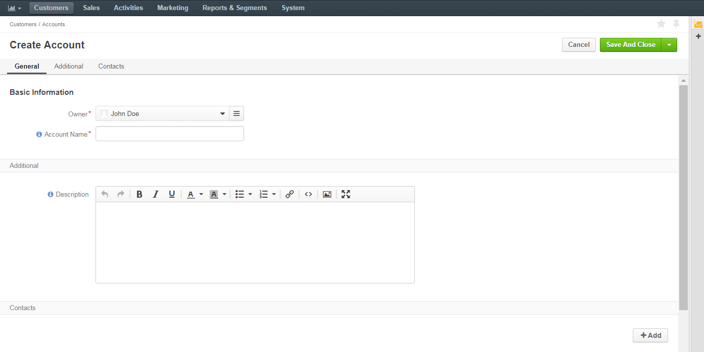
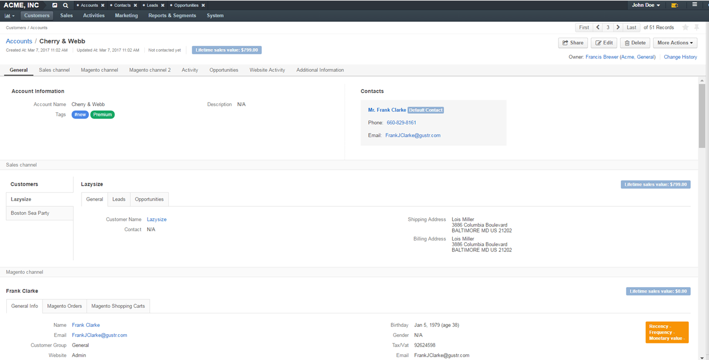
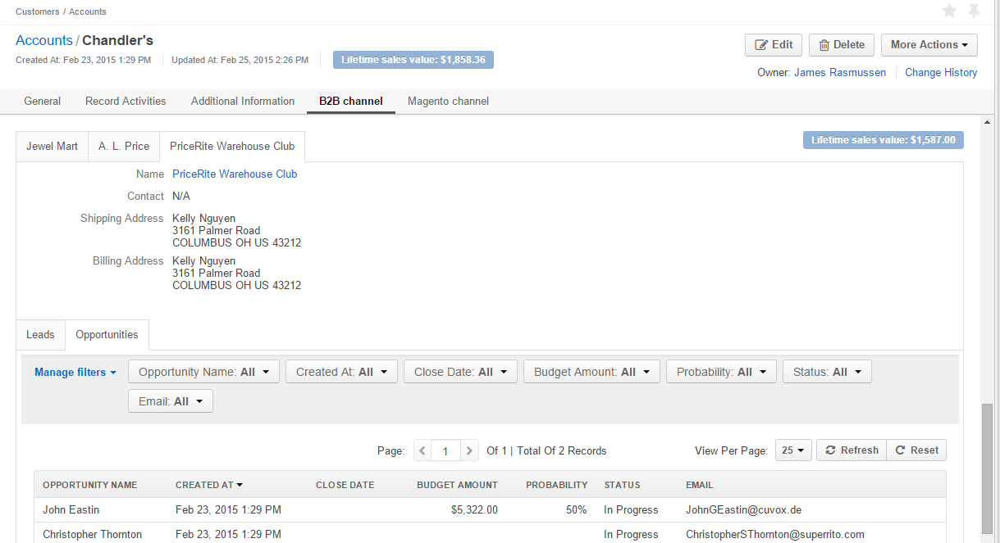
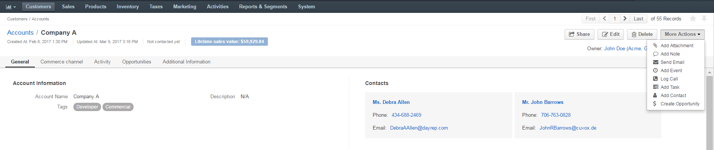
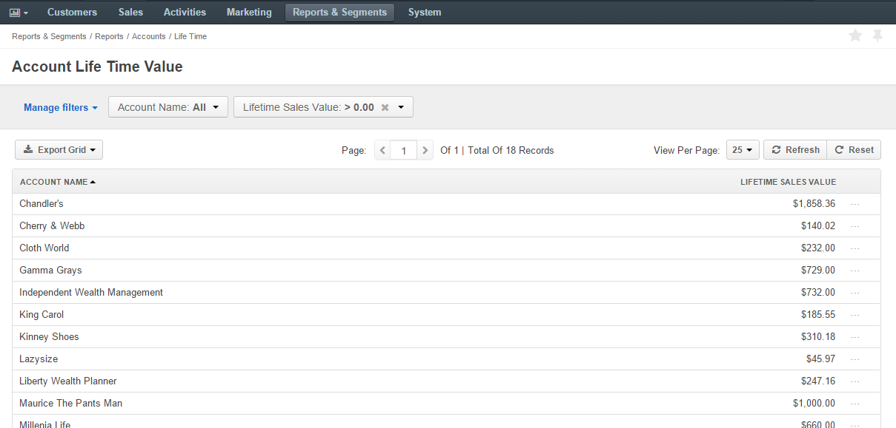
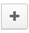
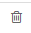

.. _user-guide-accounts:

Accounts
========

To collect and process information on the customer activity of a person, group of people or business cooperating with 
you, you can create an *"Account"* record ("account") that will represent them in OroCRM.
An account can aggregate details of all the :term:`customer identities <Customer Identity>` assigned to it, providing 
a 360-degree view of the customer. 

.. _user-guide-accounts-create:

Create Account Records
----------------------

- Go to the *Customers → Accounts*

- Click :guilabel:`Create Account` button

- The *Create Account* :ref:`form <user-guide-ui-components-create-pages>` will appear:

The following fields are mandatory and **must** be defined:

.. csv-table::
  :header: "Field", "Description"
  :widths: 10, 30

  "**Owner***","Limits the list of users that can manage the account to users,  whose 
  :ref:`roles <user-guide-user-management-permissions>` allow managing 
  accounts assigned to the owner (e.g. the owner, members of the same business unit, system administrator, etc.).
  
  By default, the user creating the account is chosen."
  "**Account Name***","The name used to refer to the account in the system."

The rest of the fields are optional. They keep additional details about the account (such as its :term:`tags <Tag>`
and related :term:`contacts <Contact>`) and may be left empty.

- In order to add a contact, click the :guilabel:`+Add` button in the *Contacts* section. 

If you need to record and process any other details of accounts, 
:ref:`custom fields <user-guide-field-management-create>` can be created. Their values will 
be displayed in the *Additional* section.
  
Once all the necessary information has been defined, click the button in the right top corner of the page to save the 
account in the system.

.. hint::

    You can also export and import accounts with :guilabel:`Export` and :guilabel:`Import` buttons as described in 
    the :ref:`Export and Import Functionality <user-guide-import>` guide. 

Manage Account Records
----------------------

Accounts View Page
^^^^^^^^^^^^^^^^^^

The :ref:`View page <user-guide-ui-components-view-pages>` consists of several sections, namely:

- **Page Header**: date of the account creation and its latest update, as well as its 
  :term:`lifetime sales value <Lifetime Sales Value>`.

- **General**: general details of the account, such as its name, tags, description and all the contacts assigned to the
  account. 

  |
  

|

- **Record Activities**: activities (calls, emails and tasks assigned to the account)

  |
  
.. image:: ./img/accounts/accounts_view_activities.png

.. note::
    
    If an activity-related action was performed for a customer or a contact assigned to the account, they will not be 
    displayed. Only the activities performed directly for the account are available in the section.

- **Additional Information**: details of any :term:`custom fields <Custom Field>` defined for the account.

- **Sections with channel names**: each section contains details of all the customers that are assigned to this 
  account and belong to the specified channel, as described in the 
  :ref:`multichannel functionality description <user-guide-multi-channel-overview>`. 
  
  Records of other entities assigned to this channel with regard to a specific customer are represented as subsections.
  
  In the example below you can see a section of a channel named "B2B Channel":
  
  - There are three B2B Customers: Jewel Mart, A. L. Price, and PriceRite Warehouse Club.

  - Once one of the customers is chosen, you can see its general details and information on related Leads/Opportunities:
 

.. note::

    Number and names of such sections depends only on the number and names of OroCRM channels and customer records 
    assigned to the account.

.. _user-guide-accounts-actions:

Account Actions from the View Page
""""""""""""""""""""""""""""""""""

      |

The following actions can be performed for the accounts from the :ref:`View page <user-guide-ui-components-view-pages>`:
  
- Get to the *"Edit"* form of the account

- Delete the account from the system 

- Export and import accounts with :guilabel:`Export` and :guilabel:`Import` buttons as described in 
  the :ref:`Export and Import Functionality <user-guide-import>` guide. 

- The rest of the actions available depend on the system settings defined in the
  :ref:`Communication & Collaboration settings <user-guide-entity-management-create-commun-collab>` of the 
  *"Accounts"* entity.

Account Actions from the Grid 
^^^^^^^^^^^^^^^^^^^^^^^^^^^^^

From the :ref:`grid <user-guide-ui-components-grids>` you can:

      |

.. image:: ./img/accounts/accounts_grid.png

|

- Delete the account from the system : |IcDelete|
  
- Get to the :ref:`Edit form <user-guide-ui-components-create-pages>` of the account : |IcEdit|
  
- Get to the :ref:`View page <user-guide-ui-components-view-pages>` of the account : |IcView| 

- Merge Accounts

.. _user-guide-accounts-merge:

Merging Accounts
""""""""""""""""

Once the accounts have been added to the system you can :ref:`merge <user-guide-accounts-merge>` them, to get a full
view of customer activities, regardless of the :term:`channels <Channel>`. This can be useful if, for example, it has 
appeared that several accounts have been created for the different representatives of the same client, or that your 
business-to-business partner is co-operating with you from a new channel (e.g. started buying from your Magento store).

In order to merge accounts:

- Go to the accounts grid

- Check the accounts that you want to merge

- Choose :ref:`bulk action <user-guide-ui-components-grid-edit>` *Merge Accounts*.

*For the sake of example, we are merging three accounts "Acuserv", "Big Bear Stores" and "Casa Bonita"*

.. image:: ./img/accounts/accounts_merge_01.png

|

Once you've clicked the :guilabel:`Merge Accounts` button, a table with the merge-settings will appear.

      |

.. image:: ./img/accounts/accounts_merge_02.png

- Choose the name of one of the accounts being merged, that will be given to your new account ("Master Record").

- Choose if the contacts shall be replaced with the contacts of one account (and which), or if all the contacts shall be
  appended.

- Choose the default contact of the accounts being merged, that will be given to the Master Record.

- Choose the description of the accounts being merged, that will be given to the Master Record.

- Choose the owner of the accounts being merged, that will be given to the Master Record.

- Choose if the tags shall be replaced with the contacts of one account (and which), or if all the tags shall be 
  appended.

- Click the :guilabel:`Merge` button.
  
A Master Record with merged data of several accounts will be created. The rest of the account details, including details 
of the customer identities will be appended.

      
.. _user-guide-accounts-reports:

Reports with Account Records
----------------------------

OroCRM currently comes with two ready-to-use reports on accounts:

- Accounts Life Time Value 

- Accounts by Opportunities

 
Accounts Life Time Value 
^^^^^^^^^^^^^^^^^^^^^^^^

This is a simple but useful report, with which you can see the total amount of money received from all the customers 
assigned to the account. 

In order to see the report go to *Reports and Segments → Reports → Accounts → Life Time*.

It shows:

- the account name 

- total lifetime sales value registered in OroCRM

Accounts by Opportunities
^^^^^^^^^^^^^^^^^^^^^^^^^

With this report you can see number of won, lost and pending opportunities for all the customers assigned to the 
account. 

In order to see the report go to *Reports and Segments → Reports → Accounts → By Opportunities*.

It shows:

- the account name 

- the number of won opportunities for all the customers assigned to the account

- the number of lost opportunities for all the customers assigned to the account

- the number of pending opportunities for all the customers assigned to the account

- total number of opportunities for all the customers assigned to the account

- total number of opportunities of a kind, regardless of their account.

  |
  
.. image:: ./img/accounts/accounts_report_by_opportunity.png 

.. hint::

    New custom reports can be added, that can use details of the accounts as well as of any records related to the 
    accounts. For more details on the ways to create and customize the reports,  please see the 
    :ref:`Reports guide <user-guide-reports>`.

.. |BCrLOwnerClear| image:: ./img/buttons/BCrLOwnerClear.png
   :align: middle

.. |Bdropdown| image:: ./img/buttons/Bdropdown.png
   :align: middle

.. |IcEdit| image:: ./img/buttons/IcEdit.png
   :align: middle

