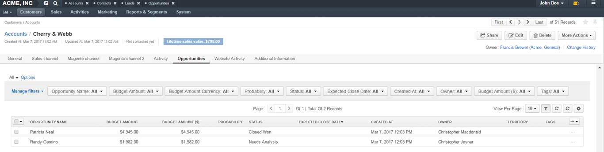

.. _user-guide-accounts:

Accounts
========

.. contents:: :local:
   :depth: 2

To collect and process information on the customer activity of a person, group of people or business cooperating with
you, you can create an **Account** record that will represent them in OroCRM.

An account can aggregate details of all the :term:`customer identities <Customer Identity>` assigned to it, providing
a 360-degree view of the customer.

.. _user-guide-accounts-create:

Create Account Records
----------------------

- Navigate to **Customers>Accounts**.

- Click :guilabel:`Create Account`.

- The **Create Account** :ref:`form <user-guide-ui-components-create-pages>` will appear:

|

.. image:: ../img/accounts/accounts_create.png

|

The following fields are mandatory and **must** be defined:

.. csv-table::
  :header: "Field", "Description"
  :widths: 10, 30

  "**Owner**","Limits the list of users that can manage the account to users,  whose
  :ref:`roles <user-guide-user-management-permissions>` allow managing
  accounts assigned to the owner (e.g. the owner, members of the same business unit, system administrator, etc.).

  By default, the user creating the account is chosen."
  "**Account Name**","The name used to refer to the account in the system."
  "**Description**","Details or a short description of an account record."

- To add a contact, click the :guilabel:`+Add` in the **Contacts** section.

If you need to record and process any other details of accounts, contact your administrator or see the
:ref:`custom fields <doc-entity-fields-create>` section for more information. Their values will
be displayed in the **Additional** section.

Once all the necessary information has been defined, click the button in the right top corner of the page to save the
account in the system.

.. hint::

    You can also export and import accounts with :guilabel:`Export` and :guilabel:`Import` buttons as described in
    the :ref:`Export and Import Functionality <user-guide-import>` guide.

Manage Account Records
----------------------

Accounts View Page
^^^^^^^^^^^^^^^^^^

The :ref:`view page <user-guide-ui-components-view-pages>` consists of several sections, namely:

- **Page Header**: date of the account creation and its latest update, as well as its
  :term:`lifetime sales value <Lifetime Sales Value>`.

- **General**: general details of the account, such as its name, tags, description and all the contacts assigned to the
  account.

  |

.. image:: ../img/accounts/accounts_view_general.png

|

- **Activity**: activities such as calls, emails and tasks assigned to the account.

  |

.. image:: ../img/accounts/accounts_view_activities.png

.. note::

    If an activity-related action was performed for a customer or a contact assigned to the account, they will not be
    displayed. Only the activities performed directly for the account are available in the section.

- **Opportunities**: a list of opportunities related to an account.

|

|

- **Additional Information**: details of any :term:`custom fields <Custom Field>` defined for the account.
- **Website Activity**: customer activities displayed in Summary and Events tabs.

  |

  .. image:: ../img/accounts/accounts_view_website_activity_1.png

  |

  |

  .. image:: ../img/accounts/accounts_view_website_activity_2.png

  |

- **Sections with channel names**: each section contains details of all the customers that are assigned to this
  account and belong to a specified channel, as described in the
  :ref:`multichannel functionality description <user-guide-multi-channel-overview>`.

    .. note:: The number and names of such sections depend on the number and names of OroCRM channels and customer records assigned to the account. The type of channels can vary   depending on your configurations and integrations (e.g. Sales, Magento, Commerce).

    |

    .. image:: ../img/accounts/accounts_view_channels.png

    |

   Records of other entities assigned to channels with regard to a specific customer are represented as subsections.

   For instance, within the **Sales Channel** tab you will be able to see:

    - The Business Customer(s) related to the selected account.
    - Once one of the customers is selected, you can see their general details and information on related Leads/Opportunities.

    .. note:: In new installations of OroCRM (2.0 and higher) the functions of a Sales channel are reduced to enabling Business Customers and controlling their grouping at the Account view. It is, therefore, no longer essential to create a Sales channel to enable leads and opportunities - these are enabled as features.

    |

    .. image:: ../img/accounts/accounts_view_channels_2.png

    |

   Within a **Magento Channel**:

    - There are three tabs with Magento customer-related information: General Info, Magento Orders, Magento Shopping Carts.

    |

    .. image:: ../img/accounts/magento_channel.png

    |

   Within a **Commerce Channel**:

    - The are seven tabs with :ref:`Commerce <user-guide-commerce-integration>` customer-related information: General, Customers Users, Shopping Lists, Requests For Quote, Quotes, Orders and Opportunities.

    |

    .. image:: ../img/accounts/commerce_channel_2.png

    |

.. _user-guide-accounts-actions:

Account Actions from the View Page
~~~~~~~~~~~~~~~~~~~~~~~~~~~~~~~~~~

The following actions can be performed for the accounts from the :ref:`View page <user-guide-ui-components-view-pages>`:

- Share the account. Clicking :guilabel:`Share` will prompt a sharing settings pop up window to open.

|

  .. image:: ../img/accounts/accounts_view_actions_share.png

|

- Get to the **Edit** form of the account.

- Delete the account from the system.

- Perform a number of actions under **More Actions** menu:

 - :ref:`Add Attachment <user-guide-activities-attachments>`
 - :ref:`Add Note <user-guide-add-note>`
 - :ref:`Send Email <user-guide-using-emails>`
 - :ref:`Add Event <doc-activities-events>`
 - :ref:`Log Call <doc-activities-calls>`
 - :ref:`Add Task <doc-activities-tasks>`
 - :ref:`Add Contact <user-guide-contacts>`
 - :ref:`Create Opportunity <user-guide-system-channel-entities-opportunities>`.

|

.. image:: ../img/accounts/accounts_view_actions.png

|

.. note:: Actions available in the system depend on the system settings defined in the **Communication & Collaboration** settings section of the  **Accounts** entity (see step 4 of the :ref:`Create an Entity <doc-entity-actions-create>` action description).

Account Actions from the Grid
^^^^^^^^^^^^^^^^^^^^^^^^^^^^^

From the :ref:`grid <user-guide-ui-components-grids>` you can:

|

.. image:: ../img/accounts/accounts_grid.png

|

- View the account by clicking |IcView|.
- Delete the account from the system by clicking |IcDelete|.

- Edit the account by clicking |IcEdit|.

- Do inline editing for specific columns, such as account name, owner or tags, by clicking |IcEditInline|.

|

.. image:: ../img/accounts/accounts_grid_inline_editing.gif

|

- View the account by clicking |IcView|.

- Merge Accounts.

.. _user-guide-accounts-merge:

Merging Accounts
~~~~~~~~~~~~~~~~

Once the accounts have been added to the system you can :ref:`merge <user-guide-accounts-merge>` them, to get a full
view of customer activities, regardless of the :term:`channels <Channel>`. This can be useful if, for example, several accounts have been created for different representatives of the same client, or if your business-to-business partner is co-operating with you from a new channel (e.g. started buying from your Magento store).

In order to merge accounts:

- Go to the accounts grid.

- Check the accounts that you want to merge.

- Choose :ref:`bulk action <user-guide-ui-components-grid-edit>` **Merge Accounts**.

As an example, we are merging three accounts "Acuserv", "Big Bear Stores" and "Casa Bonita".

|

.. image:: ../img/accounts/accounts_merge_01.png

|

Once you have clicked :guilabel:`Merge Accounts`, a table with merge-settings will appear.

|

.. image:: ../img/accounts/accounts_merge_02.png

|

- Choose the name of one of the accounts that is being merged to give to your new account ("Master Record").

- Choose if the contacts shall be replaced with the contacts of one account (and which), or if all the contacts shall be
  appended.

- Choose the default contact of the accounts being merged, that will be given to the Master Record.

- Choose the description of the accounts being merged, that will be given to the Master Record.

- Choose the owner of the accounts being merged, that will be given to the Master Record.

- Choose if the tags shall be replaced with the contacts of one account (and which), or if all the tags shall be
  appended.

- Click :guilabel:`Merge`.

A Master Record with the merged data of several accounts will be created. The rest of the account details, including details
of the customer identities will be appended.

.. _user-guide-accounts-reports:

Reports with Account Records
----------------------------

OroCRM currently comes with two ready-to-use reports on accounts:

- Accounts Life Time Value

- Accounts by Opportunities

Accounts Life Time Value
^^^^^^^^^^^^^^^^^^^^^^^^

This is a simple but useful report, with which you can see the total amount of money received from all the customers
assigned to the account.

In order to see the report go to **Reports and Segments>Reports>Accounts>Life Time**.

It shows:

- the account name

- the total lifetime sales value registered in OroCRM

|

.. image:: ../img/accounts/accounts_report_by_lifetime.png

|

Accounts by Opportunities
^^^^^^^^^^^^^^^^^^^^^^^^^

With this report you can see number of won, lost and pending opportunities for all the customers assigned to the
account.

In order to see the report go to **Reports and Segments>Reports>Accounts>By Opportunities**.

It shows:

- the account name

- the number of won opportunities for all the customers assigned to the account

- the number of lost opportunities for all the customers assigned to the account

- the number of pending opportunities for all the customers assigned to the account

- total number of opportunities for all the customers assigned to the account

- total number of opportunities of a kind, regardless of their account.

|

.. image:: ../img/accounts/accounts_report_by_opportunity.png

|

.. hint::

    New custom reports can be added, that can use details of the accounts as well as of any records related to the
    accounts. For more details on the ways to create and customize the reports,  please see the
    :ref:`Reports guide <user-guide-reports>`.

.. |BCrLOwnerClear| image:: ../../img/buttons/BCrLOwnerClear.png
   :align: middle

.. |Bdropdown| image:: ../../img/buttons/Bdropdown.png
   :align: middle

.. |BGotoPage| image:: ../../img/buttons/BGotoPage.png
   :align: middle

.. |Bplus| image:: ../../img/buttons/Bplus.png
   :align: middle

.. |IcDelete| image:: ../../img/buttons/IcDelete.png
   :align: middle

.. |IcEdit| image:: ../../img/buttons/IcEdit.png
   :align: middle

.. |IcView| image:: ../../img/buttons/IcView.png
   :align: middle

.. |IcEditInline| image:: ../../img/buttons/IcEditInline.png
