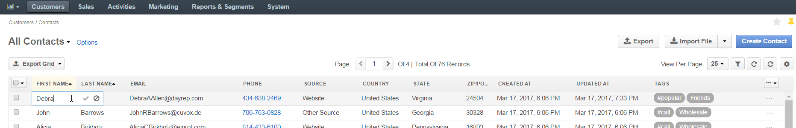

.. _user-guide-contacts:

Contacts
========

.. contents:: :local:
    :depth: 3

Overview
--------

To save details of actual people with whom you are getting in touch during the business activities, use the Contact 
records ("contacts"). 

A contact may be assigned as a related entity to records of other entities, e.g. to :term:`users <User>`, 
:term:`accounts <Account>`, and :term:`opportunities <Opportunity>`.

.. note:: For a quick guidance, please see a short demo on `accounts, contacts and customers <https://www.orocrm.com/media-library/22091>`_.

Create a Contact Record
-----------------------

.. note:: Checkout a short video on `how to create and edit contact records <https://www.orocrm.com/media-library/create-edit-contact-records-orocrm#play=SmkJGGwG-r0>`_, or keep reading the step-by-step guidance.

In order to create a Contact record:

- Go to **Customers>Contacts**.
- Click the :guilabel:`Create Contact` button.
- Define the contact settings in the sections described below.

General
^^^^^^^
The "General" section defines the basic settings of the contact created. The following fields are mandatory and 
**must** be defined in the section.

.. csv-table::
  :header: "**Name**","**Description**"
  :widths: 10, 30

  "**Owner**","Define users that can manage the contact, subject to the 
  :ref:`role settings <user-guide-user-management-permissions>`."
  "**First Name** and **Last Name**","Name used to refer to the contact in the UI."
  
The rest of the fields are optional. They can be used to define 
additional details of the contact, such as the name prefix and suffix, the middle name, free-text description, emails
and phone numbers, birthday, etc.

- With the optional field **Assigned To** you can specify a :term:`User` record, to which the contact will be assigned.

- With the optional field **Reports To** you can specify another Contact record, that corresponds to a person in charge 
  of the contact added (e.g. manager of the department, CEO of the company etc.).

- You can also add a picture (upload a picture to be used for the contact in the UI) and/or 
  :term:`tags <Tag>` related to the contact.

- With the **Addresses** form you can define Billing and Shipping addresses of the contact. Any amount of the addresses 
  may be added.

.. note::
  
    Any custom fields added to the **User** entity can be defined in the 
    **Additional** section.

Groups
^^^^^^

The **Groups** section contains all the :ref:`contact groups <contact_groups>` available in the system. 
Check the boxes to assign the contact to a group.

One contact may be assigned to several groups.

Accounts
^^^^^^^^

The **Accounts** section contains all the :ref:`accounts <user-guide-accounts>` available in the system. 
Check the boxes to assign the contact to an account.

One contact may be assigned to several accounts.

View and Manage a Contact Record
--------------------------------

:ref:`Inline editing <doc-grids-actions-records-edit-inline>` can help you amend details of contacts without opening the edit contact form. For contacts, it is available from records' grids and view pages.

If the |IcPencil| **Edit Inline** icon appears next to a value, inline editing is available for it.

.. To edit a contact from the view page, double-click on the required field or the inline editing icon |IcPencil| in the field you wish to edit, and modify the value as required.

.. |

.. .. image:: ../img/data_management/view/inline_editing_2.png

.. |

.. In some cases, you will need to select the value from a dropdown.

.. |

.. .. image:: ../img/data_management/view/inline_editing_3.png

.. |

.. From the view page, you can perform inline editing for the following fields:

.. - Fax
.. - Skype
.. - Tags
.. - Birthday
.. - Gender
.. - Source

To edit contacts from the grid using inline editing, perform the same actions as for inline editing from the view page.

|

.. image:: ../img/contacts/inline_editing_contacts.png

|

|

|

All contacts available in the system are displayed in the contacts grid (**Customers>Contacts**).

|
  
.. image:: ../img/contacts/action_icons.png

|

In addition, from the grid you can:

- Export or import contacts, as described in the
  :ref:`Import and Export Functionality <user-guide-export-import>` guide .

- Delete a contact from the system: click the |IcDelete| **Delete** icon.

- Get to the :ref:`edit page <user-guide-ui-components-create-pages>` of the contact: click the |IcEdit| **Edit** icon.

- Get to the :ref:`view page <user-guide-ui-components-view-pages>` of the contact: click the |IcView| **View** icon.

- Perform :ref:`bulk delete <doc-grids-actions-records-delete-multiple>` of several contacts.

.. |IcDelete| image:: ../../img/buttons/IcDelete.png
   :align: middle

.. |IcEdit| image:: ../../img/buttons/IcEdit.png
   :align: middle

.. |IcView| image:: ../../img/buttons/IcView.png
   :align: middle

.. |BulkDelete| image:: ../img/contacts/bulk_delete.png

.. |IcPencil| image:: ../../img/buttons/IcEditInline.png
   :align: middle
