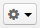

.. _user-guide-ui-components-grids:
    
Grids
=====

A grid is an aggregated view of all the records within an entity. Each row of a grid is one record and each column is 
one of the grid properties. Thus, each cell displays a value of a property for a record.

For example, you can open a grid of all the Contacts. 

|

.. image:: ./img/data_management/grid/grid_01.png

|

In this example, you can immediately see some major details of our contacts, such as their first and last names, email, 
phone number, etc.

You can adjust and save grid views, update and delete grid records, get to the 
:ref:`Edit forms <user-guide-ui-components-create-pages>` and :ref:`View pages <user-guide-ui-components-view-pages>` 
of any record on the grid, and even export all the data in the grid as a .csv file.

Getting to a Grid
-----------------

There are several ways to get to a grid.

- Choose the relevant option in the :ref:`menu bar <user-guide-navigation-menu>`. For instance, select the *"Contacts"* 
  menu item to get to the "All Contacts" grid, click the *"Manage Custom Reports"* menu item to get to the 
  *"All Reports"* grid, and so on.
 
  
- Find it in the :ref:`Shortcuts <user-guide-getting-started-shortcuts>`.

- Click the grid link on the :ref:`View page <user-guide-ui-components-view-pages>` 
  or :ref:`Create/Edit form <user-guide-ui-components-create-pages>` of a record. 

|

.. image:: ./img/data_management/grid/grid_from_view.png

|

.. hint::

    If you have reached a View page or Create/Edit form from a grid, and now click  link to get back to the grid, it 
    will look identical to when you left it (the same filters and order will still be applied).   

.. _user-guide-ui-components-grids-adjust:    

Adjust a Grid
-------------

.. _user-guide-ui-components-grids-change-table:

Change the Table
^^^^^^^^^^^^^^^^

You can change the set of details available in the grid (if permitted) and its order of columns by going to the right 
corner of the grid and clicking the settings icon |IcSettings|.

To show/hide a column on the grid, check/uncheck it in the *"Table Settings"*.(The list of columns is defined 
by the system administrator using the *Show On Grid* setting of the entity fields).

To move a column on the grid, move it in the form: click on the "Sort" icon opposite to the column name, hold the mouse 
button, and drag the column to change the order:

|

.. image:: ./img/data_management/grid/grid_table_settings.png

|

.. _user-guide-ui-components-grid-filters:

Apply Filters
^^^^^^^^^^^^^

You can apply filters to choose specific items to be shown in the grid. 

Of course, if there are a lot of contacts, they won't all fit on one page. In order to find the required contact in the 
grid, you can use the grid filters. 

Some filters are available by default, but the set of filters can be modified using check-boxes under the 
*"Manage Filters"* menu on the left. (The list of filters is defined 
by the system administrator using the *Show Grid Filter* setting of the entity fields).

|

.. image:: ./img/data_management/grid/grid_filters.png

|

The list of properties that can be used as filters is defined by the system administrator using the *"Show Grid Filter"* 
setting of the entity fields. 

Click the arrow on a filter to choose the required values. Available value setting depend on the field type. 

|

.. image:: ./img/data_management/grid/grid_filters_define.png

|

If more than one filter is active, only the the records that meet requirements of ALL the filters are displayed. For 
example, we have filtered the *"All Contacts"* grid so that it only shows Jameses Browns from California.

.. image:: ./img/data_management/grid/grid_02.png

Change Sorting
^^^^^^^^^^^^^^

Be default, grids are sorted in ascending order by the first column. You can sort them by any field and in any order - 
it is enough to click the column header. An upward or downward looking arrow will appear by the column name.

.. _user-guide-ui-components-grid-customized:

Save Your Customized Grid View and Share It with Other Users
^^^^^^^^^^^^^^^^^^^^^^^^^^^^^^^^^^^^^^^^^^^^^^^^^^^^^^^^^^^^

If there is a frequent set of filters and/or ordering that you need to use, you can save your customized grid view with 
all the filters and return to it at any moment. You can have any number of such views. This is very convenient if you 
are working with customers from different stores, contacts from different states, and so on. 

You can save a set of filters and  any custom sorting you've applied to the grid using the named view.

To save a view:

- Adjust the grid

- Click the :guilabel:`Options` link next to the grid view name, then choose :guilabel:`Save As` 

|

.. image:: ./img/data_management/grid/grid_custom_view_01.png

|

- Define the view name and click the :guilabel:`Save` button. . Name it something meaningful so you can easily find it 
  later.

|

.. image:: ./img/data_management/grid/grid_custom_view_02.png

|

The view will now be available in the drop-down next to the grid title.

|

.. image:: ./img/data_management/grid/grid_custom_view_03.png

|    

For each of the grid views, there is a number of options.

.. image:: ./img/data_management/grid/grid_custom_view_04.png

- You can create a new grid view based on the existing one with *"Save as"*
- You can rename an existing grid view with *"Rename"*
- You can share the grid view with other users with *"Share"*. This means that other users will see your customized 
  grid view in their grid view selector.
- You can delete the grid view.

.. _user-guide-ui-components-grid-action-buttons:

Other Grid Controls
^^^^^^^^^^^^^^^^^^^

You can adjust any grid view using the action buttons displayed right above the grid.

|

.. image:: ./img/data_management/grid/grid_action_buttons.png

|

- Change the amount of items displayed per page: :guilabel:`View Per Page`

- Scroll pages (if there is more than one page of records): |ScrollPage|

- Refresh the grid (i.e., get the newest details on the displayed records): |BRefresh|

- Reset the grid (i.e., clear all the filters applied to the grid): |BReset|

In some grids (as in the example), you can export all the details shown in the grid as a .csv file.

.. _user-guide-ui-components-grid-action-icons:

What You Can Do on a Grid
-------------------------

Create New Records from a Grid
^^^^^^^^^^^^^^^^^^^^^^^^^^^^^^

If permitted, you can initiate the creation of a new record directly from the grid.
Right above the grid, there is usually a :guilabel:`Create New ...` button. Click it, to get to the Create form.

.. _user-guide-ui-components-grid-edit:

Edit Records on a Grid
^^^^^^^^^^^^^^^^^^^^^^

If permitted, you can edit the records directly from the grid. Beside each cell there is an edit icon. Click it twice, 
in order to edit the value. 

|

.. image:: ./img/data_management/grid/grid_edit.png

|

Click the check to confirm the change, or the cross to cancel it.

|

.. image:: ./img/data_management/grid/grid_edit_confirm.png

.. _user-guide-ui-components-grids-delete-merge:

Delete and Merge Records on a Grid
^^^^^^^^^^^^^^^^^^^^^^^^^^^^^^^^^^

If permitted, you can delete records.

- To delete a record, hover the cursor over the action buttons (the last column) and click |IcDelete|.

|

.. image:: ./img/data_management/grid/grid_delete.png

|

- To delete several records (where available), check the record boxes (corresponding rows will be highlighted) and 
  click the bulk delete action.

|
  
.. image:: ./img/data_management/grid/grids_delete_bulk.png

|

In the same manner, you can merge several records (if the corresponding :ref:`capabiltiy <admin-capabilities-merge>` has 
been enabled). Currently, merge can only be done for  :ref:`accounts <user-guide-accounts>`.

Get to View Page and Edit Forms from a Grid
^^^^^^^^^^^^^^^^^^^^^^^^^^^^^^^^^^^^^^^^^^^

If permitted, you can get to the :ref:`View Page <user-guide-ui-components-view-pages>` or 
:ref:`Edit form <user-guide-ui-components-create-pages>` of any record in the grid.
 

To get to the *"Edit"* page, hover the cursor over the action buttons (the last column) and click |IcEdit|.  

To get to the *"View"* page, hover the cursor over the action buttons and click |IcView|. 

 
.. _user-guide-ui-components-grid-action-buttons-export:

Export Grids
------------

You can export all the data displayed in a grid as a .csv table. To do so, click the 
:guilabel:`Export Grid` button and select *"CSV"*.

.. image:: ./img/data_management/grid/export_grid.png

The file will be saved in compliance with your browser settings.

 
 
.. |IcDelete| image:: ./img/buttons/IcDelete.png
   :align: middle
   
.. |IcSettings| image:: ./img/buttons/IcSettings.png
   :align: middle

.. |IcEdit| image:: ./img/buttons/IcEdit.png
   :align: middle

.. |IcView| image:: ./img/buttons/IcView.png
   :align: middle
   

   
.. |ScrollPage| image:: ./img/buttons/scroll_page.png
   :align: middle
   
.. |BRefresh| image:: ./img/buttons/BRefresh.png
   :align: middle
   
.. |BReset| image:: ./img/buttons/BReset.png
   :align: middle
