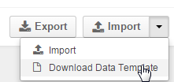

.. _user-guide-export-import:

Import and Export Data
======================

OroCRM's import and export functionality is a simple way of working with multiple records in the .CSV format.

If the functionality is enabled for an entity, :guilabel:`Export` and :guilabel:`Import` buttons are displayed
in the top right corner of the page. 
If a grid can be exported the :guilabel:`Export` button will appear on the left, just above the grid. What records
can be exported/imported and what field will be used as a record identifier during update, is defined by the system 
administrator.

.. _user-guide-import:

Import
------

- Click |Bdropdown| on the  :guilabel:`Import` button.

- Choose :guilabel:`Download Data Template`.

- Make a .csv file in compliance with the template.

.. caution::

    Mandatory fields of the entity **must** be specified

- Click the  :guilabel:`Import` button.

- Click :guilabel:`Choose File` and choose a .csv file to import.

- Click :guilabel:`Submit`.

.. image:: ./img/export_import/leads_import.png

|

- Carefully read through the submission form.

- Click the :guilabel:`Back` button to choose another file or :guilabel:`Import` button to go on with the import

  - First, the *"Validation started. Please wait."* message will appear.

  - When the import has finished, the *"File is successfully imported."* message will appear.

Once import is over, the new entity records will appear in the :ref:`grid <user-guide-ui-components-grids>`.

.. _user-guide-export:

Export
------

- Go to the grid and

  - Click the :guilabel:`Export` button.

  - The *"Export started. Please wait."* message will appear at the top of the screen.

  - As soon as the export is over, the message will change to: *"Export performed successfully, [number]
    downloads exported. Download result file."*

- Click the *"Download result file*" link at the end of the message, and the download will be performed subject to your
  browser settings.
  

Export Grid
^^^^^^^^^^^

In a similar way, you can export records of specific grid (subject to all the adjustments and filters applied). To do 
so, click the  Click the :guilabel:`Export Grid` button and select *"CSV"* below it. The download will start and the 
file will be save in compliance to your browser settings.
  
.. note::

    Please note that scope of record details exported, their names and position in the .csv file depend on the 
    :ref:`Import&Export settings <user-guide-entity-management-export-import-common>` of the entity fields.

.. |Bdropdown| image:: ./img/buttons/Bdropdown.png
   :align: middle
