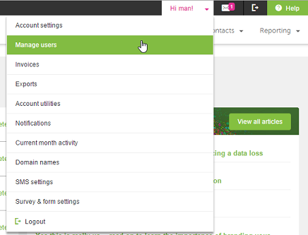
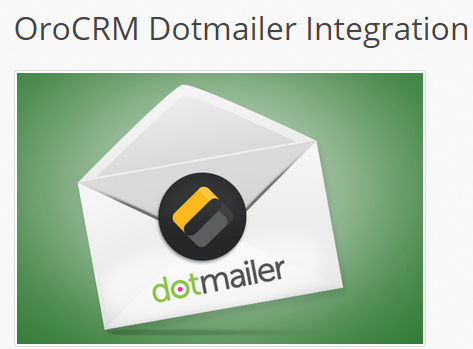
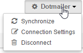
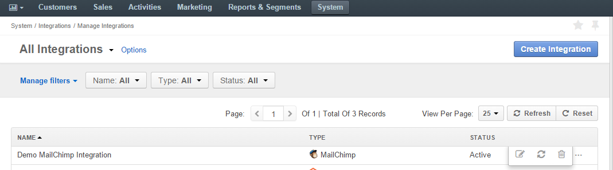

.. _user-guide-dm-integration:

Integration with Dotmailer
--------------------------

OroCRM supports out of the box integration with Dotmailer, allowing you to do the following:

- Map OroCRM :ref:`Marketing Lists <user-guide-marketing-lists>` to address books in Dotmailer and keep them 
  synchronized.
- Use your address books to create email campaigns in Dotmailer and import them to OroCRM.
- Use Dotmailer campaign statistics and OroCRM reporting tools to analyze the campaign efficiency.

This article describes how to define and edit the integration and synchronization settings.

.. hint::

    While Dotmailer integration capabilities are pre-implemented, OroCRM can be integrated with different third-party
    systems.

On the Dotmailer Side
---------------------

The only step you will need to take in Dotmailer is to generate an API user for the integration:

- Login to your Dotmailer account.

- Hover over the Account menu and click *"Manage users"*.

- Click the API tab

.. image:: ./img/dotmailer/dt_account_02.png

- Click the :guilabel:`Add user` button

- Define the following details:

.. csv-table::
  :header: "Field", "Description"
  :widths: 10, 30

  "**Email address**","The email address is automatically generated for you and cannot be edited."
  "**Description**","An optional field, where you can enter a free text description to understand the specific API key 
  purpose in future."
  "**Password** and **Confirm Password**","Enter a password then confirm it. Your password must be at least 8 characters 
  in length and contain at least 1 digit or non alphanumeric."
  "**Enabled**","Check the box to activate the API key."

- Click the :guilabel:`Save` button.
 

On the OroCRM Side
------------------

Install the *"OroCRM Dotmailer Integration"* extension (oro/crm-dotmailer)

Create Dotmailer Integration
^^^^^^^^^^^^^^^^^^^^^^^^^^^^

- Go to *"System --> Integrations → Manage Integrations"* and click the :guilabel:`Create Integration` button.

- The "Create Integration" form will appear. 

- As soon as you've set the integration type to "Dotmailer", the form will be recalculated to meet specific integration 
  requirements.

Define the following mandatory details:

.. csv-table::
  :header: "Field", "Description"
  :widths: 10, 30

  "**Type***","The integration type. Must be set to *Dotmailer*."
  "**Name***","The integration name used to refer to the integration within the system."
  "**User Name*** and **Password***","The email address and password of the Dotmailer API user."
  "**Default Owner**","Limits the list of users that can manage the integration, as well as all the entities imported 
  within the integration to only those whose :ref:`roles <user-guide-user-management-permissions>` allow them to manage
  integrations and corresponding entities that have been assigned to the owner (e.g. the owner, members of the same 
  business unit, system administrator, etc.).
  
  By default, the field is filled in with the user that is creating the integration."
  
After the *"Username"* and *"Password"* have been entered, you can click the :guilabel:`Check Connection` button, to see 
if the credentials are valid.

      |
  
.. image:: ./img/dotmailer/dt_integration_form.png

|

After the integration has been created and its status has been set to Active, the list of Address Books will be 
automatically imported from Dotmailer to OroCRM for further integration management. 

.. _user-guide-dm-integration-map:

Map OroCRM Marketing Lists to Dotmailer Address Books
^^^^^^^^^^^^^^^^^^^^^^^^^^^^^^^^^^^^^^^^^^^^^^^^^^^^^

Now you can map contacts from the OroCRM marketing list to a Dotmailer address book.

- Go to *Marketing → Marketing Lists* and open the Marketing list that you want to use. 
- If a Marketing list is suitable for the connection, the :guilabel:`Connect to Dotmailer` button will appear on the 
  :ref:`View page <user-guide-ui-components-view-pages>` of the marketing list.
   
  |
   
  |ConnectToDotmailer|
  
.. note::

    Each OroCRM marketing list may be connected to only one Dotmailer address book, and each Dotmailer address book may 
    be connected to only one OroCRM marketing list.
  
- Click the button. *"Connect To Dotmailer"* form will emerge. 
  
  |
  
  |ConnectToDotmailerForm|

- Define the following fields:

.. csv-table::
  :header: "Field", "Description"
  :widths: 10, 30

  "**Integration***","Contains all the Dotmailer integrations available in the OroCRM instance. Select the 
  integration, for which the mapping must be performed."
  "**Address Book***","Contains all the Dotmailer Address Book records 
  `created <https://support.dotmailer.com/entries/20663833-Creating-an-address-book>`_ in the Dotmailer UI and available 
  or connection.

  Does not contain the *All Contacts* and *Test* Address Books automatically generated in Dotmailer, 
  nor the Address Books that have already been connected to another Marketing List in OroCRM."

*Now you can use the Address Book record to create Email Campaigns in Dotmailer.*

Synchronization Flow
--------------------

Start the Synchronization
^^^^^^^^^^^^^^^^^^^^^^^^^
After the connection has been saved, contacts from the  marketing list will be automatically exported from OroCRM to 
the chosen segment of MailChimp. Since then, data synchronization between OroCRM and Dotmailer will 
be performed automatically. 

You can also start the synchronization manually. To do so:

- Click the :guilabel:`Synchronize` button in the Dotmailer menu on the 
  :ref:`View page <user-guide-ui-components-view-pages>` of the Markting List   
  

- You can also start the data synchronization from the :ref:`View page <user-guide-ui-components-view-pages>` of the
  integration, with the :guilabel:`Schedule Sync` button. 

- You can also start the data synchronization with the |BSchedule| button in the *System → Integrations → Manage 
  Integrations* section.
  
Synchronization Process
^^^^^^^^^^^^^^^^^^^^^^^
During the synchronization the following details are updated:

- The list of Address Books available in Dotmailer is updated in OroCRM.
- All the contacts suppressed/unsubscribed from an Address Book are unsubscribed from the related Marketing List in 
  OroCRM.
- All the contacts added to an OroCRM Marketing List are added to the related Address Book in Dotmailer.
- An Email Campaign is created for every campaign that was created in Dotmailer, and details of the contact activities 
  within the campaign are imported to OroCRM. 
  
  
.. _user-guide-dm-integration-details_edit:

Manage the Integration
^^^^^^^^^^^^^^^^^^^^^^

All the integrations created will be available in the Integrations grid under *"System → Integrations → Manage 
Integrations"*. You can use the :ref:`grid action icon <user-guide-ui-components-grid-action-icons>` for the following:

- Delete the integration - |IcDelete| 

- Get to the Edit page of the integration - |IcEdit|

- Start the data synchronization - |BSchedule|

On the View page of a specific marketing list you can click the :guilabel:`Dotmailer` drop-down menu for the following:

- Start synchronization manually.
- Change the connection settings for the list.
- Disconnect the list from the segment.

.. |IcCross| image:: ./img/buttons/IcCross.png
   :align: middle

.. |BSchedule| image:: ./img/buttons/BSchedule.png
   :align: middle

   
.. |IcDelete| image:: ./img/buttons/IcDelete.png
   :align: middle

.. |IcEdit| image:: ./img/buttons/IcEdit.png
   :align: middle

.. |IcView| image:: ./img/buttons/IcView.png
   :align: middle
   
.. |ConnectToDotmailer| image:: ./img/dotmailer/dt_button.png
   :align: middle
   
.. |ConnectToDotmailerForm| image:: ./img/dotmailer/dt_connect_form.png
   :align: middle
     
