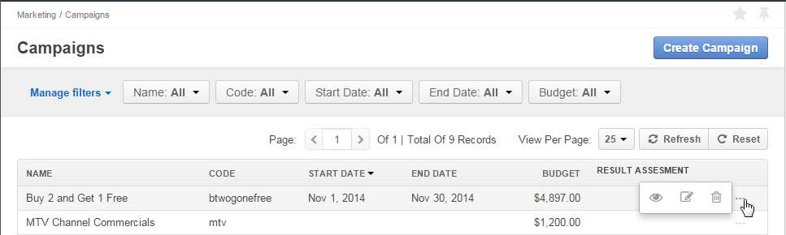

.. _user-guide-email-campaigns:

Email Campaigns
===============

Records of the Email Campaign entity ("Email campaigns") represent mailing and keep their general information and 
mailing settings.

The articles describes the ways to :ref:`create <user-guide-email-campaigns-create>` and 
:ref:`manage <user-guide-email-campaigns-actions>` Email campaigns. 

.. _user-guide-email-campaigns-create:

Creating a Campaign
--------------------

1. Go to *Email --> Campaigns* page and click :guilabel:`Create Campaign` button in the top right corner to get 
   to the *"Create Campaign"* form.

2. Define general settings of the campaign:

  There are four mandatory fields that **must** be defined:
  
.. csv-table::
  :header: "**Name**","**Description**"
  :widths: 10, 30

  "**Name***","Name used to refer to the campaign in the system."
  "**Marketing List***","A marketing list used for the mailing. The letter will be sent to Email addresses defined in the 
  list. You can choose one of available marketing lists from the list (|Bdropdown|) or from the grid (|BGotoPage|), as
  well as create you own marketing list (|BPlus|)

  Click |BCrLOwnerClear| button to clear the field
  
  More details about the marketing lists are available in the :ref:`Marketing Lists <user-guide-marketing-lists>` 
  guide."
  "**Schedule***","Defines if the mailing shall be activated manually (*Manual*) or scheduled for a specific 
  date (*Deferred*).

  If *Deferred* value is chosen, **Scheduled For** field will appear. Choose the date and time of the mailing in the 
  calendar. 
  
  |email_campaign_schedule|"
  "**Owner***","Limits the list of Users that can manage the campaign to its owner and Users, whose roles allow managing 
  Email campaigns of the owner (e.g. members of the same business unit, system administrator, etc.). 
  
  You can  choose one of available users from the list (|Bdropdown|) or from the *Select Owner* page (|BGotoPage|).

  Click |BCrLOwnerClear| button to clear the field
  
  By default, the user creating the campaign is chosen."

Optional fields can be used to define such details as the Sender Email and Name, Campaign within which the mailing is 
done and free text description. 

Custom fields may be added subject to specific business-needs. 

3. Define the mailing settings. 

There are two mandatory fields that **must** be defined:
  
.. csv-table::
  :header: "**Name**","**Description**"
  :widths: 10, 30
  
  "Transport","The field defines the service to be used for the mailing. Out of the box, the only option is OroCRM. 
  Other means can be added in the course of customization."
  "Template","Choose the Email template to be used from the drop-down. 
  
  Please note that only the templates assigned on no entity or the same entity that the marketing list are available "
  
4. Save the campaign in the system with the button in the top right corner of the page.

.. image:: ./img/marketing/email_campaign_example.png

.. _user-guide-email-campaigns-actions:

Campaign Actions
----------------

The following actions are available for a campaign from the \:ref:`grid <user-guide-ui-components-grids>`\:

- Delete the campaign from the system : |IcDelete| 

- Get to the *"Edit"* form of the campaign : |IcEdit| 
  
  You can change the campaign details or delete the campaign from the \:ref:`Edit form <user-guide-ui-edit-forms>`\.

- Get to the *"View"* page of the campaign :  |IcView| 

.. |IcDelete| image:: ./img/buttons/IcDelete.png
   :align: middle

.. |IcEdit| image:: ./img/buttons/IcEdit.png
   :align: middle

.. |IcView| image:: ./img/buttons/IcView.png
   :align: middle
   
.. |BGotoPage| image:: ./img/buttons/BGotoPage.png
   :align: middle
   
.. |Bdropdown| image:: ./img/buttons/Bdropdown.png
   :align: middle
   
.. |BPlus| image:: ./img/buttons/Bdropdown.png
   :align: middle

.. |BCrLOwnerClear| image:: ./img/buttons/BCrLOwnerClear.png
   :align: middle
   
.. |email_campaign_schedule| image:: ./img/marketing/email_campaign_schedule.png
   :scale: 40%

