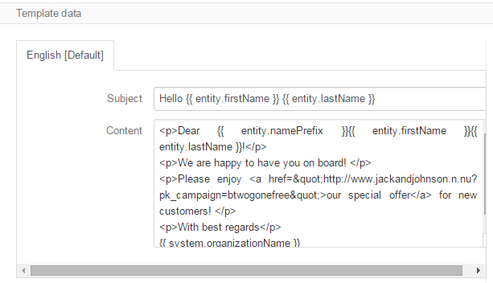

.. _user-guide-email-templates:

Email Templates
===============

Records of the Email Template entity ("Email templates") represent html or plain text templates used for
mailings and filled with free text, as well as system variables and variables of a specific entity. 

The articles describes the ways to create and manage Email templates. 

.. _user-guide-email-templates-create:

Creating an Email Template
---------------------------

1. Go to *System → Emails → Templates* page and click :guilabel:`Create Template` button in the top right corner to 
   get to the *"Create Template"* :ref:`form <user-guide-ui-components-create-pages>`.
   
  |email_template_create|

2. Define general settings of the template:

   The following fields are mandatory and **must** be defined:
  
.. csv-table::
  :header: "**Field**","**Description**"
  :widths: 10, 30

  "**Template Name***","Name used to refer to the template in the system"
  "**Type***","Use html or plain text"
  "**Owner***","Limits the list of users that can manage the template to those, whose roles allow managing 
  Email templates of the owner (e.g. the owner, members of the same business unit, system administrator, etc.)"
 
Optional field *"Entity Name"* shall be assigned if you want to use some entity-specific variables in the template.

If no entity name is defined, only system variables will be available.

2. Define the Email template. Drag the variables to wherever you need them.

*In the example below, the template contains a link to the website page composed with a piece of
:ref:`tracking code <user-guide-how-to-track>`. Every time a user follows the link, visit event 
will be tracked for the campaign.*   

3. You can click :guilabel:`Preview` button to check your template

.. image:: ./img/marketing/email_template_preview.png

4. If you are satisfied with the preview, save the template in the system with the button in the top right corner of
   the page.

.. _user-guide-email-templates-actions:

Campaign Actions
----------------

The following :ref:`actions <user-guide-ui-components-grid-action-icons>` are available for an Email template from 
the :ref:`grid <user-guide-ui-components-grids>`:

.. image:: ./img/marketing/email_template_actions.png

- Delete the template from the system: |IcDelete| 

- Get to the :ref:`Edit form <user-guide-ui-edit-forms>` form of the template: |IcEdit| 

- Clone the  template:  |IcClone| - You can edit the template details and save a new (cloned and edited) template.  

  
.. |IcDelete| image:: ./img/buttons/IcDelete.png
   :align: middle

.. |IcEdit| image:: ./img/buttons/IcEdit.png
   :align: middle
   
.. |IcClone| image:: ./img/buttons/IcClone.png
   :align: middle
   
.. |BGotoPage| image:: ./img/buttons/BGotoPage.png
   :align: middle
   
.. |Bdropdown| image:: ./img/buttons/Bdropdown.png
   :align: middle

.. |BCrLOwnerClear| image:: ./img/buttons/BCrLOwnerClear.png
   :align: middle
   
.. |email_template_create| image:: ./img/marketing/email_template_create.png
