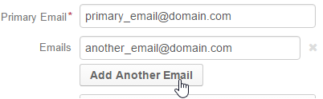
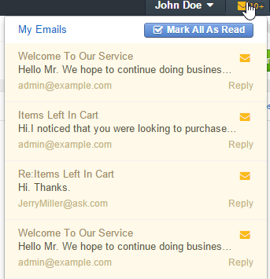
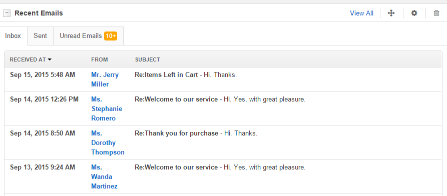

.. _emails-overview:

Email Management
================

Today, emails have become a substantial part of communications, particularly, of communications with customers. 
Therefore, OroCRM provides an extensive and flexible functionality with which you can send emails from OroCRM as well 
as integrate with other existing mailboxes and servers to keep working with your emails in a convenient and well-known 
environment. 

Moreover, each email can be tied to a number of records (context), to make sure that all the correspondence
related to a customer, an opportunity, a user, or to any other record in the system is available directly from the page 
of this record.

This article aims to provide an overview of the email-related functionalities of OroCRM. 

User's Email Address
---------------------

Every :term:`user <User>` in OroCRM must have at least one unique email address.  This is called a *Primary Email* and 
used as a default value, whenever there is a need to refer to the user's email. No two users can have the same primary 
email address.

Other, non-primary, emails can be defined for any user. These  will be available in the email selectors where 
applicable. Non-primary emails may duplicate (several user may have the same additional email).

When :ref:`a new User record is created <user-management-users>` in OroCRM, the administrator must define the primary 
email address and can define any number of other emails.

Other Email Addresses
---------------------

You can save and use other email addresses in OroCRM. For example, there is at least one email address for each 
:ref:`magento customers <user-guide-magento-entities-customers>`, emails can be bound to a 
ref:`contact <user-guide-contacts>`, or a :ref:`lead <user-guide-system-channel-entities-leads>`.

:term:`Custom fields <Custom Field>` can be :ref:`defined as an email <user-guide-entity-management-other-common>`.
Such fields can be used as contact information for :ref:`marketing lists <user-guide-marketing-lists>` and 
:ref:`email campaigns <user-guide-email-campaigns>`.

User's Mailbox
--------------

The *"My Emails"* page of the :ref:user menu <user-guide-getting-started-user-menu> every user contains all the emails: 

- sent by the user from OroCRM
- sent to the user from OroCRM 
- collected from related mailboxes via IMAP

  
.. _emails-overview-related-mailbox:
  
Related Mailboxes
-----------------

The system administrator can set up a mailbox or a set of mailboxes that will be synchronized with the User's Mail in 
OroCRM:

- If IMAP connection is enabled for a mailbox, all the letters from the mailbox will be saved in *"My Emails*"
  of the related user(s).  

- If SMTP connection is enabled for a mailbox, all the letters sent from the *"My Emails"* as 
  responses/forwards for the letters received from this mailbox will be saved in the related mailbox.

This way, users can run the correspondence in the related mailbox that they are used to, or in OroCRM without loosing 
any information. 

The following mailboxes may be set up:

.. csv-table:: 
  :header: "Mailbox","Description","Link to Related Documents"
  :widths: 10,30,20
  
  "**User Mailbox**","One mailbox define for a specific user.","The 
  :ref:`Email synchronization settings <user-management-users-email-sync>` section of the User Records guide."
  "**System Mailbox(es)**","Any number of external mailboxes related to OroCRM in such a manner that an adjustable 
  group of OroCRM users will get all the letters sent to the system mailbox. 
  
  If SMTP is set-up, responses of any user will be sent to the system mailbox and can then be received by the rest of 
  the users. Such a mailbox may be set up for support team, a team processing business proposals, working with 
  reclamations, etc. All the participants will get requests (letters) sent to the system mailbox and will be able to 
  take part in the issue resolution/opportunity development and see all the related correspondence. 
  
  Letters from a 
  system mailbox can be automatically turned into :ref:`cases <user-guide-activities-cases>` or 
  :ref:`leads <user-guide-system-channel-entities-leads>`. 
  
  Auto-responses to the letters that meet certain criteria can 
  be set up.",":ref:`System Mailboxes guide <admin-configuration-system-mailboxes>`"
  "**Microsoft Exchange Server**","Users of the OroCRM Enterprise Edition can set up integration with Microsoft Exchange 
  server. This means that emails from mailboxes on the MS Exchange server that meet adjustable conditions will be 
  automatically uploaded to OroCRM. This functionality enables using single system-wide setting to collect letters of 
  multiple users within organization. SMTP connection is not supported by the functionality","
  :ref:`Integration with Microsoft Exchange Server guide <admin-configuration-ms-exchange>`"
  
.. _emails-overview-send:

  
Sending an Email from OroCRM
----------------------------

Emails can be sent directly from OroCRM via the internal OroCRM's server. There are several ways to send an Email from 
OroCRM.

.. csv-table:: 
  :header: "Way","Description","Link to Related Documents"
  :widths: 10,30,20
 
  "**Email activity**","You can create an email related to any record in OroCRM. To do so, emails must be enabled for this
  type of records. Choose the record and select the *Send Email* action for it.

  - Primary email address of the user, who is creating the email will be automatically added to the *From* field of the 
    email. The address can be changed. Additional email addresses (if any) will be available in the drop-down selector. 

  - Primary email address of the record (if any) will be automatically added to the *To* field of the email. 
    The address can be changed. Additional email addresses (if any) will be available in the drop-down selector. 

  - The record will be automatically added to the context of the email. It can be removed. Other records can be added 
    to the context.",":ref:`Send Email Guide <user-guide-activities-emails>`"
  "**Email Campaign**","You can automatically generate a list of contact details (*marketing list*) and create an email 
  that will be manually or automatically sent to all the contacts on the list from OroCRM, MailChimp or dotmailer. 
  
  Primary and additional emails, as well as custom fields defined as emails can be used to generate marketing lists.","

  :ref:`Marketing Lists Guide <user-guide-marketing-lists>`
  
  :ref:`Email Campaigns Guide <user-guide-email-campaigns>`
  
  :ref:`Integration with MailChimp Guide <user-guide-mc-integration>`
  
  :ref:`Integration with Dotmailer Guide <user-guide-dm-integration>`"
  "**Notification**","You can set up automatic notification of specific users upon some event in the system (e.g. an 
  entity created or deleted). Such notifications will be sent to primary email addresses of the defined users.",
  ":ref:`Automatic Notification Guide <system-notification-rules>`"
  "**Reply/Forward**","You can reply to any email in your user's mailbox or forward this email.",""

  
.. _emails-overview-read: 
 
Reading Emails
--------------

All the emails sent to a user from OroCRM and related mailboxes will appear in *"My Emails"*

A widget on the top panel displays the number of unread messages, shows a pop-up when a new message has appeared and 
can be used to get to *"My Emails"* or to reply to/forward the letter directly from the widget. 

|

|

The *"Recent Emails"* widget can be added to the dashboard.

|

|

.. _emails-overview-contexts: 
  
Related Contexts
----------------

As everything in OroCRM is designed to make you customer relations management more straightforward and convenient, each 
email in the system can be assigned one or several records that it is related to - a context. For example, you have 
received an email from one of your customers related to one of your projects. You can add the specific customer, 
project (opportunity) and contact person as the context of this email. When you or another OroCRM user will get to the 
View page of this customer, opportunity or contact they will see this email in the *"Activity"* section of the record's
view page. 

Email-related Configuration Settings
------------------------------------

A number of email-related settings can be defined system-wide in the :ref:`configuration <admin-configuration-emails>`.
These settings, include such relatively small things as settings of address auto-complete, way to display email threads
and reply/forward buttons, default sender's email and name for campaigns and notifications and adjustable signature, 
with which you can set up the emails in the way most convenient for your users, as well as ability to create system 
mailboxes. Moreover, signature text can be defined, and system mailboxes can be created separately for each 
organization. 

.. _emails-overview-outlook: 

OroCRM and Outlook
------------------

OroCRM provides a powerful integration with Microsoft Outlook. All the contacts, tasks and calendar events available for 
the user can be synchronized with the specified Outlook account and vice versa, moreover, with the Outlook plugin, you 
can relate them as contexts to the emails directly in the Outlook mailbox.

In order to synchronize the emails, define the Outlook mailbox as a related mailbox or use the Outlook's synchronization
functionality.

Conclusion
----------

OroCRM can collect emails related to the customer relations management process from different sources, and at the same 
time you can run all the correspondence directly from OroCRM. Handy widget will let you always be aware of your emails 
and the ability to tie and email to its context will ensure that all the necessary letters are at hand when considering 
a specific deal, profile, reclamation, offer and other.