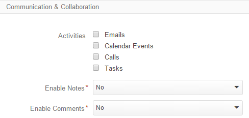

.. _user-guide-entity-management-from-UI:

Entities
========

OroCRM provides users with ability to record, store, process and analyze various customer-related information. 
This information may cover different areas including customer profiles, address and billing details, 
customer activity, possible sales and arrangements, and many others. This can be any type of 
information necessary to monitor, manage and understand specific customer-related activities.
For each of these things it is important to record specifically the details that matter for your business. For example, 
a customer's name is a universally needed piece of information, while the gender may be needed for 
clothes shops and the hobbies may interest book stores.

A collection of information of a similar nature is represented in OroCRM with an *entity*. And *records* of an entity 
are specific instances. So, the *B2B Customer* entity represents all your clients involved in business-to-business
relations, and each such client is a record of the entity.

OroCRM comes with a number of out-of-the-box entities that represent general stakeholders and components of 
customer relation management. These are called **system entities**.
 
However, sometimes users have a need to create additional entities from the UI. These are called **custom entities**.

The article describes how to create and manage the entities.

.. note::

    Entities may be added in the course of customization subject to the user's needs. In these case they may be defined
    either as system or as custom entities (as arranged with the user).

.. _user-guide-entity-management-create:

Create Entities
---------------

In order to create a custom entity, you have to specify its details as described in the sections below: 

.. _user-guide-entity-management-create-general-information:

General Information
^^^^^^^^^^^^^^^^^^^

The following two fields are mandatory and **must** be defined:

.. csv-table::
  :header: "Field", "Description"
  :widths: 10, 30

  "**Name***","Name used to refer to the entity in the system.
  The name shall be at least 5 characters long, may contain numbers and alphabetic symbols. The first symbol must be a 
  letter.

  The name field cannot be a `reserved sql word <http://msdn.microsoft.com/en-us/library/ms189822.aspx>`_."
  "**Label***","The label will be used to refer to the entity in the UI. Label shall be at least 2 symbols long."

.. caution::

  **The Name value must be unique for every Custom entity created.** Failure to do so may cause partial update of 
  the existing entity and failure of the schema update.
  
  |
  
  Labels may be duplicated. However, keep in mind that from the UI perspective it will be impossible to distinguish
  them, so it is better to keep them unique.
    
The following general entity details are optional and may be specified:

.. csv-table::
  :header: "Field", "Description"
  :widths: 10, 30

  "**Icon**","All the entity records will be displayed with the icon chosen."
  "**Plural Label**","The label defined will be used to name the menu items and grids related to the entity."
  "**Description**","Free text info to help you or other users understand the purpose and specifics of the created 
  entity in future."  

  
.. _user-guide-entity-management-create-commun-collab:

Communication & Collaboration
^^^^^^^^^^^^^^^^^^^^^^^^^^^^^

The section contains check-boxes for all the activities available and *"Enable Notes"* drop-down.

- Check the activities that you want to enable for the entity.

- Choose *Yes* in the drop-down and it will be possible to add free text *Notes* to the entity records.

.. _user-guide-entity-management-create-attachments:

Attachment Settings
^^^^^^^^^^^^^^^^^^^

You can enable attachments for the entity records and define relevant limitations.

.. image:: ./img/entity_management/new_entity_attachment.png

- Choose *Yes* in the drop-down to enable attachments.

- Define the upper limit of an attachment size, if necessary. No larger attachments will be added.

- Limit the list of supported MIME types if necessary. If no MIME type is defined, the list defined in 
  the *System → Configuration → Upload Settings* will be used. 
  
  Define the list of MIME types supported in the field, add each new type on a new line. For example:
  
.. image:: ./img/entity_management/new_entity_general_mime_types.png

.. important::

    If the MIME types field is empty, the settings defined in the *System → Configuration → Upload Settings* are used.

.. _user-guide-entity-management-create-other:

Other Settings
^^^^^^^^^^^^^^

The following three fields must be specified for every entity created:

.. csv-table::
  :header: "Name","Description"
  :widths: 10, 30

  "**Ownership Type***","Defines the level at which permissions will be set for instances of the entity:
  
  - None: no authorization is required to see and process the entity.
  
  - User/Business Unit/Organization: defines the level at which an Owner can be defined.
    
  "
  "**Auditable**","If enabled, the actions performed with the entity records will be recorded and can be 
  viewed with System → Audit functionality.
  
  " 
  "**Workflow Step in Grid**","

  - Show: if there is a workflow defined for the entity, the workflow *Step* will be displayed on the entity records 
    :ref:`grid <user-guide-ui-components-grids>`.

  - Hide: no steps will be shown in the grid, even if there is a workflow defined for the entity."
  

.. _user-guide-entity-management-create-fields:
  
Add Fields to an Entity
-----------------------

An entity with no fields is meaningless and will not be processed by the system. Once an entity has been created, you 
can get to the :ref:`View page <user-guide-ui-components-view-pages>` of the new entity, where you can define its new 
fields.

Please refer to the :ref:`Field Management <user-guide-field-management>` Guide to find out, how to add fields to the 
entity.

 
.. _user-guide-entity-management-create-update:

Update Schema
-------------
Once you have defined necessary entities and their fields, at the top right corner of the page of any new or extended 
entity there will appear an :guilabel:`Update Schema` button. Click the button. The Schema update can take some time, 
so please be patient.

.. caution::
    
    Please note that the Schema Update influences the overall system performance and updates the schema for all the 
    created/updated entities.

.. _user-guide-entity-management-edit:

Manage Entities
---------------

Sometimes there is a need to edit existing entities of OroCRM from the 
Web UI.

Entities Grid 
^^^^^^^^^^^^^
 
The following table describes columns of the Entities grid and how they affect ability to edit the entity:

.. csv-table:: Entity Grid Columns
  :header: "Column","What's in it","Effect ability to edit?"
  :widths: 20, 30, 30

  "**LABEL***","Name used to refer to the entity in the system UI.","No"
  "**SCHEMA STATUS**","Defines the state of current schema for the entity.","No, but unless its value is *Active* your 
  changes to entities an/or their fields will not have effect for the system, until you 
  :ref:`Update the Schema <user-guide-entity-management-create-update>`."
  "**IS EXTEND**","Defines if :ref:`new fields can be added <user-guide-field-management-create>` to the entity.","If 
  the value is *No*, you cannot add any new fields to the entity."
  "**TYPE**","Defines whether the entity was loaded from the back-end (System) or created in the UI (Custom).","New 
  fields can always be added to custom entities. For the system entities ability to add new fields may differ subject to
  the *IS EXTEND* value. System entities cannot be deleted."
  "**AUDITABLE**","Defines if the actions performed on the entity records shall be logged.","No"
  "**OWNERSHIP TYPE**","Defines the level at which permissions will be set for instances of the entity as
  described in the Create Entities guide :ref:`section <user-guide-entity-management-create-other>`.","Not 
  directly, however, you need to have permissions to edit the entity (See System → User Management → Roles)."
  "**NAME** and **MODULE**","Define the name used to refer to the entity at the back-end. Comes handy if there is a 
  need to change configuration or otherwise find the entity in the code.","No"
  "**UPDATED AT**","The date and time of the last schema update for the entity.","No"
  "...","Hover your mouse over the *...* to access the action icons.","Use the icons to manage the entity."  

This way, ability to add :ref:`new fields <user-guide-entity-management-create-fields>` depends on the entity, 
:ref:`Edit form <user-guide-ui-components-create-pages>` is available for any entity in the system. 
List of editable properties for each of the System type entities depends on 
configuration and is created in a way reasonable and safe for the system performance and operation. 

.. note:

    If you need to add new fields to an entity that is not "EXTEND", configuration of the entity may be change in the 
    course of customization.

Actions on Entities
^^^^^^^^^^^^^^^^^^^

The following actions are available for an entity:

From the :ref:`grid <user-guide-ui-components-grids>`

- Delete the entity: |IcDelete| (available only for custom entities)
- Get to the :ref:`View page <user-guide-ui-components-view-pages>` of the entity:  |IcView|
- Get to the :ref:`Edit form <user-guide-ui-components-create-pages>` of the entity: |IcEdit|"

From the :ref:`View page <user-guide-ui-components-view-pages>`:

- Get to the :ref:`Edit from <user-guide-ui-components-create-pages>` of the entity: |IcEdit|"
- Manage the entity fields, as described in the :ref:`Field Management <user-guide-field-management>` Guide.
  

.. |IcDelete| image:: ./img/buttons/IcDelete.png
   :align: middle

.. |IcEdit| image:: ./img/buttons/IcEdit.png
   :align: middle

.. |IcView| image:: ./img/buttons/IcView.png
   :align: middle
   
.. |IcRest| image:: ./img/buttons/IcRest.png
   :align: middle
  