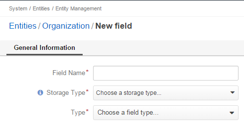
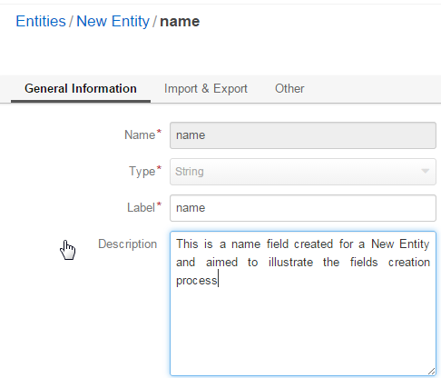
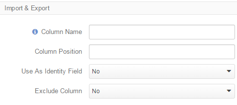
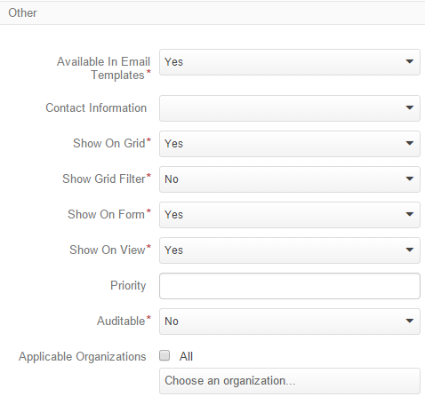
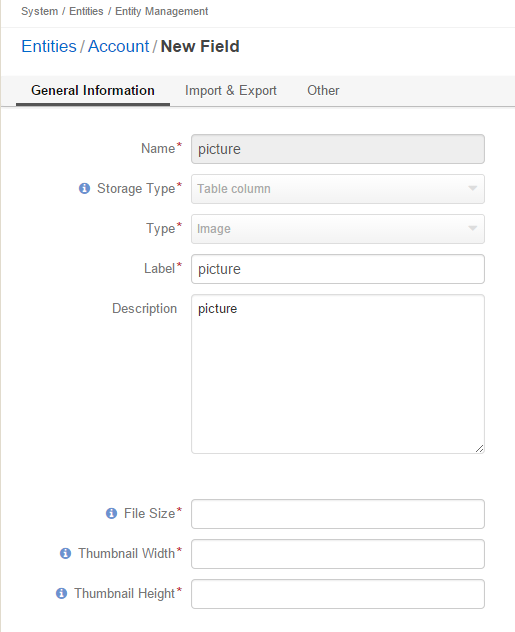

.. _user-guide-field management

Entity Fields
=============

Fields are used to collect details of :ref:`entity <user-guide-entity-management-from-UI>` :term:`records <Record>`. 
For example, street name, zip code and building number are fields of an address. 

Subject to your needs, you can add new fields to any :term:`custom entity <Custom Entity>` or 
an :ref:`extendible <user-guide-entity-management_is_extend>` :term:`system entity <System Entity>`.
This guide describes the way to create and modify fields.

  
Start Field Creation
--------------------

- Go to the :ref:`View page <user-guide-ui-components-view-pages>` of the entity.  

- Click the :guilabel:`Create Field` button. 

- Specify the basic entity details:

.. csv-table::
  :header: "Field", "Description"
  :widths: 10, 30

  "**Field Name***","Name of the field used to refer to it in the system. 
  
  The *Field Name* values shall be unique within one entity. 
  
  The *Field Name* cannot be a `reserved sql 
  word <http://msdn.microsoft.com/en-us/library/ms189822.aspx>`_ ,nor a
  `reserved php word <http://php.net/manual/en/reserved.keywords.php>`_"
  
  "**Storage Type***","There are two options:

- *Serialized field*: allows creation of custom fields without a schema update (the field will appear in the system as 
  soon as it has been added. This is particularly useful for simple custom fields that keep information necessary for 
  an only entity). 
  
  Serialized fields cannot be used for :ref:`grid filters <user-guide-ui-components-grid-filters>`, for
  :ref:`report <user-guide-reports>` and :ref:`chart <user-guide-reports-chart>`generation, for data audit and creation 
  of :ref:`segments <user-guide-filters-segments>` and :ref:`relations <>`
  
  Serialized fields cannot be files, multi-selects or option sets.
  
- *Table column*: store to a database table. If the option is chosen, the field can be used without the limitations 
  applicable to a serialized field. If field stored in the table column has been created, a 
  :ref:schema update `<user-guide-entity-management-create-update>` is required.

  "
"**Type***","Choose the field type from a drop-down."

- Click :guilabel:`Continue` button. 

A bigger form will appear where you can define more field details, subject to the chosen field type.

.. _user-guide-entity-management-create-fields-common:

Add a Common Field
------------------

The section describes how to add a fields of the following types:

- BigInt
- Boolean
- Currency
- Date
- DataTime
- Decimal :ref:`* <additional_general_fields>`
- Float
- Integer
- SmallInt
- Integer
- Percent
- String :ref:`* <additional_general_fields>`
- Text :ref:`** <missing_other_fields>`

.. _user-guide-entity-management-general-common

Common General Section
^^^^^^^^^^^^^^^^^^^^^^
You can see and define general field properties in the section.

**Name***, "**Storage Type***" and **Type***","The values were specified at the previous step and cannot be 
re-defined.

**Label*** is the only mandatory field at the step. The label defines the way the field will be referred to in the UI.

The only optional field in the section is **Description**. It contains information to help you or other users understand
the purpose and specifics of the created field.

.. _additional_general_fields:
  
Decimal fields have two additional optional properties that can be defined in the *General* section:

- **Precision**: maximum number of digits
- **Scale**: Maximum number of decimal places

String fields have an additional optional property **Length**. It is a number from 1 to 255. The property can be used to
limit the length of string properties

.. _user-guide-entity-management-export-import-common

Common Export and Import Settings
^^^^^^^^^^^^^^^^^^^^^^^^^^^^^^^^^

Oro Platform provides for export and import of its entity record details from and into .csv tables. In the section you 
can define the rules applied to the specific field in the course of import and export.

.. csv-table:: Import and Export Settings
  :header: "Field","Description"
  :widths: 10,30

  "**Column Name**","Name of the .csv table column that corresponds to the field (if left blank, the field label will be
  used for export"
  "**Column Position**","Position of the column that corresponds to the field in the .csv table"
  "**Use as Identity Field**","If *Yes* is chosen, the field will be used in the course of import to define if:
 
  - a new item is created (if there are no items with the ID field value equal to the imported) or

  - an existing item is updated (the item with ID field value equal to the imported one's)
 
  "
  "**Exclude Column**", "If chosen, the field will will be omitted when creating a .csv file"
  
  
.. _user-guide-entity-management-other-common

Common Other Field Settings
^^^^^^^^^^^^^^^^^^^^^^^^^^^

The *Other* section is used to define additional field settings.

The following Yes/No options can be defined for each field

.. csv-table:: Import and Export Settings
  :header: "Option","Description"
  :widths: 10,30

  "**Available in Email Templates**","If set to *Yes*, values of the field can be used to create email patterns."
  "**Contact Information**","If set to *Yes*, the field value shall be treated by the system as contact details. (E.g.
  can be used to create marketing lists)"
  "**Show on Grid**","If set to *Yes*, the field will be displayed in a separate column of the respective grid."
  "**Show Grid Filter**","Not available for serialized fields. If set to *Yes*, a corresponding filter will be added to 
  the :ref:`grid filters <user-guide-ui-components-grid-filters>` by default." 
  "**Show on Form**","If set to *Yes*, the field value can be edited from the edit form of the record.

.. caution:: 

    If the *Show on Form* value has been set to *No*, there will be no way to create/update the field values from 
    OroCRM. This is only reasonable for the fields values whereof are uploaded to the system during a synchronization.    

  "**Show on View**","If set to *Yes*, the field is displayed on the *View* page"
  "Priority","Priority defines the order of custom fields on a corresponding view page, edit and create forms and grid. 
  Custom field are always displayed one after another, usually below the system fields. If no priority is defined or the 
  defined priority is "0", the fields will be displayed in the order they have been added to the system (the later - the
  lower). The fields with a higher priority (a bigger value) will be displayed before the fields with a lower priority."
  "**Auditable**","Not available for serialized fields. If set to *Yes*, data on the field processing details is 
  logged."
  "**Applicable Organizations**","Defines for what :term:`organizations <Organization>` the custom field will be added 
  to the :term:`entity <Entity>`.
  
  *All* is chosen by default. Uncheck it to choose specific organizations from the list."
  
.. _missing_other_fields:

Fields of the text type aren't displayed on a grid, so *Show on Grid* and *Show Grid Filter* properties cannot be 
defined for them.
  
  
.. _user-guide-entity-management-create-file:

Adding a File Field
-------------------

Value of a field may be a file, e.g. a document, an agreement, a proposal, etc.

.. image:: ./img/entity_management/new_entity_field_file.png
   :align: right

- The file fields can be only of the *column table* storage type.

- The:ref:`general section <user-guide-entity-management-general-common>` of a file field has an only additional 
  mandatory field **File Size***. The field defines a maximum file size allowed for an upload (in MB).

- The file fields cannot be defined as an identity field for 
  :ref:`export/import <user-guide-entity-management-export-import-common>`

- The file fields aren't displayed on a grid, so *Show on Grid* and *Show Grid Filter* properties cannot be defined for 
  them. Auditing is not available for actions with the file fields.

  
.. _user-guide-entity-management-create-image:
  
Adding an Image Field
---------------------

Value of a field may be a an image, e.g. the customer's picture or image of a product.

- Image fields can be only of the *column table* storage type.

- The :ref:`general section <user-guide-entity-management-general-common>` of an image field has three additional 
  mandatory fields:
  
- **File Size***: defines a maximum file size allowed for an upload (in MB)

- **Thumbnail Width***: defines the thumbnail width in pixels

- **Thumbnail Height***: defines the thumbnail height in pixels

- The image fields cannot be defined as an identity field for 
  :ref:`export/import <user-guide-entity-management-export-import-common>`

- The image fields aren't displayed on a grid, so *Show on Grid* and *Show Grid Filter* properties cannot be defined for 
  them. Auditing is not available for actions with the image fields.

  
  
.. _user-guide-entity-management-create-select:
  
Adding a Select/Multi-Select Field
----------------------------------

Value of a field may be a an image, e.g. the customer's picture or image of a product.

- Image fields can be only of the *column table* storage type.

- The :ref:`general section <user-guide-entity-management-general-common>` of an image field has three additional 
  mandatory fields:
  
- **File Size***: defines a maximum file size allowed for an upload (in MB)

- **Thumbnail Width***: defines the thumbnail width in pixels

- **Thumbnail Height***: defines the thumbnail height in pixels

- The image fields cannot be defined as an identity field for 
  :ref:`export/import <user-guide-entity-management-export-import-common>`

- The image fields aren't displayed on a grid, so *Show on Grid* and *Show Grid Filter* properties cannot be defined for 
  them. Auditing is not available for actions with the image fields.

File General Section
^^^^^^^^^^^^^^^^^^^^

**Name***, "**Storage Type***" and **Type***","The values were specified at the previous step and cannot be 
re-defined.

**Label*** is the only mandatory field at the step. The label defines the way the field will be referred to in the UI.

The only optional field in the section is **Description**. It contains information to help you or other users understand
the purpose and specifics of the created field.

.. _additional_general_fields:
  
Decimal fields have two additional optional properties that can be defined in the *General* section:

- **Precision**: maximum number of digits
- **Scale**: Maximum number of decimal places

String fields have an additional optional property **Length**. It is a number from 1 to 255. The property can be used to
limit the length of string properties

.. _user-guide-entity-management-create-fields-exportimport:

Common Export and Import Settings
^^^^^^^^^^^^^^^^^^^^^^^^^^^^^^^^^

Oro Platform provides for export and import of its entity record details from and into .csv tables. In the section you 
can define the rules applied to the specific field in the course of import and export.

.. csv-table:: Import and Export Settings
  :header: "Field","Description"
  :widths: 10,30

  "**Column Name**","Name of the .csv table column that corresponds to the field (if left blank, the field label will be
  used for export"
  "**Column Position**","Position of the column that corresponds to the field in the .csv table"
  "**Use as Identity Field**","If *Yes* is chosen, the field will be used in the course of import to define if:
 
  - a new item is created (if there are no items with the ID field value equal to the imported) or

  - an existing item is updated (the item with ID field value equal to the imported one's)
 
  "
  "**Exclude Column**", "If chosen, the field will will be omitted when creating a .csv file"
  
.. _user-guide-entity-management-create-fields-other:

Common Other Field Settings
^^^^^^^^^^^^^^^^^^^^^^^^^^^

The following Yes/No options can be defined for each field

.. csv-table:: Import and Export Settings
  :header: "Option","Description"
  :widths: 10,30

  "**Available in Email Templates**","If set to *Yes*, values of the field can be used to create email patterns."
  "**Contact Information**","If set to *Yes*, the field value shall be treated by the system as contact details. (E.g.
  can be used to create marketing lists)"
  "**Show on Grid**","If set to *Yes*, the field will be displayed in a separate column of the respective grid."
  "**Show Grid Filter**","Not available for serialized fields. If set to *Yes*, a corresponding filter will be added to 
  the :ref:`grid filters <user-guide-ui-components-grid-filters>` by default." 
  "**Show on Form**","If set to *Yes*, the field value can be edited from the edit form of the record.

.. caution:: 

    If the *Show on Form* value has been set to *No*, there will be no way to create/update the field values from 
    OroCRM. This is only reasonable for the fields values whereof are uploaded to the system during a synchronization.    

  "**Show on View**","If set to *Yes*, the field is displayed on the *View* page"
  "Priority","Priority defines the order of custom fields on a corresponding view page, edit and create forms and grid. 
  Custom field are always displayed one after another, usually below the system fields. If no priority is defined or the 
  defined priority is "0", the fields will be displayed in the order they have been added to the system (the later - the
  lower). The fields with a higher priority (a bigger value) will be displayed before the fields with a lower priority."
  "**Auditable**","Not available for serialized fields. If set to *Yes*, data on the field processing details is 
  logged."
  "**Applicable Organizations**","Defines for what :term:`organizations <Organization>` the custom field will be added 
  to the :term:`entity <Entity>`.
  
  *All* is chosen by default. Uncheck it to choose specific organizations from the list."
  
.. _missing_other_fields:

Fields of the text type aren't displayed on a grid, so *Show on Grid* and *Show Grid Filter* properties cannot be 
defined for them.
  
.. _user-guide-entity-management-create-relation:

Add Relation for the Entity
^^^^^^^^^^^^^^^^^^^^^^^^^^^
Relation is a field that let's assign an instance (or instances) of one entity to an instance (or instances) of another
entity.

To define a relation, you should:

- :ref:`Create a field <user-guide-entity-management-create-fields>`

- Define the field type in the **Relations** section

.. image:: ./img/entity_management/new_entity_relation.png

The following three options are available:

- **Many to many**: any amount of the entity records can be assigned to any amount of the related entity records 
  (for example any amount of customers may take part in an advertisement campaign and the same customer may take part in
  several advertisement campaigns).

- **Many to one**: any amount the entity records can be assigned to one and only one record of another entity 
  (for example any amount of customers may be assigned to an account in OroCRM, but no customer may be assigned to more 
  than one account)

- **One to many**: one and only one entity record can be assigned to many records of another entity 
  (so one account may be assigned many customer)

For fields that define relations you can 

- Define more :ref:`general information <user-guide-entity-management-create-fields-general-info>` details

- Define :ref:`export and import settings <user-guide-entity-management-create-fields-exportimport>`

- Specify :ref:`ability to view and use the field <user-guide-entity-management-create-fields-other>`

in the same manner you would do it for any other field. The only other thing is that you should specify additional
relation specific settings.

Relation Specific Settings
^^^^^^^^^^^^^^^^^^^^^^^^^^
The following settings shall be defined for *One to Many* and *Many to Many* Relation Settings:

.. csv-table:: 
  :header: "Option","Description"
  :widths: 15,30

  "**Related Entity Data Fields**","Defines a set of the related entity fields displayed in the grid that appears
  one a user has clicked the :guilabel:`+Add` button on the Create/Edit form for new related entity records and in the 
  Edit form for existing related entity records." 
  "**Related Entity Info Title**","Defines a set of the related entity fields displayed on the *View* page."
  "**Related Entity Detailed**","Defines the list of the related entity fields displayed in the form that emerges once a
  user has clicked the link of a related entity record pn the *Edit* form."

The following settings shall be defined for *Many to One* Relation Settings:

.. csv-table::
  :header: "Field","Description"
  :widths: 15,30

  "**Target Entity**","Choose the related entity. Once the entity has been chosen, its records may be related to the 
  entity from the drop-down on the Create/Edit form."
  "**Target Field**","The field chosen will represent the entity records in the drop-down."
 
 
.. _user-guide-entity-management-create-update:

  
Managing Fields
---------------

The following actions are available from the "Action icons" column:
  
  
 
  
  - Click |icDelete| button to remove an entity, It will appear only for Custom entities
  - Click |IcView| to get to the details of a specific entity
  - Click |IcEdit| to get directly to the edit form
  - Once any entity has been deleted |IcRest| will appear. Click the icon to restore the removed entity. It will be
    available until the schema is updated."

This way:

All the properties of Custom fields but their name and type may be edited. The property meanings are the same as when 
you :ref:`create a field <user-guide-entity-management-create-fields>`.

The list of properties editable for System fields depends on configuration and is created in a way reasonable and safe 
for the system performance and operation.  

