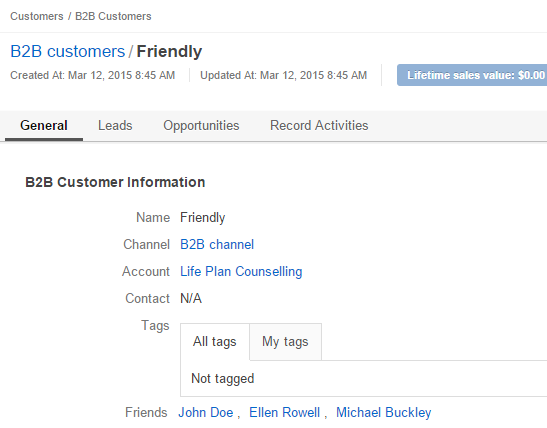

.. _user-guide-field-management:

Entity Fields
=============

Fields are used to collect details of :ref:`entity <user-guide-entity-management-from-UI>` :term:`records <Record>`. 
For example, a "street name", "zip code" and "building number" may be fields of an "address". 

Subject to your needs, you can add new fields to any :term:`custom entity <Custom Entity>` or 
an :ref:`extendible <user-guide-entity-management-edit>` :term:`system entity <System Entity>`.

This guide describes how to create and modify the fields.

.. _user-guide-field-management-create:

Create Entity Fields
--------------------

Creation if an entity field is made on two forms and depends on the field specifics.

Start Creating an Entity Field
^^^^^^^^^^^^^^^^^^^^^^^^^^^^^^

- Go to the :ref:`View page <user-guide-ui-components-view-pages>` of the entity.  

- Click the :guilabel:`Create Field` button. 

- Specify the basic entity details:

.. image:: ./img/entity_management/new_entity_field.png

.. csv-table::
  :header: "Field", "Description"
  :widths: 10, 30

  "**Field Name***","Name of the field used to refer to it in the system. 
  
  The *Field Name* values shall be unique within one entity. 
  
  The *Field Name* cannot be a `reserved sql 
  word <http://msdn.microsoft.com/en-us/library/ms189822.aspx>`_ , nor a
  `reserved php word <http://php.net/manual/en/reserved.keywords.php>`_."
  "**Storage Type***","There are two options:

  - *Serialized field*: allows creation of custom fields without a schema update (the field will appear in the system as 
    soon as it has been added. This is particularly useful for simple custom fields that keep information necessary for 
    an only entity). 
  
   Serialized fields cannot be used for :ref:`grid filters <user-guide-ui-components-grid-filters>`, for
   :ref:`report <user-guide-reports>` and :ref:`chart <user-guide-reports-chart>` generation, for data audit and creation 
   of :ref:`segments <user-guide-filters-segments>` and :ref:`relations <user-guide-entity-management-create-relation>`.
  
   Serialized fields cannot be files, multi-selects or option sets.
  
  - *Table column*: store to a database table. If the option is chosen, the field can be used without the limitations 
    applicable to a serialized field. If field stored in the table column has been created, a 
    :ref:`schema update <user-guide-entity-management-create-update>` is required.
  "
  "**Type***","Choose the field type from a drop-down.
  
  The following types are available:
  
  - BigInt  
  - Boolean
  - Currency
  - Date
  - DataTime
  - Decimal
  - File
  - Float
  - Image
  - Integer
  - Multi-Select
  - Percent
  - Select
  - SmallInt
  - String
  - Text
  - Relations
  
  "
  
- Click :guilabel:`Continue` button. 

A bigger form will appear where you can define more field details, subject to the chosen field type.

.. _user-guide-entity-management-create-fields-common:

Create and Entity of a Specific Type
^^^^^^^^^^^^^^^^^^^^^^^^^^^^^^^^^^^^
The bigger form for creation of an entity field has the following three sections:

- **General Information**: see and define general field properties in the section.

- **Import & Export**: define the rules applied to the specific field in the course of 
  :ref:`export/import <user-guide-export-import>` of the entity.

- **Other**: define additional properties of the field.

Properties that can be defined may vary subject to the chosen field type. 
The following sections provide description of common properties defined for all or most of the types and peculiarities 
of specific types.

.. _user-guide-entity-management-common:

Common Settings
"""""""""""""""

.. _user-guide-entity-management-general-common:

General Information
*******************

The following details are available in the section:

**Name***, **Storage Type*** and **Type***: the values that were specified at the previous step and cannot be 
re-defined.

**Label***: the only mandatory field at the step. The label defines the way the field will be referred to in the UI.

The only optional field in the section is **Description**. It contains information to help you or other users understand
the purpose and specifics of the created field.

.. _user-guide-entity-management-export-import-common:

Export and Import
*****************

The following details are available in the section:

.. csv-table:: 
  :header: "Field","Description"
  :widths: 10,30

  "**Column Name**","Name of the .csv table column that corresponds to the field (if left blank, the field label will be
  used for export)."
  "**Column Position**","Position of the column that corresponds to the field in the .csv table."
  "**Use as Identity Field**","If *Yes* is chosen, the field will be used in the course of import to define if:
 
  - a new item is created (if there are no items with the ID field value equal to the imported), or

  - an existing item is updated (the item with ID field value equal to the imported one's).
 
  "
  "**Exclude Column**", "If chosen, the field will will be omitted when creating a .csv file."
  
  
.. _user-guide-entity-management-other-common:

Other
*****

The following Yes/No options can be defined:

.. csv-table:: 
  :header: "Option","Description"
  :widths: 10,30

  "**Available in Email Templates**","If set to *Yes*, values of the field can be used to create email patterns."
  "**Contact Information**","If set to *Yes*, the field value shall be treated by the system as contact details. (E.g.
  can be used to create marketing lists)."
  "**Show on Grid**","If set to *Yes*, the field will be displayed in a separate column of the respective grid."
  "**Show Grid Filter**","Not available for serialized fields. If set to *Yes*, a corresponding filter will be added to 
  the :ref:`grid filters <user-guide-ui-components-grid-filters>` by default." 
  "**Show on Form**","If set to *Yes*, the field value can be edited from the edit form of the record."
  "**Show on View**","If set to *Yes*, the field is displayed on the *View* page."
  "**Priority**","Priority defines the order of custom fields on a corresponding view page, edit and create forms and 
  grid. 
  
  Custom fields are always displayed one after another, usually below the system fields. If no priority is defined or the 
  defined priority is 0, the fields will be displayed in the order they have been added to the system (the later - the
  lower). The fields with a higher priority (a bigger value) will be displayed before the fields with a lower priority."
  "**Auditable**","Not available for serialized fields. If set to *Yes*, data on the field processing details is 
  logged."
  "**Applicable Organizations**","Defines for what :term:`organizations <Organization>` the custom field will be added 
  to the :term:`entity <Entity>`.
  
  *All* is chosen by default. Uncheck to choose specific organizations from the list."

.. caution:: 

      If the *Show on Form* value has been set to *No*, there will be no way to create/update the field values from 
      OroCRM. This is only reasonable for the fields values whereof are uploaded to the system during a synchronization. 

Type-Related Peculiarities
""""""""""""""""""""""""""
Properties defined in the :ref:`Common Settings <user-guide-entity-management-common>` section above fully cover 
the field creation process for the following types:

- BigInt
- Boolean
- Currency
- Date
- DataTime
- Float
- Integer
- SmallInt
- Integer
- Percent

Peculiarities of other types are described in the sections below under the corresponding type name:

      |

Decimal
*******

Decimal fields have two additional optional properties that can be defined in the *General* section:

- **Precision**: maximum number of digits.
- **Scale**: Maximum number of decimal places.

       |

String
*******

String fields have an additional optional property **Length**. It is a number from 1 to 255. The property can be used to
limit the length of string properties.

       |

Text
****
Fields of the text type aren't displayed on a grid, so *Show on Grid* and *Show Grid Filter* properties cannot be 
defined for them.

      |
  
.. _user-guide-entity-management-create-file:

File
****  

.. image:: ./img/entity_management/new_entity_field_file.png
   :align: middle

- The file fields can be only of the *column table* storage type.

- The :ref:`general information section <user-guide-entity-management-general-common>` of a file field has an only 
  additional mandatory field **File Size***. The field defines a maximum file size allowed for an upload (in MB).

- The file fields cannot be defined as an identity field for 
  :ref:`export/import <user-guide-entity-management-export-import-common>`.

- The file fields aren't displayed on a grid, so *Show on Grid* and *Show Grid Filter* properties cannot be defined for 
  them. Auditing is not available for actions within the file fields.

  
.. _user-guide-entity-management-create-image:

Image
*****  

- Image fields can be only of the *column table* storage type.

- The :ref:`general section <user-guide-entity-management-general-common>` of an image field has three additional 
  mandatory fields:
  
  - **File Size***: defines a maximum file size allowed for an upload (in MB).

  - **Thumbnail Width***: defines the thumbnail width in pixels.

  - **Thumbnail Height***: defines the thumbnail height in pixels.

.. image:: ./img/entity_management/new_entity_field_image.png
   :scale: 50%

- The image fields cannot be defined as an identity field for 
  :ref:`export/import <user-guide-entity-management-export-import-common>`.

- The image fields aren't displayed on a grid, so *Show on Grid* and *Show Grid Filter* properties cannot be defined for 
  them. Auditing is not available for actions with the image fields.

  
.. _user-guide-entity-management-create-select:
  
Select and Multi-Select
*********************** 

The value of a field may enable users to choose one or several values from the list (select and multi-select type 
correspondingly). For example, "grade the level of service from 1 to 5" or "choose the time window convenient for you".

- The select and multi-select fields can be only of the *column table* storage type.

- If you have chosen a "select" or "multi-select" option in the "Type" field, additional property "Options".

- Click the :guilabel:`+Add` button to add an option. (For example, numbers from 1 to 5 for the service level assessment
  or different time-periods, etc.).

- For each option you can:

  - Define an option as chosen by default: check the flag next to the option value . For multi-select these may 
    be done to several options.
  
  - Move it up and down around the list: drag the option by the |IcMove| icon next to the option value.

  - Delete it: click the :guilabel:`X` next to the option value. Please note that if you delete an option when editing a field,
    the option will be removed from all the records in the system (where applicable).

- The select and multi-select fields cannot be defined as an identity field for 
  :ref:`export/import <user-guide-entity-management-export-import-common>`.

- All the :ref:`other common field settings <user-guide-entity-management-other-common>` can be applied to the select 
  and multi-select fields.

      |  
  
.. _user-guide-entity-management-create-relation:
  
Relations
*********

Relation is a field that enables users to tie record(s) of one entity to record(s) of another entity.
For example each :term:`customer` has an :term:`account`, and each account can be assigned several contacts.

- Define the field type in the **Relations** section.

.. image:: ./img/entity_management/new_entity_relation.png

The following three options are available:

- **Many to many**: any amount of the entity records can be assigned to any amount of the related entity records 
  (for example any amount of customers may take part in an advertisement campaign and the same customer may take part in
  several advertisement campaigns).

- **One to many**: one and only one entity record can be assigned to many records of another entity 
  (so one account may be assigned many customer).

- **Many to one**: any amount the entity records can be assigned to one and only one record of another entity 
  (for example any amount of customers may be assigned to an account in OroCRM, but no customer may be assigned to more 
  than one account).

The following is true for all the relations fields:
  
- The relation fields can be only of the *column table* storage type.

- The relation fields cannot be defined as an identity field for 
  :ref:`export/import <user-guide-entity-management-export-import-common>`.

- The image fields aren't displayed on a grid, so *Show on Grid* and *Show Grid Filter* properties cannot be defined for 
  them.
  
  
*One to Many and Many to Many Relations*
****************************************

If the "One to many" or "Many to many" type has been chosen for a field, its *General Information* section will contain 
the **Target Entity** property. It specifies to records of which entity record(s) of the chosen entity can be tied.

(For example, we have created a field "Friends" that relates to users, who have become our clients following the 
recommendations of a specific B2B customer. This is a One to Many relation, as one B2B customer may advise many 
friends). 

Once the entity has been chosen, its properties can be used to define the following settings:

- **Related Entity Data Fields**: set of the related entity properties displayed in the grid that appears once a user 
  has clicked the :guilabel:`+Add` button on the Create/Edit form of the master record below the link.
 
- **Related Entity Info Title**: a set of the related entity properties displayed as a link on the *Edit* form and on 
  the *View* page of a master record.

- **Related Entity Detailed**: a set of the related entity properties displayed in the form that emerges once a
  user has clicked the link of a related entity record on the *Edit* form.
  
.. hint::

    Hold the **Ctrl** key to choose several properties.

For the sake of example, our "Friends" field has the following values:

- **Target Entity**: User.

- **Related Entity Data Fields**: First Name, Last Name and Primary Email.
 
- **Related Entity Info Title**: First Name and Last Name.

- **Related Entity Detailed**: all the fields available.

Let's create a B2B Customer:

The following grid appears once you've clicked the :guilabel:`+Add` button against the "Friends" filed of the record on 
the Edit/Create form:

      |
  

|

It contains all the fields defined for the *Related Entity Data Fields*.

We have added three users. They are now displayed on the Create/Edit form. The link-titles contain properties defined 
for the *Related Entity Info Title* and *Related Entity Data Fields* are displayed for each record below the link.

      |
  

|
   
If you click the link name of one of the users, a form with all the details specified in the *Related Entity 
Detailed* appears.

      |

|
   
The *Related Entity Info Title* properties are also used to represent the  related users on the View page ("Friends 
section").

   
Many to One Relations
**********************

If the "Many to one" type has been chosen for a field, its *General Information* section will contain the
**Target Entity** property. It specifies to a record of which entity records of the chosen entity can be tied.
(For example, many users can belong to the same business unit).

Once the entity has been chosen, you can choose any of its fields as a "Target Field". It will represent the entity 
records in the drop-down.

As an example, we have created a relation "Business Unit" with:

- **Target Entity**: Business Unit.

- **Target Field**: Name.

Now, when creating/editing a User record, you can choose a related business unit from the list. Business Unit records in
the list are represented with their "Name" values.

.. _user-guide-field-edit:

Manage Entity Fields
--------------------

The following actions are available from the *Fields* section of a View page of an 
:ref:`entity <user-guide-entity-management-edit>`:

  
- Remove a field: click |icDelete|. The action is available only for custom entities.
  
- Click |IcEdit| to get directly to the entity edit form.

  All the properties of custom fields but their name and type may be edited. The properties are the same as when 
  you :ref:`create a field <user-guide-entity-management-create-fields>`.

  The list of properties editable for System fields depends on configuration and is created in a way reasonable and safe 
  for the system performance and operation.  

.. |IcMove| image:: ./img/buttons/IcMove.png
   :align: middle

.. |IcDelete| image:: ./img/buttons/IcDelete.png
   :align: middle

.. |IcEdit| image:: ./img/buttons/IcEdit.png
   :align: middle

.. |IcView| image:: ./img/buttons/IcView.png
   :align: middle
   
.. |IcRest| image:: ./img/buttons/IcRest.png
   :align: middle
