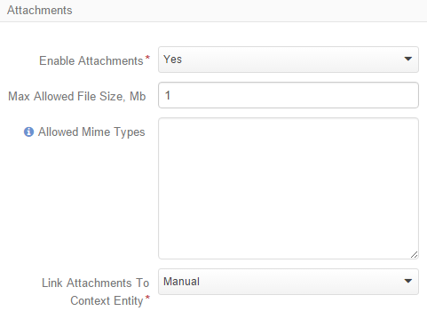
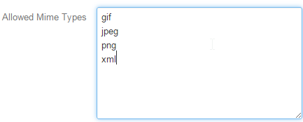

.. _user-guide-entity-management-from-UI:

Entity Management
=================

Entity is a group of rules and setting used to create and process all the records of the system that belong thereto.

The OroCRM comes with a number of out of the box entities and can be populated with necessary entities from the 
back-end.
However, sometimes there appears a need to create additional entities from the UI. They are called Custom entities.
In this article you can learn how to create custom entities and manage entities from the UI.

.. _user-guide-entity-management-create:
    
Creating an Entity from the UI
------------------------------

In order to create an Entity: 

1. Go the the *System → Entities → Entity Management* page and click the :guilabel:`Create Entity` button.
   *Entities/New entity* form will appear.

2. Define the :ref:`general information <user-guide-entity-management-create-general-information>` of the entity 
   created.

3. Define what :ref:`activities <user-guide-entity-management-create-commun-collab>` can performed for the entity.

4. Define the :ref:`attachments settings <user-guide-entity-management-create-attachments>`.

5. Define :ref:`other processing settings <user-guide-entity-management-create-other>`, i.e. the ownership 
   type, auditabilty and visibility in the grid.
  
6. Create at least one :ref:`field <user-guide-entity-management-create-fields>` for the entity.

7. :ref:`Update <user-guide-entity-management-create-update>` the schema.

.. _user-guide-entity-management-create-general-information:

General Information
^^^^^^^^^^^^^^^^^^^

The following two fields are mandatory and **must** be defined:

.. csv-table::
  :header: "Field", "Description"
  :widths: 10, 30

  "**Name***","Name used to refer to the entity in the system.
  Name field cannot be a `reserved sql word <http://msdn.microsoft.com/en-us/library/ms189822.aspx>`_
  
  .. caution::

    **The Name value must be unique for every Custom entity created.** Fault to do so may cause partial update of 
    the existing entity and failure of the schema update"
  "**Label***","The label will be used to refer to the entity in the UI. 
  
  .. note::
  
    Labels may duplicate, though keep in mind that from the UI perspective it will be impossible to distinguish
    them, so it is better to keep them unique."
    
The following general entity details are optional and may be specified:

.. csv-table::
  :header: "Field", "Description"
  :widths: 10, 30

  "**Icon**","All the entity records will be displayed with the icon chosen."
  "**Plural Label**","The label defined will be used to name the menu items and grids related to the entity."
  "**Description**","Free text info to help you or other users understand the purpose and specifics of the created 
  entity in future."  

  
.. _user-guide-entity-management-create-commun-collab:

Communication & Collaboration
^^^^^^^^^^^^^^^^^^^^^^^^^^^^^

The section contains check-boxes for all the activities available and *Enable Notes* drop-down.

.. image:: ./img/entity_management/new_entity_communication_collaboration.png

- Check the activities that you want to enable for the entity.

- Choose *Yes* in the drop-down and it will be possible to add free text *Notes* to the entity records.

.. _user-guide-entity-management-create-attachments:

Attachment Settings
^^^^^^^^^^^^^^^^^^^

You can enable attachments for the entity records and define relevant limitations.

- Choose *Yes* in the drop-down to enable attachments.

- Define the upper limit of an attachment size, if necessary. No larger attachments will be added.

- Limit the list of supported mime types if necessary. If no mime type is defined, the list defined in 
  the *System → Configuration → Upload Settings* will be used. 
  
  Define the list of mime types supported in the field, add each new type on a new line. For example:
  

   

.. _user-guide-entity-management-create-other:

Other Settings
^^^^^^^^^^^^^^

The following three fields must be specified for every entity created:

.. csv-table::
  :header: "Name","Description"
  :widths: 10, 30

  "**Ownership Type***","Defines the level at which permissions will be set for instances of the entity:
  
  - None: no authorization is required to see and process the entity.
  
  - User/Business Unit/Organization: defines the level at which an Owner can be defined.
    
  "
  "**Auditable**","If enabled, the actions performed with the entity records will be recorded and can be 
  viewed with System → Audit functionality.
  
  " 
  "**Workflow Step in Grid**","

  - Show: if there is a workflow defined for the entity, the workflow *Step* will be displayed on the entity records
    *View* page

  - Hide: no steps will be shown, even if there is a workflow defined for the entity."
  

.. _user-guide-entity-management-create-fields:
  
Add Fields to an Entity
-----------------------

Entity with no fields is meaningless and will not be processed by the system. Once an entity has been created, you will
get to the *View* page of the new entity. In order to define a new field you need to:

- Click :guilabel:`Create Field` button. 

- Define the general information in the emerged page.

The following values **must** be specified:

.. csv-table:: Mandatory Fields for a Field Created
  :header: "Field", "Description"
  :widths: 10, 30

  "**Field Name***","Name of the field used to refer to it in the system. 
  
  The *Field Name* values shall be unique within one entity. 
  
  The *Field Name* cannot be a `reserved sql 
  word <http://msdn.microsoft.com/en-us/library/ms189822.aspx>`_ ,nor a
  `reserved php word <http://php.net/manual/en/reserved.keywords.php>`_"
  "**Type***","Choose the field type from a drop-down."

- Click :guilabel:`Continue` button. 

A bigger form will appear where you can:

- Define more :ref:`general information <user-guide-entity-management-create-fields-general-info>` details

- Define :ref:`export and import settings <user-guide-entity-management-create-fields-exportimport>`

- Specify :ref:`ability to view and use the field <user-guide-entity-management-create-fields-other>`

.. _user-guide-entity-management-create-fields-general-info:

*Field General Information*
^^^^^^^^^^^^^^^^^^^^^^^^^^^

The following fields are mandatory and **must** be defined

.. csv-table::
  :header: "Field Defined","Description"
  :widths: 10, 30

  "**Name*** and **Type***","The values were specified at the previous step and cannot be re-defined."
  "**Label***","The way the field will be referred to in the UI
  
  By default filled with the *Name* value."

There are also optional fields in the section that can be defined for some of the fields:

.. csv-table::
  :header: "Field","Type","Description"
  :widths: 20,10,30

  "Description","Any","Information to help you or other users understand the purpose and specifics of the created field 
  in the future."  
  "Length","String","Any number from 1 to 255 can be used to limit the length of string properties"
  "Precision","Decimal","Maximum number of digits"
  "Scale","Decimal","Maximum number of decimal places"

  
.. _user-guide-entity-management-create-fields-exportimport:

*Export and Import Settings*
^^^^^^^^^^^^^^^^^^^^^^^^^^^^

Oro Platform provides for export and import of its entity record details from and into .csv tables. In the section you 
can define the rules applied to the specific field in the course of import and export.

.. csv-table:: Import and Export Settings
  :header: "Field","Description"
  :widths: 10,30

  "**Column Name**","Name of the .csv table column that corresponds to the field (if left blank, the field label will be
  used for export"
  "**Column Position**","Position of the column that corresponds to the field in the .csv table"
  "**Use as Identity Field**","If *Yes* is chosen, the field will be used in the course of import to define if:
 
  - a new item is created (if there are no items with the ID field value equal to the imported) or

  - an existing item is updated (the item with ID field value equal to the imported one's)
 
  "
  "**Exclude Column**", "If chosen, the field will will be omitted when creating a .csv file"
  
.. _user-guide-entity-management-create-fields-other:

Other Field Settings
^^^^^^^^^^^^^^^^^^^^

The following Yes/No options can be defined for each field

.. csv-table:: Import and Export Settings
  :header: "Option","Description"
  :widths: 10,30

  "**Show on Grid**","Field will be displayed in the grid of the entity records"
  "**Show Grid Filter**","Filter for the field will be available on the grid"
  "**Show on Form**","Field can be edited from the edit form
  
  .. caution:: 
    
    If *No* is chosen for *Show on Form* of the field, it cannot be edited"
  "**Show on View**","Field can be seen on the *View* page"
  "**Available in Email Templates**","The field can be used to create E-mail templates"
  "**Auditable**","Data on the field processing details is logged"
  
  
.. _user-guide-entity-management-create-relation:

Add Relation for the Entity
^^^^^^^^^^^^^^^^^^^^^^^^^^^
Relation is a field that let's assign an instance (or instances) of one entity to an instance (or instances) of another
entity.

To define a relation, you should:

- :ref:`Create a field <user-guide-entity-management-create-fields>`

- Define the field type in the **Relations** section

.. image:: ./img/entity_management/new_entity_relation.png

The following three options are available:

- **Many to many**: any amount of the entity records can be assigned to any amount of the related entity records 
  (for example any amount of customers may take part in an advertisement campaign and the same customer may take part in
  several advertisement campaigns).

- **Many to one**: any amount the entity records can be assigned to one and only one record of another entity 
  (for example any amount of customers may be assigned to an account in OroCRM, but no customer may be assigned to more 
  than one account)

- **One to many**: one and only one entity record can be assigned to many records of another entity 
  (so one account may be assigned many customer)

For fields that define relations you can 

- Define more :ref:`general information <user-guide-entity-management-create-fields-general-info>` details

- Define :ref:`export and import settings <user-guide-entity-management-create-fields-exportimport>`

- Specify :ref:`ability to view and use the field <user-guide-entity-management-create-fields-other>`

in the same manner you would do it for any other field. The only other thing is that you should specify additional
relation specific settings.

Relation Specific Settings
^^^^^^^^^^^^^^^^^^^^^^^^^^
The following settings shall be defined for *One to Many* and *Many to Many* Relation Settings:

.. csv-table:: 
  :header: "Option","Description"
  :widths: 15,30

  "**Related Entity Data Fields**","Defines a set of the related entity fields displayed in the grid that appears
  one a user has clicked the :guilabel:`+Add` button on the Create/Edit form for new related entity records and in the 
  Edit form for existing related entity records." 
  "**Related Entity Info Title**","Defines a set of the related entity fields displayed on the *View* page."
  "**Related Entity Detailed**","Defines the list of the related entity fields displayed in the form that emerges once a
  user has clicked the link of a related entity record pn the *Edit* form."

The following settings shall be defined for *Many to One* Relation Settings:

.. csv-table::
  :header: "Field","Description"
  :widths: 15,30

  "**Target Entity**","Choose the related entity. Once the entity has been chosen, its records may be related to the 
  entity from the drop-down on the Create/Edit form."
  "**Target Field**","The field chosen will represent the entity records in the drop-down."
 
 
.. _user-guide-entity-management-create-update:

Update Schema
-------------
Once you have defined necessary entities and their fields, at the top right corner of the page of any new or extended 
entity there will appear an :guilabel:`Update Schema` button. Click the button. The Schema update can take some time, 
so please be patient.

.. note::
    
    Please note hat the Schema Update influences the overall system performance and updates the schema for all the 
    created/updated entities.

.. _user-guide-entity-management-edit:

Editing Entities from UI
-------------------------

Sometimes there appears a need to edit or extend (add new fields to) existing entities of the Oro Platform from the 
Web UI.

Entities Grid or What We Can Edit
^^^^^^^^^^^^^^^^^^^^^^^^^^^^^^^^^

The following table describes columns of the Entities grid and how they effect ability to edit the entity:

.. csv-table:: Mandatory Entity Fields
  :header: "Column","What's in it","Effect ability to edit?"
  :widths: 10, 30, 30

  "**LABEL***","Name used to refer to the entity in the system UI","No"
  "**SCHEMA STATUS**","Defines the state of current schema for the entity.","No, but unless its value is *Active* your 
  changes to entities an/or their fields will not have affect for the system, until you 
  :ref:`Update the Schema <user-guide-entity-management-create-update>`" 
  "**IS EXTEND**","Defines if new fields can be added to the entity","Yes. If the entity is no extend, you cannot add 
  any new fields to it (if you feel that it is crucial for you business needs, you can address the developers to change 
  the configuration of the entity at the back-end or create a duplicate custom entity)"
  "**TYPE**","Defines whether the entity was loaded from the back-end (System) or created in the UI (Custom)","Custom 
  entities are always extend, while for System entities this may differ subject to the configuration. System entities 
  cannot be deleted"
  "**AUDITABLE**","Defines if the actions performed on the entity records shall be logged","No"
  "**OWNERSHIP TYPE**","Defines the level at which permissions will be set for instances of the entity as
  described in the Create Entities guide :ref:section`user-guide-entity-management-create-other-ownership-type`","Not 
  directly, however, you need to have permissions to edit the entity (See System → User Management → Roles)"
  "**NAME** and **MODULE**","Define the name used to refer to the entity at the back-end. Comes handy if there is a 
  need to change configuration or otherways find the entity in the code","No"
  "**UPDATED AT**","The date and time of the last schema update for the entity","No"
  "...","Action icons","Hover your mouse over the *...* to access the action icons.
  
  - Click |icDelete| button to remove an entity, It will appear only for Custom entities
  - Click |IcView| to get to the details of a specific entity
  - Click |IcEdit| to get directly to the edit form
  - Once any entity has been deleted |IcRest| will appear. Click the icon to restore the removed entity. It will be
    available until the schema is updated."

This way:

- Edit form is available for any entity in the system. List of editable properties for each of the System type 
  entities depends on configuration and is created in a way reasonable and safe for the system performance and 
  operation. 
  (Some properties may be disabled for editing, this means that this is restricted at the system level).
  The list of fields on the Edit form is the same as when you :ref:`Create an 
  entity <user-guide-entity-management-create>`
  
- Only for the entities with "IS EXTEND" = "Yes" you can :ref:`create <user-guide-entity-management-create-fields>` new
  fields.

  
Editing Fields
^^^^^^^^^^^^^^

When you go to the entity view page, there is a grid of fields below. Just as entities, the fields may be of System and 
Custom TYPE and have different SHEMA STATUS.

All the properties of Custom fields but their name and type may be edited. The property meanings are the same as when 
you :ref:`create a field <user-guide-entity-management-create-fields>`.

The list of properties editable for System fields depends on configuration and is created in a way reasonable and safe 
for the system performance and operation.

.. |IcDelete| image:: ./img/buttons/IcDelete.png
   :align: middle

.. |IcEdit| image:: ./img/buttons/IcEdit.png
   :align: middle

.. |IcView| image:: ./img/buttons/IcView.png
   :align: middle
   
.. |IcRest| image:: ./img/buttons/IcRest.png
   :align: middle
   
