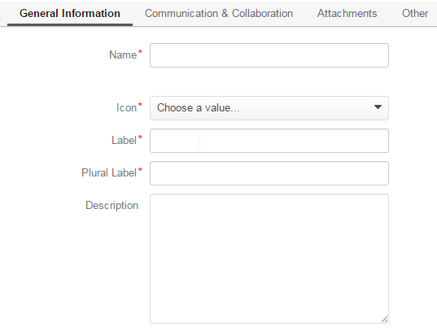
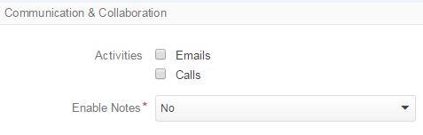
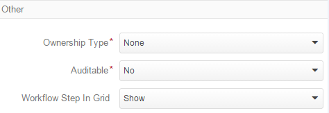
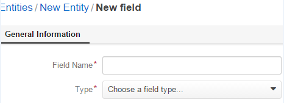
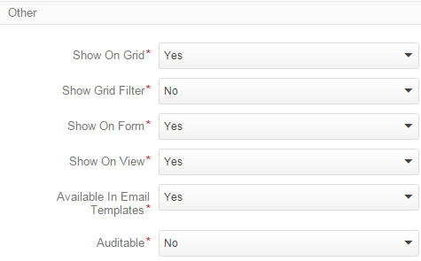
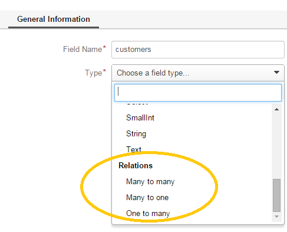
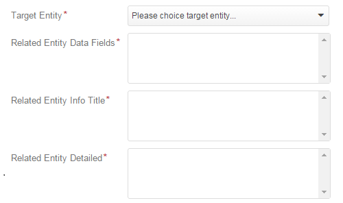
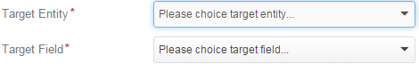

.. _platform-entity-management-create-from-UI:

Entity Management. Creating Entities from UI
============================================

What We are Talking About
-------------------------

Entity is a group of rules and setting such used to create and process all the records of the system the belong to this 
group (such records are called *the Entity instances*).

Entity Management is performed in the same manner both for the OroCRM System and for the Oro Platform, whereas the only
difference is that OroCRM is pre-filled with CRM-oriented Entities.

The ways of processing entities in the course of customization are described in the 
`Customizing the Database 
Schema <http://www.orocrm.com/documentation/index/current/book/customization#customizing-the-database-schema>`_ section
of the Oro Customization guide.

This specific document is devoted to creation and modification of Entities in the Oro Platform from the Web UI.

Steps to Perform
----------------

In order to create an Entity: 

- Go the the *System --> Entities --> Entity Management* page and click the :guilabel:`Create Entity` button

- *Entities/New entity* form will appear 

  - Fill the :ref:`general Information <platform-entity-management-create-general-information>` : define basic details 
    of the Entity created

  - Define the :ref:`communication and collaboration settings <platform-entity-management-create-commun-collab>` : 
    enable activities for the Entity and define if notes are allowed

  - Specify the :ref:`attachments settings <platform-entity-management-create-attachments>`

  - Define some :ref:`other processing settings <platform-entity-management-create-other>`, i.e. the ownership 
    type, auditabilty and visibility in the grid 
  
- Create at least one :ref:`field <platform-entity-management-create-fields>` for the entity instances and/or 
    :ref:`define a relation <platform-entity-management-create-relation>` 

- :ref:`Update the Schema <platform-entity-management-create-update>` 

.. _platform-entity-management-create-general-information:

*General Information*
---------------------

The following two fields are mandatory and **must** be defined:

.. csv-table:: Mandatory Entity Fields
  :header: "Field", "Description"
  :widths: 10, 30

  "**Name***","This is a name used to refer to the entity in the system.

  Name field cannot be empty, shall consist of Latin alphabet letters and may also contain numbers and symbols and shall
  not be shorter than 5 symbols. 
  
  Name field cannot be a `reserved sql word <http://msdn.microsoft.com/en-us/library/ms189822.aspx>`_
  
  .. caution::

      **The *Name* value must be unique for every Custom entity created.** Fault to do so may cause partial update of 
      the existing entity and failure of the schema update"
      
  "**Label***","The label will be used to refer to the entity in UI. 
  
  .. note::
  
    Labels may duplicate, though keep in mind that from the average user respective it will be impossible to distinguish
    them, so it is better to keep them unique, unless there is some specific need for duplication."
    
The following general entity details may be specified:

.. csv-table:: Optional Entity Fields
  :header: "Field", "Description"
  :widths: 10, 30

  "**Icon**","All the instances of the entity will be displayed with the icon chosen."

  "**Plural Label**","The label defined will be used to name the menu items and grid related to instances of the entity
  created."

  "**Description**","Information specified in the field is available only from the Entities/Entity page and can be defined 
  to help you or other users understand the purpose and specifics of the created entity in future."  

  
.. _platform-entity-management-create-commun-collab:

*Communication & Collaboration*
-------------------------------

In the section you will see the list of check-boxes for all the activities available and *Enable Notes* drop-down.

- Check the ones that you want to enable for the instances of the custom entity created.
  
  For example, if you check the *Emails* box, it will be possible to create an Email from the page of the entity 
  instance.

- Choose *Yes* in the drop-down and it will be possible to add free text *Notes* for each instance of the Entity.

.. hint::

   If there is more than one activity possible for the entity (e.g. if you can add both Emails and notes), instead of
   separate buttons, the user will see a 

   
.. _platform-entity-management-create-attachments:

*Attachment Settings*
---------------------

You can enable attachments being added to instances of the entity and define limitation therefore.

.. image:: ./img/entity_management_create/new_entity_attachment.png

- Choose *Yes* in the drop-down to enable attachments. This is a free-text field that will appear once you click 
  :guilabel:`Add Note` button.

- Define the upper limit of an attachment size, if necessary. No attachments bigger than specified will be added to
  instances of the entity.

- Limit the list of supported mime types if necessary. Define the list of mime types supported in the field, add each 
  new type on a new line, 
  
  For example:
  
  ..image :: ./img/entity_management_create/new_entity_general_mime_types

.. _platform-entity-management-create-other:

*Other Settings*
----------------

The following three fields must be specified for every entity created:

.. csv-table:: Mandatory Entity Fields
  :header: "Field", "Description"
  :widths: 10, 30

  "**Ownership Type***","Defines the level at which permissions will be set for instances of the entity. Available 
  values:
  
  - None : no authority required to see and process the entity.
  
  - User : for each instance of the entity there must be defined a User that will be assigned as an Owner of this 
    instance. Subject to the Roles settings (*System --> User Management --> Roles/Entity*), only this User or all the 
    Users of a business unit/division/organization/system this user belongs to will be able to view and process the 
    instances.
    
  - Business Unit : for each instance of the entity there must be defined a Business Unit that will be assigned as an 
    Owner of this instance. Subject to the Roles settings, only Users assigned to this business unit or to the
    division/organization/system this business unit belongs to will be able to view and process the instances.
    
  - Organization : for each instance of the entity there must be defined an Organization that will be assigned as an 
    Owner of this instance. Subject to the Roles settings, only Users assigned to this organization or to the system the
    organization belongs to will be able to view and process the instances."
    
  "**Auditable**","Whether actions performed in the system with instances of the entity shall be recorded and can be 
  viewed with System --> Audit functionality.
    
  Choose *Yes* in the drop-down menu to enable the functionality."
    
  "**Workflow Step in Grid**","There are two options available:
  
  - Show: if there is a workflow defined for the entity, grid that displays all the instances of the entity visible to 
    the User will contain *Step* column where current status of each entity for the workflow will be specified.
  
  - Hide: no steps will be shown in the grid, even if there is a workflow defined for the entity."
  

.. _platform-entity-management-create-fields:
  
*Adding Fields to an Entity*
-----------------------------

Entity with no fields is meaningless and will not be processed by the system. Once an entity has been created, you will
get to the page of the new entity. In order to define a new field you need to:

- Click :guilabel:`Create Field` button. 

- Define General Information in the emerged page.

The following values must be specified:

.. csv-table:: Mandatory Fields for a Field Created
  :header: "Field", "Description"
  :widths: 10, 30

  "**Field Name***","Name of the field that will be used to refer to the field in the system. 
  
  Field Name values shall be unique within one entity. 
  
  The Field Name cannot be empty, its value should contain only lower case alphabetic symbols and may also contain 
  underscore and numbers and cannot be shorter than two symbols.
 
  Name field cannot be a `reserved sql word <http://msdn.microsoft.com/en-us/library/ms189822.aspx>`_ ,nor a
  `reserved php word <http://php.net/manual/en/reserved.keywords.php>`_"
  
  "**Type***","Choose the field type from a drop-down."

- Click :guilabel:`Continue` button. 

A bigger form will appear where you can:

- Define more :ref:`general information <platform-entity-management-create-fields-general-info>` details

- Define :ref:`export and import settings <platform-entity-management-create-fields-exportimport>`

- Specify :ref:`ability to view and use the field <platform-entity-management-create-fields-other>`

.. _platform-entity-management-create-fields-general-info:

Field General Information
^^^^^^^^^^^^^^^^^^^^^^^^^

.. image:: ./img/entity_management_create/new_entity_field_general.png

The following fields are mandatory and **must** be defined

.. csv-table:: Mandatory Fields Defined for a Field Created
  :header: "Field Defined","Description"
  :widths: 10, 30

  "**Name*** and **Type***","The values were specified at the previous step and cannot be re-defined."
  
  "**Label***","Specifies the way the field will be referred to in the UI
  
  By default filled with the *Name* value."

There are also optional fields in the section that can be defined for some of the fields subject to their type:

- **Description**: information specified in the field is available only from the Field page and can be defined 
  to help you or other users understand the purpose and specifics of the created field in future. 
  
  There are some other additional fields, available and meaningful subject to a specific type of the field created.

.. csv-table:: Mandatory Fields Defined for a Field Created
  :header: "Type of the Field Created","Field Defined","Description"
  :widths: 10,20,30

  "String","Length","Any number from 1 to 255 can be used to limit the length of string properties"

  "Decimal","Precision","Maximum number of digits that are present in the number"
  
  "Decimal","Scale","Maximum number of decimal places"

  
.. _platform-entity-management-create-fields-exportimport:

Export and Import Settings
^^^^^^^^^^^^^^^^^^^^^^^^^^

.. image:: ./img/entity_management_create/new_entity_field_exportimport.png

Oro Platform provides for export and import of its entity details from and into .csv tables. In the section you can
define the rules applied to the specific field in the course of import and export.

.. csv-table:: Import and Export Settings
  :header: "Field","Description"
  :widths: 10,30

  "**Column Name**","Name of the .csv table column that corresponds to the field (if left blank, the field label will be
  used"
  
  "**Column Position**","position of the .csv table column that corresponds to the field"
  
  "**Use as Identity Field**","If *Yes* is chosen, the field will be used in the course of import to define if:
  - a new item is created (if there are no items with the ID field value equal to the imported) or
  - an existing item is updated (the item with ID field value equal to the imported)"
  
  "**Exclude Column**", "If chosen, the field will will be omitted when creating a .csv file"
  
.. _platform-entity-management-create-fields-other:

Other Field Settings
^^^^^^^^^^^^^^^^^^^^

The following Yes/No options can be defined for each field

.. csv-table:: Import and Export Settings
  :header: "Field","Description"
  :widths: 10,30

  "**Show on Grid**","Field will be displayed in the grid of the entity instances"
  
  "**Show Grid Filter**","Filter for the field will be displayed on the grid"

  "**Show on Form**","Field can be edited on the edit form of the entity instances
  
  ..caution:: 
  
      If *No* is chosen for *Show on Form* of the field, it cannot be edited"
      
  "**Show on View**","Field can be seen in the details of the entity instances"
  
  "**Available in Email Templates**","The field can be used to create E-mail templates"
  
  "Auditable","Data on the field processing details is logged"
  
  
.. _platform-entity-management-create-relation:

Add Relation for the Entity
^^^^^^^^^^^^^^^^^^^^^^^^^^^
Relation is a field that let's assign an instance (or instances) of one entity to an instance (or instances) of another
entity.

To define a relation, you should:

- :ref: `Create a field <platform-entity-management-create-fields>`

- define the field type in the **Relations** section

The following three options are available:

- **Many to many**: any amount of instances of one entity can be assigned to any amount of instances of another entity 
  (for example any amount of customers may take part in an advertisement campaign and the same customer may take part in
  several advertisement campaigns).

- **Many to one**: any amount of instances of one entity can be assigned to one and only one instance of another entity 
  (for example any amount of customers may be assigned to an account in OroCRM, but no customer may be assigned to more 
  than one account)

- **One to many**: one and only one instance of the entity can be assigned to many instances of another entity 
  (so one account may be assigned many customer)

For the fields that define relations you can 

- Define more :ref:`general information <platform-entity-management-create-fields-general-info>` details

- Define :ref:`export and import settings <platform-entity-management-create-fields-exportimport>`

- Specify :ref:`ability to view and use the field <platform-entity-management-create-fields-other>`

in the same manner you would do it for any other field. The only other thing is that you should specify additional
relation specific settings.

Relation Specific Settings
^^^^^^^^^^^^^^^^^^^^^^^^^^
The following settings shall be defined for *One to Many* and *Many to Many* Relation Settings:

.. csv-table:: *One to Many* and *Many to Many* Relation Settings
  :header: "Field","Description"
  :widths: 15,30

  "**Related Entity Data Fields**","When creating/editing an instance of the entity, for the *One to Many* and *Many to 
  Many* relation fields, :guilabel:`+Add` appears. Once you've clicked this button, there will emerge a grid of the 
  related entity instances, where you can tick all the related entities. The list properties displayed as columns of the
  grid is defined in the field.
  
  When editing an instance of the entity, values of  *One to Many* and *Many to Many* relation fields already defined 
  for the instance appear as links with a list of properties below. These are the same properties as in the grid."
  
  "**Related Entity Info Title**","When viewing details of an instance of the entity, a list of properties is displayed
  for every *One to Many* and *Many to Many* relation fields. The properties in the list are defined in the field."
    
  "**Related Entity Detailed**","When editing an instance of the entity, values of  *One to Many* and *Many to Many* 
  relation fields already defined for the instance appear as links with a list of properties below. While the list of 
  properties is defined in the *Related Entity Data Fields*, once you click the link, there will appear a form. The list
  of details displayed at the form is specified in field."

The following settings shall be defined for *Many to One* Relation Settings:

.. csv-table:: *One to Many* and *Many to Many* Relation Settings
  :header: "Field","Description"
  :widths: 15,30

  "**Target Entity**","Choose the related entity. Once the entity has been chosen, instances of the entity may be 
  assigned to the *Target Entity*."
  
  "**Target Field**","Value of the Target Entity field chosen here will be used to represent its instances. (For 
  example, if the target entity is Account, and Target field is *Account name*, a drop-down of Account name value will
  appear when creating and editing the entity instance. When viewing the details, you will see the Account name value as
  the field value)."  
 
 
.. _platform-entity-management-create-update:

Update Schema
-------------
Once you have defined necessary entities and their fields, at the top right corner of the page of any new or extended 
entity there will appear an :guilabel:`Update Schema` button. Click the button. The Schema update can take some time, 
so please be patient.
As the Schema Update influences the overall system performance, it is recommended to schedule it for not business hours,
if possible.

