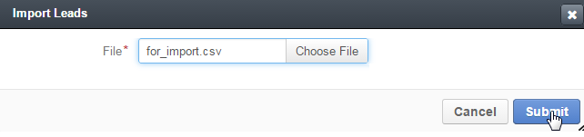

.. _user-guide-export-import 

Import and Export Functionality
===============================

Details of some OroCRM entities (e.g. Users, Leads, Opportunities, etc.) can be exported and/or imported in/from
.csv files. 
For such entities, :guilabel:`Export` and :guilabel:`Import` buttons are displayed in the top right corner of the grid
and :guilabel:`Export Grid` button is available above the grid.

.. _user-guide-import:

Import
-------

Import functionality is particularly useful, if you want to upload multiple instances.

- Click |Bdropdown| on the **Import** button in the top right corner of the grid page
- Choose :guilabel:`Download Data Template`
- Prepare a .csv file following the template 
- Click  :guilabel:`Import` button, choose the .csv file for import
- Carefully read through the submission form and confirm the import

.. caution:: 

    Mandatory fields of the entity **must** be specified

Once import is over the new entity instances will appear in the grid.

      
*Import Example*
^^^^^^^^^^^^^^^^

Prior to using OroCRM, John&Sons construction material factory used to keep track of their potential opportunities
in a Calc table. 
Now they want to upload their details to OroCRM as Leads. 

These are the first 10 instances of the table:

.. image:: ./img/export_import/in_lead_table_ex.png

You can find the whole document at the *System --> Entities --> Documentation --> Initial Leads Table --> 
Attachments --> John&SonsLeads.xls*.

In order to import the Leads into the system, we have downloaded the data template.

.. image:: ./img/export_import/download_data_template.png

- All the mandatory properties **must** be filled
- If a column is missing, the value will be filled with the default value or left empty
- If there is a column in the initial table that must be added to the system and is not in the template, custom 
  property must be created for it.

In our example:

- **Id** can be left empty and will be automatically generated by the system.

- **Mandatory Properties**

  - Channel Name: must be defined. We have created a new column *Channel name*. As we are uploading data for the Channel 
    instance *Factory* (Channel instance of B2B Type created for the John&Sons Factory sales activities as an example in 
    the :ref: Channel Management Guide <user-guide-channels-example`, we have filled all the column rows with 
    *Factory*
  
  - Owner: will be filled with default value specified in the system, so we don't need to create a column

- **Properties specified in the initial table**:
  
  - Status Name: corresponds to the *Status Name* column of the data template
  
  - Lead name: corresponds to the *Lead name* column of the data template
  
  - First name: corresponds to the *First name* column of the data template

  - Last name: corresponds to the *Last name* column of the data template

  - Company: corresponds to the *Company name* column of the data template

  - Phone number: corresponds to the *Phone number* column of the data template
  
  - Email: corresponds to the *Email* column of the data template
 
  - Street: corresponds to the *Address Street* column of the data template

  - Zip: corresponds to the *Address Zip/postal code* column of the data template

  - State: must be configured to match the settings of *Address State Combined code* column of the data template (US 
    prefix added)

This is what we have got for the first ten instances.

.. image:: ./img/export_import/leads_table_ex_1.png    

You can find the whole document at the *System --> Entities --> Documentation --> Leads Table for import--> 
Attachments --> leads_template_for_import.xls*.

We have saved the file as .csv with coma (,) for a field delimiter and quotation mark (") as a text delimiter.

In the Leads grid, we have clicked :guilabel:`Import` button and chosen our file:

Import validation results have appeared:

.. image:: ./img/export_import/leads_import_validation_results.png
   
Click :guilable:`Import` button. *"Validation started. Please wait"* message will appear. *File is successfully 
imported* message will appear when the import has finished.

Entities imported will appear in the grid.

.. _user-guide-export:

Export
-------

A functionality enables export of the entity details into  a .csv file. 

In order to export the .csv file:

- Go to the grid and 
  - Click :guilable:`Export` button to export all the fields assigned for export for all the entity records or  
  - Click :guilable:`Export Grid`button to export the table that correspond to the grid

  
- *"Export started. Please wait"* message will appear at the top of the screen.

- As soon as the export has finished the message will change to: *"Export performed successfully, [number] 
  downloads exported. Download result file"*.

- Click the *"Download result file*" at the end of the message and the download will be performed subject to your 
  browser settings.

.. |Bdropdown| image:: ./img/buttons/Bdropdown.png
   :align: middle
