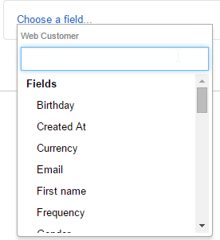
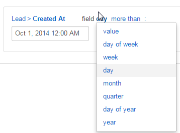

.. _user-guide-filters-management:

Filters Management Guide
-------------------------

Filers functionality helps you to automatically generate a list of entity records that meet certain requirements.

Basically, you say "I want to see only the records that meet my requirements", specify the requirements and get the 
list of records.

Filter is always created for records of a specific :term:`entity <Entity>` specified in the general details of the 
relevant segment, report of marketing list.

Main element of a filter is a :ref:`field condition <user-guide-filters-field-conditions>`. Field conditions specify
what attributes the record should have to meet the filter conditions.

:ref:`Conditions Groups <user-guide-filters-condition-groups>` are sets of field conditions that combine
requirements of field conditions.

:ref:`Segments <user-guide-filters-segments>` are sets of conditions and condition groups.

 
.. _user-guide-filters-field-conditions:

Field Conditions
----------------

Field conditions specify what attributes the record should have to meet the filter conditions.

To define a field condition 

- Drag *"Field condition"* to the box on the right

.. image:: ./img/filters/field_condition.png

- Click the* "Choose a field..." link

.. image:: ./img/filters/field_condition_click.png

- A drop-down will appear. At the top of the drop-down, you can see the name of the entity, records whereof will be 
  filtered. (In the example below it is a Web Customer)

- You can choose a field (attribute) of this entity and define rule for it. For example, you can choose only those
  Web customer, who were born in specific month and use specific currency, etc.
  
  
  

  
- (for example, that all the Leads in the list have been created within the last month):
  
- Click *Choose a field* link and select the necessary field (e.g *"Created at"*) 

- Click links and choose a drop-down value. (e.g. "day" "more than" Oct 1, 2014, 12:00 AM)

 

You can define conditions used to select the entity records for the marketing list, using the following tools: 

- **Field Condition**: only records that meet the condition are added to the list

- **Conditions Group**: a set of field conditions

- **Apply Segment**: only records that meet a specific set of predefined conditions (belong to a segment) are added to 
  the list. (Segments are subject to a separate document)

Field conditions, condition groups and segment settings can be combined or ORed to define the final set of conditions. 

.. _user-guide-filters-condition-groups:

Condition Groups
----------------

.. _user-guide-filters-segments:

Segments
--------
