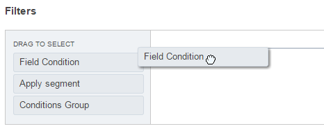
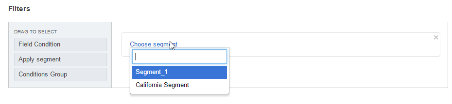

.. _user-guide-filters-management:

Filters
=======

Filters functionality automatically generates a list, all the records of which meet certain requirements.
Basically, you say "I want to see only the records that meet these conditions", specify the conditions and get the 
list of records.

Filters are always created for records of a specific :term:`entity <Entity>` specified in the general details of the 
relevant segment, report of marketing list.

Main element of a filter is a :ref:`Field Condition <user-guide-filters-field-conditions>`. Field conditions specify
what attributes the record should have to meet the filter conditions.

:ref:`Conditions Groups <user-guide-filters-condition-groups>` are sets of field conditions that combine
requirements of field conditions.

:ref:`Segments <user-guide-filters-segments>` are sets of conditions and Conditions Groups.

 
.. _user-guide-filters-field-conditions:

Field Conditions
----------------

Field conditions specify what attributes the record should have to meet the filter conditions.

To define a field condition 

- Drag *"Field condition"* to the box on the right |field_condition|

- Click the* "Choose a field..." link 

  |field_condition_click|
  
- A drop-down will appear. At the top of the drop-down, you can see the name of the entity, for which the records are 
  filtered. (In the example below it is a Web Customer) 
  
  |field_condition_fields|

  - You can choose a field (attribute) of this entity and define rule for it. For example, you can choose only those
    Web customer that were created within the last month and use a specific currency (e.g. US dollars), 
    etc. 
   
    |field_condition_defined|
    
  - You can also choose a field (attribute) of another entity, related to the one selected in the general settings. 
    For example, if you want the list to contain only Web Customers who have an abandoned cart (in OroCRM this is a Cart
    with "Status" = "Open").

    To do so, scroll down the drop-down and choose this entity under the "Related Entities" header. 

    |field_condition_rel_ent|

    The name of the entity (In our example it is  "Carts") will appear at the top of the drop-down. 
  
    |field_condition_rel_ent_carts|

.. caution::

    Attributes in the "Fields" section belong to the entity chosen (in the example below, these are Carts).

  - You can also choose a field (attribute) of another entity, related to the entity chosen in the "Related entities"
    section. For example, if you want the list to contain only Web Customers who have a Cart, for which  
    the "City" field of the Billing address is "Dallas"

   |field_condition_rel_rel_ent|
  
- You can choose the conjunction for the the conditions: "AND" or "OR". 

  For example: 
    
  - If you choose only Web customers,for whose carts the city of the billing address is Dallas and who were 
    registered from Dec 10 to Jan 10 and use AND conjunction, the list will contain only those for whom the both 
    conditions are true.
  
  - If you choose the same Field conditions but join them with OR, the list will contain all those from Dallas 
    (regardless of their registration date) and all registered within the specified month (regardless of the billing 
    address defined for their carts)

    |field_condition_and|

.. hint::
   
    Once you have chosen the field to specify the conditions for, a default condition will appear. Some components of it
    are links. Each of these links contains a drop-down of possible values suitable for the specified field. 

    |field_condition_value|, |field_condition_value_1|

.. _user-guide-filters-condition-groups:

Conditions Groups
-----------------

A Conditions Group is a set of Condition Fields treated as a single condition. These are useful for more complex logic of
conditions. 

For example, you want to see in the list: 

- all the Web customers created in December 2014 who have an abandoned Cart (Cart with status Open) with a billing 
  address in Dallas, as well as
  
- all the Web customers created in January 2015 who have an abandoned Cart (Cart with status Open) with a billing 
  address in San Francisco
  
You need to create to Conditions Groups for each of the cases, and join them with OR (as you want to see the both cases
in the list):

- Drag the *"Conditions Group"* to the box on the right. 

  |conditions_group|

- Add conditions to the section that has appeared. 
  
  |conditions_group_1|

- Define the conditions and conjunctions between them.

  |conditions_group_2|

.. hint::

    For complex conditions, it is a good idea to draw an outline of the conditions first.

A condition group may also be included into another condition group. For example, if you want the list to contain:

- all the Web customers created in December 2014, who have an abandoned Cart (Cart with status Open) with a billing 
  address in Dallas, as well as

- all the Web customers created in January 2015, who have an abandoned Cart (Cart with status Open) or any cart created 
  after January 10 with a billing address in San Francisco OR who 

  |conditions_group_3|

.. _user-guide-filters-segments:

Segments
--------

Segment is a set of :ref:`field conditions <user-guide-filters-field-conditions>` and 
:ref:`conditions groups <user-guide-filters-condition-groups>` defined for a specific entity and treated as a single
conditions.

In other words, if you often need to use a specific set of conditions to filter the entity records, you can create a 
segment and use it instead of redefining the same conditions time and again.

To add a Segment to the Conditions:

- Drag "Apply segment" to the box on the right, 
  
  |segments|

- Click "Choose segment" link and choose one of the Segment predefined in the system. 
 
  |segments_choose|

Subject to the conjunction with the rest of conditions the list will now contain:

- Only the records from the segment that correspond to the rest of conditions (AND is used)

- The records that correspond to the rest of conditions and the segment (OR is used)

.. note::   
  
   To create a segment, go to the *System → Reports and Segments → Manage Segments* and click 
   :guilabel:`Create Segment`.
   
   Creating and managing Segment is very similar to creating and managing a 
   :ref:`marketing list <user-guide-marketing-lists-create>`. The only difference is that there are no limitations 
   for the columns (i.e. at least one column must be specified but it can use any field of the entity) 

   

.. |field_condition_click| image:: ./img/filters/field_condition_click.png

.. |field_condition_fields| image:: ./img/filters/field_condition_fields.png

.. |field_condition_and| image:: ./img/filters/field_condition_and.png

.. |segments| image:: ./img/filters/segments.png

