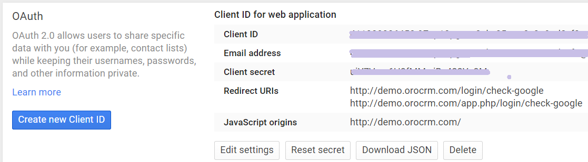
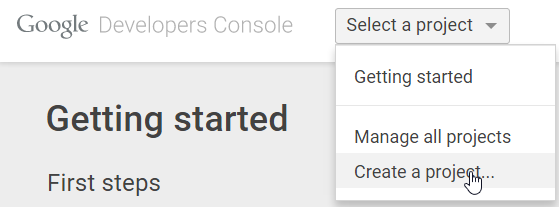
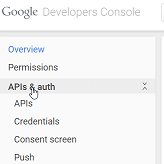
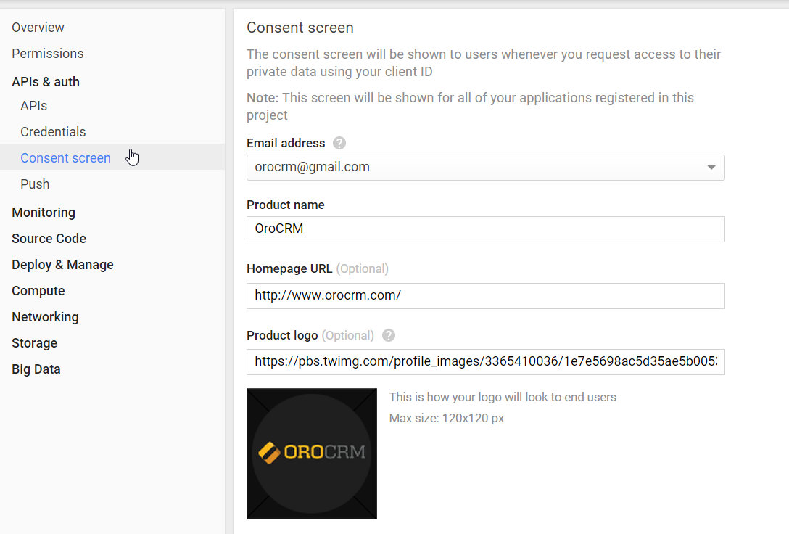
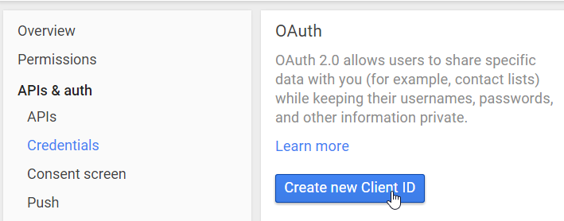
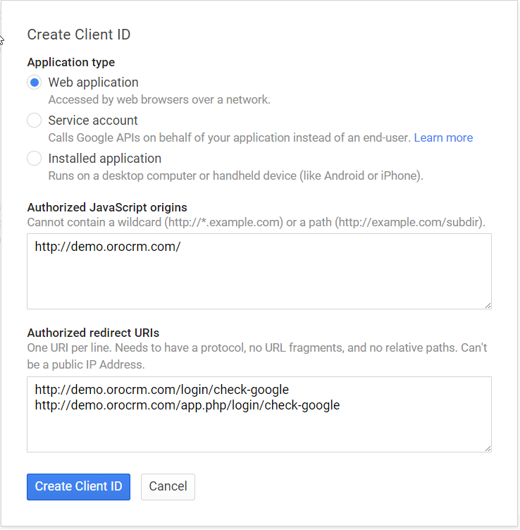

.. _admin-configuration-google-settings:

Google Single Sign-On Capabilities for OroCRM
=============================================

OroCRM supports Google Single Sign-On capabilities. This means that for a user that has the same primary email in the  
OroCRM and Google accounts, it is enough to log-in only once during a session. 

The following settings must be defined to enable this capability:

On the Google Side
------------------

You need to create a project for OroCRM in the 
`Google Developers Console <https://console.developers.google.com/start>`_:

- Go to the Google Developers Console.

  |

- Create a project in the *"Select a project"* drop-down menu.
 
 |
  
  |CreateProject|

  |
  
- Define the Project name.

  |
  
- Go to the *"APIs & auth"* menu.

  |
  
  |APImenu|

  |  
  
- Go to the *"Credentials"* section.

  |
  
- Click the :guilabel:`Create new Client ID` button.

  |
  
  |CreateClientID|

  |
  
- Define the following settings:

.. csv-table::
  :header: "**Field**","**Value**"
  :widths: 10, 30

  "**Application type**","Should be set to *Web application*"
  "**Authorized JavaScript origins**","URL of the OroCRM instance, for which single sign-on is being enabled"
  "**Authorized redirect URIs**","The unified resource names used for interaction between Google and the OroCRM 
  instance. It is advised to add the following two values:
  
  - [URL of the OroCRM instance, for which single sign-on is being enabled]/login/check-google
  - [URL of the OroCRM instance, for which single sign-on is being enabled]/app.php/login/check-google
  
  "

-  Click the :guilabel:`Create Client ID` button.

  |
  
  |CreateClientIDForm|

  |
  
- The Client ID has been generated

  |
  |
  

  
- Go to the *"OAuth Consent screen"* tab to define the project details that will be shown to users whenever 
  access to their private data is requested with the defined client ID.*

  |
  
- Click the :guilabel:`Save` button.

  |

  |ConsentScreen|
   
  |

On the OroCRM Side
------------------

- Go to *"System → Configuration → Integrations → Google Settings"*.

  |
  
- Check the *"Enable"* box and define the following details:

.. csv-table::
  :header: "**Name**","**Description**"
  :widths: 10, 30

  "**Client Id** and **Client Secret**","The same as Client ID created in the Google Developers Console"
  "**Domains**","Limit the list of mailboxes for which single sign-on can be used (e.g., only a domain 
  used specifically by your company). Leave the field empty to set no such limitation."

|OroGoogleSettings|

- Click the :guilabel:`Save Settings` button.

  
Using Single Sign-On
--------------------

When a user gets to the login page of an instance for which single sign-on capability has been enabled, there is a 
*"login using Google"* link. 

- If the user is not logged in to any Google accounts, after the link has been clicked, a usual Google log-in page will 
  appear.

  |
    
- After the user has logged in to the Google account, a request to use the account in order to log-in to OroCRM will 
  appear. (Details defined for the consent screen will be used).

  |
  
  |PermissionAccept|

  |
  
  By clicking Accept, you allow this app and Google to use your information in accordance with their respective terms of 
  service and privacy policies. You can change this and other Account Permissions at any time.

For now on, for a user logged-in into a Google account, it is enough to click the *"login using Google"* link to get
into OroCRM.

.. important::

    The email used for the Google account and the primary email of the user in OroCRM must be the same.
  
  

   

   

   

   

   
.. |OroGoogleSettings| image:: ./img/google_integration/oro_google_settings.png
   :align: middle
   
.. |PermissionAccept| image:: ./img/google_integration/permission_accept.png
   :align: middle   
