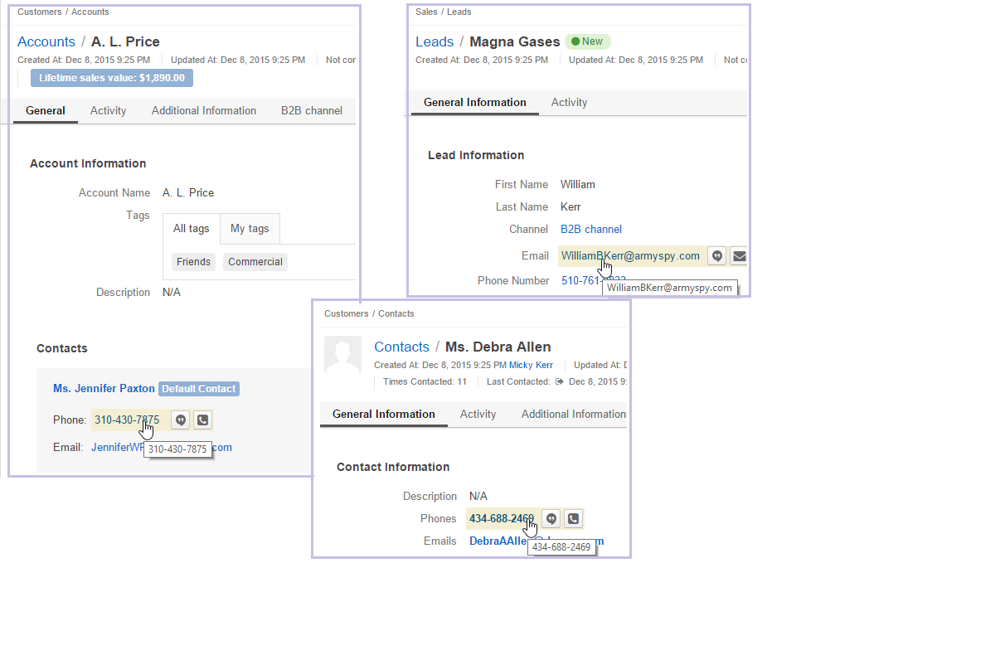

.. _user-guide-hangouts:

Call and Email Using Hangouts 
=============================
With the Hangouts feature you can call via Google Hangouts directly from OroCRM. 
This means that sales team can make calls to your customers and prospects directly from OroCRM, making it faster than 
ever to make and log your sales calls.
The feature is also great for support teams, as they can contact the customer and utilize the screen sharing function 
for necessary support cases.
It can be used for internal communications (meetings and discussions), as it is possible to hold a session with up to 
five OroCRM users. Moreover, integration with OroCRM Calendar, allows to pre-arrange a meeting and then quickly launch 
a call from the event page.

Preliminary Conditions
----------------------

- Have an active Google account (if you try using the feature when not logged in, you will be prompted to log-in) 

- Hangouts extension installed in OroCRM as described in the 
  :ref:`Extensions and Package Manager Guide <admin-package-manager>`

- If you are using a browser other then Chrome, install a Google Hangout or Google Talk extension for 
  the browser.

  
Start a Hangout Using Contact Details
-------------------------------------

In order to start a hangout:

- Go to the :ref:`View page <user-guide-ui-components-view-pages>` of the record that you want to contact (account, 
  lead, contact, user, etc.) . 

- Hover the mouse over a phone number or an email available on the View page.

  |

|
	  
- Click the |HObutton| button

- The *"Invite Contacts to a Google Hangout"* form will appear.

  |
  
.. image:: ./img/hangouts/invite.png  

|

- Click the :guilabel:`Start a Hangout` button

  - If you are already logged in to your Google account, the Hangout will start immediately, otherwise you will be 
    prompted to log in. 
	
	
.. _user-guide-hangouts-call:	

Start a Hangout Using Phone Number
^^^^^^^^^^^^^^^^^^^^^^^^^^^^^^^^^^
 
If you call your contact via their phone number, and the telephone calling has been enabled for your Google Hangouts, 
the call will start immediately. 

Otherwise, you will be prompted to enable it:

|

.. image:: ./img/hangouts/enable_phone.png 

|

Most calls within the USA and Canada are free, and you can pay your balance for other regions using Google Wallet. 
	

Start a Hangout Using Email
^^^^^^^^^^^^^^^^^^^^^^^^^^^

If you call via the email, the call will be initiated. You can invite other call participants (up to 5 total),
remove them (click the :guilabel:`X` button by the name) or send them a link to the session.

  |
  
.. image:: ./img/hangouts/invite_more.png

|

Once the contact has joined the session, you can talk.

  
Start a Hangout from the Log Call
---------------------------------

The Hangouts feature is also available in the :ref:`Log Call <user-guide-activities-calls>` form.

|

.. image:: ./img/hangouts/log_call_hangout.png

|

- Click the :guilabel:`Start a Hangout` button to start a Hangout using the phone number.

Start a Hangout from the Calendar
---------------------------------

The Hangout feature is integrated with OroCRM Calendar. In order to start a Hangout with the users invited to an event:

- Go to the Calendar (or the Calendar widget on the Dashboard) 

- Click the event name

- If the event has at least one guest invited, the :guilabel:`Start a Hangout` button will be available.

  |

.. image:: ./img/hangouts/view_event.png

|
	  
- Click the :guilabel:`Start a Hangout` button to start a Hangout using the emails of the first five guest.

