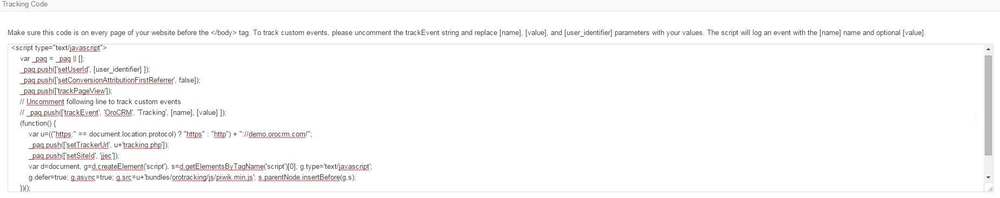

.. _user-guide-how-to-track:

How to Track Campaign Related Activities on the Website
=======================================================

OroCRM provides a tracking functionality, you can use to learn how many users have visited your Web-site from links 
within a specific marketing campaign and what these users' actions at the site were. 

- Create a :ref:`Сampaign <user-guide-marketing-campaigns>` record

- Create a :ref:`Tracking Website <user-guide-marketing-tracking>` record for this Website

- Use the "Tracking code" on their View pages to modify the code of the website, as described below.

.. note::

    Tracking of Magento stores is pre-implemented and available with the extension at 
    http://www.magentocommerce.com/magento-connect/orocrm-tracking.html

Use Tracking Code
-----------------

Tracking code that shall be added before the </body> tag  on every page of the website 
can be found on the :ref:`View page <user-guide-ui-components-view-pages>` of the corresponding 
:ref:`Tracking Website <user-guide-marketing-tracking>` record.

The code defines some of `piwik <http://piwik.org>`_-specific settings that should not be changed and the following variables
that can/must be defined by the user:

.. code-block:: html
    :linenos:

    _paq.push(['setUserId', [user_identifier] ])

[user_identifier] defines the user id used in compliance with the Website settings.

.. code-block:: html
    :linenos:

    _paq.push(['trackEvent', 'OroCRM', 'Tracking', [name], [value] ]

If you want to allocate user activities on a specific page of the Website, uncomment this line and replace the 
"[name]" and "[value]".

- [name] is used in the system to refer to events on the page
- [value] is any numeric value (e.g. for a cart, it can be an item code or cost)

.. note::
  
    The code may be filled with both static and dynamic values, however the use of dynamic values requires complex 
    back-end development. 

There are two ways to implement tracking for a Website: 

- Add the piece of code from the :ref:`View page of the campaign <user-guide-marketing-campaigns-view-page>` to the 
  tracking script from 
  the :ref:`View page of the Website Tracking record <user-guide-marketing-tracking-websites-view-page>` after 
  setUserId call, and provide the users with the URL of the page(s)
   
- Add the piece of code from the :ref:`View page of the campaign <user-guide-marketing-campaigns-view-page>` 
  to the page url and use this modified URL in the link used for the campaign, mailing, etc.

 Either way, after the user has entered (clicked) the URL, all the user activity recorded on the website within the 
 session will be tied to the specific campaign.

Tracked Website Example
------------------------

This is the code pre-implemented for Magento stores:

.. code-block:: html
    :linenos:

    

*Users are identified as guests until they sign in. As soon as a user signs in, their identification is a value of
the "visitor-id" field. A special block has been implemented to enable transfer of the 
ID data to Oro.*

*Every time a user follows the link of a campaign, they get to a page with the URL piece from the campaign page.
From now on, all the actions performed by the user at the Website within this session will be assigned to the
campaign.*

On some of the pages, actions are activated. For example, this is a tracking script on the cart page:

.. code-block:: html
    :linenos:

    

*Every time the user get to the page where the code is implemented, a "Cart item added" 
event will appear on the campaign page and a dynamic value that corresponds to the item ID will be saved.*

A similar tracking script is implemented on each of the Website pages. The order placement page has the following action
enabled:

.. code-block:: html
    :linenos:

    _paq.push(['trackEvent', 'OroCRM', 'Tracking', 'order successfully placed', '2699.990000' ]);            

An *"Order successfully placed" event is saved for the campaign with a dynamic value that corresponds to a total
cost of the order.*

.. |IcDelete| image:: ./img/buttons/IcDelete.png
   :align: middle

.. |IcEdit| image:: ./img/buttons/IcEdit.png
   :align: middle

.. |IcView| image:: ./img/buttons/IcView.png
   :align: middle
   
.. |BGotoPage| image:: ./img/buttons/BGotoPage.png
   :align: middle
   
.. |Bdropdown| image:: ./img/buttons/Bdropdown.png
   :align: middle

.. |BCrLOwnerClear| image:: ./img/buttons/BCrLOwnerClear.png
   :align: middle
