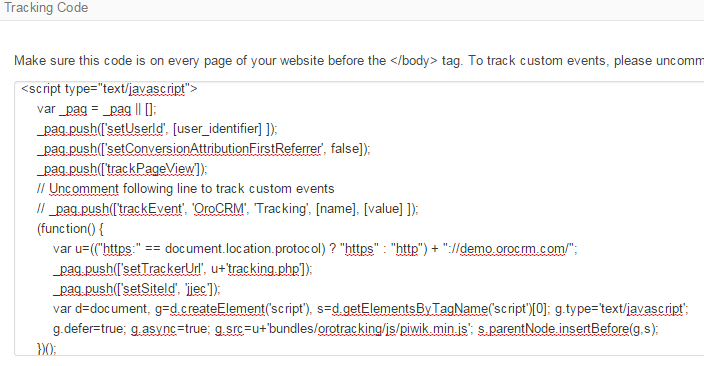

.. _user-guide-how-to-track:

How to Track Campaign Related Activities on the Website
=======================================================

In order to track campaign-related activities of a Website user, you need to:

- Create a :ref:`*campaign <user-guide-marketing-campaigns>*`

- Create a :ref:`*Tracking Website*` <user-guide-tracking-websites>` records for this Website

- Use the "Tracking code" on their View pages to modify the code of the website.

Use Tracking Code
-----------------

Tracking code that shall be added to every page of the website before the </body> tag can be found on the View page of 
the corresponding *Tracking Website*` <user-guide-tracking-websites>` record.

The code defines a number of piwik specific settings that should not be changed.

The following variables can/must be defined by the user:

.. code-block:: html

   _paq.push(['setUserId', [user_identifier] ])

[user_identifier] defines the user id used in compliance with the Website settings.

.. code-block:: html

    _paq.push(['trackEvent', 'OroCRM', 'Tracking', [name], [value] ]

If you want to allocate user activities on a specific page of the Website, uncomment this line and replace the 
"[name]" and "[value]".

- [name] is used in the system to refer to events on the page
- [value] is any numeric value (for example if the page tracked is a cart it can be an item code or cost)

One of the ways to implement tracking from the site is to 

..note::
  
    The code may be filled with both static and dynamic values, however the use of dynamic values requires complex 
    back-end development. 

.. code-block:: html
    :linenos:

    

    
 _paq.push(['setUserId', [user_identifier] ])
