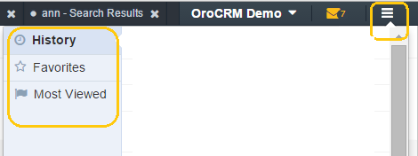

.. _user-guide-getting-started-history:

History, Favorites and Most Viewed
==================================

The "hamburger" icon next to the user menu contains a history of your page views, the list of your favorite pages, and 
the list of the most viewed pages in OroCRM.

All the page names available in the lists are clickable links to the relevant pages. 

|

|

History
-------

This section displays links to the latest 20 pages you’ve visited in the reverse chronological order. The list is 
particularly useful to open a page that you have recently used without searching for it. 

Favorites
---------

The section displays links to all the pages that you have marked as "favorite".

Add a page to the "Favorites" list
^^^^^^^^^^^^^^^^^^^^^^^^^^^^^^^^^^

Most of the pages can be marked as favourite. Marking a page as "favorite" is handy when you need to return to the same 
page repeatedly. In order to do so, click the star-shaped *"Mark as favorite*" icon in the top right corner of the page.

|

.. image:: ./img/navigation/panel/favorite.png  

|

The icon will turn yellow and a link the page will appear in the *"Favorites*" menu. 

|

.. image:: ./img/navigation/panel/favorite_1.png  

|

Remove a page from the "Favorites" list
^^^^^^^^^^^^^^^^^^^^^^^^^^^^^^^^^^^^^^^

In order to remove a page from the *"Favorites*" page, open the page and click the yellow star icon. 

The icon will turn grey and the page will be removed from the *"Favorites*" list.

Most Viewed
-----------

In the section you can see links to the pages most frequently visited by the uses with the period of the last ... 

