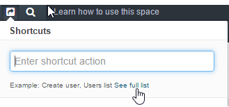

.. _user-guide-getting-started-shortcuts:

Shortcuts
=========

Shortcuts are used to perform common actions quickly from anywhere. They can be, particularly, used to create new 
records and navigate through the system quickly. Shortcuts are at hand, if you are not sure where in the menu the entity 
you’re looking for is.

Shortcuts are accessible via the icon in the navigation panel.

|

.. image:: ./img/navigation/panel/shortcut_full.png

|

From here you can:

* Launch an action from the "most used" list

.. hint::

    This list is updated as you are using the system, and will initially contain the actions that you use the most.

* Start typing the name of a related entity or an action to choose from a list of matching items:

  |shortcut|
  
|

- To see all the shortcut actions available, click *"See the full list"* link

|

  |shortcut_all|

All the :ref:`menu and sub-menu items <user-guide-navigation-menu>` and 
:ref:`Create forms <user-guide-ui-components-create-pages>` are available.

.. |IcSearch| image:: ./img/buttons/IcSearch.png

.. |shortcut| image:: ./img/navigation/panel/shortcut.png

