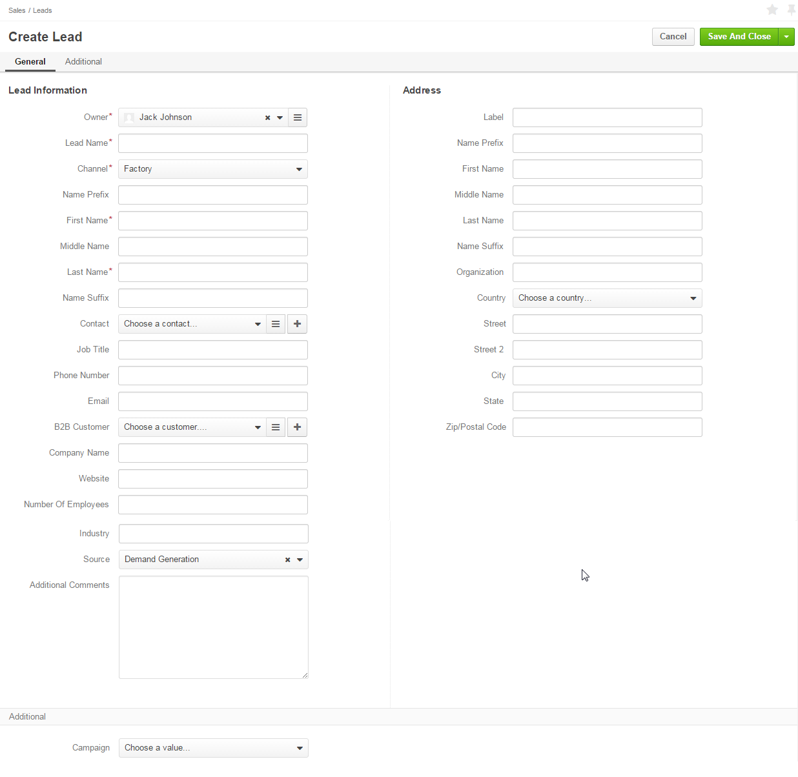
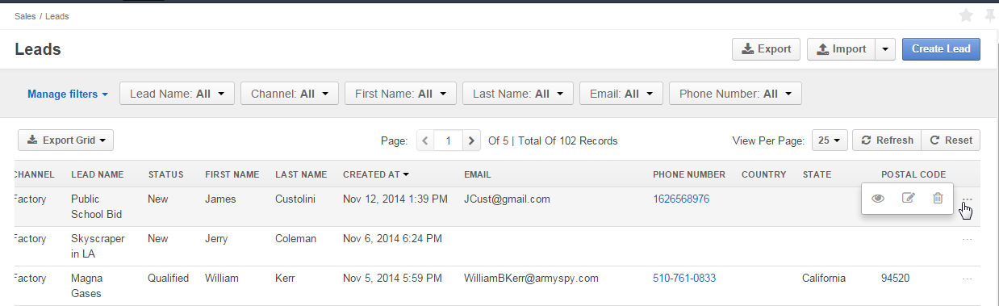
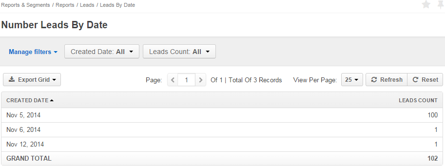
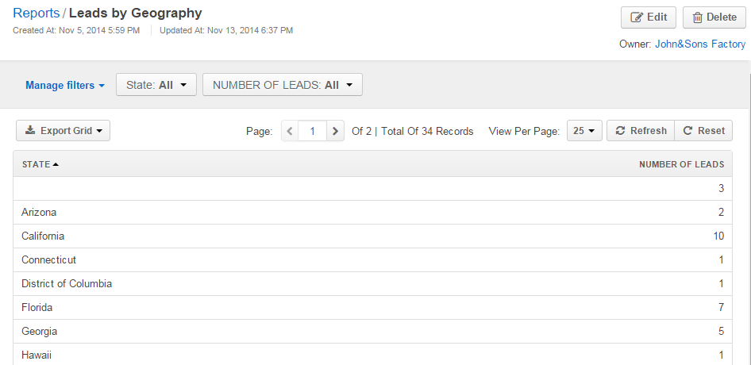

.. _user-guide-system-channel-entities-leads:

Channel Entities. Leads.
========================

The Lead records ("leads") represent people or businesses the have initial interest, authority and budget to take part 
in your commercial or social activity but whose intentions are not yet backed up with any arrangements. 

As soon as there is at least one :ref:`Channel <user-guide-channel-guide-create>` assigned the *Lead* entity, you can:

- :ref:`Create <user-guide-leads-create>` new leads

- :ref:`Manage <user-guide-leads-actions>` existing leads, particularly, import and export lead records and assign
  them different activities

- Analyse details of the lead records with OroCRM :ref:`reports <user-guide-leads-reports>`

- Use leads in :ref:`workflows <user-guide-leads-workflows>`

.. _user-guide-leads-create:

Create Leads from the UI
^^^^^^^^^^^^^^^^^^^^^^^^

- Click :guilabel:`Create Lead` button

- The *Create Lead* form will appear:

The following fields are mandatory and **must** be defined:

.. csv-table:: Mandatory Entity Fields
  :header: "Field", "Description"
  :widths: 10, 30

  "**Owner***","Limits the list of users that can manage the lead to its owner and users, whose roles allow managing 
  leads assigned to the owner (e.g. members of the same business unit, system administrator, etc.).
  
  You can choose an owner from the list (|Bdropdown|) or from the grid (|BGotoPage|).
  
  Click |BCrLOwnerClear| button to clear the field.
  
  By default, the user creating the lead is chosen."
  "**Lead Name***","The name used to refer to the lead in the system."
  "**Channel***","Any of active channels assigned the *Lead* entity. 

  Details of the lead will be uploaded from the source of the channel.
  
  Click |Bdropdown| button to choose one of available channels from the list."
  "**First Name*** and **Last Name***","Personal details of the potential customer or contact person." 

**Optional fields** keep additional information and may be left empty:

- If a field refers to a number (e.g. *"Number of Employees"*), an integer value shall be used.

- **Source** drop-down contains tunable predefined list of possible lead sources, such as the website, direct mail, 
  partner, etc.

- **Contact** and **B2B Customer** enable binding the lead created to records of corresponding 
  entities in the system.
  
  You can choose the record from the list (|Bdropdown|) or from the grid (|BGotoPage|), as well as create a new record
  (|Bplus|).
  
  Click |BCrLOwnerClear| button to clear the field

  
**Custom fields** can be created to meet specific customer needs and will be displayed in the *Additional* section.

To create a custom field, go to *System → Entities → Entity Management → Lead* and click :guilabel:`Create Field`
button.

Once all the necessary fields have been defined, click the button in the right top corner of the page to save the lead
in the system.

.. _user-guide-leads-actions:

Lead Actions 
^^^^^^^^^^^^^

The following actions can be enabled for the leads:

From the \:ref:`Grid <user-guide-ui-components-grids>`\:

- Delete a lead from the system : |IcDelete|
  
- Get to the *"Edit"* form  of the lead : |IcEdit|
  
- Get to the "*View*" page of the lead : |IcView| 

- Export and import lead record details with :guilabel:`Export` and :guilabel:`Import` buttons as described in the 
  :ref:`Export and Import Functionality <user-guide-import>` guide. 

From the \:ref:`View page <user-guide-ui-components-view-pages>`\

.. image:: ./img/leads/lead_view.png
  
- Get to the *"Edit"* form of the lead

- Delete the lead from the system 

The rest of \ref:`actions <user-guide-ui-components-view-page-actions>`\ available depends on the system settings 
defined in the \ref:`Communication &  Collaboration <user-guide-entity-management-create-commun-collab>` section of the 
"Lead" entity
      
.. _user-guide-leads-reports:

Reports with Leads
------------------

OroCRM 1.4 comes with two ready-to-use reports related to the leads.

*Leads by Date*
^^^^^^^^^^^^^^^

This is a simple but useful report, with which you can see how many leads were created on a specific date for 
all of your channels.

To see the report go to *Reports and Segments → Reports → Leads → Leads By Date*

It shows:

- the date leads were created on 

- the number of the leads created on the date, and 

- total amount of the leads created

*Lead by Geography*
^^^^^^^^^^^^^^^^^^^

This report is placed in the *Manage custom reports* section and can be edited. 

Out of the box, the report shows:

- name of the US state (in alphabetic order)

- number of Leads in this State

This report may be customized, and other new custom reports can be added. For more details on the ways to create and 
customize the reports,  please see the \:ref:`*Reports* <user-guide-reports>` guide\.

.. _user-guide-leads-workflows:

Using Leads in the Workflows
----------------------------

Workflows define rules and guidelines on possible actions/updates related to the entity records. 

Currently, OroCRM comes with a pre-implemented B2B-oriented workflow described in the 
\:ref:`*Sales Processes Workflow* <user-guide-sales-processes-workflow>`\ guide. 

New customer-specific workflows can also be created, as described in the :ref:`Workflows 
guide <user-guide-workflow-management>`

.. |BCrLOwnerClear| image:: ./img/buttons/BCrLOwnerClear.png
   :align: middle

.. |Bdropdown| image:: ./img/buttons/Bdropdown.png
   :align: middle

.. |BGotoPage| image:: ./img/buttons/BGotoPage.png
   :align: middle

.. |Bplus| image:: ./img/buttons/Bplus.png
   :align: middle

.. |IcDelete| image:: ./img/buttons/IcDelete.png
   :align: middle

.. |IcEdit| image:: ./img/buttons/IcEdit.png
   :align: middle

.. |IcView| image:: ./img/buttons/IcView.png
   :align: middle

