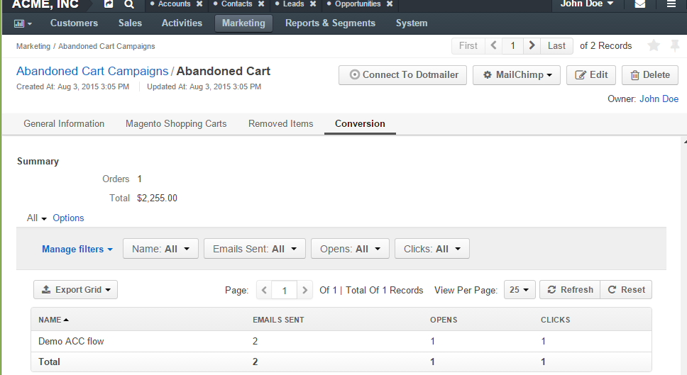
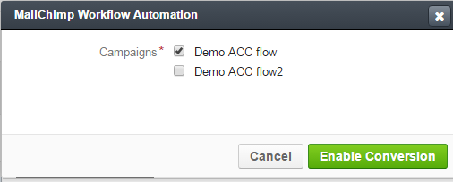

.. _user-guide-acc:

Magento Abandoned Cart Campaigns
================================

With OroCRM's Magento Abandoned Cart Campaign functionality users can automatically generate contact lists of 
customers  that abandoned your Magento store cart during the checkout process. Contacts in the list may be selected 
dynamically by a number of parameters, such as date when they added items to the cart, cart value, type of the items 
chosen, customer actions and more.

Once you have created a Magento Abandoned Cart Campaign, you can use its contact list to run 
:ref:`Email Campaigns <user-guide-email-campaigns>` in OroCRM. You can also synchronize it with Subscribers 
Lists in :ref:`MailChimp <user-guide-mc-integration>` and use it to create Email Campaigns and Automation in MailChimp.

The article describes how to create and manage Magento Abandoned Cart Campaigns.

.. _user-guide-acc-ext:

Set up Abandoned Cart Extension
-------------------------------

To use this functionality, you need to set up the Abandoned Cart extension:

- Go to System → Package Manager.

.. image:: ./img/mailchimp/ext_01.png
 
- Enter your login credentials (same as for your OroCRM account). The *Oro Installer* page will emerge.

- Enter the package name *oro/crm-abandoned-cart* and click :guilabel:`Install`

.. image:: ./img/mailchimp/ext_02.png

- The extension does not require any demo data, so disable the *Load demo data* check-box.

.. image:: ./img/mailchimp/ext_03.png

- Click :guilabel:`Continue`. Once the installation is over, a success message will be displayed. 

Now you can use the functionality.

.. _user-guide-acc-create-channel:
 
Add Abandoned Cart to the Channel 
---------------------------------

If there is no channel created for the Magento store, for which the abandoned cart campaigns should be used, created the 
channel, as described in the :ref:`corresponding section <user-guide-channel-guide-create>` of the channel's guide.

Make sure that all the channels representing Magento stores, for which the abandoned cart campaigns should be used, 
are :ref:`assigned <user-guide-channel-guide-entities>` the *"Abandoned Cart Campaign"* entity.

.. image:: ./img/mailchimp/acc_channel.png

.. _user-guide-acc-create:
 
Create an Abandoned Cart Campaign
---------------------------------

Go to the *Marketing --> Abandoned Cart Campaigns* and click the :guilabel:`Create Abandoned Cart Campaign` button 
in the top right corner of the grid.
   
The Create Abandoned Cart Campaign :ref:`form <user-guide-ui-components-create-pages>` will emerge.

.. hint::

    Creating an abandoned cart campaign is somewhat similar to creating a marketing list, where the entity is 
    a Magento Shopping Cart with status Open and the type is dynamic.

Define the list settings, as described in the sections below:

.. _user-guide-acc-create-general:
  
General Details  
^^^^^^^^^^^^^^^

The following fields are mandatory and **must** be specified:

.. csv-table::
  :header: "Field", "Description"
  :widths: 10, 30

  "**Name**","Name used to refer to the list of abandoned cart contacts in the system"
  "**Owner**","Limits the list of users that can manage the marketing list to only those,  whose 
  :ref:`roles <user-guide-user-management-permissions>` allow managing marketing lists of the owner (e.g., the owner, 
  members of the same business unit, system administrator, etc.)."

Optional field **Description** can be filled with free text to help you and other users understand the purpose or 
peculiarities of the list in the future.

Custom fields may be added according to specific business needs. 

.. _user-guide-acc-create-filters:
  
Filters
^^^^^^^

By default, an only filter *"Status"* *equals to* *"Open"* is used. If you don't apply any other conditions, all the
carts abandoned during the checkout will be covered by the mailing.  

You can use other filters to choose only those abandoned cart records that you need for marketing purposes.
For example, this could be only carts the belong to customers from a specific state and/or with a birthday 
within a specific month, carts created after a specific date, or specified with other combinations of filter conditions. 

More information about the ways to define filters is provided in the 
:ref:`Filters Management <user-guide-filters-management>` guide.

.. _user-guide-acc-columns:

Columns
^^^^^^^

In the "*Columns*" section, define the set of fields.
The only goal of this set of fields is to visualize records that meet the filter requirements. (Values of the chosen 
fields will be displayed at the :ref:`View page <user-guide-ui-components-view-pages>` of the campaign).

.. note::

    Marketing activities require some contact information, so at least one column that contains it must be 
    selected.
  
- Choose the fields from the drop-down menu in the *"Column*" section.

- Label is the way the field will be referred to in the grid. The value defined for the field will be added by default, 
  but can be changed. 
  
- Define the sorting order if you want the grid to be sorted by the field value.

- Click the :guilabel:`Add` button.

Use action icons in the last column to edit the grid:

- Delete a column from the list with |IcDelete|

- Edit the column settings with |IcEdit|

- Change the column position (drag the column by the |IcMove| icon)

.. hint::

    Save the campaign in the system with the button in the top right corner of the page.

For example, we have created a *Demo ACC* abandoned cart campaign, within which a list will be created in the MailChimp
account. The List will contain abandoned Magento Shopping Carts available in the OroCRM account that were created 
after April 1st, 2015. The cart id, customer's last name, and email will be transferred to the MailChimp account for 
every such cart and can be used as variables for email campaigns.

      |
	  
.. image:: ./img/mailchimp/acc_create_ex.png

.. _user-guide-acc-actions:

Manage Abandoned Cart Campaigns
-------------------------------

The following actions are available for an abandoned cart campaign from the 
:ref:`grid <user-guide-ui-components-grids>`:

      |
	  
.. image:: ./img/mailchimp/acc_edit.png

- Delete the campaign from the system : |IcDelete| 

- Get to the :ref:`Edit form <user-guide-ui-components-create-pages>` of the campaign : |IcEdit| 

- Get to the :ref:`View page <user-guide-ui-components-view-pages>` of the campaign :  |IcView| 

.. _user-guide-acc-view-page:

Abandoned Cart Campaign View Page
^^^^^^^^^^^^^^^^^^^^^^^^^^^^^^^^^
      |
  
.. image:: ./img/mailchimp/acc_view.png

|

The :ref:`View page <user-guide-ui-components-view-pages>` of an abandoned cart campaign contains the following 
sections:

- The :ref:`Action buttons <user-guide-ui-components-grid-action-buttons>`.

- General Information: general details of the campaign.

- Magento Shopping Carts grid: the grid of Magento shopping carts included in the campaign.
  
  - *"SUBSCRIBED"* column of the grid : Initially all the users in the list are subscribed (the column value is "Yes"). 
    If during one of the mailing campaigns a user has unsubscribed, the value is changed to "No" and 
    the user is excluded from the next campaigns.

- Removed Items: the grid contains carts that have been removed from the list (a cart may be removed from OroCRM 
  and\or from MailChimp (requires synchronization).

- Action icons in the last column of the grid enable the following actions:

  - Get to the *"View"* page of the grid item: |IcView|

  - Unsubscribe/subscribe the item from/to the list manually: |IcUns| and  |IcSub| icons
 
  - Remove the item from the list: |IcRemove|

- Action icons in the last column of the *"Removed Items"* grid enable the following actions:

  - Get to the *"View"* page of the grid item: |IcView|

  - Restore the item in the marketing list: |UndoRem|  
   
- Conversion: Items that were initially added to the campaign and then were turned into orders.

Mapping
^^^^^^^

*Now you can go ahead and use the contact list generated by the Abandoned Cart Campaign to create*
:ref:`Email Campaigns <user-guide-email-campaigns>` *in OroCRM. You can also synchronize it with Subscribers 
Lists in* :ref:`MailChimp <user-guide-mc-integration>` *and use it to create Email Campaigns and Automation in 
MailChimp.*

As soon as OroCRM has been integrated with a third party system, to which an abandoned cart campaign may be mapped,
you will see :guilabel:`Connect to ...` buttons, with which you
can, for example, map the list to :ref:`Subscribers Lists in MailChimp <user-guide-mc-integration-map-contacts>` or
:ref:`Address Books of Dotmailer <user-guide-dm-integration-map>`.
  
  |
  
  |MapML| 

  
Conversion  
^^^^^^^^^^

For Magento Abandoned Cart Campaigns, OroCRM provides an out-of-the-box conversion tool. This means that you can 
see how many carts have been converted into orders through your campaign.

In order to enable the conversion you need to do the following:

- Create a :ref:`Tracking website record <user-guide-marketing-tracking>` for which:
  
  - The *Url* value is the url address of the Magento store, for which Abandoned Cart Campaign is created.
  
  - The *Channel* value is the channel of the Magento store, for which Abandoned Cart Campaign is created.

- Create an Abandoned Cart Campaign record. 

  When the Abandoned Cart Campaign has been created, a 
  :ref:`Campaign <user-guide-marketing-campaigns>` will be created automatically.
  
- Map the Abandoned Cart Campaign list to MailChimp. 

  When mapping is performed, MailChimp will receive the Campaign code. In the email template, it is an *|E_CMPGN_CD|*
  variable.

- Create an `Automation <http://mailchimp.com/features/automation/>`_ in MailChimp.

.. important::

    For all the links to be monitored for conversion, add the *?pk_campaign=*|E_CMPGN_CD|*.
 
    This way, each time a user follows the link, an event will be created in OroCRM. Further actions of the user in the
    store will be tracked.

- Once automation emails have been sent, you can enable the conversion results for the abandoned cart campaign.
  
  The :guilabel:`Related Campaigns` option will appear in the MailChimp drop-down menu.

  |
  
  |acc_related_camp|
  
  |

- Click it. Check the MailChimp Automation records, that should be considered for the conversion of this Abandoned Cart
  Campaign items.
  
  |
  
  |acc_enable|
  
  |
  
In the example below, you can see, that within the Automation, two emails have been sent. One emails has been opened.
One cart has been converted.  The cost of items is the cart was $2,255.

  

 
  
.. |IcDelete| image:: ./img/buttons/IcDelete.png
   :align: middle

.. |IcEdit| image:: ./img/buttons/IcEdit.png
   :align: middle

.. |IcMove| image:: ./img/buttons/IcMove.png
   :align: middle

.. |IcView| image:: ./img/buttons/IcView.png
   :align: middle

.. |IcSub| image:: ./img/buttons/IcSub.png
   :align: middle

.. |IcUns| image:: ./img/buttons/IcUns.png
   :align: middle

.. |IcRemove| image:: ./img/buttons/IcRemove.png
   :align: middle

.. |UndoRem| image:: ./img/buttons/UndoRem.png
   :align: middle
      

   
.. |Bdropdown| image:: ./img/buttons/Bdropdown.png
   :align: middle

.. |BCrLOwnerClear| image:: ./img/buttons/BCrLOwnerClear.png
   :align: middle

.. |BSchedule| image:: ./img/buttons/BSchedule.png
   :align: middle
   
.. |acc_related_camp| image:: ./img/marketing/acc_related_camp.png
   :align: middle
   
.. |MapML| image:: ./img/marketing/map_ml.png
   :align: middle

